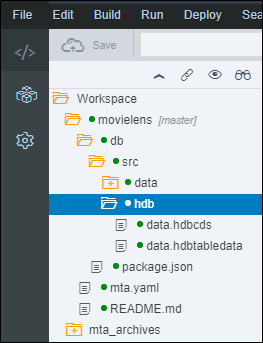
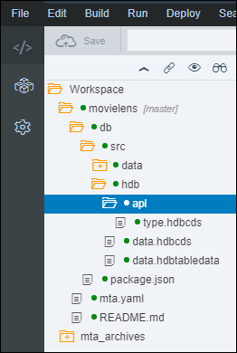
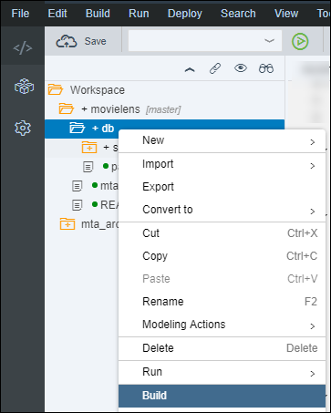

## Prerequisites
 - [Use Machine Learning to Build a Movie Recommendation application using the XS advanced development model](https://www.sap.com/developer/groups/hxe-aa-movielens.html)

## Next Steps
 - [Use Machine Learning to Build a Movie Recommendation application using the XS advanced development model](https://www.sap.com/developer/groups/hxe-aa-movielens.html)

## Details
### You will learn
- Understand the basics about the SAP HANA Predictive Analytics Library
- How to call SAP HANA Predictive Analytics Library functions from an XSA application and an HDI container
- Identify which algorithm options are available for recommendation engines
- How to use SAP HANA APL APRIORI algorithm from an XSA application and an HDI container

[ACCORDION-BEGIN [Step 1:](SAP HANA Predictive Analytics Library)]

The ***SAP HANA Predictive Analytics Library*** (PAL) is an ***Application Function Library*** (AFL) which defines a set of functions that can be called from within ***SAP HANA SQL Script*** (an extension of SQL) to perform analytic algorithms.

The Predictive Analysis Library (PAL) defines functions that can be called from within ***SQL Script*** procedures to perform analytic algorithms and includes classic and universal predictive analysis algorithms in the following data-mining categories:

- Clustering
- Classification
- Regression
- Association
- Time Series
- Preprocessing
- Statistics
- Social Network Analysis
- Miscellaneous

With over 90 algorithm functions across the above data-mining categories, the ***SAP HANA Predictive Analytics Library*** has been built and enhanced upon on the following goals:

- provide the required algorithms for SAP HANA applications features
- provide the most commonly used algorithms based on market surveys
- provide a set of algorithms generally available in other database or processing platforms

For more details about the PAL function, check the online <a href="https://help.sap.com/viewer/2cfbc5cf2bc14f028cfbe2a2bba60a50/latest/en-US/f652a8186a144e929a1ade7a3cb7abe8.html" target="new">documentation</a>..

[DONE]
[ACCORDION-END]

[ACCORDION-BEGIN [Step 1:](Calling AFL functions from HDI containers)]

In order to use an ***SAP HANA PAL*** function in SAP HANA, ultimately an AFL wrapper must be created and then invoked.

Creating and invoking the AFL wrapper is performed by executing ***SAP HANA `SQLScript`***.

Other database objects also need to be created, such as table types or signature table.

Just like with the SAP HANA APL, there are two techniques for calling APL functions, the ***direct technique*** and the ***procedure technique***.

However, since you are working in an HDI container with CDS artifacts, you will be creating AFLLANG procedures to surface the APL functions.

Therefore, you won't need to create table types or signature table using SQL, but using design time artifacts, like CDS Entities and others.

[DONE]
[ACCORDION-END]

[ACCORDION-BEGIN [Step 1:](Recommendation engines with SAP HANA PAL)]

As stated above, the ***SAP HANA Predictive Analytics Library*** (PAL) delivers over a hundred of ***best in class industry standard*** algorithms.

There are multiple association rules functions that can be used to address both a collaborative filtering and a content-based filtering scenario.

For both the collaborative filtering and the content-based filtering scenario, the SAP HANA PAL ***APRIORI*** algorithm is probably the most appropriate and the easiest one to use.

However, some preparation will be required to get the input in the right format.

> ### **Note**
><center><b>SAP HANA PAL Apriori algorithm</b></center>
>Given a set of items, the algorithm attempts to find subsets which are common to at least a minimum number of the item sets.
>&nbsp;
>Apriori uses a "bottom up" approach, where frequent subsets are extended one item at a time, a step known as candidate generation, and groups of candidates are tested against the data.
>&nbsp;
>The algorithm terminates when no further successful extensions are found. Apriori uses breadth-first search and a tree structure to count candidate item sets efficiently.
>&nbsp;
>It generates candidate item sets of length k from item sets of length k-1, and then prunes the candidates which have an infrequent sub pattern.
>&nbsp;
>The candidate set contains all frequent k-length item sets.
>&nbsp;
>After that, it scans the transaction database to determine frequent item sets among the candidates.
>Extracted from the documentation.

[DONE]
[ACCORDION-END]

[ACCORDION-BEGIN [Step 1:](SAP HANA PAL APRIORI function)]
While assessing the available data, we found out that only the ratings can be used to build our collaborative filtering an content-based filter scenarios.

The SAP HANA PAL function that we will be using in this step is

- <a href="https://help.sap.com/viewer/2cfbc5cf2bc14f028cfbe2a2bba60a50/1.0.12/en-US/7a073d66173a4c1589ef5fbe5bb3120f.html" target="new"><b>Apriori</b></a>

To apply a collaborative filtering approach with the ratings dataset, we would train a SAP HANA PAL `Apriori` model using the list of rated movies as the a *transactional* dataset, where each entry will represent a link between a user and an item.

The SAP HANA PAL `Apriori` algorithm provide multiple configuration options like:

Name                                 | Description
-------------------------------------|------------------------------
**maximum consequent**               | Maximum length of dependent items.
**maximum item length**              | Total length of leading items and dependent items in the output.
**minimum support**                  | ignores items whose support values are greater than the value during the frequent items mining phase (UBIQUITOUS).
**left/right-hand side restriction** | Specifies that some items are only allowed on the left/right-hand side of the association rules.

> ### **Note**
>In this scenario, we are not considering the rating notation itself (between 0.5 to 5) to build the output list, which would help a list of movies that both users rated the same way. To achieve that, we would need to investigate the ***Factorized Polynomial Regression Models*** algorithm available in SAP HANA 2.0 SPS02.
We could also transform the data structure, and use the movie as one node (entity type) and the user associated with the rating notation as the second node (entity type), then use the same algorithm. And finally instead of using the user as the entry point we would use the user and the rating notation as the entry point.
>
If you want to try out this scenario, you can build a view where the user id and the rating are concatenated into one column that will be used as the second entity type.

The PAL functions are really strict on the input dataset format, so you will create a view to provide the input dataset in the proper format (with only the user and movie id) .

[DONE]
[ACCORDION-END]

[ACCORDION-BEGIN [Step 1: ](Open the Web IDE)]

Open the Web IDE, and login using the **`XSA_DEV`** credentials.

Switch to the ***Development*** perspective using the  icon.


As a reminder the default URL for the Web IDE is:

 - `https://hxehost:53075`

A link to the Web IDE can also be found on the ***XSA Controller page*** at:

- `https://hxehost:39030`

[DONE]
[ACCORDION-END]

[ACCORDION-BEGIN [Step 2: ](Create the CDS Entity & Table Type Artifacts)]

In order to execute the APL algorithm, a series of table types and entities will be required to process the AFL calls.

These types maps the input and output table structure for the <a href="https://help.sap.com/viewer/2cfbc5cf2bc14f028cfbe2a2bba60a50/2.0.03/en-US/7a073d66173a4c1589ef5fbe5bb3120f.html" target="new"><b>APRIORI</b></a> function signature.

Some elements of the function signature are bound to the `MovieLens` dataset structure.

In the left side panel, expand the **`movielens/db/src/hdb`** tree node.



Right click on the **`hdb`** folder and select **New > Folder** (or press ***CTRL+ALT+SHIFT+N***).

Enter **`pal`** as the folder name, then click on **OK**.

Right click on the **`pal`** folder node from the tree, and select **New > File**.

Enter **`apriori.hdbcds`** as the file name, then click on **OK**.

This is the full path of the created file:

```
movielens/db/src/hdb/pal/apriori.hdbcds
```

Paste the following content:

```JavaScript
namespace aa.movielens.db.hdb.pal;

using aa.movielens.db.hdb :: data.ratings;

context apriori {
    entity parameter {
        PARAM_NAME   : String(100);
        INT_VALUE    : Integer;
        DOUBLE_VALUE : Double;
        STRING_VALUE : String(100);
    };

    table type tt_parameter {
        PARAM_NAME   : String(100);
        INT_VALUE    : Integer;
        DOUBLE_VALUE : Double;
        STRING_VALUE : String(100);
    };

    entity rules {
        PRERULE    : String(500);
        POSTRULE   : String(500);
        SUPPORT    : Double;
        CONFIDENCE : Double;
        LIFT       : Double;
    };

    table type tt_rules {
        PRERULE    : String(500);
        POSTRULE   : String(500);
        SUPPORT    : Double;
        CONFIDENCE : Double;
        LIFT       : Double;
    };

    entity pmml {
        ID        : Integer;
        PMMLMODEL : String(5000);
    };

    table type tt_pmml {
        ID        : Integer;
        PMMLMODEL : String(5000);
    };

    view movielens_dataset as
        select from ratings
        {
            USERID,
            MOVIEID
        };

    table type tt_movielens_dataset {
        USERID  : Integer;
        MOVIEID : Integer;
    };

    table type tt_movielens_collaborative_result {
        USERID  : Integer;
        RANK    : Integer;
        MOVIEID : Integer;
        SCORE   : Double;
        TITLE   : String(255);
        GENRES  : String(255);
        IMDBID  : Integer;
        TMDBID  : Integer;
    };
    table type tt_movielens_contentbased_result {
        MOVIEID       : Integer;
        RANK          : Integer;
        SIMILAR_MOVIE : Integer;
        SCORE         : Double;
        TITLE         : String(255);
        GENRES        : String(255);
        IMDBID        : Integer;
        TMDBID        : Integer;
    };
};
```

Save the file using the  icon from the menu.

[DONE]
[ACCORDION-END]

[ACCORDION-BEGIN [Step 3: ](Create the AFLLANG Procedure Artifact)]

Once the CDS artifacts are created for the entities and table types, you can now surface the AFL function using an AFL procedure.

In the left side panel, expand the **`movielens/db/src/hdb/pal`** tree.



Right click on the **`pal`** folder node from the tree, and select **New > Folder**.

Enter **`afllang`** as the folder name, then click on **OK**.

Right click on the **`afllang`** folder and select **New > File**.

Enter **`apriori_afl.hdbafllangprocedure`** as the file name, then click on **OK**.

This is the full path of the created file:

```
movielens/db/src/hdb/pal/afllang/apriori.hdbafllangprocedure
```

Paste the following content:

```JSON
{
    "area" : "AFLPAL",
    "function" : "APRIORIRULE",
    "parameters" : [
        { "direction" : "IN",  "type" : "aa.movielens.db.hdb.pal::apriori.tt_movielens_dataset"},
        { "direction" : "IN",  "type" : "aa.movielens.db.hdb.pal::apriori.tt_parameter"},
        { "direction" : "OUT", "type" : "aa.movielens.db.hdb.pal::apriori.tt_rules"},
        { "direction" : "OUT", "type" : "aa.movielens.db.hdb.pal::apriori.tt_pmml"}
    ]
}
```

Save the file using the  icon from the menu.

[DONE]
[ACCORDION-END]

[ACCORDION-BEGIN [Step 4: ](Create the HDB SQL View Artifacts)]

In order to get ***recommendation*** results, you will need to create a SQL view that will leverage the output generated by the model.

The generated result rule set in the `aa.movielens.db.hdb.pal::apriori.result_rules` table are "just" the rules between movies

For the collaborative filtering results, you will need to associate the users with their rated movies as `PRERULE`, and rank the `POSTRULE` using the confidence.

These SQL views code were manually handcrafted to achieve a similar output to the one generated by the SAP HANA Automated Predictive Library.

As a reminder, the result rule set provide a ***confidence*** metric that will be used here.

The view will also limit to the 5 top recommendations.

These views will be later used to read the results from an HTML module via an OData service in your XSA project.

#### Collaborative filtering results

Right click on the **`pal`** folder and select **New > Folder**.

Enter **`views`** as the folder name, then click on **OK**.

Right click on the **`views`** folder node from the tree, and select **New > File**.

Enter **`apriori_collaborative.hdbview`** as the file name, then click on **OK**.

This is the full path of the created file:

```
movielens/db/src/hdb/pal/views/apriori_collaborative.hdbview
```

Paste the following content:

```SQL
view "aa.movielens.db.hdb.pal.views::apriori_collaborative" as
select
  userid, rank, t1.movieid, score, title, genres, imdbid, tmdbid
from (
  select
      t1.userid
    , row_number() over(partition by t1.userid order by t1.score desc, t1.consequent desc ) as rank
    , cast(t1.consequent as integer) as movieid
    , t1.score
  from (
    select
      input_data.userid,
      rules.postrule as consequent,
      max(rules.confidence) as score
    from "aa.movielens.db.hdb::data.ratings" as input_data
    left outer join "aa.movielens.db.hdb.pal::apriori.rules" rules on (cast (input_data.movieid as varchar(500)) = rules.prerule)
    where rules.postrule is not null
    group by input_data.userid, rules.postrule
  ) t1
) t1
left outer join "aa.movielens.db.hdb::data.movies" movies on movies.movieid = t1.movieid
left outer join "aa.movielens.db.hdb::data.links"  links  on links.movieid  = t1.movieid
where t1.rank <= 5;
```

Save the file using the  icon from the menu.

As you can notice, the view use both the model generated links (`aa.movielens.db.hdb.pal::apriori.result_rules`) and the initial dataset (`aa.movielens.db.hdb::data.ratings`).

Off course, this model is for demonstration purpose and very specific to the initial purpose of this tutorial series, which is to give you a quick tour of the algorithm and may not be applicable as-is to other use cases or dataset.

#### Content-based filtering results

To address the content-based filtering scenario with the rating dataset, your goal is to provide a list of similar movies based on the number of users who rated the same movies together.

Here, you will assume that the rating action of a single movie by multiple users is a proof of similarity.

For this scenario, you won't actually need to build another model as the previous one already provides the links between movies based on user ratings.

Right click on the **`views`** folder node from the tree, and select **New > File**.

Enter **`apriori_contentbased.hdbview`** as the file name, then click on **OK**.

This is the full path of the created file:

```
movielens/db/src/hdb/pal/views/apriori_contentbased.hdbview
```

Paste the following content:

```SQL
view "aa.movielens.db.hdb.pal.views::apriori_contentbased" as
select
  t1.movieid, rank, similar_movie, score, title, genres, imdbid, tmdbid    
from (
  select
      t1.movieid
    , row_number() over(partition by t1.movieid order by t1.score desc, t1.consequent desc ) as rank
    , cast(t1.consequent as integer) as similar_movie
    , t1.score
  from (
    select movieid, rules.postrule as consequent, rules.confidence as score
    from "aa.movielens.db.hdb::data.movies" as input_data
    left outer join "aa.movielens.db.hdb.pal::apriori.rules" rules on (cast (input_data.movieid as varchar(500)) = rules.prerule)
    where rules.postrule is not null
  ) t1
) t1
left outer join "aa.movielens.db.hdb::data.movies" movies on movies.movieid = t1.similar_movie
left outer join "aa.movielens.db.hdb::data.links"  links  on links.movieid  = t1.similar_movie
where t1.rank <= 5;
```

Save the file using the  icon from the menu.

[DONE]
[ACCORDION-END]

[ACCORDION-BEGIN [Step 5: ](Build the SAP HANA Database Module)]

Right click on the **`db`** folder and select **Build**.



The console should display at the end the following message:

```
(Builder) Build of /movielens/db completed successfully.
```

[DONE]
[ACCORDION-END]

[ACCORDION-BEGIN [Step 6: ](Run Recommendation APL function as SQL)]

When executed, the following code will generate a ***Recommendation*** model linking `userId` & `moveId` from the `ratings` CDS Entity.

The results will be stored in the **`"aa.movielens.db.hdb.apl::recommendation.result_model_links"`** table.

Switch to the ***Database Explorer*** perspective using the  icon.


Select **HDI Container** created previously with a name starting with ***`XSA_DEV`***.

Open a new **SQL Console** using the  icon.

Paste the following content in the console, and use the execute icon  from the menu.

```SQL
-- Clear tables content
truncate table "aa.movielens.db.hdb.pal::apriori.parameter";
truncate table "aa.movielens.db.hdb.pal::apriori.rules";
truncate table "aa.movielens.db.hdb.pal::apriori.pmml";

-- Insert operation parameters
insert into "aa.movielens.db.hdb.pal::apriori.parameter" VALUES ('MIN_SUPPORT'     , null, 0.1, null);
insert into "aa.movielens.db.hdb.pal::apriori.parameter" VALUES ('MIN_CONFIDENCE'  , null, 0.1, null);
insert into "aa.movielens.db.hdb.pal::apriori.parameter" VALUES ('MAX_CONSEQUENT'  , 1  , null, null);
insert into "aa.movielens.db.hdb.pal::apriori.parameter" VALUES ('MAX_ITEM_LENGTH' , 1  , null, null);

call "aa.movielens.db.hdb.pal.afllang::apriori"(
  "aa.movielens.db.hdb.pal::apriori.movielens_dataset",
  "aa.movielens.db.hdb.pal::apriori.parameter",
  "aa.movielens.db.hdb.pal::apriori.rules",
  "aa.movielens.db.hdb.pal::apriori.pmml"
) with overview;
```

You will notice that the `MIN_SUPPORT` & `MIN_CONFIDENCE` are mandatory attributes to filter out some of the candidate associations.

The value selected here were set relatively high to prevent long running processes on your trial environment. But in a real life scenario, these settings must be determined based on an the initial analysis of the training dataset.

[DONE]
[ACCORDION-END]

[ACCORDION-BEGIN [Step 7: ](Validate the collaborative filtering results)]

In order to be consistent, we should validate the same details that you verified with the SAP HANA APL Recommendation results.

Let's verify how many users will actually get recommendations using the following SQL:

```SQL
select reco_count, count(1) as user_count
from (
  select userid, max(rank) as reco_count
  from "aa.movielens.db.hdb.pal.views::apriori_collaborative"
  group by userid
) group by reco_count order by reco_count desc;
```

Let's verify how many distinct movies will actually get recommended to a user (part of the top 5 scores) using the following SQL:

```SQL
select
    count(1) as movie_count
  , count(1) *100 / (select count(1) as count from "aa.movielens.db.hdb::data.movies" ) as movie_ratio
from (
  select movieid
  from "aa.movielens.db.hdb.pal.views::apriori_collaborative"
  group by movieid
);
```

Let's verify how many distinct movies will potentially get recommended to a user (not just the top 5 scores) using the following SQL:

```SQL
select
    count(1) as movie_count
  , count(1) *100 / (select count(1) as count from "aa.movielens.db.hdb::data.movies" ) as movie_ratio
from (
  select prerule as movieid
  from "aa.movielens.db.hdb.pal::apriori.rules"
  where prerule not like '%&%'
  group by prerule
);
```

Based on the last result, you can conclude that:

 - all 660 users will receive the requested 5 recommendations
 - only about 0.45% of the movies (41 out of the 9,125) are in the top 5 lists
 - only about 2.2% of the movies (200 out of the 9,125) will get potentially recommended


Provide an answer to the question below then click on **Validate**.

[VALIDATE_1]
[ACCORDION-END]

[ACCORDION-BEGIN [Step 8: ](Validate the content-based filtering results)]

In order to be consistent, we should validate the same details that you verified with the SAP HANA APL Recommendation results.

Let's verify how many movies will actually get recommendations using the following SQL:

```SQL
select reco_count, count(1) as movie_count
from (
  select movieid, max(rank) as reco_count
  from "aa.movielens.db.hdb.pal.views::apriori_contentbased"
  group by movieid
) group by reco_count order by 1 desc;
```

Let's verify how many distinct movies will actually get recommended to a user (part of the top 5 scores) using the following SQL:

```SQL
select
    count(1) as movie_count
  , count(1) *100 / (select count(1) as count from "aa.movielens.db.hdb::data.movies" ) as movie_ratio
from (
  select movieid
  from "aa.movielens.db.hdb.pal.views::apriori_contentbased"
  group by movieid
);
```

Only 200 movies (out of the 9,125) will receive at least one recommendations, and only 166 will receive the requested 5 recommendations.

Let's verify how many rating does the movies with no recommendation have using the following SQL:

```SQL
select rating_count, count(1) as movie_count
from (
  select ratings.movieid, count(1) as rating_count
  from "aa.movielens.db.hdb::data.ratings" ratings
  left outer join (
    select movieid
    from (
      select prerule as movieid
      from "aa.movielens.db.hdb.pal::apriori.rules"
      where prerule not like '%&%'
      group by prerule
    )
  ) t1 on (ratings.movieid = t1.movieid)
  where t1.movieid is null
  group by ratings.movieid
) group by rating_count;
```

As you can see, the movies with no recommendations have up to 92 ratings, and this list include the 3063 movies with only one rating and the 1202 with only 2 ratings.

[DONE]
[ACCORDION-END]

[ACCORDION-BEGIN [Step 9: ](Commit your changes)]

On the icon bar located on the right side of the Web IDE, click on the **Git Pane** icon .

Click on **Stage All**, enter a commit comment, then click on **Commit and Push > origin master**.

[DONE]
[ACCORDION-END]
