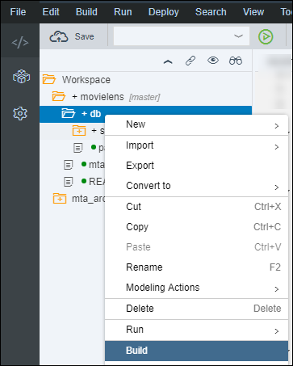

## Prerequisites
 - **Proficiency:** Beginner

## Details
### You will learn

- Create a HDB SQL View Artifact

### Time to Complete
**20 Min**

[ACCORDION-BEGIN [Step 1: ](Open the Web IDE)]

Open the Web IDE, and login using the **`XSA_DEV`** credentials.

Switch to the ***Development*** perspective using the  icon.


As a reminder the default URL for the Web IDE is:

 - `https://hxehost:53075`

A link to the Web IDE can also be found on the ***XSA Controller page*** at:

- `https://hxehost:39030`

[DONE]
[ACCORDION-END]

[ACCORDION-BEGIN [Step 2: ](Create a Rating User Summary view)]

When building your SAPUI5 application, you will need a set of additional views inspired by the series of SQL used to validate our SAP HANA APL & PAL results.

This set of views will help provide a better application user experience.

First, you will create a view that present a ***user rating summary*** which includes the number of ratings, the average notation etc. for each user.

Right click on the **`hdb`** folder and select **New > Folder** (or press ***CTRL+ALT+SHIFT+N***).

Enter **`summary`** as the folder name, then click on **OK**.

Right click on the **`summary`** folder node from the tree, and select **New > File** (or press ***CTRL+ALT+N***).

Enter **`ratings_user.hdbview`** as the file name, then click on **OK**.

Paste the following content:

```SQL
view "aa.movielens.db.hdb.summary::ratings_user" as
select distinct
    userid
  , 'user id: ' || userid || ' - rating count: ' ||   count(1) over( partition by userid )  as description
  , count(1)               over( partition by userid ) as rating_count
  , avg(rating)            over( partition by userid ) as rating_avg
  , nth_value(timestamp,1) over( partition by userid  order by timestamp desc, movieid) as last_rating_date
  , nth_value(rating   ,1) over( partition by userid  order by timestamp desc, movieid) as last_rating
  , nth_value(movieid  ,1) over( partition by userid  order by timestamp desc, movieid) as last_movieid
from "aa.movielens.db.hdb::data.ratings";
```

Save the file using the  icon from the menu or press `CTRL+S`.

The path of the file you have just created is **`movielens/db/src/hdb/summary/ratings_user.hdbview`**.

Right click on **`ratings_user.hdbview`**  and select **Build Selected Files**.

The console should at the display the following message:

```
(Builder) Build of /movielens/db completed successfully.
```

Switch to the ***Database Explorer*** perspective using the  icon.

Select your **HDI Container** connection, and open a new **SQL Console** using the  icon.

Paste the following content in the console, and use the execute icon  from the menu.

```SQL
select
  'summary::ratings_user' as "view name",
  count(1) as "row count"
from   "aa.movielens.db.hdb.summary::ratings_user";
```

Provide an answer to the question below then click on **Validate**.

[VALIDATE_1]
[ACCORDION-END]

[ACCORDION-BEGIN [Step 3: ](Create a Rating Movie Summary view)]

Then, you will create a view that present a ***movie rating summary*** which includes the number of ratings, the average notation etc. for each movie.

Switch to the ***Development*** perspective using the  icon.

Right click on the **`summary`** folder node from the tree, and select **New > File** (or press ***CTRL+ALT+N***).

Enter **`ratings_movie.hdbview`** as the file name, then click on **OK**.

Paste the following content:

```SQL
view "aa.movielens.db.hdb.summary::ratings_movie" as
select distinct
    t1.movieid
  , 'movie id: ' || t1.movieid || ' - rating count: ' ||  count(1) over( partition by t1.movieid ) as description
  , t2. title
  , t2. genres
  , t3. imdbid
  , t3. tmdbid
  , count(1)               over( partition by t1.movieid ) as rating_count
  , avg(rating)            over( partition by t1.movieid ) as rating_avg
  , nth_value(timestamp,1) over( partition by t1.movieid  order by t1.timestamp desc, t1.movieid) as last_rating_date
  , nth_value(rating   ,1) over( partition by t1.movieid  order by t1.timestamp desc, t1.movieid) as last_rating
  , nth_value(userid   ,1) over( partition by t1.movieid  order by t1.timestamp desc, t1.movieid) as last_userid
from "aa.movielens.db.hdb::data.ratings" t1
left outer join "aa.movielens.db.hdb::data.movies" t2 on (t1.movieid = t2.movieid)
left outer join "aa.movielens.db.hdb::data.links"  t3 on (t1.movieid = t3.movieid);
```

Save the file using the  icon from the menu or press `CTRL+S`.

The path of the file you have just created is **`movielens/db/src/hdb/summary/ratings_movie.hdbview`**.

Right click on **`ratings_movie.hdbview`**  and select **Build Selected Files**.

The console should at the display the following message:

```
(Builder) Build of /movielens/db completed successfully.
```

Switch to the ***Database Explorer*** perspective using the  icon.

Select your **HDI Container** connection, and open a new **SQL Console** using the  icon.

Paste the following content in the console, and use the execute icon  from the menu.

```SQL
select
  'summary::ratings_movie' as "view name",
  count(1) as "row count"
from "aa.movielens.db.hdb.summary::ratings_movie"
```

Provide an answer to the question below then click on **Validate**.

[VALIDATE_2]
[ACCORDION-END]

[ACCORDION-BEGIN [Step 4: ](Create a Rating Details view)]

And finally, you will create a view that present the ***rating details*** which joins the ratings along with the movie and links details.

Switch to the ***Development*** perspective using the  icon.

Right click on the **`summary`** folder node from the tree, and select **New > File** (or press ***CTRL+ALT+N***).

Enter **`ratings_detailed.hdbview`** as the file name, then click on **OK**.

Paste the following content:

```SQL
view "aa.movielens.db.hdb.summary::ratings_detailed" as
select
    t1.movieid
  , t1.userid
  , 'user id: ' || t1.userid || ' - user rating: ' || t1.rating || ' - movie id: ' || t1.movieid || ' - title: ' || t2.title as description
  , t2.title
  , t2.genres
  , t3.imdbid
  , t3.tmdbid
  , t1.rating
  , t1.timestamp
from "aa.movielens.db.hdb::data.ratings" t1
left outer join "aa.movielens.db.hdb::data.movies" t2 on (t1.movieid = t2.movieid)
left outer join "aa.movielens.db.hdb::data.links"  t3 on (t1.movieid = t3.movieid);
```

Save the file using the  icon from the menu or press `CTRL+S`.

The path of the file you have just created is **`movielens/db/src/hdb/summary/ratings_detailed.hdbview`**.

Right click on **`ratings_detailed.hdbview`**  and select **Build Selected Files**.

The console should at the display the following message:

```
(Builder) Build of /movielens/db completed successfully.
```

Switch to the ***Database Explorer*** perspective using the  icon.

Select your **HDI Container** connection, and open a new **SQL Console** using the  icon.

Paste the following content in the console, and use the execute icon  from the menu.

```SQL
select
  'summary::ratings_detailed' as "view name",
  count(1) as "row count"
from "aa.movielens.db.hdb.summary::ratings_detailed";
```

Provide an answer to the question below then click on **Validate**.

[VALIDATE_3]
[ACCORDION-END]

[ACCORDION-BEGIN [Step 5: ](Create the APL Recommendation procedure)]

In order to expose in your application the ability to execute the APL Recommendation algorithm, you will need create a stored procedure, that you will later expose in a XSJS service.

In this procedure, you will expose a series of parameters from the APL Recommendation function:

   - Best Seller Threshold
   - Max Top Nodes
   - Minimum Confidence
   - Minimum Predictive Power
   - Minimum Support

Certain parameters are not included either because they are not compatible with the recommendation model type used here, or because they don't influence the generated rules but just the generated SQL to consume the rules.

The complete description of these parameters is available in the [`CREATE_RECO_MODEL_AND_TRAIN` function](https://help.sap.com/viewer/4055990955524bb2bc61ee75de3b08ff/latest/en-US/0bc196486e4047c2a7671ccf529167b6.html) documentation.

Switch to the ***Development*** perspective using the  icon.

Right click on the **`apl`** folder (from **`movielens/db/src/hdb`** ) and select **New > Folder** (or press ***CTRL+ALT+SHIFT+N***).

Enter **`procedures`** as the folder name, then click on **OK**.

Right click on the **`procedures`** folder node from the tree, and select **New > File** (or press ***CTRL+ALT+N***).

Enter **`recommendation.hdbprocedure`** as the file name, then click on **OK**.

Paste the following content:

```SQL
PROCEDURE "aa.movielens.db.hdb.apl.procedures::recommendation" (
    in BestSellerThreshold    integer default 50000
   ,in MaxTopNodes        integer default 100000
   ,in MinimumConfidence     double default 0.05
   ,in MinimumPredictivePower  double default 0.1
   ,in MinimumSupport      integer default 2
)
LANGUAGE SQLSCRIPT
SQL SECURITY INVOKER
AS
BEGIN
  -- Insert operation parameters
  truncate table "aa.movielens.db.hdb.apl::recommendation.function_header";
  in_function_header = select * from "aa.movielens.db.hdb.apl::recommendation.function_header";                                 

  truncate table "aa.movielens.db.hdb.apl::recommendation.operation_config";
  insert into "aa.movielens.db.hdb.apl::recommendation.operation_config" values ('APL/ModelType'  , 'recommendation'  );
  insert into "aa.movielens.db.hdb.apl::recommendation.operation_config" values ('APL/User'       , 'USERID'          ); -- mandatory
  insert into "aa.movielens.db.hdb.apl::recommendation.operation_config" values ('APL/Item'       , 'MOVIEID'         ); -- mandatory
  insert into "aa.movielens.db.hdb.apl::recommendation.operation_config" values ('APL/RuleWeight' , 'Support'         );

  insert into "aa.movielens.db.hdb.apl::recommendation.operation_config" values ('APL/BestSeller'             , cast(:BestSellerThreshold     as varchar));
  insert into "aa.movielens.db.hdb.apl::recommendation.operation_config" values ('APL/MaxTopNodes'            , cast(:MaxTopNodes             as varchar));
  insert into "aa.movielens.db.hdb.apl::recommendation.operation_config" values ('APL/MinimumConfidence'      , cast(:MinimumConfidence       as varchar));
  insert into "aa.movielens.db.hdb.apl::recommendation.operation_config" values ('APL/MinimumPredictivePower' , cast(:MinimumPredictivePower  as varchar));
  insert into "aa.movielens.db.hdb.apl::recommendation.operation_config" values ('APL/MinimumSupport'         , cast(:MinimumSupport          as varchar));

  in_operation_config = select * from "aa.movielens.db.hdb.apl::recommendation.operation_config";       

  truncate table "aa.movielens.db.hdb.apl::recommendation.variable_descs";
  in_variable_descs = select * from "aa.movielens.db.hdb.apl::recommendation.variable_descs";                                   

  in_movielens_dataset = select * from "aa.movielens.db.hdb::data.ratings";           
  call "aa.movielens.db.hdb.apl.afllang::recommendation"(
    :in_function_header,
    :in_operation_config,
    :in_variable_descs,
    :in_movielens_dataset,
    :out_result_model,
    :out_result_model_node_user,
    :out_result_model_node_movie,
    :out_result_model_links,
    :out_result_operation_log,
    :out_result_summary,
    :out_result_indicators,
    :out_result_reco_sql_code
  );
  -- Clear tables content
  truncate table "aa.movielens.db.hdb.apl::recommendation.result_model";
  truncate table "aa.movielens.db.hdb.apl::recommendation.result_model_node_user";
  truncate table "aa.movielens.db.hdb.apl::recommendation.result_model_node_movie";
  truncate table "aa.movielens.db.hdb.apl::recommendation.result_model_links";
  truncate table "aa.movielens.db.hdb.apl::recommendation.result_reco_sql_code";
  -- Insert the results
  insert into "aa.movielens.db.hdb.apl::recommendation.result_model"            select * from :out_result_model;
  insert into "aa.movielens.db.hdb.apl::recommendation.result_model_node_user"  select * from :out_result_model_node_user;
  insert into "aa.movielens.db.hdb.apl::recommendation.result_model_node_movie" select * from :out_result_model_node_movie;
  insert into "aa.movielens.db.hdb.apl::recommendation.result_model_links"      select * from :out_result_model_links;
  insert into "aa.movielens.db.hdb.apl::recommendation.result_reco_sql_code"    select * from :out_result_reco_sql_code;
END
```

Save the file using the  icon from the menu or press `CTRL+S`.

The path of the file you have just created is **`movielens/db/src/hdb/apl/procedures/recommendation.hdbprocedure`**.

Right click on **`recommendation.hdbprocedure`**  and select **Build Selected Files**.

The console should at the display the following message:

```
(Builder) Build of /movielens/db completed successfully.
```

You can now check how many users will get recommendation for the collaborative filtering approach.

Switch to the ***Database Explorer*** perspective using the  icon.

Select your **HDI Container** connection, and open a new **SQL Console** using the  icon.

Paste the following content in the console, and use the execute icon  from the menu.

```SQL
truncate table "aa.movielens.db.hdb.apl::recommendation.result_model";
truncate table "aa.movielens.db.hdb.apl::recommendation.result_model_node_user";
truncate table "aa.movielens.db.hdb.apl::recommendation.result_model_node_movie";
truncate table "aa.movielens.db.hdb.apl::recommendation.result_model_links";
truncate table "aa.movielens.db.hdb.apl::recommendation.result_reco_sql_code";

call "aa.movielens.db.hdb.apl.procedures::recommendation"();

select count(distinct userid) from "aa.movielens.db.hdb.apl.views::recommendation_collaborative_filtering";
```

Provide an answer to the question below then click on **Validate**.

[VALIDATE_4]
[ACCORDION-END]

[ACCORDION-BEGIN [Step 6: ](Create the PAL Apriori procedure)]

In order to expose in your application the ability to execute the PAL APRIORI algorithm, you will need create a stored procedure, that you will later expose in a XSJS service.

In this procedure, you will expose a series of parameters from the PAL APRIORI function:

   - Minimum Support
   - Minimum Confidence
   - Minimum Lift
   - Ubiquitous

Certain parameters are not included because they are not compatible with the recommendation model type used here, or because they would require a more ~~complex~~ sophisticated implementation.

The complete description of these parameters is available in the [APRIORI function](https://help.sap.com/viewer/2cfbc5cf2bc14f028cfbe2a2bba60a50/latest/en-US/7a073d66173a4c1589ef5fbe5bb3120f.html) documentation.

Switch to the ***Development*** perspective using the  icon.

Right click on the **`pal`** folder (from **`movielens/db/src/hdb`** ) and select **New > Folder** (or press ***CTRL+ALT+SHIFT+N***).

Enter **`procedures`** as the folder name, then click on **OK**.

Right click on the **`procedures`** folder node from the tree, and select **New > File** (or press ***CTRL+ALT+N***).

Enter **`apriori.hdbprocedure`** as the file name, then click on **OK**.

Paste the following content:

```SQL
PROCEDURE "aa.movielens.db.hdb.pal.procedures::apriori" (
   in min_support       double default 0.1,
   in min_confidence    double default 0.1,
   in min_lift          double default 0.0,
   in ubiquitous        double default 1.0
)
LANGUAGE SQLSCRIPT
SQL SECURITY INVOKER
AS
BEGIN
  -- Insert operation parameters
  truncate table "aa.movielens.db.hdb.pal::apriori.parameter";
  insert into "aa.movielens.db.hdb.pal::apriori.parameter" VALUES ('MIN_SUPPORT'     , null, :min_support    , null);
  insert into "aa.movielens.db.hdb.pal::apriori.parameter" VALUES ('MIN_CONFIDENCE'  , null, :min_confidence , null);
  insert into "aa.movielens.db.hdb.pal::apriori.parameter" VALUES ('MIN_LIFT'        , null, :min_lift       , null);
  insert into "aa.movielens.db.hdb.pal::apriori.parameter" VALUES ('UBIQUITOUS'      , null, :ubiquitous     , null);
  insert into "aa.movielens.db.hdb.pal::apriori.parameter" VALUES ('MAX_CONSEQUENT'  , 1   , null  , null);
  insert into "aa.movielens.db.hdb.pal::apriori.parameter" VALUES ('MAX_ITEM_LENGTH' , 1   , null  , null);
  in_parameter = select * from "aa.movielens.db.hdb.pal::apriori.parameter";                                 

  in_movielens_dataset = select USERID, MOVIEID from "aa.movielens.db.hdb::data.ratings";
  call "aa.movielens.db.hdb.pal.afllang::apriori"(
    :in_movielens_dataset,
    :in_parameter,
    :out_result_rules,
    :out_model_pmml
  );
  -- Clear tables content
  truncate table "aa.movielens.db.hdb.pal::apriori.result_rules";
  truncate table "aa.movielens.db.hdb.pal::apriori.model_pmml";
  -- Insert the results
  insert into "aa.movielens.db.hdb.pal::apriori.result_rules"  select * from :out_result_rules;
  insert into "aa.movielens.db.hdb.pal::apriori.model_pmml"    select * from :out_model_pmml;
END;
```

Save the file using the  icon from the menu or press `CTRL+S`.

The path of the file you have just created is **`movielens/db/src/hdb/pal/procedures/apriori.hdbprocedure`**.

Right click on **`apriori.hdbprocedure`**  and select **Build Selected Files**.

The console should at the display the following message:

```
(Builder) Build of /movielens/db completed successfully.
```

You can now check how many users will get recommendation for the collaborative filtering approach.

Switch to the ***Database Explorer*** perspective using the  icon.

Select your **HDI Container** connection, and open a new **SQL Console** using the  icon.

Paste the following content in the console, and use the execute icon  from the menu.

```SQL
truncate table "aa.movielens.db.hdb.pal::apriori.result_rules";
truncate table "aa.movielens.db.hdb.pal::apriori.model_pmml";

call "aa.movielens.db.hdb.pal.procedures::apriori"();

select count(distinct userid) from "aa.movielens.db.hdb.pal.views::apriori_collaborative_filtering";
```

Provide an answer to the question below then click on **Validate**.

[VALIDATE_5]
[ACCORDION-END]

[ACCORDION-BEGIN [Step 5: ](Build the SAP HANA Database Module)]

Right click on the **`db`** folder and select **Build**.



The console should at the display the following message:

```
(Builder) Build of /movielens/db completed successfully.
```

[DONE]
[ACCORDION-END]

[ACCORDION-BEGIN [Step 6: ](Commit your changes)]

On the icon bar located on the right side of the Web IDE, click on the **Git Pane** icon .

Click on **Stage All**, enter a commit comment, then click on **Commit and Push > origin master**.

[DONE]
[ACCORDION-END]
