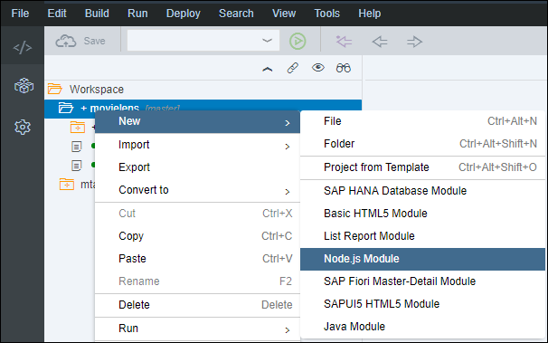
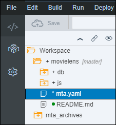
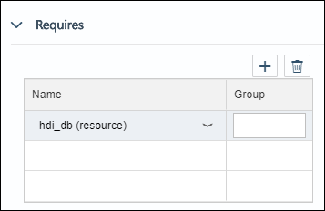
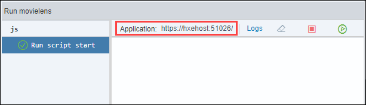
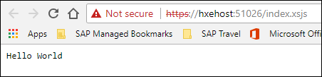
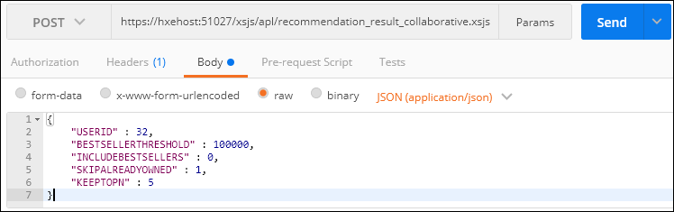

## Prerequisites
 - [Use Machine Learning to Build a Movie Recommendation application using the XS advanced development model](https://www.sap.com/developer/groups/hxe-aa-movielens.html)

## Next Steps
 - [Use Machine Learning to Build a Movie Recommendation application using the XS advanced development model](https://www.sap.com/developer/groups/hxe-aa-movielens.html)

## Details
### You will learn
 - Create a Node.js Module
 - Add a dependency to the SAP HANA Database Module
 - Create a XS OData service
 - Test the  XS OData service

[ACCORDION-BEGIN [Step 1: ](Open the Web IDE)]

Open the Web IDE, and login using the **`XSA_DEV`** credentials.

Switch to the ***Development*** perspective using the  icon.


As a reminder the default URL for the Web IDE is:

 - `https://hxehost:53075`

A link to the Web IDE can also be found on the ***XSA Controller page*** at:

- `https://hxehost:39030`

[DONE]
[ACCORDION-END]

[ACCORDION-BEGIN [Step 2: ](Create a Node.js Module)]

In the left panel, right click on the `movielens` project, then select **New > Node.js Module**.



Set the name to **`js`** and click on **Next**.

Check **Enable XSJS support**.

Click on **Finish**.


[DONE]
[ACCORDION-END]

[ACCORDION-BEGIN [Step 3: ](Add Module dependencies)]

In order to consume the data from the SAP HANA Database Module created previously, you will need to add a dependency from the Node.js Module to the SAP HANA Database Module.

Edit the **`mta.yaml`** file located in the `movielens` project folder.



Select the **`js`** module.


Under the **Requires** section, add your ***SAP HANA Database Module*** resource (most likely named **`hdi_db`**).



Save the file using the  icon from the menu.

[DONE]
[ACCORDION-END]

[ACCORDION-BEGIN [Step 4: ](Create the folder structure)]

Before creating the OData and XSJS services, you need to create the required directory structure.

Expand the **`movielens/js/lib`** folder.

Create the following directory structure:

```
|-- movielens/js/lib
    |-- xsodata
    |-- xsjs
        |-- apl
        |-- pal
```

[DONE]
[ACCORDION-END]

[ACCORDION-BEGIN [Step 5: ](Create SAP HANA XS OData services)]

Now, you can expose the results and summary views using XS OData services that will consumed by your SAPUI5 applications.

In the left side panel, expand the **`movielens/js/lib/xsodata`** tree node.

Right click on the **`xsodata`** folder node from the tree, and select **New > File**.

Enter **`data.xsodata`** as the file name, then click on **OK**.

This is the full path of the created file:

```
movielens/js/lib/xsodata/data.xsodata
```

Paste the following content in the console.

```JavaScript
service {
  // expose the model result views
  "aa.movielens.db.hdb.apl.views::recommendation_collaborative"  as "apl_recommendation_collaborative" key ("USERID" , "RANK");
  "aa.movielens.db.hdb.apl.views::recommendation_contentbased"   as "apl_recommendation_contentbased"  key ("MOVIEID", "RANK");
  "aa.movielens.db.hdb.pal.views::apriori_collaborative"         as "pal_apriori_collaborative"        key ("USERID" , "RANK");
  "aa.movielens.db.hdb.pal.views::apriori_contentbased"          as "pal_apriori_contentbased"         key ("MOVIEID", "RANK");

  // expose the summary user and movie views
  "aa.movielens.db.hdb.summary::ratings_user"       as "ratings_user"     key ("USERID");
  "aa.movielens.db.hdb.summary::ratings_movie"      as "ratings_movie"    key ("MOVIEID");
  "aa.movielens.db.hdb.summary::ratings_detailed"   as "ratings_detailed" key ("USERID", "MOVIEID");
}
```

Save the file using the  icon from the menu.

[DONE]
[ACCORDION-END]

[ACCORDION-BEGIN [Step 6: ](Create SAP HANA XSJS services for APL)]

Now, you can expose the XSJS service that will let you run and retrieve the result for the APL Recommendation algorithm using the procedure created previously.

#### The execution service

As you will notice, not all the algorithm parameters are exposed, and this is on purpose, as you will use them for the result retrieval part.

In short, the service implements a POST method that accepts a JSON stream with a set of parameters.

Then the XSJS Connection API is used to execute the stored procedures previously created.

If successful, a HTTP OK return core is sent back with no body else the error message is returned.

In the left side panel, expand the **`movielens/js/lib/xsjs/apl`** tree node.

Right click on the **`apl`** folder node from the tree, and select **New > File**.

Enter **`recommendation_execute.xsjs`** as the file name, then click on **OK**.

This is the full path of the created file:

```
movielens/js/lib/xsjs/apl/recommendation_execute.xsjs
```

Paste the following content in the console.

```JavaScript
/*eslint no-console: 0, no-unused-vars: 0, dot-notation: 0*/
/*eslint-env node, es6 */
function close(o) {
  try {
    if (o) {
      o.close();
    }
  } catch (e) { /* do nothing */ }
}

function methodNotAllowed() {
  $.response.status = $.net.http.METHOD_NOT_ALLOWED;
  $.response.setBody(JSON.stringify({
    message: "Method Not Allowed"
  }));
}

function doPost() {
  var connection = null;
  var preparedStatement = null;
  try {
    // Build the SQL Query with the parameters
    var params = {};
    if (typeof $.request.body !== "undefined") {
      // Get the request body
      var requestBody = JSON.parse($.request.body.asString());
      if (typeof requestBody.BESTSELLERTHRESHOLD !== "undefined") {
        params.BESTSELLERTHRESHOLD = requestBody.BESTSELLERTHRESHOLD;
      }
      if (typeof requestBody.MAXTOPNODES !== "undefined") {
        params.MAXTOPNODES = requestBody.MAXTOPNODES;
      }
      if (typeof requestBody.MINIMUMCONFIDENCE !== "undefined") {
        params.MINIMUMCONFIDENCE = requestBody.MINIMUMCONFIDENCE;
      }
      if (typeof requestBody.MINIMUMPREDICTIVEPOWER !== "undefined") {
        params.MINIMUMPREDICTIVEPOWER = requestBody.MINIMUMPREDICTIVEPOWER;
      }
      if (typeof requestBody.MINIMUMSUPPORT !== "undefined") {
        params.MINIMUMSUPPORT = requestBody.MINIMUMSUPPORT;
      }
    }

    var start = Date.now();
    connection = $.hdb.getConnection();
    var algorithm = connection.loadProcedure(null, "aa.movielens.db.hdb.apl.procedures::recommendation_execute");
    var results = algorithm(params);
    $.response.status = $.net.http.OK;
    $.response.setBody(JSON.stringify({
      results: results,
      message: "Process completed in : " + (Date.now() - start) + " ms"
    }));
  } catch (e) {
    $.response.setBody(JSON.stringify({
      message: e.message
    }));
    $.response.status = $.net.http.BAD_REQUEST;
  } finally {
    close(preparedStatement);
    close(connection);
  }
}
$.response.contentType = "application/json; charset=utf-16le";
switch ($.request.method) {
  case $.net.http.POST:
    doPost();
    break;
  default:
    methodNotAllowed();
    break;
}
```

Save the file using the  icon from the menu.

#### The collaborative & content based filtering results service

For the results procedure, you will be using very similar XSJS service for both the collaborative and content based filtering results where the only difference will be on the set of input parameters.

Therefore, you will only create one XSJS service that serve both needs.

In the left side panel, expand the **`movielens/js/lib/xsjs/apl`** tree node.

Right click on the **`apl`** folder node from the tree, and select **New > File**.

Enter **`recommendation_results.xsjs`** as the file name, then click on **OK**.

This is the full path of the created file:

```
movielens/js/lib/xsjs/apl/recommendation_results.xsjs
```

Paste the following content in the console.

```JavaScript
/*eslint no-console: 0, no-unused-vars: 0, dot-notation: 0*/
/*eslint-env node, es6 */
function close(o) {
  try {
    if (o) {
      o.close();
    }
  } catch (e) { /* do nothing */ }
}

function methodNotAllowed() {
  $.response.status = $.net.http.METHOD_NOT_ALLOWED;
  $.response.setBody(JSON.stringify({
    message: "Method Not Allowed"
  }));
}

function doPost() {
  var connection = null;
  var preparedStatement = null;
  try {
    // Build the SQL Query with the parameters
    var params = {};
    var resultType = "";
    if (typeof $.request.body !== "undefined") {
      // Get the request body
      var requestBody = JSON.parse($.request.body.asString());
      if (typeof requestBody.resultType !== "undefined") {
        resultType = requestBody.resultType;
      }
      if (typeof requestBody.USERID !== "undefined") {
        params.USERID = requestBody.USERID;
      }
      if (typeof requestBody.MOVIEID !== "undefined") {
        params.MOVIEID = requestBody.MOVIEID;
      }
      if (typeof requestBody.BESTSELLERTHRESHOLD !== "undefined") {
        params.BESTSELLERTHRESHOLD = requestBody.BESTSELLERTHRESHOLD;
      }
      if (typeof requestBody.INCLUDEBESTSELLERS !== "undefined") {
        params.INCLUDEBESTSELLERS = (requestBody.INCLUDEBESTSELLERS ? 1 : 0);
      }
      if (typeof requestBody.SKIPALREADYOWNED !== "undefined") {
        params.SKIPALREADYOWNED = (requestBody.SKIPALREADYOWNED ? 1 : 0);
      }
      if (typeof requestBody.KEEPTOPN !== "undefined") {
        params.KEEPTOPN = requestBody.KEEPTOPN;
      }
    }

    var start = Date.now();
    connection = $.hdb.getConnection();
    var algorithm = connection.loadProcedure(null, "aa.movielens.db.hdb.apl.procedures::recommendation_result_" + resultType);
    var result = algorithm(params);
    $.response.status = $.net.http.OK;
    $.response.setBody(JSON.stringify({
      results: result.RESULTS,
      message: "Process completed in : " + (Date.now() - start) + " ms!"
    }));
  } catch (e) {
    $.response.setBody(JSON.stringify({
      message: e.message
    }));
    $.response.status = $.net.http.BAD_REQUEST;
  } finally {
    close(preparedStatement);
    close(connection);
  }
}
$.response.contentType = "application/json; charset=utf-16le";
switch ($.request.method) {
  case $.net.http.POST:
    doPost();
    break;
  default:
    methodNotAllowed();
    break;
}
```

Save the file using the  icon from the menu.

[DONE]
[ACCORDION-END]

[ACCORDION-BEGIN [Step 7: ](Create SAP HANA XSJS services for PAL)]

Now, you can expose the XSJS service that will let you run and retrieve the result for the PAL APRIORI algorithm using the procedure created previously.

#### The execution service

As you will notice, not all the algorithm parameters are exposed, and this is on purpose, as you will use them for the result retrieval part.

In short, the service implements a POST method that accepts a JSON stream with a set of parameters.

Then the XSJS Connection API is used to execute the stored procedures previously created.

If successful, a HTTP OK return core is sent back with no body else the error message is returned.

In the left side panel, expand the **`movielens/js/lib/xsjs/pal`** tree node.

Right click on the **`pal`** folder node from the tree, and select **New > File**.

Enter **`apriori_execute.xsjs`** as the file name, then click on **OK**.

This is the full path of the created file:

```
movielens/js/lib/xsjs/pal/apriori_execute.xsjs
```

Paste the following content in the console.

```JavaScript
/*eslint no-console: 0, no-unused-vars: 0, dot-notation: 0*/
/*eslint-env node, es6 */
function close(o) {
  try {
    if (o) {
      o.close();
    }
  } catch (e) { /* do nothing */ }
}

function methodNotAllowed() {
  $.response.status = $.net.http.METHOD_NOT_ALLOWED;
  $.response.setBody(JSON.stringify({
    message: "Method Not Allowed"
  }));
}

function doPost() {
  var connection = null;
  var preparedStatement = null;
  try {
    // Build the SQL Query with the parameters
    var params = {};
    if (typeof $.request.body !== "undefined") {
      // Get the request body
      var requestBody = JSON.parse($.request.body.asString());
      if (typeof requestBody.MIN_SUPPORT !== "undefined") {
        params.MIN_SUPPORT = requestBody.MIN_SUPPORT;
      }
      if (typeof requestBody.MIN_CONFIDENCE !== "undefined") {
        params.MIN_CONFIDENCE =  requestBody.MIN_CONFIDENCE ;
      }
      if (typeof requestBody.MIN_LIFT !== "undefined") {
        params.MIN_LIFT = requestBody.MIN_LIFT;
      }
      if (typeof requestBody.UBIQUITOUS !== "undefined") {
        params.UBIQUITOUS =  requestBody.UBIQUITOUS ;
      }
    }

    var start = Date.now();
    connection = $.hdb.getConnection();
    var algorithm = connection.loadProcedure(null, "aa.movielens.db.hdb.pal.procedures::apriori_execute");
    var results = algorithm(params);
    $.response.status = $.net.http.OK;
    $.response.setBody(JSON.stringify({
      results: results,
      message: "Process completed in : " + (Date.now() - start) + " ms"
    }));
  } catch (e) {
    $.response.setBody(JSON.stringify({
      message: e.message
    }));
    $.response.status = $.net.http.BAD_REQUEST;
  } finally {
    close(preparedStatement);
    close(connection);
  }
}
$.response.contentType = "application/json; charset=utf-16le";
switch ($.request.method) {
  case $.net.http.POST:
    doPost();
    break;
  default:
    methodNotAllowed();
    break;
}
```

Save the file using the  icon from the menu.

#### The collaborative & content based filtering results service

For the results procedure, you will be using very similar XSJS service for both the collaborative and content based filtering results where the only difference will be on the set of input parameters.

Therefore, you will only create one XSJS service that serve both needs.

In the left side panel, expand the **`movielens/js/lib/xsjs/pal`** tree node.

Right click on the **`pal`** folder node from the tree, and select **New > File**.

Enter **`apriori_results.xsjs`** as the file name, then click on **OK**.

This is the full path of the created file:

```
movielens/js/lib/xsjs/pal/apriori_results.xsjs
```

Paste the following content in the console.

```JavaScript
/*eslint no-console: 0, no-unused-vars: 0, dot-notation: 0*/
/*eslint-env node, es6 */
function close(o) {
  try {
    if (o) {
      o.close();
    }
  } catch (e) { /* do nothing */ }
}

function methodNotAllowed() {
  $.response.status = $.net.http.METHOD_NOT_ALLOWED;
  $.response.setBody(JSON.stringify({
    message: "Method Not Allowed"
  }));
}

function doPost() {
  var connection = null;
  var preparedStatement = null;
  try {
    // Build the SQL Query with the parameters
    var params = {};
    var resultType = "";
    if (typeof $.request.body !== "undefined") {
      // Get the request body
      var requestBody = JSON.parse($.request.body.asString());
      if (typeof requestBody.resultType !== "undefined") {
        resultType = requestBody.resultType;
      }
      if (typeof requestBody.USERID !== "undefined") {
        params.USERID = requestBody.USERID;
      }
      if (typeof requestBody.MOVIEID !== "undefined") {
        params.MOVIEID = requestBody.MOVIEID;
      }
      if (typeof requestBody.KEEPTOPN !== "undefined") {
        params.KEEPTOPN = requestBody.KEEPTOPN;
      }
    }

    var start = Date.now();
    connection = $.hdb.getConnection();
    var algorithm = connection.loadProcedure(null, "aa.movielens.db.hdb.pal.procedures::apriori_result_" + resultType);
    var result = algorithm(params);

    $.response.status = $.net.http.OK;
    $.response.setBody(JSON.stringify({
      results: result.RESULTS,
      message: "Process completed in : " + (Date.now() - start) + " ms!"
    }));
  } catch (e) {
    $.response.setBody(JSON.stringify({
      message: e.message
    }));
    $.response.status = $.net.http.BAD_REQUEST;
  } finally {
    close(preparedStatement);
    close(connection);
  }
}
$.response.contentType = "application/json; charset=utf-16le";
switch ($.request.method) {
  case $.net.http.POST:
    doPost();
    break;
  default:
    methodNotAllowed();
    break;
}
```

Save the file using the  icon from the menu.

[DONE]
[ACCORDION-END]

[ACCORDION-BEGIN [Step 8: ](Build and Start the Node.js Module)]

Right click on the **`js`** folder and select **Build**.


The console should display at the end the following message:

```
(Builder) Build of /movielens/js completed successfully.
```

Select the **`js`** module,  then click on the execute icon  from the menu bar.

Once the application is started, you can click on the application URL:



This should open the ***`index.xsjs`*** page.



[DONE]
[ACCORDION-END]

[ACCORDION-BEGIN [Step 9: ](Test your XS OData service)]

Now, let's test your **XS OData** service.

From the ***`index.xsjs`*** page, replace ***`index.xsjs`***  from the URL by:

```HTML
xsodata/data.xsodata?$format=json
```

You should now get the list of XS OData services available.


Replace ***`xsodata/data.xsodata?$format=json`***  from the URL by:

```HTML
xsodata/data.xsodata/apl_recommendation_collaborative(USERID=1,RANK=1)/TITLE?$format=json
```

You should get the rank 1 recommendation from the APL algorithm collaborative filtering results for user id 1, which should be ***Star Wars: Episode V - The Empire Strikes Back (1980)***.

Provide an answer to the question below then click on **Validate**.

[VALIDATE_1]
[ACCORDION-END]

[ACCORDION-BEGIN [Step 10: ](Test your XSJS service)]

Open your preferred REST client, like **`cURL`**, and if don't have one yet you can [install and use Postman](https://www.sap.com/developer/tutorials/api-tools-postman-install.html).

#### With Postman

Open a new tab, and set the following information:

Name           | Value
:------------- | :--------------
Request Method | POST
URL            | `https://hxehost:51xxx/xsjs/apl/recommendation_results.xsjs`

Select the **Body** tab, enable the **raw** mode, select **`JSON (application/json)`** in the drop down (instead of ***Text***), then past the following content:

```JSON
{
  "USERID" : 32,
  "BESTSELLERTHRESHOLD" : 100000,
  "INCLUDEBESTSELLERS" : 0,
  "SKIPALREADYOWNED" : 1,
  "KEEPTOPN" : 5,
  "resultType": "collaborative"
}
```

Click on **Send**.



#### With `cURL`

With `cURL`, you can use the following command:

```shell
curl --request POST \
  --url https://hxehost:51xxx/xsjs/apl/recommendation_results.xsjs \
  --header 'cache-control: no-cache' \
  --header 'content-type: application/json' \
  --data '{"USERID" : 32, "BESTSELLERTHRESHOLD" : 100000, "INCLUDEBESTSELLERS" : 0, "SKIPALREADYOWNED" : 1, "KEEPTOPN" : 5, "resultType": "collaborative"}'
```

> ### **Note:** Make sure to adjust the host and port number used in the URL to your local environment.
&nbsp;
> You might also need to add the following parameters when using `cURL`  to ignore certificate signature origin and proxy:
> ```
--insecure --noproxy "*"
```

Provide an answer to the question below then click on **Validate**.

[VALIDATE_2]
[ACCORDION-END]

[ACCORDION-BEGIN [Step 11: ](Commit your changes)]

On the icon bar located on the right side of the Web IDE, click on the **Git Pane** icon .

Click on **Stage All**, enter a commit comment, then click on **Commit and Push > origin master**.

[DONE]
[ACCORDION-END]
