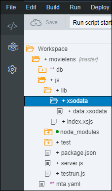
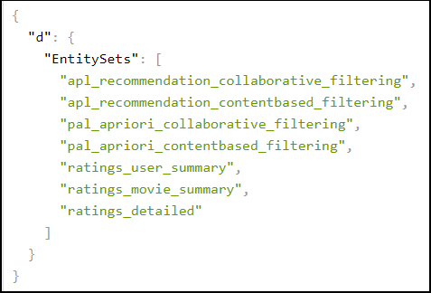

## Prerequisites
 - **Proficiency:** Beginner

## Details
### You will learn

 - Create a Node.js Module
 - Add a dependency to the SAP HANA Database Module
 - Create a XS OData service
 - Test the  XS OData service

### Time to Complete
**15 Min**

[ACCORDION-BEGIN [Step 1: ](Open the Web IDE)]

Open the Web IDE, and login using the **`XSA_DEV`** credentials.

Switch to the ***Development*** perspective using the  icon.


As a reminder the default URL for the Web IDE is:

 - `https://hxehost:53075`

A link to the Web IDE can also be found on the ***XSA Controller page*** at:

- `https://hxehost:39030`

[DONE]
[ACCORDION-END]

[ACCORDION-BEGIN [Step 2: ](Create a Node.js Module)]

In the left panel, right click on the `movielens` project, then select **New > Node.js Module**.


Set the name to **`js`** and click on **Next**.

Check **Enable XSJS support**.

Click on **Finish**.


[DONE]
[ACCORDION-END]

[ACCORDION-BEGIN [Step 3: ](Add Module dependencies)]

In order to consume the data from the SAP HANA Database Module created previously, you will need to add a dependency from the Node.js Module to the SAP HANA Database Module.

Edit the **`mta.yaml`** file located in the `movielens` project folder.


Select the **`js`** module.


Under the **Requires** section, add your ***SAP HANA Database Module*** resource (most likely named **`hdi_db`**).


Save the file using the  icon from the menu or press `CTRL+S`.

[DONE]
[ACCORDION-END]

[ACCORDION-BEGIN [Step 4: ](Create SAP HANA XS OData services)]

Now, you can expose the results and summary views using XS OData services that will consumed by your SAPUI5 applications.

Expand the **`movielens/js/lib`** folder.

Right click on the **`lib`** folder and select **New > Folder** (or press ***CTRL+ALT+SHIFT+N***).

Enter **`xsodata`** as the folder name, then click on **OK**.

Create a new file named **`data.xsodata`** in the **`movielens/js/lib/xsodata`** folder.



Paste the following content in the console.

```JavaScript
service {
  // expose the model result views
  "aa.movielens.db.hdb.apl::recommendation_collaborative_filtering"  as "apl_recommendation_collaborative_filtering" key ("USERID" , "RANK");
  "aa.movielens.db.hdb.apl::recommendation_contentbased_filtering"   as "apl_recommendation_contentbased_filtering"  key ("MOVIEID", "RANK");
  "aa.movielens.db.hdb.pal::apriori_collaborative_filtering"         as "pal_apriori_collaborative_filtering"        key ("USERID" , "RANK");
  "aa.movielens.db.hdb.pal::apriori_contentbased_filtering"          as "pal_apriori_contentbased_filtering"         key ("MOVIEID", "RANK");

  // expose the summary user and movie views
  "aa.movielens.db.hdb.summary::ratings_user"       as "ratings_user"     key ("USERID");
  "aa.movielens.db.hdb.summary::ratings_movie"      as "ratings_movie"    key ("MOVIEID");
  "aa.movielens.db.hdb.summary::ratings_detailed"   as "ratings_detailed" key ("USERID", "MOVIEID");
}
```

Save the file using the  icon from the menu or press `CTRL+S`.

The path of the file you have just created is **`movielens/db/src/js/lib/xsodata/data.xsodata`**.

[DONE]
[ACCORDION-END]

[ACCORDION-BEGIN [Step 5: ](Create SAP HANA XSJS services)]

And last but not least, you can expose the XSJS services that will let you run the algorithm with different parameters.

The XSJS services can be called as REST API.

In this example, the service implement a POST method that accepts a JSON stream with the set of parameters.

It uses the XSJS Connection API to execute the stored procedures previously created.

If successful, a HTTP OK return core is sent back with no body else the error message is returned.

Expand the **`movielens/js/lib`** folder.

Right click on the **`lib`** folder and select **New > Folder** (or press ***CTRL+ALT+SHIFT+N***).

Enter **`xsjs`** as the folder name, then click on **OK**.

Create a new file named **`apl_recommendation.xsjs`** in the **`movielens/js/lib/xsjs`** folder.

Paste the following content in the console.

```JavaScript
/*eslint no-console: 0, no-unused-vars: 0, dot-notation: 0*/
/*eslint-env node, es6 */

function methodNotAllowed() {
	$.response.contentType = "text/html";
	$.response.status = $.net.http.METHOD_NOT_ALLOWED;
	$.response.setBody("405 Method Not Allowed");
}

function doPost() {
	// Get the request body
	var requestBody = JSON.parse($.request.body.asString());
	// Build the SQL Query with the parameters
	var query = "call \"aa.movielens.db.hdb.apl::recommendation_execute\"( ";
	if (typeof requestBody.BESTSELLERTHRESHOLD !== "undefined") {
		query += " BESTSELLERTHRESHOLD => " + requestBody.BESTSELLERTHRESHOLD + ",";
	}
	if (typeof requestBody.MAXTOPNODES !== "undefined") {
		query += " MAXTOPNODES => " + requestBody.MAXTOPNODES + ",";
	}
	if (typeof requestBody.MINIMUMCONFIDENCE !== "undefined") {
		query += " MINIMUMCONFIDENCE => " + requestBody.MINIMUMCONFIDENCE + ",";
	}
	if (typeof requestBody.MINIMUMPREDICTIVEPOWER !== "undefined") {
		query += " MINIMUMPREDICTIVEPOWER => " + requestBody.MINIMUMPREDICTIVEPOWER + ",";
	}
	if (typeof requestBody.MINIMUMSUPPORT !== "undefined") {
		query += " MINIMUMSUPPORT => " + requestBody.MINIMUMSUPPORT + ",";
	}
	query = query.replace(/,\s*$/, "");
	query += ");";

	try {
		var connection = $.db.getConnection();
		var preparedStatement = connection.prepareStatement(query);
		preparedStatement.execute();
		preparedStatement.close();
		connection.close();

		$.response.contentType = "plain/text; charset=utf-16le";
		$.response.status = $.net.http.OK;
	} catch (e) {
		$.response.setBody(JSON.stringify({ error : e}));
		$.response.contentType = "application/json; charset=utf-16le";
		$.response.status = $.net.http.BAD_REQUEST;
	}
}

switch ($.request.method) {
	case $.net.http.POST:
		doPost();
		break;
	default:
		methodNotAllowed();
		break;
}
```

Save the file using the  icon from the menu or press `CTRL+S`.

The path of the file you have just created is **`movielens/db/src/js/lib/xsjs/apl_recommendation.xsjs`**.

Create a new file named **`pal_apriori.xsjs`** in the **`movielens/js/lib/xsjs`** folder.

Paste the following content in the console.

```JavaScript
/*eslint no-console: 0, no-unused-vars: 0, dot-notation: 0*/
/*eslint-env node, es6 */

function methodNotAllowed() {
	$.response.contentType = "text/html";
	$.response.status = $.net.http.METHOD_NOT_ALLOWED;
	$.response.setBody("405 Method Not Allowed");
}

function doPost() {
	// Get the request body
	var requestBody = JSON.parse($.request.body.asString());
	// Build the SQL Query with the parameters
	var query = "call \"aa.movielens.db.hdb.pal::apriori_execute\"( ";
	if (typeof requestBody.MIN_SUPPORT !== "undefined") {
		query += " MIN_SUPPORT => " + requestBody.MIN_SUPPORT + ",";
	}
	if (typeof requestBody.MIN_CONFIDENCE !== "undefined") {
		query += " MIN_CONFIDENCE => " + requestBody.MIN_CONFIDENCE + ",";
	}
	if (typeof requestBody.MIN_LIFT !== "undefined") {
		query += " MIN_LIFT => " + requestBody.MIN_LIFT + ",";
	}
	if (typeof requestBody.UBIQUITOUS !== "undefined") {
		query += " UBIQUITOUS => " + requestBody.UBIQUITOUS + ",";
	}
	query = query.replace(/,\s*$/, "");
	query += ");";

console.log(query);
	try {
		var connection = $.db.getConnection();
		var preparedStatement = connection.prepareStatement(query);
		preparedStatement.execute();
		preparedStatement.close();
		connection.close();

		$.response.contentType = "plain/text; charset=utf-16le";
		$.response.status = $.net.http.OK;
	} catch (e) {
		$.response.setBody(JSON.stringify({ error : e}));
		$.response.contentType = "application/json; charset=utf-16le";
		$.response.status = $.net.http.BAD_REQUEST;
	}
}

switch ($.request.method) {
	case $.net.http.POST:
		doPost();
		break;
	default:
		methodNotAllowed();
		break;
}
```

Save the file using the  icon from the menu or press `CTRL+S`.

The path of the file you have just created is **`movielens/db/src/js/lib/xsjs/pal_apriori.xsjs`**.

[DONE]
[ACCORDION-END]


[ACCORDION-BEGIN [Step 5: ](Build and Start the Node.js Module)]

Right click on the **`js`** folder and select **Build**.


The console should at the display the following message:

```
(Builder) Build of /movielens/js completed successfully.
```

Select the **`js`** module,  then click on the execute icon  from the menu bar.

Once the application is started, you can click on the application URL:


This should open the ***`index.xsjs`*** page.


[DONE]
[ACCORDION-END]

[ACCORDION-BEGIN [Step 6: ](Test your XS OData service)]

Now, let's test your **XS OData** service.

From the ***`index.xsjs`*** page, replace ***`index.xsjs`***  from the URL by:

```HTML
xsodata/data.xsodata?$format=json
```

You should now get the list of XS OData services available.



Replace ***`xsodata/data.xsodata?$format=json`***  from the URL by:

```HTML
xsodata/data.xsodata/apl_recommendation_collaborative_filtering(USERID=1,RANK=1)/TITLE?$format=json
```

You should get the rank 1 recommendation from the APL algorithm collaborative filtering results for user id 1.

Provide an answer to the question below then click on **Validate**.

[VALIDATE_1]
[ACCORDION-END]

[ACCORDION-BEGIN [Step 7: ](Commit your changes)]

On the icon bar located on the right side of the Web IDE, click on the **Git Pane** icon .

Click on **Stage All**, enter a commit comment, then click on **Commit and Push > origin master**.

[DONE]
[ACCORDION-END]
