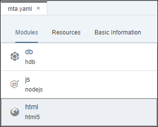
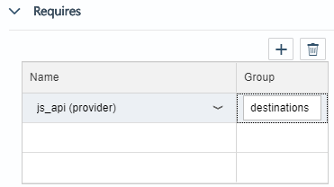
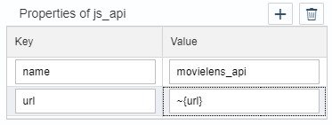
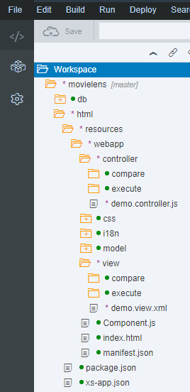
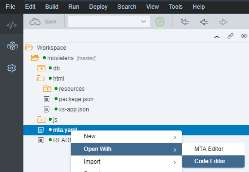

## Prerequisites
 - **Proficiency:** Beginner

## Details
### You will learn

 - Create a SAPUI5 HTML Module
 - Add a dependency to the Node.js Module as a destination
 - Configure the Application Router
 - Configure the Application Manifest
 - Run your SAPUI5 application

**Note:** The intent of the following tutorials is not to focus on SAPUI5 but to use it as mean to execute the SAP Predictive services.
For more content on SAPUI5, you can check the dedicated <a href="https://sapui5.hana.ondemand.com/#/topic/3da5f4be63264db99f2e5b04c5e853db" target="new">tutorials</a> section available on the <a href="https://sapui5.hana.ondemand.com" target="new">SAPUI5 documentation</a>.

### Time to Complete
**25 Min**

[ACCORDION-BEGIN [Step 1: ](Open the Web IDE)]

Open the Web IDE, and login using the **`XSA_DEV`** credentials.

Switch to the ***Development*** perspective using the  icon.


As a reminder the default URL for the Web IDE is:

 - `https://hxehost:53075`

A link to the Web IDE can also be found on the ***XSA Controller page*** at:

- `https://hxehost:39030`

[DONE]
[ACCORDION-END]

[ACCORDION-BEGIN [Step 2: ](Create a SAPUI5 HTML Module)]

In the left panel, right click on the `movielens` project, then select **New > SAPUI5 HTML Module**.


Enter the following information, then click on **Next**

Field Name           | Value
-------------------- | --------------
Module Name          | `html`
Namespace            | `movielens`


Enter the following information, then click on **Finish**

Field Name           | Value
-------------------- | --------------
View Type            | `XML`
View Name            | `demo`


[DONE]
[ACCORDION-END]

[ACCORDION-BEGIN [Step 3: ](Add Module Dependencies)]

In order to consume the XS OData service from the Node.js Module created previously, you will need to add a dependency from the SAPUI5 HTML Module to the Node.js Module.

Open the **`mta.yaml`** file located in the `movielens` project folder.


Select the **`html`** module.



Under the **Requires** section, add your ***Node.js API provider*** (most likely named **`js_api` (provider)**).

Set the **Group** value to **destinations**.



Add the following properties to the **`js_api`** entry:

Key                  | Value
-------------------- | --------------
`name`               | `movielens_api`
`url`                | `~{url}`



Save the file using the  icon from the menu or press `CTRL+S`.

[DONE]
[ACCORDION-END]

[ACCORDION-BEGIN [Step 4: ](Edit the Application Router Configuration)]

The XS Advanced Application Router Configuration file (`xs-app.json`) contains the configuration information used by the application router.

For more details on the syntax, please check the online [documentation](https://help.sap.com/viewer/4505d0bdaf4948449b7f7379d24d0f0d/latest/en-US/5f77e58ec01b46f6b64ee1e2afe3ead7.html).

Open the **`xs-app.json`** file located in the `movielens/html` folder.

Replace the current content by the following:

```JSON
{
	"welcomeFile": "webapp/index.html",
	"authenticationMethod": "none",
	"routes": [{
		"source": "/xsjs/(.*)(.xsjs)",
		"destination": "movielens_api",
		"csrfProtection": true,
 		"authenticationType": "none"
	}, {
		"source": "/xsodata/(.*)(.xsodata)",
		"destination": "movielens_api",
 		"authenticationType": "none"
	}]
}
```

Save the file using the  icon from the menu or press `CTRL+S`.

[DONE]
[ACCORDION-END]

[ACCORDION-BEGIN [Step 5: ](Edit the Application Descriptor)]

The descriptor file (`manifest.json`) for applications, components, and libraries is inspired by the Web Application Manifest concept introduced by the W3C.

The descriptor provides a central, machine-readable and easy-to-access location for storing metadata associated with an application, an application component, or a library.

It includes the definition of OData data sources and models used by SAPUI5 applications.

Open the **`manifest.json`** file located in the `movielens/html/resources/webapp` folder.

In the **`"sap.app"`** section, replace the **`"sourceTemplate"`** element by:

```JSON
		"sourceTemplate": {
			"id": "hanatemplates.basicSAPUI5ApplicationProject",
			"version": "0.0.0"
		},
		"dataSources": {
			"data.xsodata": {
				"uri": "/movielens_api/xsodata/data.xsodata/",
				"type": "OData",
				"settings": {
					"odataVersion": "2.0"
				}
			}
		}
```

In the **`"models"`** section, replace the **`"i18n"`** element by:

```JSON
			"i18n": {
				"type": "sap.ui.model.resource.ResourceModel",
				"settings": {
					"bundleName": "movielens.html.i18n.i18n"
				}
			},
			"": {
				"type": "sap.ui.model.odata.v2.ODataModel",
				"settings": {
					"defaultOperationMode": "Server",
					"defaultBindingMode": "TwoWay",
					"defaultCountMode": "Both"
				},
				"dataSource": "data.xsodata",
				"preload": false
			}
```


Save the file using the  icon from the menu or press `CTRL+S`.

[DONE]
[ACCORDION-END]

[ACCORDION-BEGIN [Step 6: ](Update the default view)]

The default application view is located in:

 - **`movielens/html/resources/webapp/view/demo.view.xml`**

These updates are made in preparation for the next steps.

Open the **`demo.view.xml`** file and replace the existing code with the following code:

```xml
<mvc:View controllerName="movielens.html.controller.demo" xmlns:html="http://www.w3.org/1999/xhtml" xmlns:mvc="sap.ui.core.mvc"
	displayBlock="true" xmlns="sap.m" xmlns:custom="http://schemas.sap.com/sapui5/extension/sap.ui.core.CustomData/1">
	<SplitApp id="SplitAppDemo" initialMaster="master" initialDetail="detail">
		<masterPages>
			<Page id="master" title="Scenario">
				<content>
					<List itemPress="onMasterListItemPress">
						<items>
							<StandardListItem title="Compare Results" type="Navigation" custom:to="sub_master_compare"/>
							<StandardListItem title="Execute Algorithms" type="Navigation" custom:to="sub_master_execute"/>
						</items>
					</List>
				</content>
			</Page>
			<Page id="sub_master_execute" title="Execute Algorithms" showNavButton="true" navButtonPress="onPressMasterBack">
				<content>
					<List itemPress="onDetailListItemPress">
						<items>
							<StandardListItem title="APL Recommendation" type="Active" custom:to="detail_execute_apl_recommendation"/>
							<StandardListItem title="PAL APRIORI" type="Active" custom:to="detail_execute_pal_apriori"/>
						</items>
					</List>
				</content>
			</Page>
			<Page id="sub_master_compare" title="Compare Results" showNavButton="true" navButtonPress="onPressMasterBack">
				<content>
					<List itemPress="onDetailListItemPress">
						<items>
							<StandardListItem title="Collaborative Filtering" type="Active" custom:to="detail_compare_collaborative"/>
							<StandardListItem title="Content-based Filtering" type="Active" custom:to="detail_compare_contentbased"/>
						</items>
					</List>
				</content>
			</Page>
		</masterPages>
		<detailPages>
			<Page id="detail" title="Moveilens Recommendation">
				<content></content>
			</Page>
			<Page id="detail_execute_apl_recommendation" title="Execute APL Recommendation Algorithm">
				<content>
					<!--<mvc:XMLView viewName="movielens.html.view.execute.apl_recommendation"/>-->
				</content>
			</Page>
			<Page id="detail_execute_pal_apriori" title="Execute PAL APRIORI Algorithm">
				<content>
					<!--<mvc:XMLView viewName="movielens.html.view.execute.pal_apriori"/>-->
				</content>
			</Page>
			<Page id="detail_compare_collaborative" title="Collaborative Filtering Results">
				<content>
					<!--<mvc:XMLView viewName="movielens.html.view.compare.collaborative"/>-->
				</content>
			</Page>
			<Page id="detail_compare_contentbased" title="Content-based Filtering Results">
				<content>
					<!--<mvc:XMLView viewName="movielens.html.view.compare.contentbased"/>-->
				</content>
			</Page>
		</detailPages>
	</SplitApp>
</mvc:View>
```

Save the file using the  icon from the menu or press `CTRL+S`.

[DONE]
[ACCORDION-END]

[ACCORDION-BEGIN [Step 7: ](Update the default controller)]

The default application controller is located in:

 - **`movielens/html/resources/webapp/controller/demo.controller.js`**

These updates are made in preparation for the next steps.

Open the **`demo.controller.js`** file and replace the existing code with the following code:

```js
sap.ui.define([
	"sap/ui/core/mvc/Controller",
	"sap/m/MessageToast"
], function(Controller, MessageToast) {
	"use strict";

	return Controller.extend("movielens.html.controller.demo", {
		onInit: function() {
			if (typeof sap.ui.getCore().getModel() === 'undefined') {
				sap.ui.getCore().setModel(new sap.ui.model.json.JSONModel());
			}
		},
		getSplitAppObj: function() {
			var result = sap.ui.getCore().byId(this.createId("SplitAppDemo"));
			if (!result) {
				MessageToast.show("SplitApp object can't be found", {
					duration: 5000
				});
			}
			return result;
		},
		onMasterListItemPress: function(oEvent) {
			var sToPageId = oEvent.getParameter("listItem").getCustomData()[0].getValue();
			this.getSplitAppObj().toMaster(this.createId(sToPageId));
		},
		onPressMasterBack: function() {
			this.getSplitAppObj().backMaster();
		},
		onDetailListItemPress: function(oEvent) {
			var sToPageId = oEvent.getParameter("listItem").getCustomData()[0].getValue();
			this.getSplitAppObj().toDetail(this.createId(sToPageId));
		}
	});
});
```

Save the file using the  icon from the menu or press `CTRL+S`.

[DONE]
[ACCORDION-END]

[ACCORDION-BEGIN [Step 8: ](Create the folder structure)]

Expand the **`movielens/html/resources/webapp/`** folder.

Create the following folder structure:

```
|-- movielens/html/resources/webapp/
	|-- controller
	| 	|-- compare
	| 	|-- execute
	|-- view
	| 	|-- compare
	| 	|-- execute
```



[DONE]
[ACCORDION-END]

[ACCORDION-BEGIN [Step 9: ](Validate your changes)]

Open the **`mta.yaml`** file located in the `movielens` project folder using the **Code editor**.



Provide an answer to the question below then click on **Validate**.

[VALIDATE_1]
[ACCORDION-END]

[ACCORDION-BEGIN [Step 10: ](Run the application)]

Select the **`html`** module,  then click on the execute icon  from the menu bar.

Once the application is started, the application will open in a new tab/window or you can click on the application URL:


This will open a web page with the following content:


[DONE]
[ACCORDION-END]

[ACCORDION-BEGIN [Step 11: ](Commit your changes)]

On the icon bar located on the right side of the Web IDE, click on the **Git Pane** icon .

Click on **Stage All**, enter a commit comment, then click on **Commit and Push > origin master**.

[DONE]
[ACCORDION-END]
