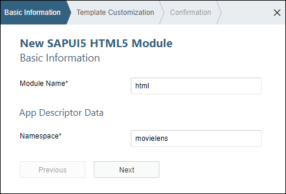
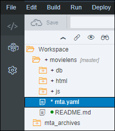
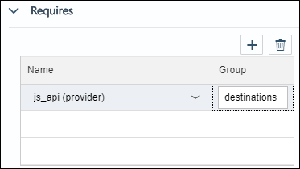
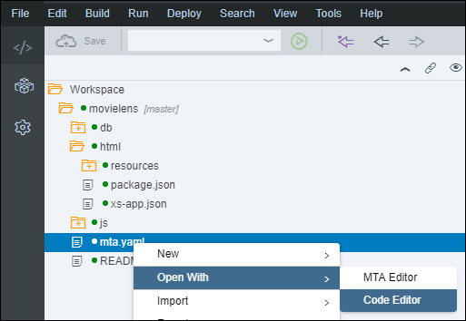
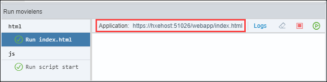
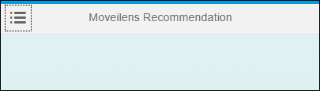

## Prerequisites
 - **Proficiency:** Beginner

## Details
### You will learn

 - Create a SAPUI5 HTML Module
 - Add a dependency to the Node.js Module as a destination
 - Configure the Application Router
 - Configure the Application Manifest
 - Create a series of Formatter
 - Run your SAPUI5 application

**Note:** The intent of the following tutorials is not to focus on SAPUI5 but to use it as mean to execute the SAP Predictive services.
For more content on SAPUI5, you can check the dedicated <a href="https://sapui5.hana.ondemand.com/#/topic/3da5f4be63264db99f2e5b04c5e853db" target="new">tutorials</a> section available on the <a href="https://sapui5.hana.ondemand.com" target="new">SAPUI5 documentation</a>.

### Time to Complete
**25 Min**

[ACCORDION-BEGIN [Step 1: ](Open the Web IDE)]

Open the Web IDE, and login using the **`XSA_DEV`** credentials.

Switch to the ***Development*** perspective using the  icon.


As a reminder the default URL for the Web IDE is:

 - `https://hxehost:53075`

A link to the Web IDE can also be found on the ***XSA Controller page*** at:

- `https://hxehost:39030`

[DONE]
[ACCORDION-END]

[ACCORDION-BEGIN [Step 2: ](Create a SAPUI5 HTML Module)]

In the left panel, right click on the `movielens` project, then select **New > SAPUI5 HTML Module**.


Enter the following information, then click on **Next**

Field Name          | Value
------------------- | --------------
Module Name         | `html`
Namespace           | `movielens`



Enter the following information, then click on **Finish**

Field Name          | Value
------------------- | --------------
View Type           | `XML`
View Name           | `demo`


[DONE]
[ACCORDION-END]

[ACCORDION-BEGIN [Step 3: ](Create the folder structure)]

Expand the **`movielens/html/resources/webapp/`** folder.

Create the following folder structure:

```
|-- movielens/html/resources/webapp/
  |-- controller
  |   |-- xsjs
  |   |-- xsodata
  |-- fragment
  |-- view
  |   |-- xsjs
  |   |-- xsodata
```



[DONE]
[ACCORDION-END]

[ACCORDION-BEGIN [Step 4: ](Add Module Dependencies)]

In order to consume the XS OData service from the Node.js Module created previously, you will need to add a dependency from the SAPUI5 HTML Module to the Node.js Module.

Open the **`mta.yaml`** file located in the **`movielens`** project folder.


Select the **`html`** module.


Under the **Requires** section, add your ***Node.js API provider*** (most likely named **`js_api` (provider)**).

Set the **Group** value to **destinations**.



Add the following properties to the **`js_api`** entry:

Key                 | Value
------------------- | --------------
`name`              | `movielens_api`
`url`               | `~{url}`
`timeout`           | 3000000


Save the file using the  icon from the menu.

[DONE]
[ACCORDION-END]

[ACCORDION-BEGIN [Step 5: ](Edit the Application Router Configuration)]

The XS Advanced Application Router Configuration file (`xs-app.json`) contains the configuration information used by the application router.

For more details on the syntax, please check the online [documentation](https://help.sap.com/viewer/4505d0bdaf4948449b7f7379d24d0f0d/latest/en-US/5f77e58ec01b46f6b64ee1e2afe3ead7.html).

Open the **`xs-app.json`** file located in the **`movielens/html`** folder.

Replace the current content by the following:

```JSON
{
  "welcomeFile": "webapp/index.html",
  "authenticationMethod": "none",
  "routes": [{
    "source": "/xsjs/(.*)(.xsjs)",
    "destination": "movielens_api",
    "csrfProtection": true,
    "authenticationType": "none"
  }, {
    "source": "/xsodata/(.*)(.xsodata)",
    "destination": "movielens_api",
    "csrfProtection": true,
    "authenticationType": "none"
  }]
}
```

Save the file using the  icon from the menu.

[DONE]
[ACCORDION-END]

[ACCORDION-BEGIN [Step 6: ](Create a JSON Model)]

In order to store some default configuration values for the XS OData or the XSJS service calls, you will define a JSON model that will be loaded thanks to the configuration of the `manifest.json` previously done.

In the left side panel, expand the **`movielens/html/resources/webapp/model`** tree node.

Right click on the **`model`** folder node from the tree, and select **New > File**.

Enter **`config.json`** as the file name, then click on **OK**.

This is the full path of the created file:

```
movielens/html/resources/webapp/model/config.json
```

Paste the following content:

```json
{
  "services": {
    "apl.recommendation": {
      "execute_url": "/xsjs/apl/recommendation_execute.xsjs",
      "execute_method": "POST",

      "results_url": "/xsjs/apl/recommendation_results.xsjs",
      "results_method": "POST"
    },
    "pal.apriori": {
      "execute_url": "/xsjs/pal/apriori_execute.xsjs",
      "execute_method": "POST",

      "results_url": "/xsjs/pal/apriori_results.xsjs",
      "results_method": "POST"
    }
  },
  "default": {
    "apl.recommendation": {
      "BESTSELLERTHRESHOLD": 500,
      "MAXTOPNODES": 100000,
      "MINIMUMSUPPORT": 2,
      "MINIMUMCONFIDENCE": 0.05,
      "MINIMUMPREDICTIVEPOWER": 0.1,
      "KEEPTOPN": 5,
      "INCLUDEBESTSELLERS": false,
      "SKIPALREADYOWNED": true
    },
    "pal.apriori": {
      "KEEPTOPN": 5,
      "MIN_SUPPORT": 0.1,
      "MIN_CONFIDENCE": 0.1,
      "MIN_LIFT": 0.0,
      "UBIQUITOUS": 1.0
    }
  }
}
```

Save the file using the  icon from the menu.

[DONE]
[ACCORDION-END]

[ACCORDION-BEGIN [Step 7: ](Create Formatters)]

In order to format some of the properties in the User Interface that will be returned by the XS OData or the XSJS services, you will need to define formatters.

In the left side panel, expand the **`movielens/html/resources/webapp/model`** tree node.

Right click on the **`model`** folder node from the tree, and select **New > File**.

Enter **`formatter.js`** as the file name, then click on **OK**.

This is the full path of the created file:

```
movielens/html/resources/webapp/model/formatter.js
```

Paste the following content:

```JavaScript
sap.ui.define([
], function (){
  "use strict";
  var isNumeric = function(oValue) {
    var tmp = oValue && oValue.toString();
    return !jQuery.isArray(oValue) && (tmp - parseFloat(tmp) + 1) >= 0;
  };
  return {
    formatEpoch: function(value) {
      var result = "";
      if (value !== "undefined" && isNumeric(value)) {
        result = new Date(value * 1000).toDateString();
      }
      return result;
    },
    formatNumber: function(value) {
      var result = "";
      if (value !== "undefined" && isNumeric(value)) {
        result = Number(value).toFixed(2);
      }
      return result;
    },
    formatPercent: function(value) {
      var result = "";
      if (value !== "undefined" && isNumeric(value)) {
        result = Number(value * 100).toFixed(2) + "%";
      }
      return result;
    },
    isNumeric: isNumeric
  };
});
```

Save the file using the  icon from the menu.

[DONE]
[ACCORDION-END]

[ACCORDION-BEGIN [Step 8: ](Create a Fragment)]

Using fragments in SAPUI5 application enables re-usability of display components.

In your case, a menu will be used in all your views.

So instead of duplicating the code, you will create a fragment that will include the menu structure.

Then, using the **`demo`** controller as your base controller, you will define a function that will be reused by every other view.

In the left side panel, expand the **`movielens/html/resources/webapp/fragment`** tree node.

Right click on the **`fragment`** folder node from the tree, and select **New > File**.

Enter **`menu.fragment.xml`** as the file name, then click on **OK**.

This is the full path of the created file:

```
movielens/html/resources/webapp/fragment/menu.fragment.xml
```

Paste the following content:

```xml
<core:FragmentDefinition xmlns="sap.m" xmlns:core="sap.ui.core" xmlns:c="http://schemas.sap.com/sapui5/extension/sap.ui.core.CustomData/1"
  xmlns:u="sap.ui.unified">
  <u:Menu  itemSelect="handleMenuItemPress" >
    <u:MenuItem text="View Results with XS OData">
      <u:Menu>
        <u:MenuItem text="Collaborative Filtering" c:to="xsodata.collaborative"/>
        <u:MenuItem text="Content-Based Filtering" c:to="xsodata.contentbased"/>
      </u:Menu>
    </u:MenuItem>
    <u:MenuItem text="Execute Algorithms with XSJS">
      <u:Menu>
        <u:MenuItem text="APL Recommendation" c:to="xsjs.apl_recommendation"/>
        <u:MenuItem text="PAL APRIORI" c:to="xsjs.pal_apriori"/>
      </u:Menu>
    </u:MenuItem>
  </u:Menu>
</core:FragmentDefinition>
```

Save the file using the  icon from the menu.

The path of the file you have just created is **`movielens/html/resources/webapp/fragment/MovieDetails.fragment.xml`**.

[DONE]
[ACCORDION-END]


[ACCORDION-BEGIN [Step 6: ](Edit the Application Descriptor)]

The descriptor file (`manifest.json`) for applications, components, and libraries is inspired by the Web Application Manifest concept introduced by the W3C.

The descriptor provides a central, machine-readable and easy-to-access location for storing metadata associated with an application, an application component, or a library.

It includes the definition of OData data sources and models used by SAPUI5 applications.

Open the **`manifest.json`** file located in the **`movielens/html/resources/webapp`** folder.

In the **`"sap.app"`** section, replace the **`"sourceTemplate"`** element by:

```JSON
"sourceTemplate": {
  "id": "hanatemplates.basicSAPUI5ApplicationProject",
  "version": "0.0.0"
},
"dataSources": {
  "data.xsodata": {
    "uri": "/xsodata/data.xsodata/",
    "type": "OData",
    "settings": {
      "odataVersion": "2.0"
    }
  }
}
```

In the **`"models"`** section, add next to the **`"i18n"`** element the **`"odata"`** and **`"config"`** elements like that:

```JSON
"models": {
  "i18n": {
    "type": "sap.ui.model.resource.ResourceModel",
    "settings": {
      "bundleName": "movielens.html.i18n.i18n"
    }
  },
  "odata": {
    "type": "sap.ui.model.odata.v2.ODataModel",
    "preload": false,
    "settings": {
      "defaultOperationMode": "Server",
      "defaultBindingMode": "Default",
      "defaultCountMode": "None",
      "useBatch": false
    },
    "dataSource": "data.xsodata"
  },
  "config": {
    "type": "sap.ui.model.json.JSONModel",
    "preload": true,
    "uri": "model/config.json"
  }
},
```

In the **`"routing"`** section,replace the existing content like that:

```JSON
"routing": {
  "config": {
    "routerClass": "sap.m.routing.Router",
    "viewType": "XML",
    "async": true,
    "viewPath": "movielens.html.view",
    "controlAggregation": "pages",
    "controlId": "idAppControl",
    "transition": "slide"
  },
  "routes": [{
    "name": "demo",
    "pattern": "",
    "target": "demo"
  }],
  "targets": {
    "demo": {
      "clearAggregation": true,
      "viewName": "demo"
    },
    "xsodata.collaborative": {
      "clearAggregation": true,
      "viewName": "xsodata.collaborative"
    },
    "xsodata.contentbased": {
      "clearAggregation": true,
      "viewName": "xsodata.contentbased"
    },
    "xsjs.apl_recommendation": {
      "clearAggregation": true,
      "viewName": "xsjs.apl_recommendation"
    },
    "xsjs.pal_apriori": {
      "clearAggregation": true,
      "viewName": "xsjs.pal_apriori"
    }
  }
}
```

Save the file using the  icon from the menu.

[DONE]
[ACCORDION-END]

[ACCORDION-BEGIN [Step 10: ](Update the default view)]

The default view will be extended with a title and a menu button that will allow you navigate within the different functionality of the application.

The default application view is located in:

 - **`movielens/html/resources/webapp/view/demo.view.xml`**

These updates are made in preparation for the next steps.

Open the **`demo.view.xml`** file and replace the existing code with the following code:

```xml
<mvc:View xmlns:html="http://www.w3.org/1999/xhtml" xmlns:mvc="sap.ui.core.mvc" xmlns="sap.m" controllerName="movielens.html.controller.demo" displayBlock="true">
  <App id="idAppControl">
    <Page showHeader="false">
      <content>
        <Bar>
          <contentMiddle>
            <Title text="Moveilens Recommendation"/>
          </contentMiddle>
          <contentLeft>
            <Button icon="sap-icon://menu" press="handlePressOpenMenu"/>
          </contentLeft>
        </Bar>
      </content>
    </Page>
  </App>
</mvc:View>
```

Save the file using the  icon from the menu.

[DONE]
[ACCORDION-END]

[ACCORDION-BEGIN [Step 11: ](Update the default controller)]

As stated earlier, the default controller will become the base controller for every other that you will build to run the application.

This will allow you to reuse a series of function over and over.

The default application controller is located in:

 - **`movielens/html/resources/webapp/controller/demo.controller.js`**

These updates are made in preparation for the next steps.

Open the **`demo.controller.js`** file and replace the existing code with the following code:

```js
sap.ui.define([
  "sap/ui/core/mvc/Controller",
  "sap/ui/model/Filter",
  "sap/ui/model/FilterOperator",
  "sap/ui/model/FilterType",
  "movielens/html/model/formatter"
], function(Controller, Filter, FilterOperator, FilterType, formatter) {
  "use strict";
  return Controller.extend("movielens.html.controller.demo", {
    formatter: formatter,

    handlePressOpenMenu: function(oEvent) {
      var oButton = oEvent.getSource();
      // create menu only once
      if (!this._menu) {
        this._menu = sap.ui.xmlfragment("movielens.html.fragment.menu", this);
        this.getView().addDependent(this._menu);
      }
      var eDock = sap.ui.core.Popup.Dock;
      this._menu.open(this._bKeyboard, oButton, eDock.BeginTop, eDock.BeginBottom, oButton);
    },
    handleMenuItemPress: function(oEvent) {
      if (oEvent.getParameter("item").getSubmenu()) {
        return;
      }
      var to = oEvent.getParameter("item").data("to");
      if (to) {
        this.getOwnerComponent().getTargets().display(to);
      }

    },
    onSuggestionSubmit: function(oEvent) {
      var type = oEvent.getSource().data("type");
      this.selectItem(type, oEvent.getParameter("value"));
    },
    onSuggestionItemSelected: function(oEvent) {
      if (oEvent.getParameter("selectedItem") !== null) {
        var type = oEvent.getSource().data("type");
        this.selectItem(type, oEvent.getParameter("selectedItem").getKey());
      }
    },
    onSuggestionSuggest: function(oEvent) {
      var type = oEvent.getSource().data("type");
      var value = oEvent.getSource().getValue();
      var searchFilters = [];
      if (value) {
        // don"t search numeric field if the input is not numerci
        if (formatter.isNumeric(value)) {
          if (type === "user") {
            searchFilters.push(new Filter("USERID", FilterOperator.EQ, value));
          } else if (type === "movie") {
            searchFilters.push(new Filter("MOVIEID", FilterOperator.EQ, value));
          }
          searchFilters.push(new Filter("RATING_COUNT", FilterOperator.EQ, value));
        }
        if (type === "movie") {
          searchFilters.push(new Filter("tolower(TITLE)", FilterOperator.Contains, "'" + value.toLowerCase() + "'"));
        }
        searchFilters.push(new Filter("tolower(DESCRIPTION)", FilterOperator.Contains, "'" + value.toLowerCase() + "'"));
      }
      this.getView().byId(type + "_input").getBinding("suggestionItems").filter(new Filter({
        filters: searchFilters,
        and: false
      }), FilterType.Application);
    }
  });
});
```

Save the file using the  icon from the menu.

[DONE]
[ACCORDION-END]

[ACCORDION-BEGIN [Step 12: ](Validate your changes)]

Open the **`mta.yaml`** file located in the `movielens` project folder using the **Code editor**.



Provide an answer to the question below then click on **Validate**.

[VALIDATE_1]
[ACCORDION-END]

[ACCORDION-BEGIN [Step 13: ](Run the application)]

Select the **`html`** module, then click on the execute icon  from the menu bar.

Once the application is started, the application will open in a new tab/window or you can click on the application URL:



This will open a web page with the following content:



[DONE]
[ACCORDION-END]

[ACCORDION-BEGIN [Step 14: ](Commit your changes)]

On the icon bar located on the right side of the Web IDE, click on the **Git Pane** icon .

Click on **Stage All**, enter a commit comment, then click on **Commit and Push > origin master**.

[DONE]
[ACCORDION-END]
