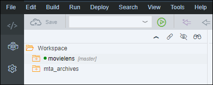
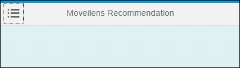
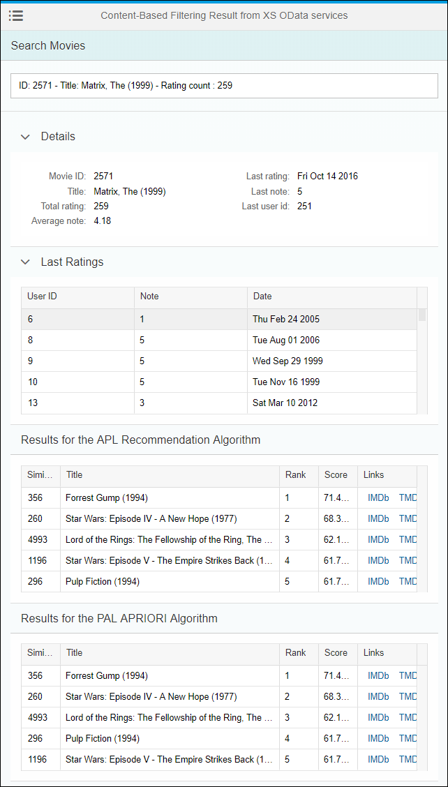

## Prerequisites
 - **Proficiency:** Beginner

## Details
### You will learn

- How to add a SAPUI5 controller and interact with an XS OData service
- How to add a SAPUI5 view and interact with an XS OData service

### Time to Complete
**15 Min**

[ACCORDION-BEGIN [Step 1: ](Open the Web IDE)]

Open the Web IDE, and login using the **`XSA_DEV`** credentials.

Switch to the ***Development*** perspective using the  icon.



As a reminder the default URL for the Web IDE is:

 - `https://hxehost:53075`

A link to the Web IDE can also be found on the ***XSA Controller page*** at:

- `https://hxehost:39030`

[DONE]
[ACCORDION-END]

[ACCORDION-BEGIN [Step 2: ](Create the controller)]

As you will be building two view, you would usually create a controller per view. But here, in order to simplify to code, only one is needed.

A few details about the controller:

- it provides formatters for the date and numeric values to be displayed in a nicer format
- handles the entry suggestions list with model filters on all fields from the `ratings_movie` and `ratings_user` views

In the left side panel, expand the **`movielens/html/resources/webapp/controller/xsodata`** tree node.

Right click on the **`xsodata`** folder node from the tree, and select **New > File**.

Enter **`results.controller.js`** as the file name, then click on **OK**.

This is the full path of the created file:

```
movielens/html/resources/webapp/controller/xsodata/results.controller.js
```

Paste the following content:

```js
sap.ui.define([
  "movielens/html/controller/demo.controller",
  "sap/ui/model/Filter",
  "sap/ui/model/FilterOperator",
  "sap/ui/model/FilterType",
  "movielens/html/model/formatter"
], function(Controller, Filter, FilterOperator, FilterType, formatter) {
  "use strict";

  return Controller.extend("movielens.html.controller.xsodata.results", {
    onInit: function() {
      if (!this.getView().getModel()) {
        this.getView().setModel(new sap.ui.model.json.JSONModel());
      }
      this.selectItem(null, null);
    },
    selectItem: function(type, value) {
      var filters = [];
      // only allow numeric direct input
      var itemId = -1;
      // get the current model and clear details
      var oModel = this.getView().getModel();
      if (formatter.isNumeric(value)) {
        // get the odata model
        var oDataModel = this.getView().getModel("odata");
        var item = oDataModel.getProperty("/ratings_" + type + "(" + value + ")", this, true);
        if (item !== "undefined") {
          if (type === "user") {
            itemId = item.USERID;
            filters = [
              new Filter([
                new Filter("USERID", FilterOperator.EQ, itemId)
              ], false)
            ];
          } else if (type === "movie") {
            itemId = item.MOVIEID;
            filters = [
              new Filter([
                new Filter("MOVIEID", FilterOperator.EQ, itemId)
              ], false)
            ];
          }
          oModel.setProperty("/selectedItemId", itemId);
          oModel.setProperty("/selectedItem", item);
          oModel.setProperty("/itemType", type);
        }
      } else {
        oModel.setProperty("/selectedItemId", null);
        oModel.setProperty("/selectedItem", null);
        oModel.setProperty("/itemType", null);
      }
      var searchFilters = new Filter({
        filters: filters,
        and: false
      });
      var history = this.getView().byId(type + "_history");
      if (typeof history !== "undefined" && typeof history.getBinding("rows") !== "undefined") {
        this.getView().byId(type + "_history").getBinding("rows").filter(searchFilters, FilterType.Application);
      }
      var resultsAPL = this.getView().byId(type + "_results_apl");
      if (typeof resultsAPL !== "undefined" && typeof resultsAPL.getBinding("rows") !== "undefined") {
        this.getView().byId(type + "_results_apl").getBinding("rows").filter(searchFilters, FilterType.Application);
      }
      var _resultsPAL = this.getView().byId(type + "_results_pal");
      if (typeof _resultsPAL !== "undefined" && typeof _resultsPAL.getBinding("rows") !== "undefined") {
        this.getView().byId(type + "_results_pal").getBinding("rows").filter(searchFilters, FilterType.Application);
      }
    }
  });
});
```

Save the file using the  icon from the menu.

[DONE]
[ACCORDION-END]

[ACCORDION-BEGIN [Step 3: ](Create the views)]

As you will be visualizing both the **collaborative filtering** and **content-based filtering** results, you will need to create two views.

A few details about the content of the views:

- an input field that will provide suggestion when the first characters are typed leveraging the OData services and its filtering capabilities

    - for the **collaborative filtering** results, the search will look into the user identifier & the rating count
    - for the **content-based filtering** results, the search will look into the movie identifier, description, titles & the rating count

- a series of tables to display:

    - for the **collaborative filtering** results:

        - the user details including the rating count & the average note, plus some details about the last rating
        - the recommendations for the user based on the SAP HANA APL and PAL

    - for the **collaborative filtering** results:

        - the movie details including the rating count & the average note, plus some details about the last rating
        - the recommendations for the movie based on the SAP HANA APL and PAL

- each movie whenever displayed will include a link to the ***`IMDb`*** (`IMDb`) and to ***The Movie DB*** (`TMDb`) sites

Expand the **`movielens/html/resources/webapp/view/xsodata`** folder.

Create a new file **`collaborative.view.xml`**.

This is the full path of the created file:

```
movielens/html/resources/webapp/view/xsodata/collaborative.view.xml
```

Paste the following content:

```xml
<mvc:View xmlns:html="http://www.w3.org/2000/xhtml" xmlns:mvc="sap.ui.core.mvc" xmlns="sap.m" xmlns:form="sap.ui.layout.form" xmlns:table="sap.ui.table" xmlns:core="sap.ui.core" xmlns:custom="http://schemas.sap.com/sapui5/extension/sap.ui.core.CustomData/1" controllerName="movielens.html.controller.xsodata.results">
  <Page showHeader="false">
    <content>
      <Bar>
        <contentMiddle>
          <Title text="Collaborative Filtering Result from XS OData services"/>
        </contentMiddle>
        <contentLeft>
          <Button icon="sap-icon://menu" press="handlePressOpenMenu"/>
        </contentLeft>
      </Bar>
      <Panel expandable="false" headerText="Search Users">
        <Input width="100%" showSuggestion="true" suggest="onSuggestionSuggest" submit="onSuggestionSubmit" suggestionItemSelected="onSuggestionItemSelected" custom:type="user" id="user_input" placeholder="Enter a user identifier..." suggestionItems="{ path: 'odata>/ratings_user', filters: [ { path: 'USERID', operator: 'EQ', value1: '-1' } ]}">
          <suggestionItems>
            <core:ListItem key="{odata>USERID}" text="{odata>USERID}" additionalText="Rating count : {odata>RATING_COUNT}"/>
          </suggestionItems>
        </Input>
      </Panel>
      <Panel expandable="false" visible="{= !!${/selectedItemId}}">
        <ScrollContainer height="100%" width="100%" horizontal="true" vertical="true" focusable="true">
          <Panel expandable="true" expanded="true" headerText="Details">
            <form:Form editable="false" class="isReadonly" width="100%">
              <form:layout>
                <form:ResponsiveGridLayout/>
              </form:layout>
              <form:formContainers>
                <form:FormContainer>
                  <form:formElements>
                    <form:FormElement label="User ID">
                      <form:fields>
                        <Text text="{/selectedItem/USERID}"/>
                      </form:fields>
                    </form:FormElement>
                    <form:FormElement label="Total rating">
                      <form:fields>
                        <Text text="{/selectedItem/RATING_COUNT}"/>
                      </form:fields>
                    </form:FormElement>
                    <form:FormElement label="Average note">
                      <form:fields>
                        <Text text="{path : '/selectedItem/RATING_AVG', formatter : '.formatter.formatNumber'}"/>
                      </form:fields>
                    </form:FormElement>
                  </form:formElements>
                </form:FormContainer>
                <form:FormContainer>
                  <form:formElements>
                    <form:FormElement label="Last rating">
                      <form:fields>
                        <Text text="{path : '/selectedItem/LAST_RATING_DATE', formatter : '.formatter.formatEpoch'}"/>
                      </form:fields>
                    </form:FormElement>
                    <form:FormElement label="Last note">
                      <form:fields>
                        <Text text="{/selectedItem/LAST_RATING}"/>
                      </form:fields>
                    </form:FormElement>
                    <form:FormElement label="Last rated movie id">
                      <form:fields>
                        <Text text="{/selectedItem/LAST_MOVIEID}"/>
                      </form:fields>
                    </form:FormElement>
                  </form:formElements>
                </form:FormContainer>
              </form:formContainers>
            </form:Form>
          </Panel>
          <Panel expandable="true" expanded="true" headerText="Last Ratings">
            <table:Table selectionMode="None" visibleRowCount="5" enableBusyIndicator="true" refresh="true" id="user_history"
              rows="{ path: 'odata>/ratings_detailed', filters: [ { path: 'USERID', operator: 'EQ', value1: '-1' } ]}">
              <table:columns>
                <table:Column sortProperty="MOVIEID" width="10%">
                  <Label text="Movie ID"/>
                  <table:template>
                    <Text text="{odata>MOVIEID}"/>
                  </table:template>
                </table:Column>
                <table:Column sortProperty="TITLE">
                  <Label text="Title"/>
                  <table:template>
                    <Text text="{odata>TITLE}"/>
                  </table:template>
                </table:Column>
                <table:Column sortProperty="RATING" width="10%">
                  <Label text="Note"/>
                  <table:template>
                    <Text text="{odata>RATING}"/>
                  </table:template>
                </table:Column>
                <table:Column sortProperty="TIMESTAMP" width="15%">
                  <Label text="Date"/>
                  <table:template>
                    <Text text="{path : 'odata>TIMESTAMP', formatter : '.formatter.formatEpoch'}"/>
                  </table:template>
                </table:Column>
                <table:Column width="15%">
                  <Label text="Links"/>
                  <table:template>
                    <HBox>
                      <Link text="IMDb" class="sapUiTinyMarginBeginEnd" target="_blank" href="http://www.imdb.com/title/tt{odata>IMDBID}"/>
                      <Link text="TMDb" class="sapUiTinyMarginBeginEnd" target="_blank" href="https://www.themoviedb.org/movie/{odata>TMDBID}"/>
                    </HBox>
                  </table:template>
                </table:Column>
              </table:columns>
            </table:Table>
          </Panel>
          <Panel expandable="false" headerText="Results for the APL Recommendation Algorithm">
            <table:Table selectionMode="None" visibleRowCount="5" enableBusyIndicator="true" refresh="true" id="user_results_apl" rows="{ path: 'odata>/apl_recommendation_collaborative_filtering', filters: [ { path: 'USERID', operator: 'EQ', value1: '-1' } ]}">
              <table:columns>
                <table:Column sortProperty="MOVIEID" width="10%">
                  <Label text="Movie ID"/>
                  <table:template>
                    <Text text="{odata>MOVIEID}"/>
                  </table:template>
                </table:Column>
                <table:Column sortProperty="TITLE">
                  <Label text="Title"/>
                  <table:template>
                    <Text text="{odata>TITLE}"/>
                  </table:template>
                </table:Column>
                <table:Column sortProperty="RANK" width="10%">
                  <Label text="Rank"/>
                  <table:template>
                    <Text text="{odata>RANK}"/>
                  </table:template>
                </table:Column>
                <table:Column sortProperty="SCORE" width="10%">
                  <Label text="Score"/>
                  <table:template>
                    <Text text="{path : 'odata>SCORE', formatter : '.formatter.formatPercent'}"/>
                  </table:template>
                </table:Column>
                <table:Column width="15%">
                  <Label text="Links"/>
                  <table:template>
                    <HBox>
                      <Link text="IMDb" class="sapUiTinyMarginBeginEnd" target="_blank" href="http://www.imdb.com/title/tt{odata>IMDBID}"/>
                      <Link text="TMDb" class="sapUiTinyMarginBeginEnd" target="_blank" href="https://www.themoviedb.org/movie/{odata>TMDBID}"/>
                    </HBox>
                  </table:template>
                </table:Column>
              </table:columns>
            </table:Table>
          </Panel>
          <Panel expandable="false" headerText="Results for the PAL APRIORI Algorithm">
            <table:Table selectionMode="None" visibleRowCount="5" enableBusyIndicator="true" refresh="true" id="user_results_pal" rows="{ path: 'odata>/pal_apriori_collaborative_filtering', filters: [ { path: 'USERID', operator: 'EQ', value1: '-1' } ]}">
              <table:columns>
                <table:Column sortProperty="MOVIEID" width="10%">
                  <Label text="Movie ID"/>
                  <table:template>
                    <Text text="{odata>MOVIEID}"/>
                  </table:template>
                </table:Column>
                <table:Column sortProperty="TITLE">
                  <Label text="Title"/>
                  <table:template>
                    <Text text="{odata>TITLE}"/>
                  </table:template>
                </table:Column>
                <table:Column sortProperty="RANK" width="10%">
                  <Label text="Rank"/>
                  <table:template>
                    <Text text="{odata>RANK}"/>
                  </table:template>
                </table:Column>
                <table:Column sortProperty="SCORE" width="10%">
                  <Label text="Score"/>
                  <table:template>
                    <Text text="{path : 'odata>SCORE', formatter : '.formatter.formatPercent'}"/>
                  </table:template>
                </table:Column>
                <table:Column width="15%">
                  <Label text="Links"/>
                  <table:template>
                    <HBox>
                      <Link text="IMDb" class="sapUiTinyMarginBeginEnd" target="_blank" href="http://www.imdb.com/title/tt{odata>IMDBID}"/>
                      <Link text="TMDb" class="sapUiTinyMarginBeginEnd" target="_blank" href="https://www.themoviedb.org/movie/{odata>TMDBID}"/>
                    </HBox>
                  </table:template>
                </table:Column>
              </table:columns>
            </table:Table>
          </Panel>
        </ScrollContainer>
      </Panel>
    </content>
  </Page>
</mvc:View>
```

Save the file using the  icon from the menu.

Create a new file **`contentbased.view.xml`**.

This is the full path of the created file:

```
movielens/html/resources/webapp/view/xsodata/contentbased.view.xml
```

Paste the following content:

```xml
<mvc:View xmlns:html="http://www.w3.org/2000/xhtml" xmlns:mvc="sap.ui.core.mvc" xmlns="sap.m" xmlns:form="sap.ui.layout.form" xmlns:table="sap.ui.table" xmlns:core="sap.ui.core" xmlns:custom="http://schemas.sap.com/sapui5/extension/sap.ui.core.CustomData/1" controllerName="movielens.html.controller.xsodata.results">
  <Page showHeader="false" press="onNavMenuItemPress" icon="sap-icon://menu" id="master">
    <content>
      <Bar>
        <contentMiddle>
          <Title text="Content-Based Filtering Result from XS OData services"/>
        </contentMiddle>
        <contentLeft>
          <Button icon="sap-icon://menu" press="handlePressOpenMenu"/>
        </contentLeft>
      </Bar>
      <Panel expandable="false" headerText="Search Movies">
        <Input width="100%" showSuggestion="true" suggest="onSuggestionSuggest" submit="onSuggestionSubmit" suggestionItemSelected="onSuggestionItemSelected" custom:type="movie" id="movie_input" placeholder="Enter a movie name or identifier ..." suggestionItems="{ path: 'odata>/ratings_movie', filters: [ { path: 'MOVIEID', operator: 'EQ', value1: '-1' } ]}">
          <suggestionItems>
            <core:ListItem key="{odata>MOVIEID}" text="ID: {odata>MOVIEID} - Title: {odata>TITLE} - Rating count : {odata>RATING_COUNT}"/>
          </suggestionItems>
        </Input>
      </Panel>
      <Panel expandable="false" visible="{= !!${/selectedItemId}}">
        <ScrollContainer height="100%" width="100%" horizontal="true" vertical="true" focusable="true">
          <Panel expandable="true" expanded="true" headerText="Details">
            <form:Form editable="false" class="isReadonly" width="100%">
              <form:layout>
                <form:ResponsiveGridLayout columnsL="2" columnsM="2"/>
              </form:layout>
              <form:formContainers>
                <form:FormContainer>
                  <form:formElements>
                    <form:FormElement label="Movie ID">
                      <form:fields>
                        <Text text="{/selectedItem/MOVIEID}"/>
                      </form:fields>
                    </form:FormElement>
                    <form:FormElement label="Title">
                      <form:fields>
                        <Text text="{/selectedItem/TITLE}"/>
                      </form:fields>
                    </form:FormElement>
                    <form:FormElement label="Total rating">
                      <form:fields>
                        <Text text="{/selectedItem/RATING_COUNT}"/>
                      </form:fields>
                    </form:FormElement>
                    <form:FormElement label="Average note">
                      <form:fields>
                        <Text text="{path : '/selectedItem/RATING_AVG', formatter : '.formatter.formatNumber'}" wrapping="false"/>
                      </form:fields>
                    </form:FormElement>
                  </form:formElements>
                </form:FormContainer>
                <form:FormContainer>
                  <form:formElements>
                    <form:FormElement label="Last rating">
                      <form:fields>
                        <Text text="{path : '/selectedItem/LAST_RATING_DATE', formatter : '.formatter.formatEpoch'}" wrapping="false"/>
                      </form:fields>
                    </form:FormElement>
                    <form:FormElement label="Last note">
                      <form:fields>
                        <Text text="{/selectedItem/LAST_RATING}" wrapping="false"/>
                      </form:fields>
                    </form:FormElement>
                    <form:FormElement label="Last user id">
                      <form:fields>
                        <Text text="{/selectedItem/LAST_USERID}" wrapping="false"/>
                      </form:fields>
                    </form:FormElement>
                  </form:formElements>
                </form:FormContainer>
              </form:formContainers>
            </form:Form>
          </Panel>
          <Panel expandable="true" expanded="true" headerText="Last Ratings">
            <table:Table selectionMode="None" visibleRowCount="5" enableBusyIndicator="true" refresh="true" id="movie_history" rows="{ path: 'odata>/ratings_detailed'}">
              <table:columns>
                <table:Column sortProperty="USERID" width="10%">
                  <Label text="User ID"/>
                  <table:template>
                    <Text text="{odata>USERID}" wrapping="false"/>
                  </table:template>
                </table:Column>
                <table:Column sortProperty="RATING" width="10%">
                  <Label text="Note"/>
                  <table:template>
                    <Text text="{odata>RATING}" wrapping="false"/>
                  </table:template>
                </table:Column>
                <table:Column sortProperty="TIMESTAMP" width="15%">
                  <Label text="Date"/>
                  <table:template>
                    <Text text="{path : 'odata>TIMESTAMP', formatter : '.formatter.formatEpoch'}" wrapping="false"/>
                  </table:template>
                </table:Column>
              </table:columns>
            </table:Table>
          </Panel>
          <Panel expandable="false" headerText="Results for the APL Recommendation Algorithm">
            <table:Table selectionMode="None" visibleRowCount="5" enableBusyIndicator="true" refresh="true" id="movie_results_apl" rows="{ path: 'odata>/apl_recommendation_contentbased_filtering'}">
              <table:columns>
                <table:Column sortProperty="SIMILAR_MOVIE" width="10%">
                  <Label text="Similar Movie ID"/>
                  <table:template>
                    <Text text="{odata>SIMILAR_MOVIE}" wrapping="false"/>
                  </table:template>
                </table:Column>
                <table:Column sortProperty="TITLE">
                  <Label text="Title"/>
                  <table:template>
                    <Text text="{odata>TITLE}" wrapping="false"/>
                  </table:template>
                </table:Column>
                <table:Column sortProperty="RANK" width="10%">
                  <Label text="Rank"/>
                  <table:template>
                    <Text text="{odata>RANK}" wrapping="false"/>
                  </table:template>
                </table:Column>
                <table:Column sortProperty="odata>SCORE" width="10%">
                  <Label text="Score"/>
                  <table:template>
                    <Text text="{path : 'odata>SCORE', formatter : '.formatter.formatPercent'}" wrapping="false"/>
                  </table:template>
                </table:Column>
                <table:Column width="15%">
                  <Label text="Links"/>
                  <table:template>
                    <HBox>
                      <Link text="IMDb" class="sapUiTinyMarginBeginEnd" target="_blank" href="http://www.imdb.com/title/tt{odata>IMDBID}"/>
                      <Link text="TMDb" class="sapUiTinyMarginBeginEnd" target="_blank" href="https://www.themoviedb.org/movie/{odata>TMDBID}"/>
                    </HBox>
                  </table:template>
                </table:Column>
              </table:columns>
            </table:Table>
          </Panel>
          <Panel expandable="false" headerText="Results for the PAL APRIORI Algorithm">
            <table:Table selectionMode="None" visibleRowCount="5" enableBusyIndicator="true" refresh="true" id="movie_results_pal" rows="{ path: 'odata>/pal_apriori_contentbased_filtering'}">
              <table:columns>
                <table:Column sortProperty="SIMILAR_MOVIE" width="10%">
                  <Label text="Similar Movie ID"/>
                  <table:template>
                    <Text text="{odata>SIMILAR_MOVIE}" wrapping="false"/>
                  </table:template>
                </table:Column>
                <table:Column sortProperty="TITLE">
                  <Label text="Title"/>
                  <table:template>
                    <Text text="{odata>TITLE}" wrapping="false"/>
                  </table:template>
                </table:Column>
                <table:Column sortProperty="RANK" width="10%">
                  <Label text="Rank"/>
                  <table:template>
                    <Text text="{odata>RANK}" wrapping="false"/>
                  </table:template>
                </table:Column>
                <table:Column sortProperty="SCORE" width="10%">
                  <Label text="Score"/>
                  <table:template>
                    <Text text="{path : 'odata>SCORE', formatter : '.formatter.formatPercent'}" wrapping="false"/>
                  </table:template>
                </table:Column>
                <table:Column width="15%">
                  <Label text="Links"/>
                  <table:template>
                    <HBox>
                      <Link text="IMDb" class="sapUiTinyMarginBeginEnd" target="_blank" href="http://www.imdb.com/title/tt{odata>IMDBID}"/>
                      <Link text="TMDb" class="sapUiTinyMarginBeginEnd" target="_blank" href="https://www.themoviedb.org/movie/{odata>TMDBID}"/>
                    </HBox>
                  </table:template>
                </table:Column>
              </table:columns>
            </table:Table>
          </Panel>
        </ScrollContainer>
      </Panel>
    </content>
  </Page>
</mvc:View>
```

Save the file using the  icon from the menu.

[DONE]
[ACCORDION-END]

[ACCORDION-BEGIN [Step 4: ](Run the application)]

Select the **`html`** module, then click on the execute icon  from the menu bar.

Once the application is started, the application will open in a new tab/window or you can click on the application URL:


This will open a web page with the following content:



[DONE]
[ACCORDION-END]

[ACCORDION-BEGIN [Step 5: ](Validate your Collaborative Filtering results)]

Using the menu icon on the top left corner of the panel, select **View Results with XS OData > Collaborative Filtering**.

Enter ***123*** in the ***User ID*** field, and pick the item from the suggestion drop down list.

The user details and list of previous rating should appear along with the recommendations from both algorithm.

Et voilà!


Provide an answer to the question below then click on **Validate**.

[VALIDATE_1]
[ACCORDION-END]

[ACCORDION-BEGIN [Step 6: ](Validate your Content-based Filtering results)]

Using the menu icon on the top left corner of the panel, select **View Results with XS OData > Content-based Filtering**.

Enter ***Matrix*** in the ***Movie ID*** field, and pick the item from the suggestion drop down list:

  - ***ID: 2571 - Title: Matrix, The (1999) - Rating count : 259***.

The user details and list of previous rating should appear along with the recommendations from both algorithm.

Et voilà!



Provide an answer to the question below then click on **Validate**.

[VALIDATE_2]
[ACCORDION-END]

[ACCORDION-BEGIN [Step 7: ](Commit your changes)]

On the icon bar located on the right side of the Web IDE, click on the **Git Pane** icon .

Click on **Stage All**, enter a commit comment, then click on **Commit and Push > origin master**.

[DONE]
[ACCORDION-END]
