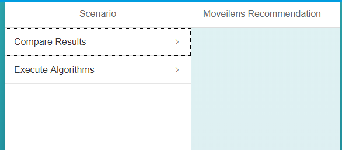
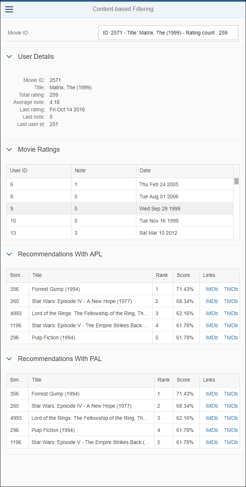

## Prerequisites
 - **Proficiency:** Beginner

## Details
### You will learn

-  How to add a SAPUI5 controller and interact with an XS OData service
-  How to add a SAPUI5 view and interact with an XS OData service

### Time to Complete
**15 Min**

[ACCORDION-BEGIN [Step 1: ](Open the Web IDE)]

Open the Web IDE, and login using the **`XSA_DEV`** credentials.

Switch to the ***Development*** perspective using the  icon.


As a reminder the default URL for the Web IDE is:

 - `https://hxehost:53075`

A link to the Web IDE can also be found on the ***XSA Controller page*** at:

- `https://hxehost:39030`

[DONE]
[ACCORDION-END]

[ACCORDION-BEGIN [Step 2: ](Create the controller)]

As you will be building two view, you would usually create a controller per view. But here, in order to simplify to code, only one is needed.

A few details about the controller:

- it provides formatters for the number and date values to be displayed in a nicer format
- handles the entry suggestions list with model filters on all fields from the `ratings_movie` and `ratings_user` views

Expand the **`movielens/html/resources/webapp/controller/compare`** folder.

Create a new file **`compare.controller.js`** with the following code:

```js
sap.ui.define([
  "sap/ui/core/mvc/Controller",
  "sap/m/MessageToast",
  'sap/ui/model/Filter',
  'sap/ui/model/FilterOperator'
], function(Controller, MessageToast, Filter, FilterOperator) {
  "use strict";

  return Controller.extend("movielens.html.controller.compare.compare", {
    onInit: function() {
      if (typeof sap.ui.getCore().getModel() === 'undefined') {
        sap.ui.getCore().setModel(new sap.ui.model.json.JSONModel());
      }
      this.getView().setModel(new sap.ui.model.json.JSONModel(), "item");
    },
    onBeforeRendering: function() {
      this.selectItemUser("");
      this.selectItemMovie("");
    },
    formatEpoch: function(value) {
      var result = "";
      if (value !== "undefined" && this.isNumeric(value)) {
        result = new Date(value * 1000).toDateString();
      }
      return result;
    },
    formatNumber: function(value) {
      var result = "";
      if (value !== "undefined" && this.isNumeric(value)) {
        result = Number(value).toFixed(2);
      }
      return result;
    },
    formatPercent: function(value) {
      var result = "";
      if (value !== "undefined" && this.isNumeric(value)) {
        result = Number(value * 100).toFixed(2) + "%";
      }
      return result;
    },
    isNumeric: function(oValue) {
      var tmp = oValue && oValue.toString();
      return !jQuery.isArray(oValue) && (tmp - parseFloat(tmp) + 1) >= 0;
    },
    selectItemUser: function(value) {
      var oItemModel = this.getView().getModel("item");
      var tableFilters = [];

      // only allow numeric direct input
      var itemId = -1;
      if (this.isNumeric(value)) {
        // get the current model
        var oModel = this.getView().getModel();
        var item = oModel.getProperty("/ratings_user(" + value + ")", this, true);
        if (item !== "undefined") {
          itemId = item.USERID;
          oItemModel.setProperty("/selectedItemId", item.USERID);
          oItemModel.setProperty("/item", item);
        }
      }
      tableFilters = [
        new Filter([
          new Filter("USERID", FilterOperator.EQ, itemId)
        ], false)
      ];
      this.getView().byId("history").getBinding("rows").filter(tableFilters);
      this.getView().byId("recommendation_apl").getBinding("rows").filter(tableFilters);
      this.getView().byId("recommendation_pal").getBinding("rows").filter(tableFilters);
    },
    selectItemMovie: function(value) {
      var oItemModel = this.getView().getModel("item");
      var tableFilters = [];

      // only allow numeric direct input
      var itemId = -1;
      if (this.isNumeric(value)) {
        // get the current model
        var oModel = this.getView().getModel();
        var item = oModel.getProperty("/ratings_movie(" + value + ")", this, true);
        if (item !== "undefined") {
          itemId = item.MOVIEID;
          oItemModel.setProperty("/selectedItemId", item.MOVIEID);
          oItemModel.setProperty("/item", item);
        }
      }

      tableFilters = [
        new Filter([
          new Filter("MOVIEID", FilterOperator.EQ, itemId)
        ], false)
      ];
      this.getView().byId("history").getBinding("rows").filter(tableFilters);
      this.getView().byId("recommendation_apl").getBinding("rows").filter(tableFilters);
      this.getView().byId("recommendation_pal").getBinding("rows").filter(tableFilters);
    },
    onSubmit: function(oEvent) {
      var sType = oEvent.getSource().getCustomData()[0].getValue();
      if (sType === "user") {
        this.selectItemUser(oEvent.getParameter("value"));
      } else if (sType === "movie") {
        this.selectItemMovie(oEvent.getParameter("value"));
      }
    },
    onSuggestionItemSelected: function(oEvent) {
      if (oEvent.getParameter("selectedItem") !== null) {
        var sType = oEvent.getSource().getCustomData()[0].getValue();
        if (sType === "user") {
          this.selectItemUser(oEvent.getParameter("selectedItem").getKey());
        } else if (sType === "movie") {
          this.selectItemMovie(oEvent.getParameter("selectedItem").getKey());
        }
      }
    },
    onSuggestUser: function(oEvent) {
      var value = oEvent.getSource().getValue();
      var filters = [];
      if (value) {
        // don't search numeric field if the input is not numerci
        if (this.isNumeric(value)) {
          filters.push(new Filter("USERID", FilterOperator.EQ, value));
          filters.push(new Filter("RATING_COUNT", FilterOperator.EQ, value));
        }
        filters.push(new Filter("tolower(DESCRIPTION)", FilterOperator.Contains, "'" + value.toLowerCase() + "'"));
      }
      this.getView().byId("input").getBinding("suggestionItems").filter([new Filter(filters, false)]);
    },
    onSuggestMovie: function(oEvent) {
      var value = oEvent.getSource().getValue();
      var filters = [];
      if (value) {
        // don't search numeric field if the input is not numerci
        if (this.isNumeric(value)) {
          filters.push(new Filter("MOVIEID", FilterOperator.EQ, value));
          filters.push(new Filter("RATING_COUNT", FilterOperator.EQ, value));
        }
        filters.push(new Filter("tolower(TITLE)", FilterOperator.Contains, "'" + value.toLowerCase() + "'"));
        filters.push(new Filter("tolower(DESCRIPTION)", FilterOperator.Contains, "'" + value.toLowerCase() + "'"));
      }
      this.getView().byId("input").getBinding("suggestionItems").filter([new Filter(filters, false)]);
    }
  });
});
```

Save the file using the  icon from the menu or press `CTRL+S`.

[DONE]
[ACCORDION-END]

[ACCORDION-BEGIN [Step 3: ](Create the views)]

As you will be building two view, you would usually create a controller per view. But here, in order to simplify to code, only one is needed.

A few details about the views:

- an input field that will provide suggestion when the first characters are typed leveraging the OData services and its filtering capabilities

    - for the **collaborative filtering** results, the search will look into the user identifier & the rating count
    - for the **content-based filtering** results, the search will look into the user identifier & the rating count

- a series of tables to display:

    - for the **collaborative filtering** results:

       - the user details including the rating count & the average note, plus some details about the last rating
       - the recommendations for the user based on the SAP HANA APL and PAL

   - for the **collaborative filtering** results:

      - the movie details including the rating count & the average note, plus some details about the last rating
      - the recommendations for the movie based on the SAP HANA APL and PAL

- each movie will include a link to the ***`IMDb`*** (`IMDb`) and to ***The Movie DB*** (`TMDb`) sites

Expand the **`movielens/html/resources/webapp/view/compare`** folder.

Create a new file **`collaborative.view.xml`** with the following code:

```xml
<mvc:View xmlns:html="http://www.w3.org/2000/xhtml" xmlns:mvc="sap.ui.core.mvc" xmlns="sap.m" xmlns:form="sap.ui.layout.form"
  xmlns:table="sap.ui.table" xmlns:core="sap.ui.core" xmlns:custom="http://schemas.sap.com/sapui5/extension/sap.ui.core.CustomData/1"
  controllerName="movielens.html.controller.compare.compare">
  <Panel expandable="false">
    <Toolbar>
      <Label text="User ID" labelFor="input" width="50%"/>
      <Input id="input" showSuggestion="true" suggest="onSuggestUser" submit="onSubmit" suggestionItemSelected="onSuggestionItemSelected"
        width="80%" suggestionItems="{ path: '/ratings_user' }" placeholder="Enter a user identifier or a rating count..." custom:item="user">
        <suggestionItems>
          <core:ListItem key="{USERID}" text="{USERID}" additionalText="Rating count : {RATING_COUNT}"/>
        </suggestionItems>
      </Input>
    </Toolbar>
  </Panel>
  <Panel headerText="User Details" expandable="true" expanded="true" visible="{= typeof ${item>/selectedItemId} !== 'undefined'}">
    <form:Form editable="false" class="isReadonly">
      <form:layout>
        <form:ResponsiveGridLayout columnsL="1" columnsM="1"/>
      </form:layout>
      <form:formContainers>
        <form:FormContainer>
          <form:formElements>
            <form:FormElement label="User ID">
              <form:fields>
                <Text text="{item>/item/USERID}"/>
              </form:fields>
            </form:FormElement>
            <form:FormElement label="Total rating">
              <form:fields>
                <Text text="{item>/item/RATING_COUNT}"/>
              </form:fields>
            </form:FormElement>
            <form:FormElement label="Average note">
              <form:fields>
                <Text text="{path : 'item>/item/RATING_AVG', formatter : '.formatNumber'}"/>
              </form:fields>
            </form:FormElement>
            <form:FormElement label="Last rating">
              <form:fields>
                <Text text="{path : 'item>/item/LAST_RATING_DATE', formatter : '.formatEpoch'}"/>
              </form:fields>
            </form:FormElement>
            <form:FormElement label="Last note">
              <form:fields>
                <Text text="{item>/item/LAST_RATING}"/>
              </form:fields>
            </form:FormElement>
            <form:FormElement label="Last movie id">
              <form:fields>
                <Text text="{item>/item/LAST_MOVIEID}"/>
              </form:fields>
            </form:FormElement>
          </form:formElements>
        </form:FormContainer>
      </form:formContainers>
    </form:Form>
  </Panel>
  <Panel headerText="User Ratings" expandable="true" expanded="true" visible="{= typeof ${item>/selectedItemId} !== 'undefined'}">
    <table:Table selectionMode="None" visibleRowCount="5" enableBusyIndicator="true" refresh="true" id="history"
      rows="{ path: '/ratings_detailed'}">
      <table:columns>
        <table:Column sortProperty="MOVIEID" width="10%">
          <Label text="Movie ID"/>
          <table:template>
            <Text text="{MOVIEID}"/>
          </table:template>
        </table:Column>
        <table:Column sortProperty="TITLE">
          <Label text="Title"/>
          <table:template>
            <Text text="{TITLE}"/>
          </table:template>
        </table:Column>
        <table:Column sortProperty="RATING" width="10%">
          <Label text="Note"/>
          <table:template>
            <Text text="{RATING}"/>
          </table:template>
        </table:Column>
        <table:Column sortProperty="TIMESTAMP" width="15%">
          <Label text="Date"/>
          <table:template>
            <Text text="{path : 'TIMESTAMP', formatter : '.formatEpoch'}"/>
          </table:template>
        </table:Column>
        <table:Column width="15%">
          <Label text="Links"/>
          <table:template>
            <HBox>
              <Link text="IMDb {IMDBID}" class="sapUiTinyMarginBeginEnd" target="_blank" href="http://www.imdb.com/title/tt{IMDBID}"/>
              <Link text="TMDb {TMDBID}" class="sapUiTinyMarginBeginEnd" target="_blank" href="https://www.themoviedb.org/movie/{TMDBID}"/>
            </HBox>
          </table:template>
        </table:Column>
      </table:columns>
    </table:Table>
  </Panel>
  <Panel headerText="Recommendations With APL" expandable="true" expanded="true" visible="{= typeof ${item>/selectedItemId} !== 'undefined'}">
    <table:Table selectionMode="None" visibleRowCount="5" enableBusyIndicator="true" refresh="true" id="recommendation_apl"
      rows="{ path: '/apl_recommendation_collaborative_filtering'}">
      <table:columns>
        <table:Column sortProperty="MOVIEID" width="10%">
          <Label text="Movie ID"/>
          <table:template>
            <Text text="{MOVIEID}"/>
          </table:template>
        </table:Column>
        <table:Column sortProperty="TITLE">
          <Label text="Title"/>
          <table:template>
            <Text text="{TITLE}"/>
          </table:template>
        </table:Column>
        <table:Column sortProperty="RANK" width="10%">
          <Label text="Rank"/>
          <table:template>
            <Text text="{RANK}"/>
          </table:template>
        </table:Column>
        <table:Column sortProperty="SCORE" width="10%">
          <Label text="Score"/>
          <table:template>
            <Text text="{path : 'SCORE', formatter : '.formatPercent'}"/>
          </table:template>
        </table:Column>
        <table:Column width="15%">
          <Label text="Links"/>
          <table:template>
            <HBox>
              <Link text="IMDb" class="sapUiTinyMarginBeginEnd" target="_blank" href="http://www.imdb.com/title/tt{IMDBID}"/>
              <Link text="TMDb" class="sapUiTinyMarginBeginEnd" target="_blank" href="https://www.themoviedb.org/movie/{TMDBID}"/>
            </HBox>
          </table:template>
        </table:Column>
      </table:columns>
    </table:Table>
  </Panel>
  <Panel headerText="Recommendations With PAL" expandable="true" expanded="true" visible="{= typeof ${item>/selectedItemId} !== 'undefined'}">
    <table:Table selectionMode="None" visibleRowCount="5" enableBusyIndicator="true" refresh="true" id="recommendation_pal"
      rows="{ path: '/pal_apriori_collaborative_filtering'}">
      <table:columns>
        <table:Column sortProperty="MOVIEID" width="10%">
          <Label text="Movie ID"/>
          <table:template>
            <Text text="{MOVIEID}"/>
          </table:template>
        </table:Column>
        <table:Column sortProperty="TITLE">
          <Label text="Title"/>
          <table:template>
            <Text text="{TITLE}"/>
          </table:template>
        </table:Column>
        <table:Column sortProperty="RANK" width="10%">
          <Label text="Rank"/>
          <table:template>
            <Text text="{RANK}"/>
          </table:template>
        </table:Column>
        <table:Column sortProperty="SCORE" width="10%">
          <Label text="Score"/>
          <table:template>
            <Text text="{path : 'SCORE', formatter : '.formatPercent'}"/>
          </table:template>
        </table:Column>
        <table:Column width="15%">
          <Label text="Links"/>
          <table:template>
            <HBox>
              <Link text="IMDb" class="sapUiTinyMarginBeginEnd" target="_blank" href="http://www.imdb.com/title/tt{IMDBID}"/>
              <Link text="TMDb" class="sapUiTinyMarginBeginEnd" target="_blank" href="https://www.themoviedb.org/movie/{TMDBID}"/>
            </HBox>
          </table:template>
        </table:Column>
      </table:columns>
    </table:Table>
  </Panel>
</mvc:View>
```

Save the file using the  icon from the menu or press `CTRL+S`.

Expand the **`movielens/html/resources/webapp/view/compare`** folder.

Create a new file **`contentbased.view.xml`** with the following code:

```xml
<mvc:View xmlns:html="http://www.w3.org/2000/xhtml" xmlns:mvc="sap.ui.core.mvc" xmlns="sap.m" xmlns:form="sap.ui.layout.form"
  xmlns:table="sap.ui.table" xmlns:core="sap.ui.core" xmlns:custom="http://schemas.sap.com/sapui5/extension/sap.ui.core.CustomData/1"
  controllerName="movielens.html.controller.compare.compare">
  <Panel expandable="false">
    <Toolbar>
      <Label text="Movie ID" labelFor="input" width="50%"/>
      <Input id="input" showSuggestion="true" suggest="onSuggestMovie" submit="onSubmit" suggestionItemSelected="onSuggestionItemSelected"
        width="80%" suggestionItems="{ path: '/ratings_movie'}" placeholder="Enter a movie name or identifier ..." custom:item="movie">
        <suggestionItems>
          <core:ListItem key="{MOVIEID}" text="ID: {MOVIEID} - Title: {TITLE} - Rating count : {RATING_COUNT}"/>
        </suggestionItems>
      </Input>
    </Toolbar>
  </Panel>
  <Panel headerText="Movie Details" expandable="true" expanded="true" visible="{= typeof ${item>/selectedItemId} !== 'undefined'}">
    <form:Form editable="false" class="isReadonly">
      <form:layout>
        <form:ResponsiveGridLayout columnsL="1" columnsM="1"/>
      </form:layout>
      <form:formContainers>
        <form:FormContainer>
          <form:formElements>
            <form:FormElement label="Movie ID">
              <form:fields>
                <Text text="{item>/item/MOVIEID}"/>
              </form:fields>
            </form:FormElement>
            <form:FormElement label="Title">
              <form:fields>
                <Text text="{item>/item/TITLE}"/>
              </form:fields>
            </form:FormElement>
            <form:FormElement label="Total rating">
              <form:fields>
                <Text text="{item>/item/RATING_COUNT}"/>
              </form:fields>
            </form:FormElement>
            <form:FormElement label="Average note">
              <form:fields>
                <Text text="{path : 'item>/item/RATING_AVG', formatter : '.formatNumber'}" wrapping="false"/>
              </form:fields>
            </form:FormElement>
            <form:FormElement label="Last rating">
              <form:fields>
                <Text text="{path : 'item>/item/LAST_RATING_DATE', formatter : '.formatEpoch'}" wrapping="false"/>
              </form:fields>
            </form:FormElement>
            <form:FormElement label="Last note">
              <form:fields>
                <Text text="{item>/item/LAST_RATING}" wrapping="false"/>
              </form:fields>
            </form:FormElement>
            <form:FormElement label="Last user id">
              <form:fields>
                <Text text="{item>/item/LAST_USERID}" wrapping="false"/>
              </form:fields>
            </form:FormElement>
          </form:formElements>
        </form:FormContainer>
      </form:formContainers>
    </form:Form>
  </Panel>
  <Panel headerText="Movie Ratings" expandable="true" expanded="true" visible="{= typeof ${item>/selectedItemId} !== 'undefined'}">
    <table:Table selectionMode="None" visibleRowCount="5" enableBusyIndicator="true" refresh="true" id="history"
      rows="{ path: '/ratings_detailed'}">
      <table:columns>
        <table:Column sortProperty="USERID" width="10%">
          <Label text="User ID"/>
          <table:template>
            <Text text="{USERID}" wrapping="false"/>
          </table:template>
        </table:Column>
        <table:Column sortProperty="RATING" width="10%">
          <Label text="Note"/>
          <table:template>
            <Text text="{RATING}" wrapping="false"/>
          </table:template>
        </table:Column>
        <table:Column sortProperty="TIMESTAMP" width="15%">
          <Label text="Date"/>
          <table:template>
            <Text text="{path : 'TIMESTAMP', formatter : '.formatEpoch'}" wrapping="false"/>
          </table:template>
        </table:Column>
      </table:columns>
    </table:Table>
  </Panel>
  <Panel headerText="Recommendations With APL" expandable="true" expanded="true" visible="{= typeof ${item>/selectedItemId} !== 'undefined'}">
    <table:Table selectionMode="None" visibleRowCount="5" enableBusyIndicator="true" refresh="true" id="recommendation_apl"
      rows="{ path: '/apl_recommendation_contentbased_filtering'}">
      <table:columns>
        <table:Column sortProperty="SIMILAR_MOVIEID" width="10%">
          <Label text="Similar Movie ID"/>
          <table:template>
            <Text text="{SIMILAR_MOVIEID}" wrapping="false"/>
          </table:template>
        </table:Column>
        <table:Column sortProperty="TITLE">
          <Label text="Title"/>
          <table:template>
            <Text text="{TITLE}" wrapping="false"/>
          </table:template>
        </table:Column>
        <table:Column sortProperty="RANK" width="10%">
          <Label text="Rank"/>
          <table:template>
            <Text text="{RANK}" wrapping="false"/>
          </table:template>
        </table:Column>
        <table:Column sortProperty="SCORE" width="10%">
          <Label text="Score"/>
          <table:template>
            <Text text="{path : 'SCORE', formatter : '.formatPercent'}" wrapping="false"/>
          </table:template>
        </table:Column>
        <table:Column width="15%">
          <Label text="Links"/>
          <table:template>
            <HBox>
              <Link text="IMDb" class="sapUiTinyMarginBeginEnd" target="_blank" href="http://www.imdb.com/title/tt{IMDBID}"/>
              <Link text="TMDb" class="sapUiTinyMarginBeginEnd" target="_blank" href="https://www.themoviedb.org/movie/{TMDBID}"/>
            </HBox>
          </table:template>
        </table:Column>
      </table:columns>
    </table:Table>
  </Panel>
  <Panel headerText="Recommendations With PAL" expandable="true" expanded="true" visible="{= typeof ${item>/selectedItemId} !== 'undefined'}">
    <table:Table selectionMode="None" visibleRowCount="5" enableBusyIndicator="true" refresh="true" id="recommendation_pal"
      rows="{ path: '/pal_apriori_contentbased_filtering'}">
      <table:columns>
        <table:Column sortProperty="SIMILAR_MOVIEID" width="10%">
          <Label text="Similar Movie ID"/>
          <table:template>
            <Text text="{SIMILAR_MOVIEID}" wrapping="false"/>
          </table:template>
        </table:Column>
        <table:Column sortProperty="TITLE">
          <Label text="Title"/>
          <table:template>
            <Text text="{TITLE}" wrapping="false"/>
          </table:template>
        </table:Column>
        <table:Column sortProperty="RANK" width="10%">
          <Label text="Rank"/>
          <table:template>
            <Text text="{RANK}" wrapping="false"/>
          </table:template>
        </table:Column>
        <table:Column sortProperty="SCORE" width="10%">
          <Label text="Score"/>
          <table:template>
            <Text text="{path : 'SCORE', formatter : '.formatPercent'}" wrapping="false"/>
          </table:template>
        </table:Column>
        <table:Column width="15%">
          <Label text="Links"/>
          <table:template>
            <HBox>
              <Link text="IMDb" class="sapUiTinyMarginBeginEnd" target="_blank" href="http://www.imdb.com/title/tt{IMDBID}"/>
              <Link text="TMDb" class="sapUiTinyMarginBeginEnd" target="_blank" href="https://www.themoviedb.org/movie/{TMDBID}"/>
            </HBox>
          </table:template>
        </table:Column>
      </table:columns>
    </table:Table>
  </Panel>
</mvc:View>
```

Save the file using the  icon from the menu or press `CTRL+S`.

[DONE]
[ACCORDION-END]

[ACCORDION-BEGIN [Step 4: ](Extend the default view)]

Now let's enable the new views.

Edit the `demo.view.xml` file located in the `movielens/html/resources/webapp/view`.

Inside the `<detailPages>` element,s remove the XML comment tag for the view by replacing this:

```xml
<Page id="detail_compare_collaborative" title="Collaborative Filtering Results">
  <content>
    <!--<mvc:XMLView viewName="movielens.html.view.compare.collaborative"/>-->
  </content>
</Page>
<Page id="detail_compare_contentbased" title="Content-based Filtering Results">
  <content>
    <!--<mvc:XMLView viewName="movielens.html.view.compare.contentbased"/>-->
  </content>
</Page>
```
by this:

```xml
<Page id="detail_compare_collaborative" title="Collaborative Filtering Results">
  <content>
    <mvc:XMLView viewName="movielens.html.view.compare.collaborative"/>
  </content>
</Page>
<Page id="detail_compare_contentbased" title="Content-based Filtering Results">
  <content>
    <mvc:XMLView viewName="movielens.html.view.compare.contentbased"/>
  </content>
</Page>
```

Save the file using the  icon from the menu or press `CTRL+S`.

[DONE]
[ACCORDION-END]

[ACCORDION-BEGIN [Step 5: ](Run the application)]

Select the **`html`** module,  then click on the execute icon  from the menu bar.

Once the application is started, the application will open in a new tab/window or you can click on the application URL:


This will open a web page with the following content:



[DONE]
[ACCORDION-END]

[ACCORDION-BEGIN [Step 6: ](Validate your Collaborative Filtering results)]

On the left panel, you should see an item labeled ***Compare Results***, click on it.

Then select ***Collaborative Filtering***.

Enter ***123*** in the ***User ID*** field, and pick it from the suggestion drop down list.

The user details and list of previous rating should appear along with the recommendations from both algorithm.

Et voilà!


Provide an answer to the question below then click on **Validate**.

[VALIDATE_1]
[ACCORDION-END]

[ACCORDION-BEGIN [Step 7: ](Validate your Content-based Filtering results)]

Select ***Content-based Filtering*** on the left side panel.

Enter ***Matrix*** in the ***Movie ID*** field, and pick from the suggestion drop down list the following entry:

  - ***ID: 2571 - Title: Matrix, The (1999) - Rating count : 259***.

The user details and list of previous rating should appear along with the recommendations from both algorithm.

Et voilà!



Provide an answer to the question below then click on **Validate**.

[VALIDATE_2]
[ACCORDION-END]

[ACCORDION-BEGIN [Step 8: ](Commit your changes)]

On the icon bar located on the right side of the Web IDE, click on the **Git Pane** icon .

Click on **Stage All**, enter a commit comment, then click on **Commit and Push > origin master**.

[DONE]
[ACCORDION-END]
