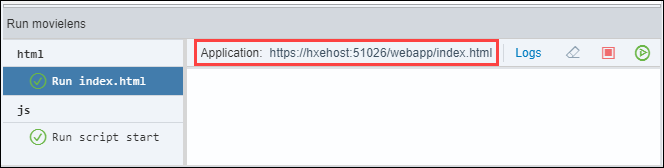
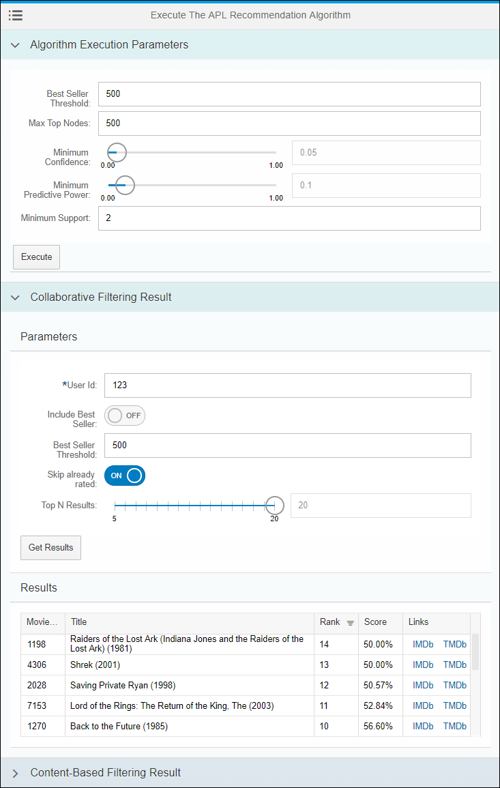
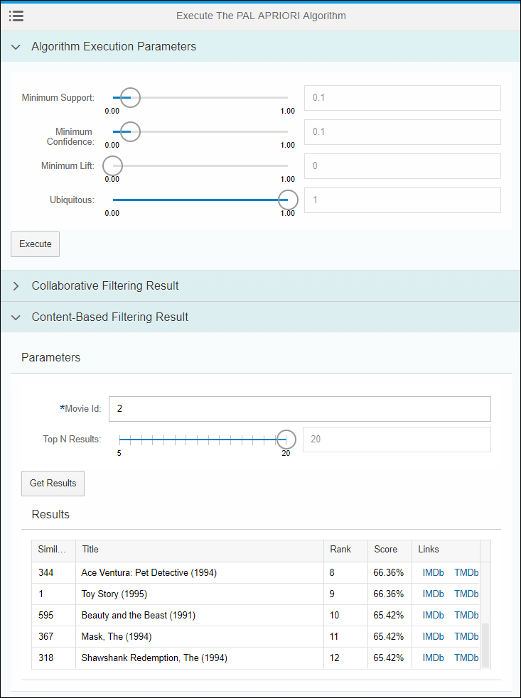

## Prerequisites
 - **Proficiency:** Beginner

## Details
### You will learn

- How to add a SAPUI5 controller and interact with an XSJS service
- How to add a SAPUI5 view and interact with an XSJS service

### Time to Complete
**10 Min**

[ACCORDION-BEGIN [Step 1: ](Open the Web IDE)]

Open the Web IDE, and login using the **`XSA_DEV`** credentials.

Switch to the ***Development*** perspective using the  icon.


As a reminder the default URL for the Web IDE is:

 - `https://hxehost:53075`

A link to the Web IDE can also be found on the ***XSA Controller page*** at:

- `https://hxehost:39030`

[DONE]
[ACCORDION-END]

[ACCORDION-BEGIN [Step 2: ](Create the controller)]

As you will be building two view, you would usually create a controller per view. But here, in order to simplify to code, only one is needed.

A few details about the controller:

- it provides formatters for the number and date values to be displayed in a nicer format
- handles the entry suggestions list with model filters on all fields from the `ratings_movie` and `ratings_user` views

Expand the **`movielens/html/resources/webapp/controller/xsjs`** folder.

Create a new file **`execute.controller.js`**.

This is the full path of the created file:

```
movielens/html/resources/webapp/controller/xsjs/execute.controller.js
```

Paste the following content:

```js
sap.ui.define([
  "movielens/html/controller/demo.controller",
  "sap/m/MessageBox"
], function(Controller, MessageBox) {
  "use strict";

  return Controller.extend("movielens.html.controller.xsjs.execute", {
    onInit: function() {
      this.getView().setModel(new sap.ui.model.json.JSONModel(), "results");
    },
    ajaxCallCompleted: function(status, message) {
      MessageBox.show(message, {
        title: status
      });
      this.oBusyIndicator.close();
    },
    onPress: function(oEvent) {
      var oController = this;
      oController.oBusyIndicator = new sap.m.BusyDialog();
      oController.oBusyIndicator.open();

      var algorithm = oEvent.getSource().data("algorithm");

      var results = oController.getView().getModel("results");
      var configData = oController.getView().getModel("config").getData();
      var service = null;
      var method = oEvent.getSource().data("method");
      if (method === "execute") {
        service = configData.services[algorithm].execute;
      } else if (method === "results") {
        service = configData.services[algorithm].results;
        service.data.resultType = oEvent.getSource().data("resultType");
        results.setProperty("/resultType", oEvent.getSource().data("resultType"));
      }

      var ajaxSuccess = function(response, status) {
        oController.ajaxCallCompleted(status, response.message);
        results.setProperty("/items", response.results);
        results.setProperty("/hasResult", true);
      };
      var ajaxError = function(xhr, status, error) {
        var msg = error;
        if (error.message) {
          msg = error.message;
        }
        oController.ajaxCallCompleted(status, msg);
      };
      $.ajax({
        method: service.method,
        url: service.url,
        async: true,
        timeout: 3000000,
        headers: {
          "content-type": "application/json",
          "accept": "application/json"
        },
        data: JSON.stringify(service.data),
        success: ajaxSuccess,
        error: ajaxError
      });
    }
  });
});
```

Save the file using the  icon from the menu.

[DONE]
[ACCORDION-END]

[ACCORDION-BEGIN [Step 3: ](Create the Fragments (1/3))]

Using fragments in SAPUI5 application enables re-usability of display components but it's also a good way to keep your code shorter and easily maintainable.

The XS JS forms and services results are one good example of components that could be defined as fragments and re-used over and over.

Expand the **`movielens/html/resources/webapp/fragment/xsjs`** folder.

Create a new file **`result_collaborative.fragment.xml`**.

This is the full path of the created file:

```
movielens/html/resources/webapp/fragment/xsjs/result_collaborative.fragment.xml
```

Paste the following content:

```xml
<core:FragmentDefinition xmlns="sap.m" xmlns:core="sap.ui.core" xmlns:ui="sap.ui">
  <ui:table.Table selectionMode="None" visibleRowCount="5" enableBusyIndicator="true" refresh="true" rows="{ path: 'results>/items'}">
    <ui:columns>
      <ui:table.Column sortProperty="MOVIEID" width="10%">
        <Label text="Movie ID"/>
        <ui:template>
          <Text text="{results>MOVIEID}"/>
        </ui:template>
      </ui:table.Column>
      <ui:table.Column sortProperty="TITLE">
        <Label text="Title"/>
        <ui:template>
          <Text text="{results>TITLE}"/>
        </ui:template>
      </ui:table.Column>
      <ui:table.Column sortProperty="RANK" width="10%">
        <Label text="Rank"/>
        <ui:template>
          <Text text="{results>RANK}"/>
        </ui:template>
      </ui:table.Column>
      <ui:table.Column sortProperty="SCORE" width="10%">
        <Label text="Score"/>
        <ui:template>
          <Text text="{path : 'results>SCORE', formatter : '.formatter.formatPercent'}"/>
        </ui:template>
      </ui:table.Column>
      <ui:table.Column width="15%">
        <Label text="Links"/>
        <ui:template>
          <HBox>
            <Link text="IMDb" class="sapUiTinyMarginBeginEnd" target="_blank" href="http://www.imdb.com/title/tt{results>IMDBID}"/>
            <Link text="TMDb" class="sapUiTinyMarginBeginEnd" target="_blank" href="https://www.themoviedb.org/movie/{results>TMDBID}"/>
          </HBox>
        </ui:template>
      </ui:table.Column>
    </ui:columns>
  </ui:table.Table>
</core:FragmentDefinition>
```

Save the file using the  icon from the menu.

Create a new file **`result_contentbased.fragment.xml`**.

This is the full path of the created file:

```
movielens/html/resources/webapp/fragment/xsjs/result_contentbased.fragment.xml
```

Paste the following content:

```xml
<core:FragmentDefinition xmlns="sap.m" xmlns:core="sap.ui.core" xmlns:ui="sap.ui">
  <ui:table.Table selectionMode="None" visibleRowCount="5" enableBusyIndicator="true" refresh="true" rows="{ path: 'results>/items'}">
    <ui:columns>
      <ui:table.Column sortProperty="SIMILAR_MOVIE" width="10%">
        <Label text="Similar Movie ID"/>
        <ui:template>
          <Text text="{results>SIMILAR_MOVIE}" wrapping="false"/>
        </ui:template>
      </ui:table.Column>
      <ui:table.Column sortProperty="TITLE">
        <Label text="Title"/>
        <ui:template>
          <Text text="{results>TITLE}" wrapping="false"/>
        </ui:template>
      </ui:table.Column>
      <ui:table.Column sortProperty="RANK" width="10%">
        <Label text="Rank"/>
        <ui:template>
          <Text text="{results>RANK}" wrapping="false"/>
        </ui:template>
      </ui:table.Column>
      <ui:table.Column sortProperty="results>SCORE" width="10%">
        <Label text="Score"/>
        <ui:template>
          <Text text="{path : 'results>SCORE', formatter : '.formatter.formatPercent'}" wrapping="false"/>
        </ui:template>
      </ui:table.Column>
      <ui:table.Column width="15%">
        <Label text="Links"/>
        <ui:template>
          <HBox>
            <Link text="IMDb" class="sapUiTinyMarginBeginEnd" target="_blank" href="http://www.imdb.com/title/tt{results>IMDBID}"/>
            <Link text="TMDb" class="sapUiTinyMarginBeginEnd" target="_blank" href="https://www.themoviedb.org/movie/{results>TMDBID}"/>
          </HBox>
        </ui:template>
      </ui:table.Column>
    </ui:columns>
  </ui:table.Table>
</core:FragmentDefinition>
```

Save the file using the  icon from the menu.
[DONE]
[ACCORDION-END]

[ACCORDION-BEGIN [Step 4: ](Create the Fragments (2/3))]

Create a new file **`apl_recommendation_execute.fragment.xml`**.

This is the full path of the created file:

```
movielens/html/resources/webapp/fragment/xsjs/apl_recommendation_execute.fragment.xml
```

Paste the following content:

```xml
<core:FragmentDefinition xmlns="sap.m" xmlns:core="sap.ui.core" xmlns:ui="sap.ui"
  xmlns:custom="http://schemas.sap.com/sapui5/extension/sap.ui.core.CustomData/1">
  <ui:layout.form.Form editable="true">
    <ui:layout>
      <ui:layout.form.ResponsiveGridLayout columnsL="1" columnsM="1"/>
    </ui:layout>
    <ui:formContainers>
      <ui:layout.form.FormContainer>
        <ui:formElements>
          <ui:layout.form.FormElement label="Best Seller Threshold">
            <ui:fields>
              <Input type="Number" value="{config>/services/apl_recommendation/execute/data/BESTSELLERTHRESHOLD}"/>
            </ui:fields>
          </ui:layout.form.FormElement>
          <ui:layout.form.FormElement label="Max Top Nodes">
            <ui:fields>
              <Input type="Number" value="{config>/services/apl_recommendation/execute/data/MAXTOPNODES}"/>
            </ui:fields>
          </ui:layout.form.FormElement>
          <ui:layout.form.FormElement label="Minimum Confidence">
            <ui:fields>
              <Slider progress="true" value="{config>/services/apl_recommendation/execute/data/MINIMUMCONFIDENCE}" step="0.01" min="0" max="1"
                enableTickmarks="true" inputsAsTooltips="true"/>
              <Input type="Number" value="{config>/services/apl_recommendation/execute/data/MINIMUMCONFIDENCE}" enabled="false"/>
            </ui:fields>
          </ui:layout.form.FormElement>
          <ui:layout.form.FormElement label="Minimum Predictive Power">
            <ui:fields>
              <Slider progress="true" value="{config>/services/apl_recommendation/execute/data/MINIMUMPREDICTIVEPOWER}" step="0.01" min="0" max="1"
                enableTickmarks="true" inputsAsTooltips="true"/>
              <Input type="Number" value="{config>/services/apl_recommendation/execute/data/MINIMUMPREDICTIVEPOWER}" enabled="false"/>
            </ui:fields>
          </ui:layout.form.FormElement>
          <ui:layout.form.FormElement label="Minimum Support">
            <ui:fields>
              <Input type="Number" value="{config>/services/apl_recommendation/execute/data/MINIMUMSUPPORT}" placeholder="Enter an id" step="0.01" min="0"
                max="1" enableTickmarks="true" inputsAsTooltips="true"/>
            </ui:fields>
          </ui:layout.form.FormElement>
        </ui:formElements>
      </ui:layout.form.FormContainer>
    </ui:formContainers>
  </ui:layout.form.Form>
  <Button text="Execute" press="onPress" custom:method="execute" custom:algorithm="apl_recommendation"/>
</core:FragmentDefinition>
```

Save the file using the  icon from the menu.

Create a new file **`apl_recommendation_result_collaborative.fragment.xml`**.

This is the full path of the created file:

```
movielens/html/resources/webapp/fragment/xsjs/apl_recommendation_result_collaborative.fragment.xml
```

Paste the following content:

```xml
<core:FragmentDefinition xmlns="sap.m" xmlns:core="sap.ui.core" xmlns:ui="sap.ui"
  xmlns:custom="http://schemas.sap.com/sapui5/extension/sap.ui.core.CustomData/1">
  <ScrollContainer height="100%" width="100%" horizontal="true" vertical="true" focusable="true">
    <Panel expandable="false" expanded="true" headerText="Parameters">
      <ui:layout.form.Form editable="true">
        <ui:layout>
          <ui:layout.form.ResponsiveGridLayout columnsL="1" columnsM="1"/>
        </ui:layout>
        <ui:formContainers>
          <ui:layout.form.FormContainer>
            <ui:formElements>
              <ui:layout.form.FormElement label="User Id">
                <ui:fields>
                  <Input id="user_input" required="true" width="100%" showSuggestion="true" suggest="onSuggestionSuggest"
                    value="{config>/services/apl_recommendation/results/data/USERID}" custom:type="user" placeholder="Enter a user identifier..."
                    suggestionItems="{ path: 'odata>/ratings_user', filters: [ { path: 'USERID', operator: 'EQ', value1: '-1' } ]}">
                    <suggestionItems>
                      <core:ListItem key="{odata>USERID}" text="{odata>USERID}" additionalText="Rating count : {odata>RATING_COUNT}"/>
                    </suggestionItems>
                  </Input>
                </ui:fields>
              </ui:layout.form.FormElement>
              <ui:layout.form.FormElement label="Include Best Seller">
                <ui:fields>
                  <Switch state="{config>/services/apl_recommendation/results/data/INCLUDEBESTSELLERS}">
                    <layoutData>
                      <FlexItemData growFactor="1"/>
                    </layoutData>
                  </Switch>
                </ui:fields>
              </ui:layout.form.FormElement>
              <ui:layout.form.FormElement label="Best Seller Threshold">
                <ui:fields>
                  <Input type="Number" value="{config>/services/apl_recommendation/results/data/BESTSELLERTHRESHOLD}"/>
                </ui:fields>
              </ui:layout.form.FormElement>
              <ui:layout.form.FormElement label="Skip already rated">
                <ui:fields>
                  <Switch state="{config>/services/apl_recommendation/results/data/SKIPALREADYOWNED}">
                    <layoutData>
                      <FlexItemData growFactor="1"/>
                    </layoutData>
                  </Switch>
                </ui:fields>
              </ui:layout.form.FormElement>
              <ui:layout.form.FormElement label="Top N Results">
                <ui:fields>
                  <Slider progress="true" value="{config>/services/apl_recommendation/results/data/KEEPTOPN}" step="1" min="5" max="20" enableTickmarks="true"
                    inputsAsTooltips="true"/>
                  <Input type="Number" value="{config>/services/apl_recommendation/results/data/KEEPTOPN}" enabled="false"/>
                </ui:fields>
              </ui:layout.form.FormElement>
            </ui:formElements>
          </ui:layout.form.FormContainer>
        </ui:formContainers>
      </ui:layout.form.Form>
      <Button text="Get Results" press="onPress" custom:method="results" custom:algorithm="apl_recommendation" custom:resultType="collaborative"/>
    </Panel>
    <Panel expandable="false" visible="{= !!${results>/hasResult} &amp;&amp; ${results>/resultType} === 'collaborative'}" headerText="Results">
      <ui:core.Fragment fragmentName="movielens.html.fragment.xsjs.result_collaborative" type="XML"/>
    </Panel>
  </ScrollContainer>
</core:FragmentDefinition>
```

Save the file using the  icon from the menu.

Create a new file **`apl_recommendation_result_contentbased.fragment.xml`**.

This is the full path of the created file:

```
movielens/html/resources/webapp/fragment/xsjs/apl_recommendation_result_contentbased.fragment.xml
```

Paste the following content:

```xml
<core:FragmentDefinition xmlns="sap.m" xmlns:core="sap.ui.core" xmlns:ui="sap.ui"
  xmlns:custom="http://schemas.sap.com/sapui5/extension/sap.ui.core.CustomData/1">
  <ScrollContainer height="100%" width="100%" horizontal="true" vertical="true" focusable="true">
    <Panel expandable="false" expanded="true" headerText="Parameters">
      <ui:layout.form.Form editable="true">
        <ui:layout>
          <ui:layout.form.ResponsiveGridLayout columnsL="1" columnsM="1"/>
        </ui:layout>
        <ui:formContainers>
          <ui:layout.form.FormContainer>
            <ui:formElements>
              <ui:layout.form.FormElement label="Movie Id">
                <ui:fields>
                  <Input required="true" width="100%" showSuggestion="true" suggest="onSuggestionSuggest"
                    value="{config>/services/apl_recommendation/results/data/MOVIEID}" custom:type="movie" id="movie_input"
                    placeholder="Enter a movie name or identifier ..."
                    suggestionItems="{ path: 'odata>/ratings_movie', filters: [ { path: 'MOVIEID', operator: 'EQ', value1: '-1' } ]}">
                    <suggestionItems>
                      <core:ListItem key="{odata>MOVIEID}" text="{odata>MOVIEID}" additionalText="Title: {odata>TITLE} - Rating count : {odata>RATING_COUNT}"/>
                    </suggestionItems>
                  </Input>
                </ui:fields>
              </ui:layout.form.FormElement>
              <ui:layout.form.FormElement label="Include Best Seller">
                <ui:fields>
                  <Switch state="{config>/services/apl_recommendation/results/data/INCLUDEBESTSELLERS}">
                    <layoutData>
                      <FlexItemData growFactor="1"/>
                    </layoutData>
                  </Switch>
                </ui:fields>
              </ui:layout.form.FormElement>
              <ui:layout.form.FormElement label="Best Seller Threshold">
                <ui:fields>
                  <Input type="Number" value="{config>/services/apl_recommendation/results/data/BESTSELLERTHRESHOLD}"/>
                </ui:fields>
              </ui:layout.form.FormElement>
              <ui:layout.form.FormElement label="Top N Results">
                <ui:fields>
                  <Slider progress="true" value="{config>/services/apl_recommendation/results/data/KEEPTOPN}" step="1" min="5" max="20" enableTickmarks="true"
                    inputsAsTooltips="true"/>
                  <Input type="Number" value="{config>/services/apl_recommendation/results/data/KEEPTOPN}" enabled="false"/>
                </ui:fields>
              </ui:layout.form.FormElement>
            </ui:formElements>
          </ui:layout.form.FormContainer>
        </ui:formContainers>
      </ui:layout.form.Form>
      <Button text="Get Results" press="onPress" custom:method="results" custom:algorithm="apl_recommendation" custom:resultType="contentbased"/>
    </Panel>
    <Panel expandable="false" visible="{= !!${results>/hasResult} &amp;&amp; ${results>/resultType} === 'contentbased'}" headerText="Results">
      <ui:core.Fragment fragmentName="movielens.html.fragment.xsjs.result_contentbased" type="XML"/>
    </Panel>
  </ScrollContainer>
</core:FragmentDefinition>
```

Save the file using the  icon from the menu.

[DONE]
[ACCORDION-END]

[ACCORDION-BEGIN [Step 5: ](Create the Fragments (3/3))]

Create a new file **`pal_apriori_execute.fragment.xml`**.

This is the full path of the created file:

```
movielens/html/resources/webapp/fragment/xsjs/pal_apriori_execute.fragment.xml
```

Paste the following content:

```xml
<core:FragmentDefinition xmlns="sap.m" xmlns:core="sap.ui.core" xmlns:ui="sap.ui"
  xmlns:custom="http://schemas.sap.com/sapui5/extension/sap.ui.core.CustomData/1">
  <ui:layout.form.Form editable="true">
    <ui:layout>
      <ui:layout.form.ResponsiveGridLayout columnsL="1" columnsM="1"/>
    </ui:layout>
    <ui:formContainers>
      <ui:layout.form.FormContainer>
        <ui:formElements>
          <ui:layout.form.FormElement label="Minimum Support">
            <ui:fields>
              <Slider progress="true" value="{config>/services/pal_apriori/execute/data/MIN_SUPPORT}" step="0.01" min="0" max="1" enableTickmarks="true"
                inputsAsTooltips="true"/>
              <Input type="Number" value="{config>/services/pal_apriori/execute/data/MIN_SUPPORT}" enabled="false"/>
            </ui:fields>
          </ui:layout.form.FormElement>
          <ui:layout.form.FormElement label="Minimum Confidence">
            <ui:fields>
              <Slider progress="true" value="{config>/services/pal_apriori/execute/data/MIN_CONFIDENCE}" step="0.01" min="0" max="1" enableTickmarks="true"
                inputsAsTooltips="true"/>
              <Input type="Number" value="{config>/services/pal_apriori/execute/data/MIN_CONFIDENCE}" enabled="false"/>
            </ui:fields>
          </ui:layout.form.FormElement>
          <ui:layout.form.FormElement label="Minimum Lift">
            <ui:fields>
              <Slider progress="true" value="{config>/services/pal_apriori/execute/data/MIN_LIFT}" step="0.01" min="0" max="1" enableTickmarks="true"
                inputsAsTooltips="true"/>
              <Input type="Number" value="{config>/services/pal_apriori/execute/data/MIN_LIFT}" enabled="false"/>
            </ui:fields>
          </ui:layout.form.FormElement>
          <ui:layout.form.FormElement label="Ubiquitous">
            <ui:fields>
              <Slider progress="true" value="{config>/services/pal_apriori/execute/data/UBIQUITOUS}" step="0.01" min="0" max="1" enableTickmarks="true"
                inputsAsTooltips="true"/>
              <Input type="Number" value="{config>/services/pal_apriori/execute/data/UBIQUITOUS}" enabled="false"/>
            </ui:fields>
          </ui:layout.form.FormElement>
        </ui:formElements>
      </ui:layout.form.FormContainer>
    </ui:formContainers>
  </ui:layout.form.Form>
  <Button text="Execute" press="onPress" custom:method="execute" custom:algorithm="pal_apriori"/>
</core:FragmentDefinition>
```

Save the file using the  icon from the menu.

Create a new file **`pal_apriori_result_collaborative.fragment.xml`**.

This is the full path of the created file:

```
movielens/html/resources/webapp/fragment/xsjs/pal_apriori_result_collaborative.fragment.xml
```

Paste the following content:

```xml
<core:FragmentDefinition xmlns="sap.m" xmlns:core="sap.ui.core" xmlns:ui="sap.ui"
  xmlns:custom="http://schemas.sap.com/sapui5/extension/sap.ui.core.CustomData/1">
  <ScrollContainer height="100%" width="100%" horizontal="true" vertical="true" focusable="true">
    <Panel expandable="false" expanded="true" headerText="Parameters">
      <ui:layout.form.Form editable="true">
        <ui:layout>
          <ui:layout.form.ResponsiveGridLayout columnsL="1" columnsM="1"/>
        </ui:layout>
        <ui:formContainers>
          <ui:layout.form.FormContainer>
            <ui:formElements>
              <ui:layout.form.FormElement label="User Id">
                <ui:fields>
                  <Input id="user_input" required="true" width="100%" showSuggestion="true" suggest="onSuggestionSuggest"
                    value="{config>/services/pal_apriori/results/data/USERID}" custom:type="user" placeholder="Enter a user identifier..."
                    suggestionItems="{ path: 'odata>/ratings_user', filters: [ { path: 'USERID', operator: 'EQ', value1: '-1' } ]}">
                    <suggestionItems>
                      <core:ListItem key="{odata>USERID}" text="{odata>USERID}" additionalText="Rating count : {odata>RATING_COUNT}"/>
                    </suggestionItems>
                  </Input>
                </ui:fields>
              </ui:layout.form.FormElement>
              <ui:layout.form.FormElement label="Top N Results">
                <ui:fields>
                  <Slider progress="true" value="{config>/services/pal_apriori/results/data/KEEPTOPN}" step="1" min="5" max="20" enableTickmarks="true"
                    inputsAsTooltips="true"/>
                  <Input type="Number" value="{config>/services/pal_apriori/results/data/KEEPTOPN}" enabled="false"/>
                </ui:fields>
              </ui:layout.form.FormElement>
            </ui:formElements>
          </ui:layout.form.FormContainer>
        </ui:formContainers>
      </ui:layout.form.Form>
      <Button text="Get Results" press="onPress" custom:method="results" custom:algorithm="pal_apriori" custom:resultType="collaborative"/>
    </Panel>
    <Panel expandable="false" visible="{= !!${results>/hasResult} &amp;&amp; ${results>/resultType} === 'collaborative'}" headerText="Results">
      <ui:core.Fragment fragmentName="movielens.html.fragment.xsjs.result_collaborative" type="XML"/>
    </Panel>
  </ScrollContainer>
</core:FragmentDefinition>
```

Save the file using the  icon from the menu.

Create a new file **`pal_apriori_result_contentbased.fragment.xml`**.

This is the full path of the created file:

```
movielens/html/resources/webapp/fragment/xsjs/pal_apriori_result_contentbased.fragment.xml
```

Paste the following content:

```xml
<core:FragmentDefinition xmlns="sap.m" xmlns:core="sap.ui.core" xmlns:ui="sap.ui"
  xmlns:custom="http://schemas.sap.com/sapui5/extension/sap.ui.core.CustomData/1">
  <ScrollContainer height="100%" width="100%" horizontal="true" vertical="true" focusable="true">
    <Panel expandable="false" expanded="true" headerText="Parameters">
      <ui:layout.form.Form editable="true">
        <ui:layout>
          <ui:layout.form.ResponsiveGridLayout columnsL="1" columnsM="1"/>
        </ui:layout>
        <ui:formContainers>
          <ui:layout.form.FormContainer>
            <ui:formElements>
              <ui:layout.form.FormElement label="Movie Id">
                <ui:fields>
                  <Input required="true" width="100%" showSuggestion="true" suggest="onSuggestionSuggest"
                    value="{config>/services/pal_apriori/results/data/MOVIEID}" custom:type="movie" id="movie_input"
                    placeholder="Enter a movie name or identifier ..."
                    suggestionItems="{ path: 'odata>/ratings_movie', filters: [ { path: 'MOVIEID', operator: 'EQ', value1: '-1' } ]}">
                    <suggestionItems>
                      <core:ListItem key="{odata>MOVIEID}" text="{odata>MOVIEID}" additionalText="Title: {odata>TITLE} - Rating count : {odata>RATING_COUNT}"/>
                    </suggestionItems>
                  </Input>
                </ui:fields>
              </ui:layout.form.FormElement>
              <ui:layout.form.FormElement label="Top N Results">
                <ui:fields>
                  <Slider progress="true" value="{config>/services/pal_apriori/results/data/KEEPTOPN}" step="1" min="5" max="20" enableTickmarks="true"
                    inputsAsTooltips="true"/>
                  <Input type="Number" value="{config>/services/pal_apriori/results/data/KEEPTOPN}" enabled="false"/>
                </ui:fields>
              </ui:layout.form.FormElement>
            </ui:formElements>
          </ui:layout.form.FormContainer>
        </ui:formContainers>
      </ui:layout.form.Form>
      <Button text="Get Results" press="onPress" custom:method="results" custom:algorithm="pal_apriori" custom:resultType="contentbased"/>
    </Panel>
    <Panel expandable="false" visible="{= !!${results>/hasResult} &amp;&amp; ${results>/resultType} === 'contentbased'}" headerText="Results">
      <ui:core.Fragment fragmentName="movielens.html.fragment.xsjs.result_contentbased" type="XML"/>
    </Panel>
  </ScrollContainer>
</core:FragmentDefinition>
```

Save the file using the  icon from the menu.


[DONE]
[ACCORDION-END]

[ACCORDION-BEGIN [Step 6: ](Create the Views)]

As you will be executing both the **collaborative filtering** and **content-based filtering** algorithms, you will need to create two views.

A few details about the content of the views:

- an series of input field that represents the algorithms parameters (not all algorithm parameters are actually exposed)

- a section to display the **collaborative filtering** results and the **collaborative filtering** results with the relevant parameters to customize the output.

Expand the **`movielens/html/resources/webapp/view/xsjs`** folder.

Create a new file **`apl_recommendation.view.xml`**.

This is the full path of the created file:

```
movielens/html/resources/webapp/view/xsjs/apl_recommendation.view.xml
```

Paste the following content:

```xml
<mvc:View xmlns:html="http://www.w3.org/2000/xhtml" xmlns:mvc="sap.ui.core.mvc" xmlns="sap.m" xmlns:ui="sap.ui"
  controllerName="movielens.html.controller.xsjs.execute">
  <Page showHeader="false" press="onNavMenuItemPress" icon="sap-icon://menu" id="master">
    <content>
      <Bar>
        <contentMiddle>
          <Title text="Execute The APL Forecast Algorithm"/>
        </contentMiddle>
        <contentLeft>
          <Button icon="sap-icon://menu" press="handlePressOpenMenu"/>
        </contentLeft>
      </Bar>
      <Panel expandable="true" expanded="true" headerText="Algorithm Execution Parameters">
        <ui:core.Fragment fragmentName="movielens.html.fragment.xsjs.apl_recommendation_execute" type="XML"/>
      </Panel>
      <Panel expandable="true" headerText="Collaborative Filtering Result">
        <ui:core.Fragment fragmentName="movielens.html.fragment.xsjs.apl_recommendation_result_collaborative" type="XML"/>
      </Panel>
      <Panel expandable="true" headerText="Content-Based Filtering Result">
        <ui:core.Fragment fragmentName="movielens.html.fragment.xsjs.apl_recommendation_result_contentbased" type="XML"/>
      </Panel>
    </content>
  </Page>
</mvc:View>
```

Save the file using the  icon from the menu.

Create a new file **`pal_apriori.view.xml`**.

This is the full path of the created file:

```
movielens/html/resources/webapp/view/xsjs/pal_apriori.view.xml
```

Paste the following content:

```xml
<mvc:View xmlns:html="http://www.w3.org/2000/xhtml" xmlns:mvc="sap.ui.core.mvc" xmlns="sap.m" xmlns:ui="sap.ui"
  controllerName="movielens.html.controller.xsjs.execute">
  <Page showHeader="false" press="onNavMenuItemPress" icon="sap-icon://menu" id="master">
    <content>
      <Bar>
        <contentMiddle>
          <Title text="Execute The PAL APRIORI Algorithm"/>
        </contentMiddle>
        <contentLeft>
          <Button icon="sap-icon://menu" press="handlePressOpenMenu"/>
        </contentLeft>
      </Bar>
      <Panel expandable="true" expanded="true" headerText="Algorithm Execution Parameters">
        <ui:core.Fragment fragmentName="movielens.html.fragment.xsjs.pal_apriori_execute" type="XML"/>
      </Panel>
      <Panel expandable="true" headerText="Collaborative Filtering Result">
        <ui:core.Fragment fragmentName="movielens.html.fragment.xsjs.pal_apriori_result_collaborative" type="XML"/>
      </Panel>
      <Panel expandable="true" headerText="Content-Based Filtering Result">
        <ui:core.Fragment fragmentName="movielens.html.fragment.xsjs.pal_apriori_result_contentbased" type="XML"/>
      </Panel>
    </content>
  </Page>
</mvc:View>
```

Save the file using the  icon from the menu.

[DONE]
[ACCORDION-END]

[ACCORDION-BEGIN [Step 7: ](Run the application)]

Select the **`html`** module, then click on the execute icon  from the menu bar.

Once the application is started, the application will open in a new tab/window or you can click on the application URL:



This will open a web page with the following content:


[DONE]
[ACCORDION-END]

[ACCORDION-BEGIN [Step 8: ](Validate your APL Recommendation results)]

Using the menu icon on the top left corner of the panel, select **Execute Algorithms with XSJS > APL Recommendation**.

Set the ***Best Seller Threshold*** and the ***Max Top Nodes*** to 500.

Click on **Execute**. This will run the algorithm.

Expand the ***Collaborative Filtering Result*** panel, and enter ***123*** as ***User Id***.

Set the ***Top N Results*** to 20.

Click on **Get Results**.

Et voilà!



Provide an answer to the question below then click on **Validate**.

[VALIDATE_1]
[ACCORDION-END]

[ACCORDION-BEGIN [Step 9: ](Validate your PAL APRIORI results)]

Using the menu icon on the top left corner of the panel, select **Execute Algorithms with XSJS > PAL APRIORI**.

Leave the parameters as default.

Click on **Execute**. This will run the algorithm.

Expand the ***Content-based Filtering Result*** panel, and enter ***2*** as ***Movie Id*** (for ***`Jumanji`***).

Set the ***Top N Results*** to 20.

Click on **Get Results**.

Et voilà!



Provide an answer to the question below then click on **Validate**.

[VALIDATE_2]
[ACCORDION-END]

[ACCORDION-BEGIN [Step 10: ](Commit your changes)]

On the icon bar located on the right side of the Web IDE, click on the **Git Pane** icon .

Click on **Stage All**, enter a commit comment, then click on **Commit and Push > origin master**.

[DONE]
[ACCORDION-END]
