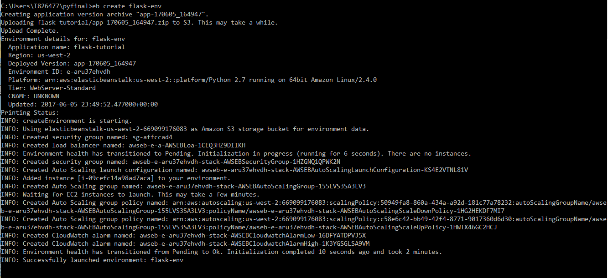
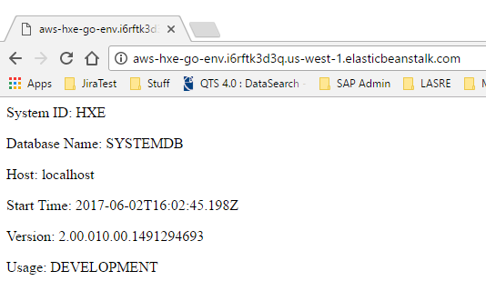
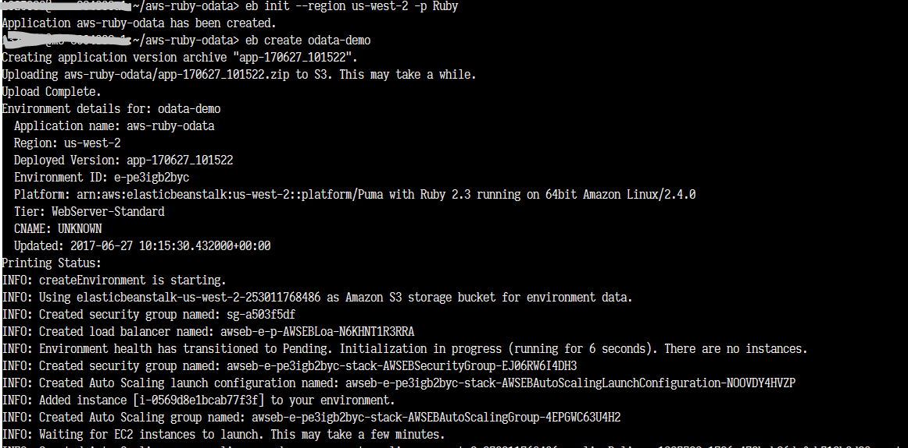
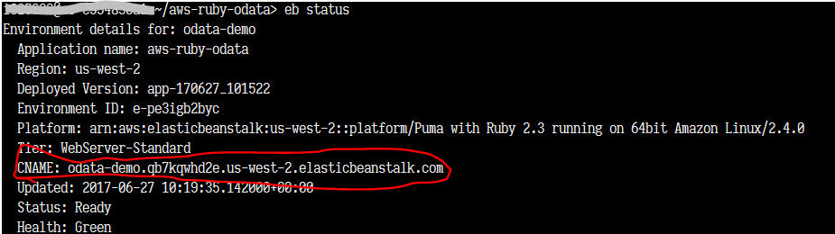

## Prerequisites and Assumptions
 - **Proficiency:** Beginner
 - You have your application working in a local environment.
 - You have an account on Amazon Web Services(AWS). If you do not already have an AWS account, you can go to the [AWS Home Page](https://aws.amazon.com/) and set one up.
 - You have familiarized yourself with [AWS Elastic Beanstalk documentation](http://docs.aws.amazon.com/elasticbeanstalk/latest/dg/Welcome.html).
 - You have installed the Elastic Beanstalk command line interface (EBCLI). If you have not already done so, you can follow [these instructions](http://docs.aws.amazon.com/elasticbeanstalk/latest/dg/eb-cli3-install.html).
 - You have a `HANA, express edition` database that can be reached from the AWS Elastic Beanstalk environment. If you do not have one set up, see the [HANA Express database deploy tutorial](https://www.sap.com/developer/tutorials/hxe-db-deploy.html).

## Next Steps
 - Go to [SAP HANA, express edition](https://www.sap.com/developer/topics/sap-hana-express.tutorials.html) tutorials page

## Details
### You will learn  
This tutorial will guide you through the process of deploying a sample `HANA, express edition` application to AWS Elastic Beanstalk. The tutorial assumes that you already have your application running in a local environment and simply need to port it to AWS Elastic Beanstalk. You will only need to complete the accordion steps of the platforms you wish to deploy to.

### Time to Complete
**30 Min**

---
[ACCORDION-BEGIN [Step 1: ](Deploy a Node JS Application)]

1. Navigate to your source folder and create a new folder called `.ebextensions`:
   ```
   % mkdir .ebextensions
   % cd .ebextensions
   ```

2. Create a file named `nodecommand.config` and add the following text:
   ```
   option_settings:
     aws:elasticbeanstalk:container:nodejs:
    	NodeCommand: "npm start"
   ```
   ```
   % ls nodecommand.config
   % cat nodecommand.config
      option_settings:
        aws:elasticbeanstalk:container:nodejs:
    	    NodeCommand: "npm start"
   ```

3. Initialize the development space for this Node application on AWS. Substitute your AWS region (e.g. "us-west-2") as needed for the region.
   ```
   % eb init --platform node.js --region  <Your Region>
   ```

   This command may prompt for AWS access id and AWS secret key. For first time user, you may need to set it up for logging into the AWS account.
   Search for access keys & try to create an access key. Save the `csv` output once the keys get generated. Substitute the environment name of your choice (e.g. `hxeapp-env`).
   ```
   % eb create <Your environment>
   ```
   Output will be similar to the following:
   ```
   Creating application version archive "app-170519_155200".
   Uploading hxeapp/app-170519_155200.zip to S3. This may take a while.
   Upload Complete.
   ...
   INFO: Successfully launched environment: hxeapp-dev
   ```

4. Deploy the Node application on AWS in the development space.
   ```
   % eb deploy <Your environment>
   ```
   Output will be similar to the following:
   ```
   Creating application version archive "app-170519_160131".
   Uploading hxeapp/app-170519_160131.zip to S3. This may take a while.
   Upload Complete.
   INFO: Environment update is starting.
   INFO: Deploying new version to instance(s).
   INFO: New application version was deployed to running EC2 instances.
   INFO: Environment update completed successfully.
   ```

5. Open the Node application deployed on AWS.
   ```
   % eb open
   ```
   This opens the URL to where the application is deployed.
   You can also login to the AWS console Elastic Beanstalk service

   Navigate to the default region (e.g. "us-west-2") where you have initialized your application. Notice <Your Environment> already exists in the location. If it does not exist, you are at a wrong region. Click on the URL for the app (something like the following):
   ```
   http://hxeapp-dev.2tmfx3b2bn.us-west-2.elasticbeanstalk.com/
   ```


[ACCORDION-END]

[ACCORDION-BEGIN [Step 2: ](Deploy a Python/Flask Application)]

1. Go to the directory where your Python/Flask Application is located.
   ```
   $ cd <source directory>

   ```

2. Create a file called `requirements.txt`, add the following to it, then save:
   ```
    Flask==0.10.1
    itsdangerous==0.24
    Jinja2==2.7.3
    MarkupSafe==0.23
    pyhdb==0.3.3
    Werkzeug==0.10.1
   ```

3. Modify `application.py` to reference the host, port, user and password to your running SAP HANA, Express Edition.
    ```
    # replace the IP address and password below
      user_provided_host='<IP address>'
      user_provided_password='<password>'
    ```

4. Execute the EB CLI commands below to deploy the application:

*Note: The first deployment can take approximately 10 minutes.*
    ```
    % eb init -p python2.7 <Your application name>
    ```

5. Create an environment and deploy the application:
    ```
    % eb create <Your environment>
    ```

    

6. After the environment is created and application deployed, open your web site with:
    ```
    % eb open
    ```


[ACCORDION-END]

[ACCORDION-BEGIN [Step 3: ](Deploy a GO Application)]

1. Because the HANA Go database driver is not part of the Go Standard library, you need to tell AWS Elastic Beanstalk how to download and build it. You do that by adding the following three files to your source directory:

    - `Buildfile` - Provides the Elastic Beanstalk instructions for building your application.
    - `build.sh` - A shell script the `Buildfile` calls that executes Go build operations. Make sure the executable bit is set on this file.
    - `Procfile` - Provides the Elastic Beanstalk instructions for running your application.


2. Create a file called `Buildfile` and type or copy and paste the following single line of source code into the file, then save:
    ```
    make: ./build.sh
    ```
    This tells Elastic Beanstalk to run `build.sh` when making the application.

3. Create a file called `Procfile` and type or copy and paste the following single line of source code into the file, then save:
    ```
    web: bin/application
    ```

    This tells Elastic Beanstalk to run `bin/application` to run your application (which is, of course, a "web" application).

4. Create a file called `build.sh` and Type or Copy and Paste the following lines of source code into the file, then save:
    ```
    go get -u github.com/SAP/go-hdb/driver
    go get github.com/aws/aws-sdk-go/...
    go build -o bin/application *.go
    ```

    This tells the Go compiler to get the SAP HANA database driver from github, get the official AWS Software Development Kit(SDK) from github and then build your application including these components.

    You may want to learn more about the [Go HANA driver](https://github.com/SAP/go-hdb) and the [AWS Go SDK](https://github.com/aws/aws-sdk-go).

5. Make sure you are in the `$GOPATH/src/hxe_go_http` directory.

6. Initialize your go application using the `eb init` command.

- When prompted for default region, select the appropriate region for your organization.
- When prompted for the application to use, create a new application called `hxe_go_http`.
- When prompted for platform, select "Go".
- When prompted for platform version, select "Go 1.7".
- When prompted to use AWS `CodeCommit`, accept the default, "n".
- When prompted for whether you wish to setup SSH, select the answer appropriate for your organization's security needs.

7. (Windows only) If you are running `eb` client on Windows, will encounter permissions problems on the `build.sh` file during deployment. An error will appear in the `eb-activity.log` if you don't correct the permissions on the `build.sh` file:

    This occurs because the Windows file, `build.sh`, does not have `unix` executable permissions set. Here is how to set the executable permissions using git.

    a. Add the following section to the `./elasticbeanstalk/config.yml` file then save:
    ```
    deploy:
      artifact: ./hxe_go_http.zip
    ```

    b. Make sure you are in the source directory to execute the following commands:

    ```
    # Initialize a git repository for your project.
    git init

    # Add all the artifacts in your project directory and subdirectories.
    git add -A

    # Commit your changes to the repository.
    git commit -a -m "Initial commit"  

    # Modify the executable setting on the build.sh file.
    git update-index --chmod=+x build.sh

    # Commit the changes to the build.sh file.
    git commit -a -m "Changed the executable bit on build.sh"

    # Generate the deployment archive file. Be sure to commit changes and regenerate the archive before each deployment.
    git archive --format=zip HEAD > hxe_go_http.zip
    ```

    c.  Create your application. The eb client will find the deployment artifact using the updated config.yml file (see step 9.a).
    ```
    eb create
    ```
    - When prompted for Environment Name accept default `hxe-go-http-dev`.
    - When prompted to select load balancer type, accept default `classic`.

    d. Application has been created and deployed. Skip ahead to step 10.

8. (Linux and Mac) Create the environment for your Elastic Beanstalk application by issuing the following command: `eb create <Your environment>`.

9. (Linux and Mac) When the `eb create` command completes, you will be ready to deploy your application, deploy your application using the following command: `eb deploy`.

10. When deployment completes, you can retrieve the URL for your application using the `eb status` command. Your application URL is the `CNAME` value. When you enter the URL in a browser, you should see something like the following:

    .


[ACCORDION-END]

[ACCORDION-BEGIN [Step 4: ](Deploy a Ruby - Sinatra Application)]

1. Copy following code to file `config.ru`
    ```
      require './app'
      run Sinatra::Application
    ```

2. Execute the following commands to deploy your app
    ```
      eb init --region <Your Region> -p Ruby
      eb create <Your Environment>
    ```

    *Note: The deployment may take 10 to 15 minutes.*

    

2. Get the URL of your app, and visit it
    ```
      eb status
    ```

    

    Your app should look like following

    


[ACCORDION-END]

---

