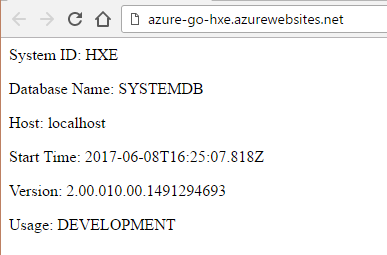

## Prerequisites and Assumptions
 - **Proficiency:** Beginner
 - You have a working application to connect to SAP HANA, Express Edition.
 - You have a Azure Account and/or have registered for the free trial.
 - You have a project created on the AWS and billing is enabled.
 - **Tutorials:**  [Create a new project using the Azure App Service](https://docs.microsoft.com/en-us/azure/app-service-web/app-service-web-overview) and [SAP HANA, express edition, in Azure](https://www.sap.com/developer/tutorials/hxe-azure-open-suse.html)


## Next Steps
 - Go to [SAP HANA, express edition](https://www.sap.com/developer/topics/sap-hana-express.tutorials.html) tutorials page

## Details
### You will learn  
This tutorial will guide you through the process of deploying a sample application to Azure. To learn more about Azure web apps read the [Azure Web Apps documentation](https://docs.microsoft.com/en-us/azure/app-service-web/). In addition to providing numerous web application templates and accelerators, Azure provides numerous [deployment options](https://docs.microsoft.com/en-us/azure/app-service-web/web-sites-deploy).

### Time to Complete
**30 Min**

---

[ACCORDION-BEGIN [Step 1: ](Create a Go or NodeJS Web App on Azure)]
If your application is written in Go and uses the go `http` package for the web framework or your application is written in nodejs and uses the Express web framework, follow these instructions. 

1. Read the [Azure client documentation](https://docs.microsoft.com/en-us/cli/azure/overview). Follow the [Azure client installation instructions](https://docs.microsoft.com/en-us/cli/azure/install-azure-cli) to install the Azure client on your system.

2. After the client is installed, login to Azure
   ```
   $ az login
   ```
3. Create your deployment credentials.
   ```
   $ az webapp deployment user set --user-name <username> --password <password>
   ```
4. Create a resource group. 
   ```
   $ az group create --name <your-resource-group-name> --location <your location>
   ```
   You can try to get the list of groups and associated locations using the `group list` command as follows:
   ```
   $ az group list
   ```
5. Create an Azure service plan.
   The example below uses the free plan, `quickStartPlan`. Replace the plan with the appropriate plan for your organization.
   ```
   $ az appservice plan create --name quickStartPlan --resource-group <your-resource-group-name> --sku FREE
   ```  
6. Create a WebApp. Replace the name of the application, `hxeapp1` with the name of your choice. 
   ```
   $ az webapp create --name hxeapp1 --resource-group <your-resource-group-name> --plan quickStartPlan
   ```
7. Configure local Git deployment. This will allow you to commit to a local git repository and push your results up to a git repository on Azure App Service's virtual machine and have the application be built automatically. This command will return a repository url.
   ```
   az webapp deployment source config-local-git --resource-group <your-resource-group-name> --name <app-name>
   ```

8. If you have not set up and populated a local git repository on your client, then navigate to your source directory and issue the following command. 
   ```
   $ git init
   ```
8. Add your Azure application's git repository as a remote repository for your local git repository. 
   ```
   $ git remote add azuregit <URL from Configure local Git Deployment step>
   ```

9. Make sure that you have pointed your application to a `HANA, express edition` database that is accessible from your Azure virtual machine. After you have made all required application changes, commit your changes to your local git repository. The command below shows how to add all source files to your git repository and commit them with a comment.
   ```
   $ git commit -a -m "<git commit comment>"
   ```
10. Push your code to the Azure remote to deploy your app
   ```
   $ git push azuregit master
   ```
11. When the push commits successfully, the client will display the URL of the deployed application, e.g. 'http://hxeapp.azurewebsites.net/`. Navigate to this URL to see your deployed application. When you do so, you should see something like the following:

. 

[DONE]
[ACCORDION-END]

[ACCORDION-BEGIN [Step 2: ](Deploy a Sinatra Application to Azure)]
Sinatra applications require an extra step on top of the steps required for go and nodejs applications. Sinatra applications require an inbound security rule to allow access to port 4567.

1. To open port 4567 for your application, run the following command using your Azure client.
```
az network nsg rule create -g MyResourceGroup --nsg-name MyNsg -n sinatra-incoming --priority 1010 --source-address-prefix * --source-port-range * --destination-address-prefix * --destination-port-range 4567 --access Allow --protocol Any --description "Allow traffic to the 4567 port."
```

After you push your code successfully to Azure using git, and add the inbound security rules you should see something like the following when you select your application URL:


[DONE]
[ACCORDION-END]

---

## Next Steps
 - Go to [SAP HANA, express edition](https://www.sap.com/developer/topics/sap-hana-express.tutorials.html) tutorials page
