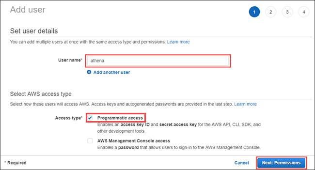
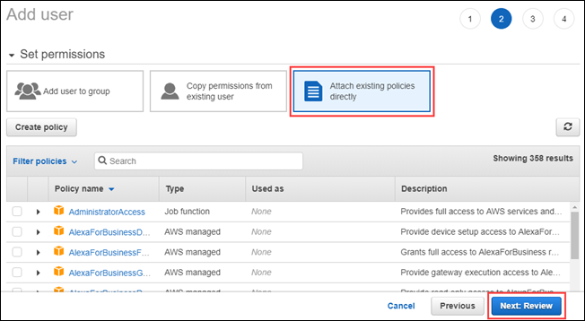
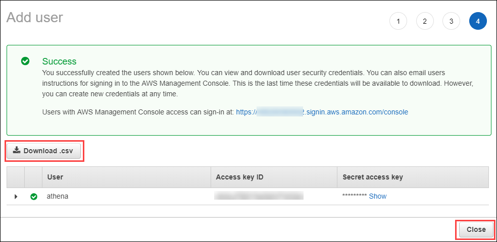
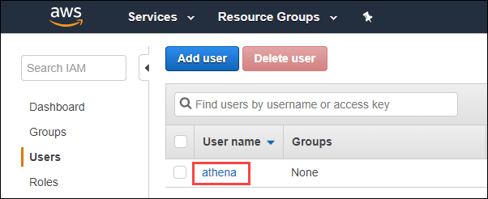
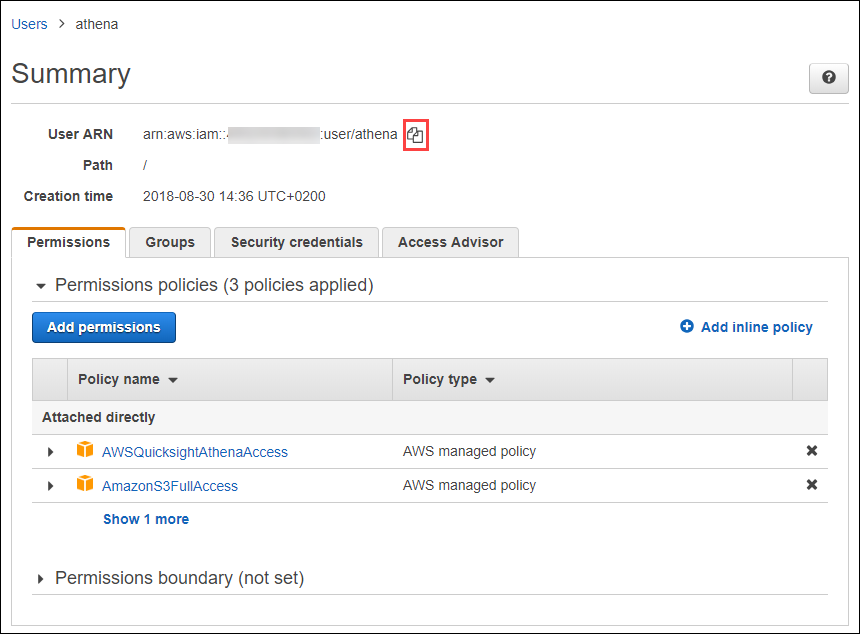
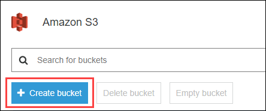
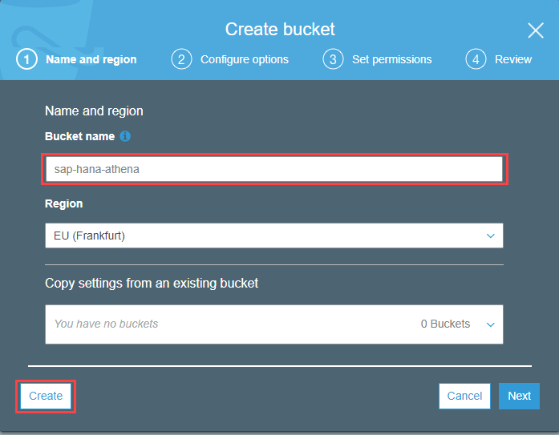
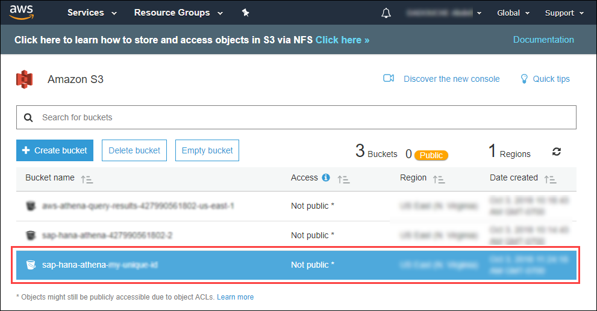
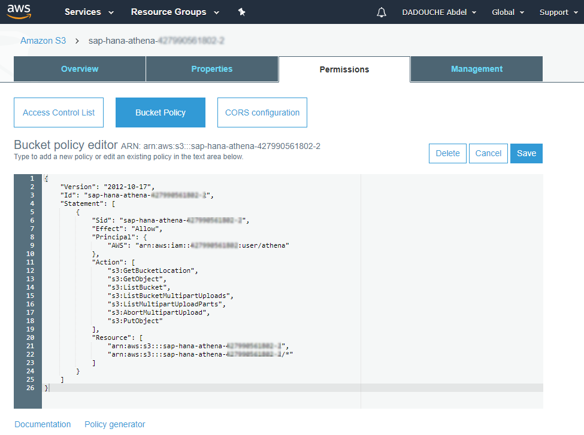

## Details
### You will learn  
  - Create a User in IAM
  - Create and configure a S3 bucket


**If you are attending SAP TechEd, come by the AWS booth to get an AWS credit voucher to cover the cost.**
---
<div align="center">
<b><span style="color:red;align:middle">Warning: Please read carefully before starting!</span></b>
</div>

**Before, you get started, please be aware that completing this tutorial track will incur a charge estimated between 10 and 20 USD on your AWS account.**

**And if you are not planning to complete the all track, be aware that when using the SAP HANA, express edition AMI from AWS, charges for both the EC2 instance and the provisioned EBS volumes used by this instance will incur.**

**And because of the EBS volumes types in use, even if you _stop_ your EC2 instance running your SAP HANA, express edition instance, you will still be charged for the provisioned EBS volumes. Only detaching and deleting the EBS volumes will prevent that. But, your SAP HANA, express edition will no longer be usable.**

Make sure to check the <a href="https://developers.sap.com/tutorials/hxe-aws-athena-07.html" target="&#95;blank">Cleanup before you leave</a> tutorial if you plan to stop before finishing the track.

---

[ACCORDION-BEGIN [Step 1: ](Sign in or Create an Account on AWS)]

Sign in or create an account on <a href="https://aws.amazon.com" target="&#95;blank">Amazon Web Services</a>.


[DONE]
[ACCORDION-END]

[ACCORDION-BEGIN [Step 1: ](Access the AWS Management Console)]

Access the <a href="https://console.aws.amazon.com/console" target="&#95;blank">Amazon Web Services Management Console</a>.


[DONE]
[ACCORDION-END]

[ACCORDION-BEGIN [Step 1: ](Create a user in AWS)]

In order to later configure the ODBC connection from SAP HANA, express edition to Amazon Athena, you will need to provide your credentials using the Access & Security Key.

Access the <a href="https://console.aws.amazon.com/iam" target="&#95;blank">IAM Management Console</a> (you also use the search for **IAM** in the Amazon Web Services Management Console).


On the left side, click on **Users**, then click on **Add User**.


Enter a **User Name** like ***`athena`***.

Set the **Access type** to **Programmatic access**.

Click on **Next: Permissions**.



Select **Attach existing policies directly**.

Search and select the following policies:

 - **`AWSQuicksightAthenaAccess`**
 - **`AmazonAthenaFullAccess`**
 - **`AmazonS3FullAccess`**

Click on **Next: Review**.



Review the user creation details then click on **Create User**.


Click on **Download .`csv`** to download the **Access key ID** and **Secret access key**.

> ### **Note:** the **Access key ID** and **Secret access key** will be used as credentials to authenticate to Amazon Athena.

Click on **Close**.



Click on the newly created user.



Click on the copy icon to copy the **User ARN**.



Save locally in a text editor the **User ARN**.

Provide an answer to the question below then click on **Validate**.

[VALIDATE_1]
[ACCORDION-END]

[ACCORDION-BEGIN [Step 1: ](Create an S3 bucket)]

If you have followed the ***<a href="https://docs.aws.amazon.com/athena/latest/ug/getting-started.html" target="&#95;blank">Getting Started</a>*** guide for Amazon Athena, a S3 bucket will be created automagically.

But for the purpose of this tutorial series, you will create a dedicated bucket.

Access the **<a href="https://s3.console.aws.amazon.com/s3/home" target="&#95;blank">S3 Management Console</a>**.

Click on **Create bucket**.



Enter as **Bucket name** ***`sap-hana-athena-<my unique id>`*** where ***&lt;my unique id&gt;*** is a unique identifier across all existing S3 bucket on AWS.

You can use the user ARN numerical identifier from the previous step as ***&lt;my unique id&gt;***.

For the sake of simplicity, choose **US East (N. Virginia)** as the region.

> #### **Note:**
> Please note that in order to use your S3 bucket with Amazon Athena, they will need to be located in the same region. Here is the list of regions where Amazon Athena is available:
>
>  - Northern Virginia
>  - Ohio
>  - Oregon
>  - Ireland
>  - Frankfurt
>  - London
>  - Singapore
>  - Tokyo
>  - Sydney
>  - Seoul
>  - Mumbai
>
>You can find the region coverage for all AWS services [here](https://aws.amazon.com/about-aws/global-infrastructure/regional-product-services).
>
>It is also recommended for you to create your SAP HANA, express edition instance in the same region.

Click on **Create**.



Click on the newly created bucket.



Select **Permissions**, then **Bucket policy**.

Paste the following code in the **Bucket Policy editor** after adjusting the **Sid** (the ***<my unique id>***  token) representing your S3 Bucket ARN along with the **AWS Principal** using the User ARN saved previously:

```json
{
    "Id": "sap-hana-athena-<my unique id>",
    "Version": "2012-10-17",
    "Statement": [
        {
            "Sid": "sap-hana-athena-<my unique id>",
            "Action": [
                "s3:GetBucketLocation",
                "s3:GetObject",
                "s3:ListBucket",
                "s3:ListBucketMultipartUploads",
                "s3:ListMultipartUploadParts",
                "s3:AbortMultipartUpload",
                "s3:PutObject"
            ],
            "Effect": "Allow",
            "Resource": [
                "arn:aws:s3:::sap-hana-athena-<my unique id>",
                "arn:aws:s3:::sap-hana-athena-<my unique id>/*"
            ],
            "Principal": {
                "AWS": "arn:aws:iam::<my unique id>:user/athena"
            }
        }
    ]
}
```

Click on **Save**.



Provide an answer to the question below then click on **Validate**.

[VALIDATE_2]
[ACCORDION-END]
