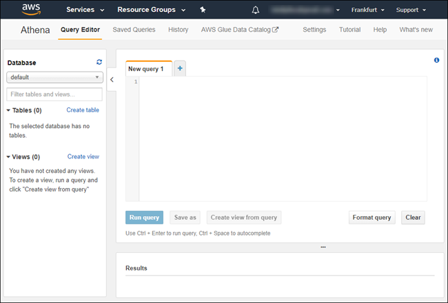

## Details
### You will learn  
  - How to access Amazon Athena Interactive query tool
  - How to create a database and a table in Amazon Athena using data stored in a S3 bucket

***Amazon Athena*** is an interactive query service that makes it easy to analyze data in Amazon S3 using standard SQL. Athena is server less, so there is no infrastructure to manage, and you pay only for the queries that you run.

For more details, you can visit the <a href="https://aws.amazon.com/athena/" target="&#95;blank">Amazon Athena</a> page.

The ***Global Database of Events, Language and Tone*** (GDELT) Project monitors the world's broadcast, print, and web news from nearly every corner of every country in over 100 languages and identifies the people, locations, organizations, counts, themes, sources, emotions, quotes, images and events driving our global society every second of every day.

The data are provided as part of the <a href="https://registry.opendata.aws/gdelt/" target="&#95;blank">Registry of Open Data on AWS</a>.

Make sure to check the <a href="http://www.gdeltproject.org/about.html#termsofuse" target="&#95;blank">term of use</a> before using the data.

In ***Amazon Athena***, you will be loading the event table made of more than ***500 million events*** and in the ***SAP HANA, express edition*** side, you will load lookup tables.

[ACCORDION-BEGIN [Step 1: ](Access Athena Query Editor)]

Access the <a href="https://console.aws.amazon.com/athena" target="&#95;blank">Athena Query Editor</a>.

When accessing Amazon Athena for the first time, you will be proposed to follow a tutorial that will guide you through the creation of a database and table using logs data.

This tutorial will take you a few minutes to finish but is not required to complete this series.



[DONE]
[ACCORDION-END]

[ACCORDION-BEGIN [Step 1: ](Create the database objects)]

First you will need to create a database named **`gdelt`**.

Paste the following SQL statement then click on **Run query**:

```sql
create database gdelt_athena
```

The results should be:

```
Query successful.
```

Now, you can create the event table .

Paste the following SQL statement then click on **Run query**:

```sql
create external table if not exists gdelt_athena.events (
  globaleventid    int,
  day              int,
  monthyear        int,
  year             int,
  fractiondate     float,
  actor1code       string, actor1name string, actor1countrycode string, actor1knowngroupcode string, actor1ethniccode string, actor1religion1code string, actor1religion2code string, actor1type1code string, actor1type2code string, actor1type3code string,
  actor2code       string, actor2name string, actor2countrycode string, actor2knowngroupcode string, actor2ethniccode string, actor2religion1code string, actor2religion2code string, actor2type1code string, actor2type2code string, actor2type3code string,
  isrootevent      boolean,
  eventcode        string,
  eventbasecode    string,
  eventrootcode    string,
  quadclass        int,
  goldsteinscale   float,
  nummentions      int, numsources int, numarticles int,
  avgtone          float,
  actor1geo_type   int,   actor1geo_fullname string, actor1geo_countrycode string, actor1geo_adm1code string, actor1geo_lat float, actor1geo_long float, actor1geo_featureid int,
  actor2geo_type   int,   actor2geo_fullname string, actor2geo_countrycode string, actor2geo_adm1code string, actor2geo_lat float, actor2geo_long float, actor2geo_featureid int,
  actiongeo_type   int,   actiongeo_fullname string, actiongeo_countrycode string, actiongeo_adm1code string, actiongeo_lat float, actiongeo_long float, actiongeo_featureid int,
  dateadded        int,
  sourceurl        string
)
row format serde
	'org.apache.hadoop.hive.serde2.lazy.LazySimpleSerDe'
with serdeproperties (
	'serialization.format' = '	',
	'field.delim'          = '	')
location
	's3://gdelt-open-data/events/'
```

You now check the row count.

Paste the following SQL statement then click on **Run query**:

```sql
select count(distinct year) from gdelt_athena.events
```

[DONE]
[ACCORDION-END]

[ACCORDION-BEGIN [Step 1: ](Check the database objects)]

You now check the created table object.

Paste the following SQL statement then click on **Run query**:

```sql
describe formatted gdelt_athena.events
```

Provide an answer to the question below then click on **Validate**.

[VALIDATE_1]
[ACCORDION-END]
