## Details
### You will learn  
  - How to create a remote source using SAP HANA, Smart Data Access
  - How to create a virtual table using SAP HANA, Smart Data Access
  - Execute queries consuming data from Amazon Athena and from both Amazon Athena and  SAP HANA, express edition

[ACCORDION-BEGIN [Step 1: ](Open SAP Web IDE)]

In order to complete this tutorial, you will be using the SAP Web IDE hosted by your SAP HANA, express edition.

You can however use HDBSQL to run the provided SQL statement instead if you prefer or if you choose to use the ***server core*** flavor instead of the ***server + applications***.

Open the following URL in your browser:

```url
https://hxehost:53075
```

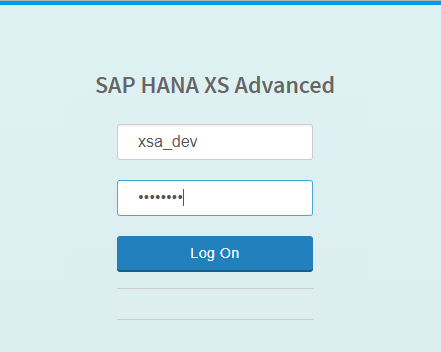

Login using **`XSA_DEV`** as user and the database master password.

[DONE]
[ACCORDION-END]

[ACCORDION-BEGIN [Step 1: ](Add your HXE tenant connection)]

On your first connection to the SAP Web IDE, you will be prompted to add a new connection.

Click on **Yes**.

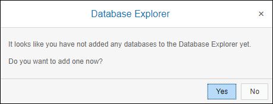

Select **SAP HANA Database (Multitenant)** as ***Database Type***.

Set the following properties:

-----------------|------------------
Host             | localhost
Instance number  | 90
Tenant database  | HXE
User             | `gdelt_hana`
Password         | `Welcome18Welcome18`

Click on **OK**.

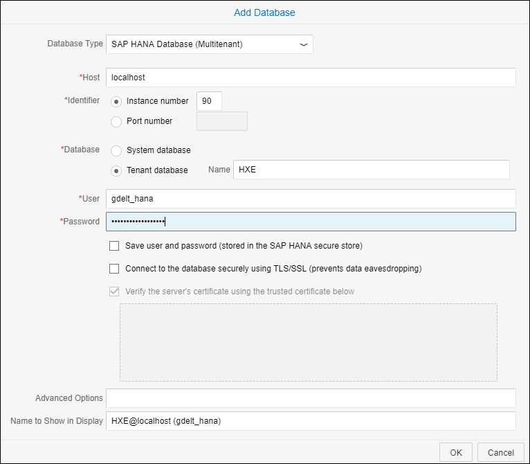

The connection should now be listed in the panel:

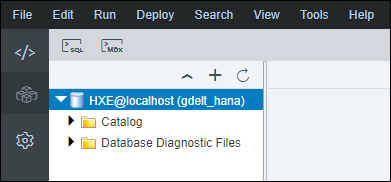

> ### **Note**: If you are not proposed to create a new connection, you can always use the **+** sign.

[DONE]
[ACCORDION-END]

[ACCORDION-BEGIN [Step 1: ](Create a remote source table)]

Creating a remote source can be done either using the Web IDE user interface menu or via SQL.

Let's try with the Web IDE user interface first.

Expand the newly created connection, then expand the **Catalogs** node.

Right click on **Remote Sources**, then select **New Remote Source**.

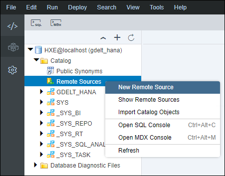

Fill the following properties (the value are case sensitive):

-------------------|------------------
Source Name        | ATHENA
Configuration file | `property_athena.ini`
Data source name   | `AWSAthena`
DML mode           | `readwrite`
Credential mode    | Technical User

Set the **User Name** with the **Access key ID** and the **Password** with the **Secret access key** retrieved previously.

Click on **Create**.

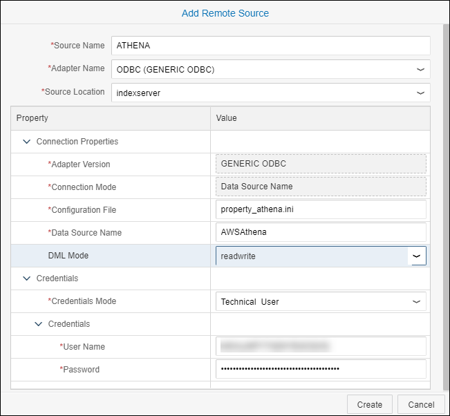

You should have now your remote source listed.

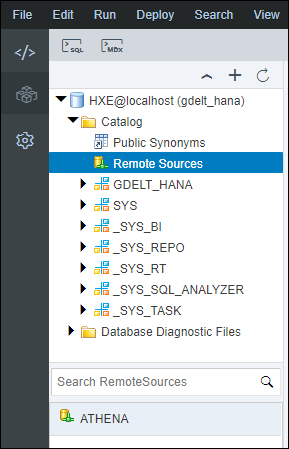

As mentioned before you can create the same remote source using SQL.

To open a new SQL console use the **SQL** icon in the bar above the panel.

Then, you can execute the following SQL statements:

```sql
create remote source athena
	adapter "odbc"
	configuration file 'property_athena.ini'
	configuration 'DSN=AWSAthena'
	with credential type 'PASSWORD' using 'user=<Access key ID>;password=<Secret access key>';
```

Make sure to replace the **Access key ID** and **Secret access key** with the values retrieved previously before running the statement.

[DONE]
[ACCORDION-END]

[ACCORDION-BEGIN [Step 1: ](Create a virtual table)]

Now that a **remote source** is configured, you can create a **virtual table** using SAP HANA Smart Data Access.

Virtual tables can be created via SQL only.

Double click on the newly created remote source **ATHENA**.


This will display the remote source details. Click on **Remote Objects**.

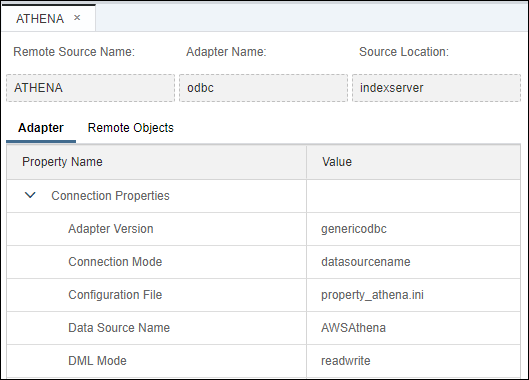

Expand **&lt;NULL&gt;** then **`gdelt_athena`**.

The available tables that can be used as virtual tables will be displayed.

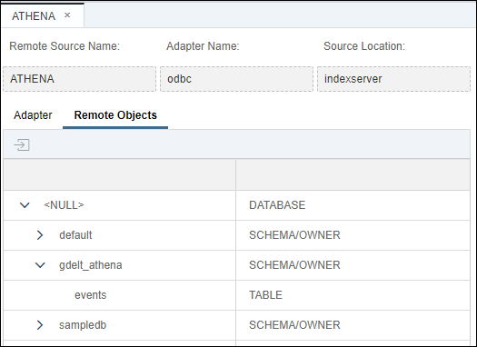

In your case, the name will be: **`"NULL"."gdelt_athena"."events"`**

Open a new SQL console, either press **CTRL + ALT +C** or use the **SQL** icon in the bar above the panel.

Execute the following SQL statements:

```sql
-- create a dedicated schema
create schema gdelt_athena;
-- create the virtual table
create virtual table gdelt_athena.events
	at athena."NULL"."gdelt_athena"."events";
```

> ### **Note**: As Amazon Athena is case-insensitive, and turns table names and column names to lower case, you will need to enclose them in double quotes in your HANA SQL scripts.

You can now expand the **`GDELT_ATHENA`** schema, and select the **Tables** node in the tree.

The **EVENTS** table should be displayed.

Double click on the **EVENTS** table.

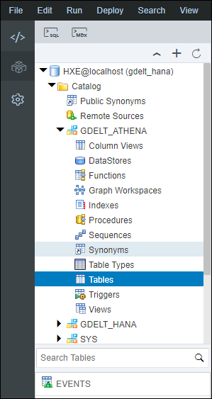

You can now inspect the table definition.

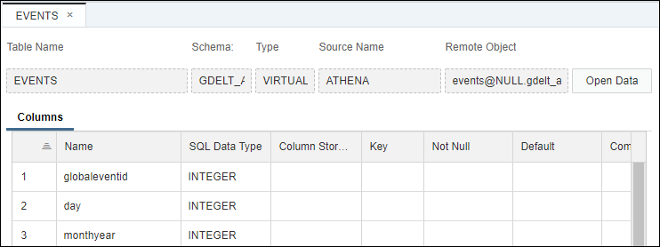

[DONE]
[ACCORDION-END]

[ACCORDION-BEGIN [Step 1: ](Query the virtual table)]

You can now query the Amazon Athena virtual table just any other table.

For example, you can run, in a new SQL console, the following SQL statement:

```sql
select count(1) from gdelt_athena.events where year = 2017;
```

You can get the count of event per year using the following SQL:

```sql
select "year", count(*) as events_count
from   gdelt_athena.events
where "year" is not null 
group by "year"
order by "year";
```

Provide an answer to the question below then click on **Validate**.

[VALIDATE_1]
[ACCORDION-END]

[ACCORDION-BEGIN [Step 1: ](Combine local and virtual table in query)]

Let's now combine a local table data and a virtual table in a query.

You have previously imported in your SAP HANA, express edition the following tables under the **`gdelt_hana`** schema:

- `gdelt_hana.type`
- `gdelt_hana.religion`
- `gdelt_hana.knowngroup`
- `gdelt_hana.goldsteinscale`
- `gdelt_hana.eventcodes`
- `gdelt_hana.ethnic`
- `gdelt_hana.country`

For example, you can run the following SQL statement to get the list of event codes from a local table:

```sql
select * from gdelt_hana.eventcodes;
```

Let's now get the count of events in 2017 which happened in France (using the `actiongeo_countrycode` column) per event codes.

Execute the following SQL:

```sql
select
	e."eventcode"         as "event code",
	ec.description        as "event type name",
	e."year"              as "event year",
	sum(e."events_count") as "events total count"
from (
	select
		e."eventcode",
		e."year",
		e."actiongeo_countrycode",
		count(*) as "events_count"
	from
		 gdelt_athena.events e
	group by
		e."eventcode",
		e."year",
		e."actiongeo_countrycode"
) e
join gdelt_hana.eventcodes ec on e."eventcode" = ec.code
where e."year" = 2017
and   e."actiongeo_countrycode" = 'FR'
group by e."year", e."eventcode", ec.code, ec.description
order by e."year", "events total count" desc;
```

Provide an answer to the question below then click on **Validate**.

[VALIDATE_2]
[ACCORDION-END]

Congratulations! You have just completed your mission: combine the power of SAP HANA, express edition with Amazon Athena!
