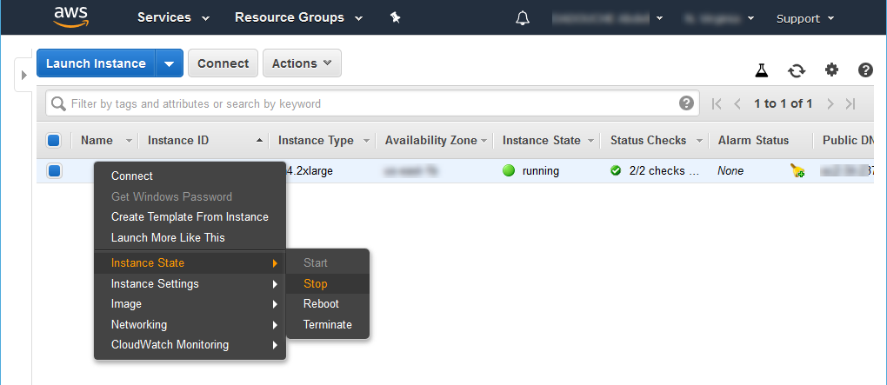
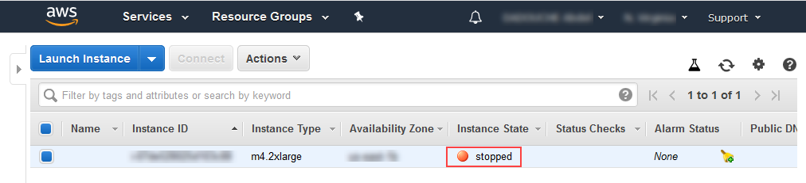
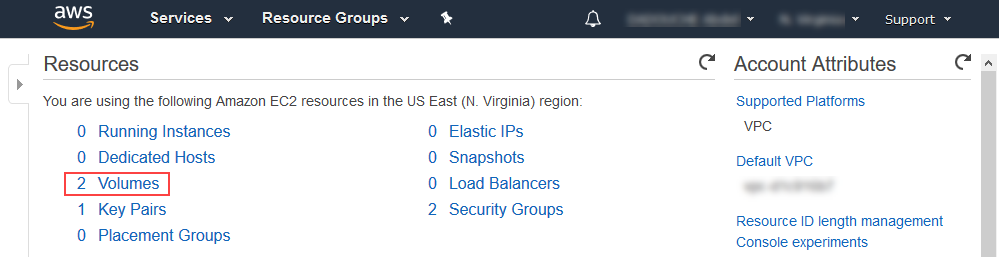
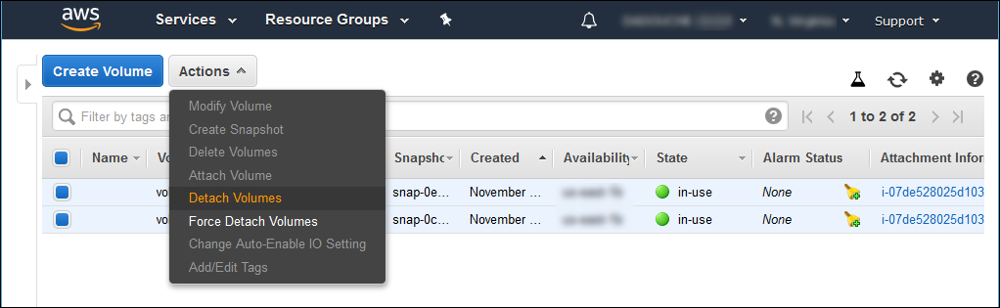
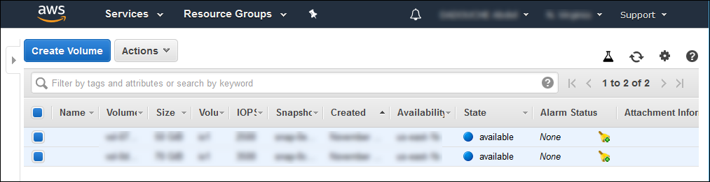
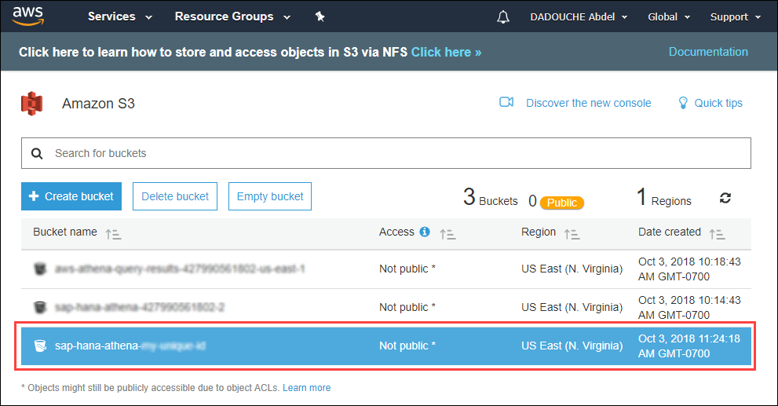

## Details
### You will learn  
  - How to stop or terminate your SAP HANA, express edition
  - How to cleanup your Amazon Athena content

[ACCORDION-BEGIN [Step 1: ](Amazon User)]

When creating your Amazon User in [Set up your AWS environment](https://developers.sap.com/tutorials/hxe-aws-athena-01.html), you had to create a new user in IAM and downloaded the the **Access key ID** and **Secret access key**.


Make sure that you backup this file by for example sending this to yourself via an email.

Then delete the local copy of the file.

[DONE]
[ACCORDION-END]

[ACCORDION-BEGIN [Step 1: ](SAP HANA, express edition Key Pair)]

When creating your SAP HANA, express edition, you had to :

- create a key pair:


 - convert it into a ***`ppk`*** private key file


Make sure that you backup this file by for example sending this to yourself via an email.

Then delete the local copy of the file.

[DONE]
[ACCORDION-END]

[ACCORDION-BEGIN [Step 1: ](SAP HANA, express edition Instance)]

You will get charged if don't stop your SAP HANA, express edition instance as detailed in the [Set up SAP HANA, express edition on Amazon Web Services (XS Advanced)](https://developers.sap.com/tutorials/hxe-xsa-aws-setup.html).

Therefore it is recommended that you **stop** your SAP HANA, express edition instance when you won't need to use it for a while

You can also **terminate** the instance if you don't need it anymore.

To do so, access the **<a href="https://console.aws.amazon.com/ec2" target="&#95;blank">EC2 Dashboard</a>**.

Click on **1 Running Instances**.


Right click on the running instance, then select **Instance State > Stop** (unless you want to destroy it using the **Terminate** option).



After a few seconds the instance will be marked as ***stopped***.



Go back to the **<a href="https://console.aws.amazon.com/ec2" target="&#95;blank">EC2 Dashboard</a>**.

Click on **2 Volumes**.



Select both volumes then use the **Actions > Detach Volumes** button.



After a few seconds, they will both be marked as **available**.



Provide an answer to the question below then click on **Validate**.

[VALIDATE_1]
[ACCORDION-END]

[ACCORDION-BEGIN [Step 1: ](Amazon Athena)]

In order to avoid being charged, you will now drop the Amazon Athena content.

Access the **<a href="https://console.aws.amazon.com/athena" target="&#95;blank">Athena Query Editor</a>**.

Paste the following SQL statement then click on **Run query**:

```sql
drop database gdelt_athena cascade
```

Provide an answer to the question below then click on **Validate**.

[VALIDATE_2]
[ACCORDION-END]

[ACCORDION-BEGIN [Step 1: ](Amazon S3)]

Now let's clean the S3 buckets.

Access the **<a href="https://s3.console.aws.amazon.com/s3/home" target="&#95;blank">S3 Management Console</a>**.

Select the ***`sap-hana-athena-<my unique id>`*** bucket created earlier.

Click on **Delete Bucket**.



You will be prompted to type (or paste) the bucket name to confirm your action then click on **Confirm**.


You can repeat the operation for all buckets where the name include **`athena`**.

[DONE]
[ACCORDION-END]

Congratulations! You have just completed your mission: combine the power of SAP HANA, express edition with Amazon Athena!
