## Details
### You will learn  
  - Create a Policy, a Role and a User in AWS Identity and Access Management (IAM)

Before getting started, you will setup a user with the proper policies to be used for the rest of the tutorial series.

If you have a ***root*** access to your AWS account, it is still a good practice not to run this type of activities using the root user.

<div align="center">
<b><span style="color:red;align:middle">Warning: Please read carefully before starting!</span></b>
</div>

**Before, you get started, please be aware that using SAP HANA, express AMI on AWS is not covered by the AWS Free tier, and therefore charges for both the EC2 instance and the provisioned EBS volumes used by this instance will incur.**

**In addition, the use of SageMaker, Elastic Container Registry and Elastic Container Service may incur charges not covered by the AWS Free tier.**

**Please be aware that completing this tutorial track will incur a charge estimated between 10 and 20 USD on your AWS account.**

**Make sure to complete the [Cleanup before you leave](hxe-aws-eml-08) tutorial if you are not planning to complete the track.**

[ACCORDION-BEGIN [Step 1: ](Sign in or Create an Account on AWS)]

Sign in or create an account on <a href="https://aws.amazon.com" target="&#95;blank">Amazon Web Services</a>.

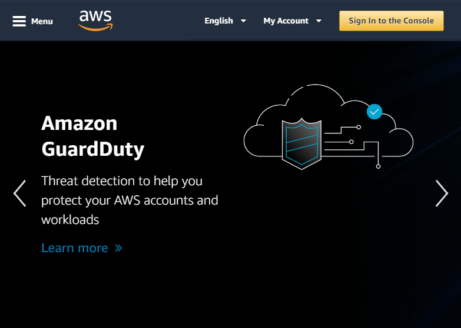

[DONE]
[ACCORDION-END]

[ACCORDION-BEGIN [Step 1: ](Access the IAM Management Console)]

Access the <a href="https://console.aws.amazon.com/iam" target="&#95;blank">IAM Management Console</a> (you also use the search for **IAM** in the Amazon Web Services Management Console).

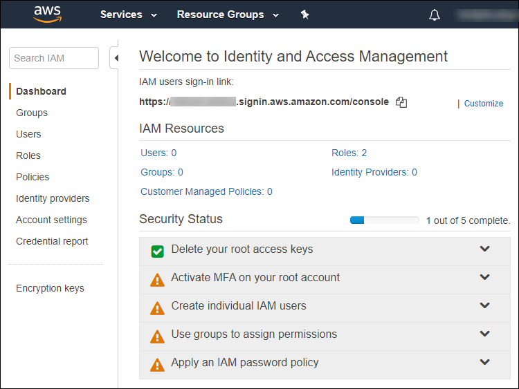

[DONE]
[ACCORDION-END]

[ACCORDION-BEGIN [Step 1: ](Create a Policy in IAM)]

In order to complete this series, you will need to configure a Policy in AWS IAM that will enable any user attached with this policy to execute the required action which includes using the following services:

 - Amazon SageMaker
 - Amazon S3
 - Amazon Elastic Container Registry
 - Amazon Elastic Container Services

This policy will also be required when using SageMaker notebooks.

In order to ease the creation of this new Policy, a series of "Full Access" policies will be reused instead of selecting the minimum viable Policies.

On the left side, click on **Policies**, then click on **Create Policy**.

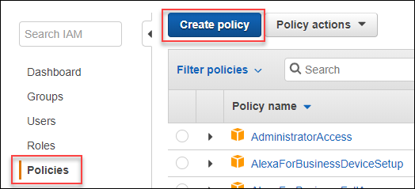

Switch to the JSON editor.

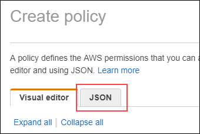

Replace the existing content with the following:

```JSON
{
    "Version": "2012-10-17",
    "Statement": [
        {
            "Action": [
                "ec2:DescribeAvailabilityZones",
                "ec2:CreateSecurityGroup",
                "ec2:DeleteSecurityGroup",
                "ec2:AuthorizeSecurityGroupIngress",
                "ecs:*",
                "ecr:*",
                "iam:CreateRole",
                "iam:AttachRolePolicy",
                "iam:CreateServiceLinkedRole",
                "iam:PassRole"
            ],
            "Effect": "Allow",
            "Resource": "*"
        },
        {
            "Action": [
                "s3:ListBucket"
            ],
            "Effect": "Allow",
            "Resource": [
                "arn:aws:s3:::SageMaker"
            ]
        },
        {
            "Action": [
                "s3:GetObject",
                "s3:PutObject",
                "s3:DeleteObject"
            ],
            "Effect": "Allow",
            "Resource": [
                "arn:aws:s3:::SageMaker/*"
            ]
        }
    ]
}
```

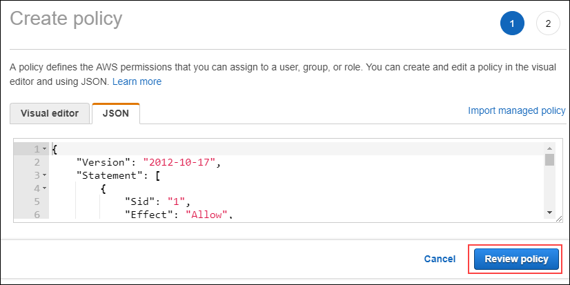

Enter  **`sap-hxe-eml-policy`** as a **Name**.

Click on **Create Policy**.

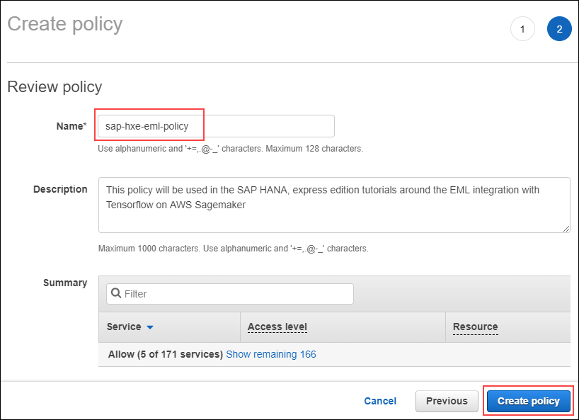

Once created click on the newly created policy name.

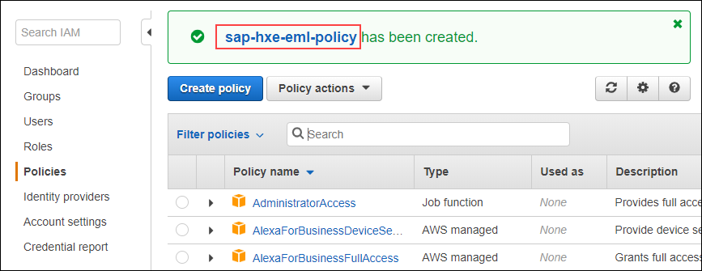

This will open the policy definition.

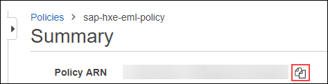

Provide an answer to the question below then click on **Validate**.

**Note:** You can use the highlighted icon to copy the object ARN.

[VALIDATE_1]
[ACCORDION-END]

[ACCORDION-BEGIN [Step 1: ](Create a Role in IAM)]

Now that the Policy is created, you can create a Role that will be used by Amazon SageMaker service. This role will first allow "Full Access" to SageMaker, then you will attach the created Policy to enable the use of S3 bucket, ECR, ECS...

On the left side, click on **Roles**, then click on **Create Role**.

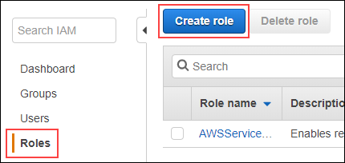

Keep the **AWS service** trusted entity type selected.

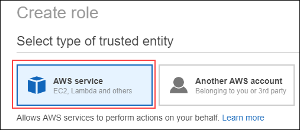

Select **SageMaker** from the list of services as your ***Selected Use Case***.


Click on **Next: Permissions**.

Click on **Next: Tags**.

Click on **Next: Review**.

Enter **`sap-hxe-eml-sagemaker-role`** as **Role name**.

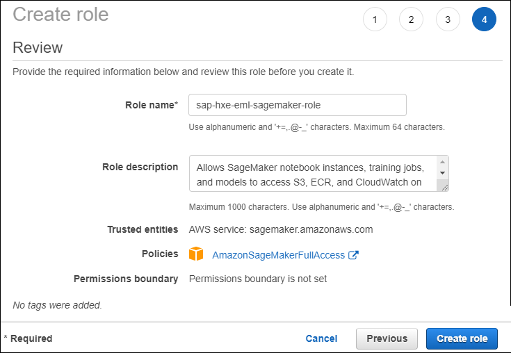

Click on **Create role**.

Once created click on the newly created policy name.

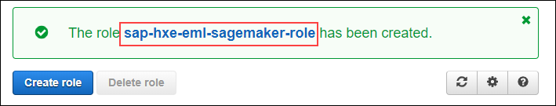

This will open the role definition.

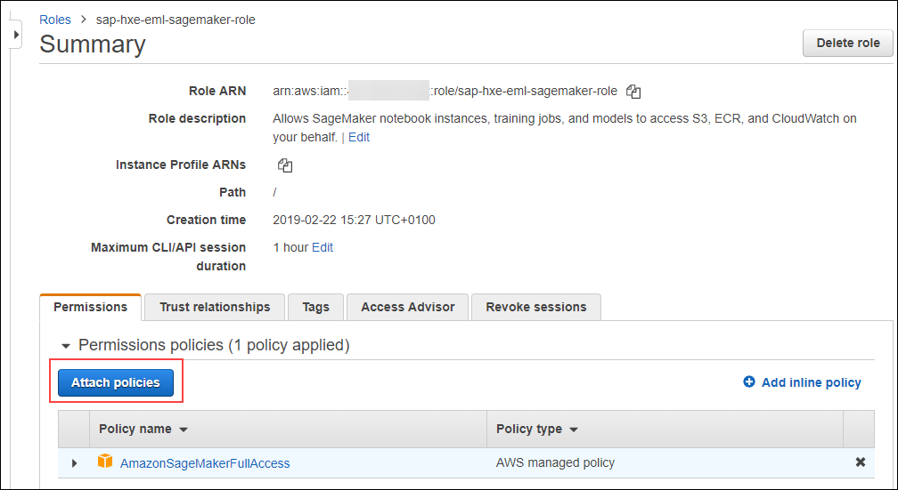

Click on **Attach Policies**.

Use the filter field to enter the Policy name : **`sap-hxe-eml-policy`**

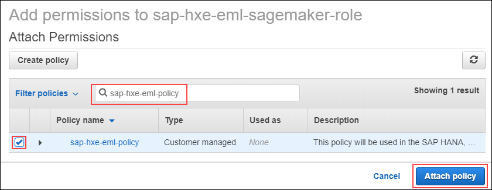

Select the item.

Click on **Attach Policy**.

**Now we need to create an additional role apart from the SageMaker role**

The role name is: `ecsTaskExecutionRole`

And we will be attaching Policies:

 `AmazonECS_FullAccess` | `AmazonEC2ContainerRegistryPowerUser`

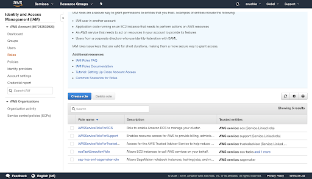
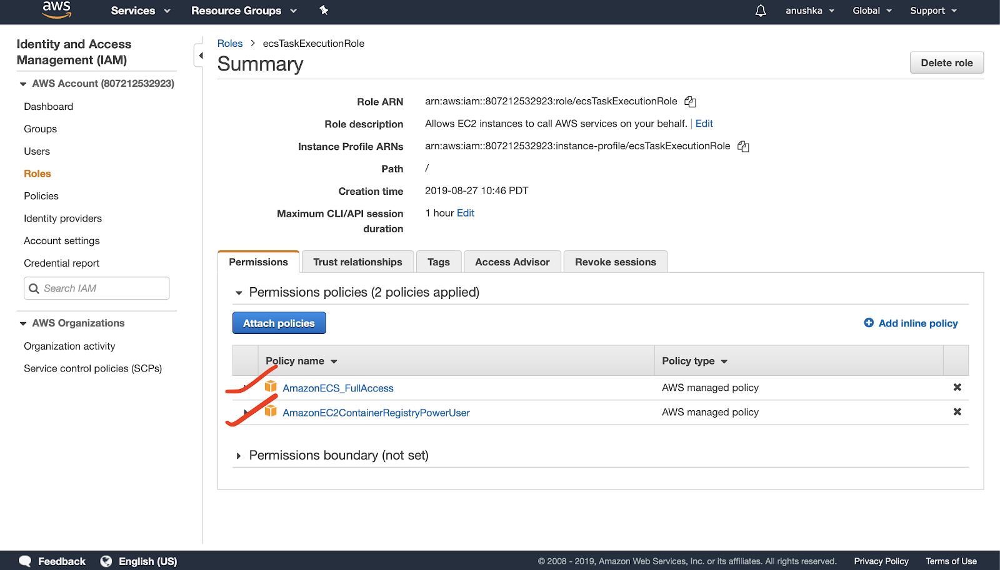

Edit Trust Relationship to add: ec2.amazonaws.com |  ecs-tasks.amazonaws.com

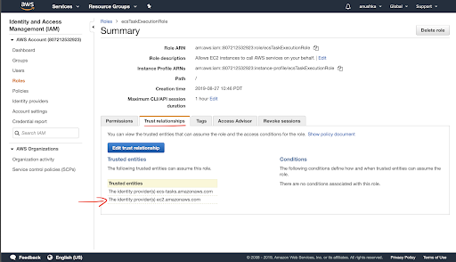

Here is the new policy document:
```JSON
{
  "Version": "2012-10-17",
  "Statement": [
    {
      "Effect": "Allow",
      "Principal": {
        "Service": [
          "ec2.amazonaws.com",
          "ecs-tasks.amazonaws.com"
        ]
      },
      "Action": "sts:AssumeRole"
    }
  ]
}

```


>

Provide an answer to the question below then click on **Validate**.

**Note:** You can use the highlighted icon to copy the object ARN.

[VALIDATE_2]
[ACCORDION-END]

[ACCORDION-BEGIN [Step 1: ](Create a User in IAM)]

Now, you can create a separate use with its own credentials to operate services and execute task..

On the left side, click on **Users**, then click on **Add User**.

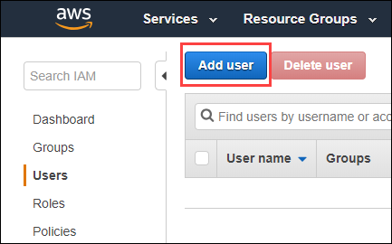

Enter **`sap-hxe-eml`** as a **User Name**.

Set the **Access type** to **Programmatic access**.

Click on **Next: Permissions**.

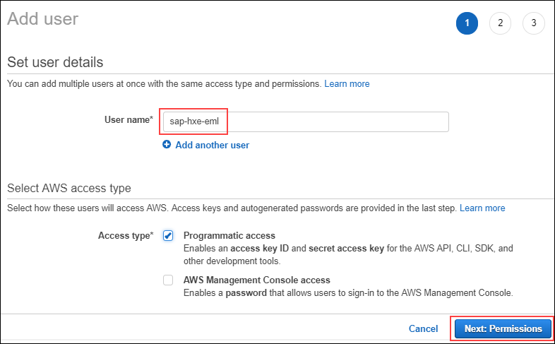

Select **Attach existing policies directly**.

Use the filter field to enter the Policy name : **`sap-hxe-eml-policy`**

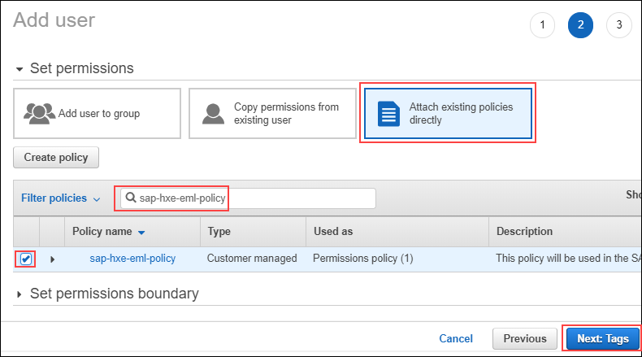

Select the item.

Click on **Next: Tags**.

Click on **Next: Review**.

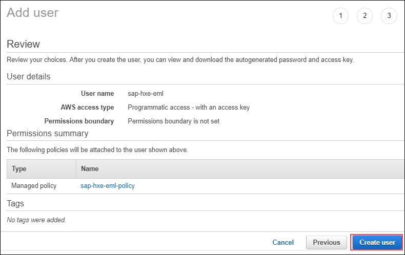

Review the user creation details then click on **Create User**.

The next screen will summarize the creation process.


Click on **Download .`csv`** to download the **Access key ID** and **Secret access key**.

Open the downloaded **.`csv`** file in a text editor or Excel. The content should like the following:

```
User name,Password,Access key ID,Secret access key,Console login link
sap-hxe-eml,,<access key id>,<secret access key>,https://xxxxxxxxxxxx.signin.aws.amazon.com/console
```
> ### **Note:** the **Access key ID** and **Secret access key** will be used as credentials in multiple place throughout this tutorial series.

Go back to the IAM Console page in your browser.

Click on **Close**.

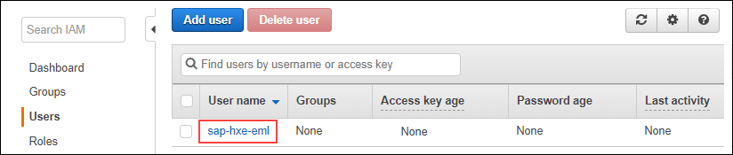

Click on the newly created user.


Provide an answer to the question below then click on **Validate**.

**Note:** You can use the highlighted icon to copy the object ARN.

[VALIDATE_3]
[ACCORDION-END]
