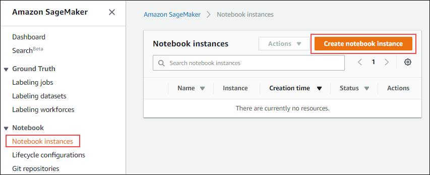
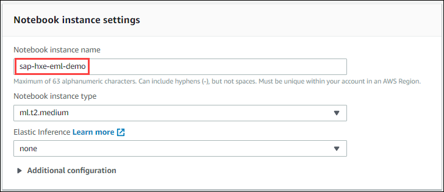
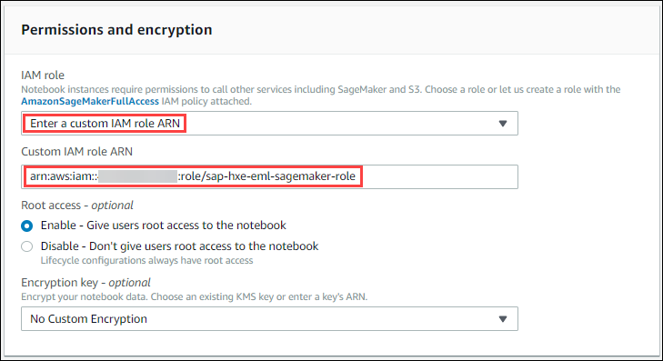
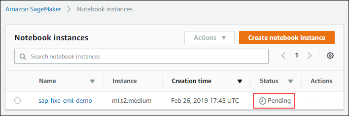
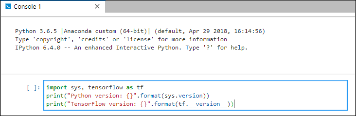
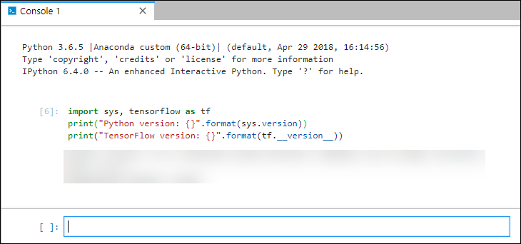
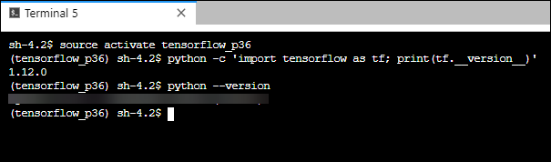

## Details
### You will learn  
  - Access Amazon SageMaker Management Console
  - Create a SageMaker Notebook instance

During this tutorial series, you will be using a SageMaker Notebook as your primary tool to not only leverage the SageMaker platform to train your TensorFlow model.

Notebooks are powerful tools that can be used for multiple purposes.

For example in the current scenario, you will use Notebooks to analyze your dataset using Python code, but also to interact with S3 buckets, trigger a SageMaker training job or deploy your trained model as part of a using a TensorFlow Serving Docker image.

To find out more about Amazon SageMaker, please check the following URL: <https://aws.amazon.com/sagemaker/>

[ACCORDION-BEGIN [Step 1: ](Access the SageMaker Console)]

Access the <a href="https://console.aws.amazon.com/sagemaker" target="&#95;blank">Amazon SageMaker Console</a> (you also use the search for **SageMaker** in the Amazon Web Services Management Console).


[DONE]
[ACCORDION-END]

[ACCORDION-BEGIN [Step 1: ](Create a Notebook instance)]

First, you will need to create a SageMaker Notebook instance.

On the left side, select **Notebook instances**, then click on **Create notebook instance**.



Enter the following **Notebook instance settings** details:

 - Notebook instance name: **`sap-hxe-eml-demo`**



Enter the following **Permissions and encryption** details:

 - IAM role: **Enter a custom IAM role ARN**
 - Custom IAM role ARN: enter the ARN for the **`sap-hxe-eml-sagemaker-role`** role create previously



Scroll down, then click on **Create notebook instance**.

The process will take up to a few minutes to complete.



Once **In Service**, click on **Open `JupyterLab`**.


Provide an answer to the question below then click on **Validate**.

[VALIDATE_1]
[ACCORDION-END]

[ACCORDION-BEGIN [Step 1: ](Check the Python and TensorFlow in a Console)]

Now that you have accessed your `JupyterLab` notebook, let's check the Python and TensorFlow version in a `IPython` console.


On the menu bar, select **File > New > Console**.


Select **`conda_tensorflow_p36`** as Kernel then click on **Select**.


This will open an interaction Python environment.

Once open, paste the following code in the input field:

```Python
import sys, tensorflow as tf
print("Python version: {}".format(sys.version))
print("TensorFlow version: {}".format(tf.__version__))
```



Then press **SHIFT** + **ENTER** to execute the command.



Provide an answer to the question below then click on **Validate**.

[VALIDATE_2]
[ACCORDION-END]

[ACCORDION-BEGIN [Step 1: ](Check the Python and TensorFlow in a Terminal)]

Let's now do the same in a Terminal console.

On the menu bar, select **File > New > Terminal**.


This will open a terminal console with bash.

Once open, paste the following series of commands:

```shell
source activate tensorflow_p36
python -c 'import tensorflow as tf; print(tf.__version__)'
python --version
```

> ### **Note:** To paste the content of your current clipboard, press **SHIFT** + **INSERT** instead of CTRL + V and use **CTRL** + **INSERT** instead of CTRL + C.



[VALIDATE_3]
[ACCORDION-END]
