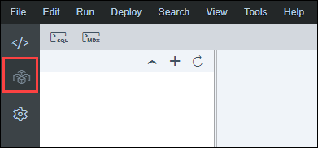
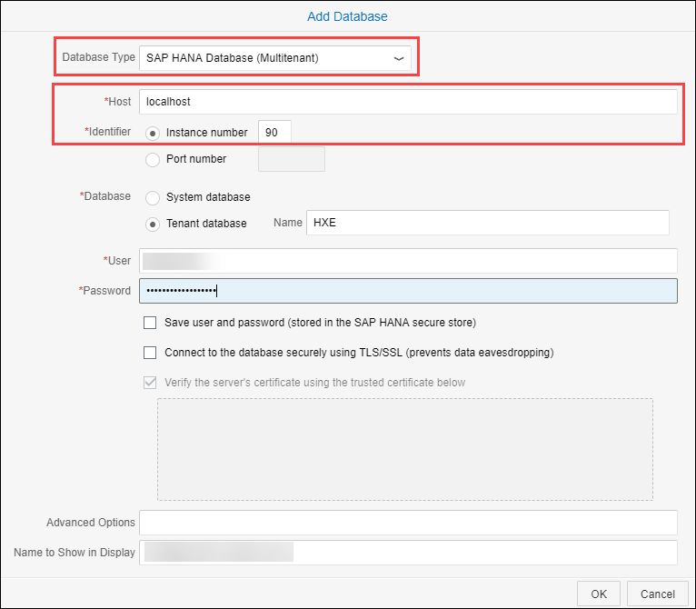
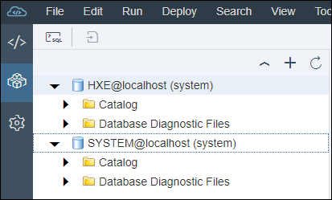
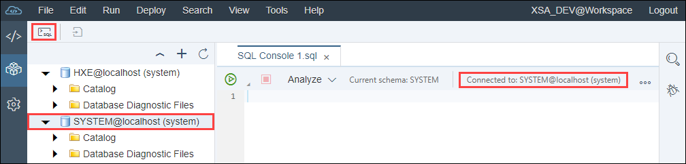

## Details
### You will learn  
  - Check your tenant database
  - Enable the Script Server
  - Check installed AFL libraries

Once downloaded and installed, you will be able to connect to your SAP HANA, express edition and start running commands to create tables, or simply run select statements directly from your SageMaker Notebook instance.

Additionally, you could also leverage your SAP HANA instance when running SageMaker training jobs, but this would require to build and deploy a new container image for SageMaker. Therefore, this tutorial won't address this scenario.

Be aware that SageMaker Notebooks are ephemeral, therefore any package installed will be lost after the notebook instance is restarted.
To avoid that you can create a lifecycle configuration that runs each time you start your notebook instance.
But in this series, you simply install the Python packages whenever needed in your notebooks.

[ACCORDION-BEGIN [Step 1: ](Open SAP Web IDE)]

During this tutorial series, you will be connecting to your instance System Database and your HXE tenant using either the SYSTEM user (the database master password provided during the initialization process) or other users.

To do so, you will be using the SAP Web IDE or the HRTT service hosted by your SAP HANA, express edition to execute your SQL statements.

You can however use HDBSQL to run the provided SQL statement instead if you prefer or if you choose to have the ***server core*** flavor instead of the ***server + applications***.

Here is how to add a new connection in SAP Web IDE.

Open the following URL in your browser:

```url
https://hxehost:53075
```

Login using **`XSA_DEV`** as user "SYSTEM" and the ***database master password*** as provided during the initialization process.

Switch to the **Database Explorer**.



On your first use to the SAP Web IDE, you will be prompted to add a new connection.

> ### **Note**: If you are not proposed to create a new connection, you can always use the **+** sign.

Click on **Yes**.


Select **SAP HANA Database (Multitenant)** as ***Database Type***.

As the SAP Web IDE is setup on the same host your SAP HANA, express edition, you can use **localhost** as **Host**.

The default instance number is **90**.

Then, you can select if you want to connect to the **System Database** or the **HXE** tenant.

Then, you can enter your credentials and optionally store them in the SAP HANA secure store for later reuse.



You can now create a connection:

 - to the **System Database** using the **SYSTEM** user credentials
 - to the **HXE** tenant using the **SYSTEM** user credentials



To execute a SQL statement against one of the connection, select the target connection, then click on the SQL icon. A new console window will appear with the connection details.



[DONE]
[ACCORDION-END]

[ACCORDION-BEGIN [Step 1: ](Check your tenant database)]

In earlier release of SAP HANA, express edition, the HXE tenant didn't exist or was not started by default.

Using the **System Database** connection with the **SYSTEM** user credentials, execute the following SQL statement:

```sql
SELECT DATABASE_NAME, DESCRIPTION, ACTIVE_STATUS, RESTART_MODE FROM SYS.M_DATABASES ORDER BY 1;
```

The result should return:

|---------------------|-----------------------|---------------------|--------------------|
| **`DATABASE_NAME`** | **`DESCRIPTION`**     | **`ACTIVE_STATUS`** | **`RESTART_MODE`** |
| `HXE`               | `HXE-90`              | `YES`               | `DEFAULT`          |
| `SYSTEMDB`          | `SystemDB-HXE-90`     | `YES`               | `DEFAULT`          |

If the **HXE** tenant is not listed, you can run the following statement to create it:

```sql
CREATE DATABASE HXE SYSTEM USER PASSWORD <password>;
```

If the **HXE** tenant is listed, but with the **`ACTIVE_STATUS`** set to **NO**, then you can run the following statement to start it:

```sql
ALTER SYSTEM START DATABASE HXE;
```

[DONE]
[ACCORDION-END]

[ACCORDION-BEGIN [Step 1: ](Enable the Script Server)]

The **Script Server** is an auxiliary service that is required to execute **Application Function Libraries** (**AFL**).

For example, this applies to the SAP HANA AFL component like the ***SAP HANA Predictive Analysis Library*** (PAL) and other similar libraries.

By default, the Script Server is not activated on the **HXE** tenant.

Using the **System Database** connection with the **SYSTEM** user credentials, execute the following SQL statement:

```sql
ALTER DATABASE HXE ADD 'scriptserver';
```

Now, you can now verify that the service is started;

Using the **HXE** connection with the **SYSTEM** user credentials, execute the following SQL statement:

```sql
SELECT SERVICE_NAME, PORT, ACTIVE_STATUS FROM SYS.M_SERVICES ORDER BY 1;
```

The result should return a list of service names, their associated port numbers and their statuses:

Provide an answer to the question below then click on **Validate**.

[VALIDATE_1]
[ACCORDION-END]

[ACCORDION-BEGIN [Step 4: ](Create a dedicated user)]

In order to perform your Machine Learning activities, it is recommended to create a dedicated user account on your SAP HANA, express edition instance.

Using the **HXE** connection with the **SYSTEM** user credentials, execute the following SQL statement:

```sql
-- Uncomment this if you want to start from scratch
-- DROP USER ML_USER CASCADE;

CREATE USER ML_USER PASSWORD Welcome19Welcome19;

-- Use this if you don't want to be forced to update your password on the first connection.
-- CREATE USER ML_USER PASSWORD Welcome19Welcome19 NO FORCE_FIRST_PASSWORD_CHANGE;
-- or
ALTER USER ML_USER DISABLE PASSWORD LIFETIME;

GRANT AFLPM_CREATOR_ERASER_EXECUTE TO ML_USER;
GRANT AFL__SYS_AFL_AFLPAL_EXECUTE TO ML_USER;
GRANT AFL__SYS_AFL_EML_EXECUTE TO ML_USER;

GRANT DATA ADMIN TO ML_USER;
GRANT IMPORT TO ML_USER;

GRANT EXECUTE on _SYS_REPO.GRANT_ACTIVATED_ROLE TO ML_USER;
GRANT SELECT, UPDATE, DELETE, INSERT ON  _SYS_AFL.EML_MODEL_CONFIGURATION TO ML_USER;
```

Create a new connection for the **HXE** tenant using the **`ML_USER`** as described in the first step (the password is ***`Welcome19Welcome19`*** )

[DONE]
[ACCORDION-END]

[ACCORDION-BEGIN [Step 1: ](Check the installed AFL libraries)]

SAP HANA, express edition is setup by default with a series of AFL pre-installed.

Using the **HXE** connection with the **`ML_USER`** user credentials, execute the following SQL statement:

```sql
SELECT * FROM SYS.AFL_PACKAGES;
```

The pre-installed AFL includes:

 - ***Business Function Library (BFL)***
 - ***Automated Predictive Library (APL)***
 - ***Predictive Analysis Library (PAL)***
 - ***External Machine Learning Library (EML)***
 - ***Optimization Function Library (OFL)***

In this scenario, you will be leveraging the **External Machine Learning Library (EML)**. So, if not present you can follow the [Install the SAP HANA External Machine Learning Library Package for SAP HANA, express edition](hxe-ua-eml-binary).

Provide an answer to the question below then click on **Validate**.

[VALIDATE_2]
[ACCORDION-END]
