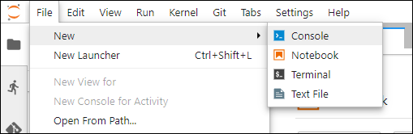
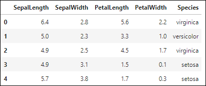
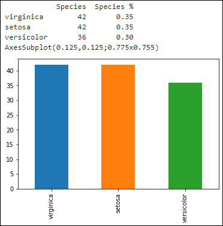
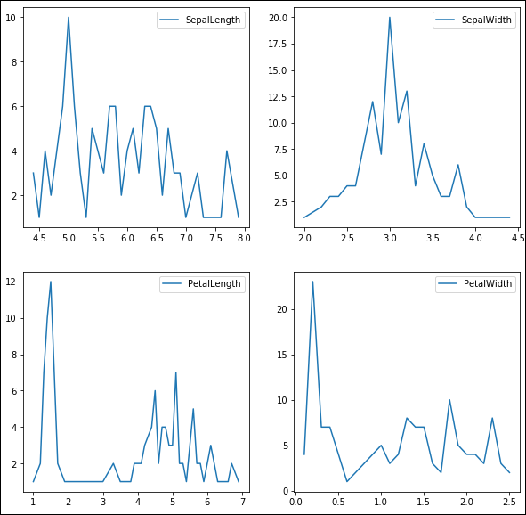
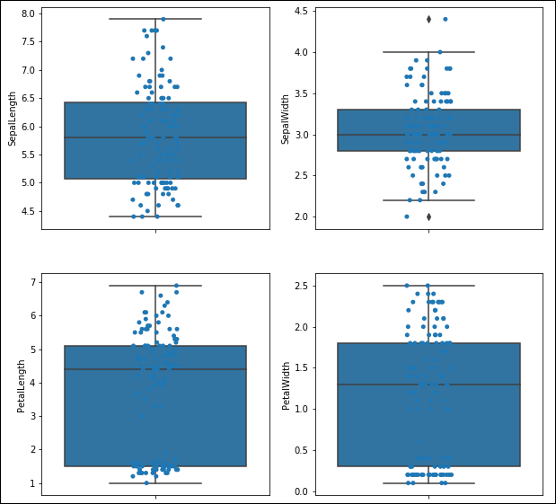

## Details
### You will learn  
  - Create a Notebook document
  - Retrieve the Iris dataset using the SAP HANA Data Frame for Python
  - Use `Pandas`, `Matplotlib` & `Seaborn` to analyze the Iris dataset

Just like with any new machine learning problem, you should always start with some analysis of the data made available to you.

To run your data analysis, you will be using Pandas, an open source, BSD-licensed library providing high-performance, easy-to-use data structures and data analysis tools for the Python programming language.

In addition to Pandas, you will also use `Matplotlib` and `Seaborn` for charting.

For more details about these libraries, Please refer to the following URL:

 - `Pandas`: <https://pandas.pydata.org/>
 - `Matplotlib`: <https://matplotlib.org/>
 - `Seaborn`: <https://seaborn.pydata.org/>

[ACCORDION-BEGIN [Step 1: ](Access the SageMaker Notebook instance)]

If you have your Jupyter Notebook instance already open in your browser, then you can move to the next step.

Else, access the <a href="https://console.aws.amazon.com/sagemaker" target="&#95;blank">Amazon SageMaker Console</a> (you also use the search for **SageMaker** in the Amazon Web Services Management Console).


Click on **Open `JupyterLab`**.

[DONE]
[ACCORDION-END]

[ACCORDION-BEGIN [Step 1: ](Create a Notebook document)]

Once open, you should have access to your Notebook instance.


On the menu bar, select **File > New > Notebook**.



Select **`conda_tensorflow_p36`** as Kernel then click on **Select**.


Rename your notebook document **`hxe-aws-eml-iris-01.ipynb`** using the menu bar with **File > Rename Notebook...**.


[DONE]
[ACCORDION-END]

[ACCORDION-BEGIN [Step 1: ](Install Python packages)]

In the first cell, paste the following code then press **SHIFT** + **ENTER** to execute the code:

```Python
!pip install -q /home/ec2-user/SageMaker/sap/hdbclient/hdbcli-*.tar.gz
!pip install -q /home/ec2-user/SageMaker/sap/hdbclient/hana_ml-*.tar.gz
```

[DONE]
[ACCORDION-END]

[ACCORDION-BEGIN [Step 1: ](Install and Import Python libraries)]

It is a command practice to group all import and generic configuration statements in the first notebook cell.

So, since you will be leveraging Pandas to run your analysis, you will need to import it.

In the next cell, paste the following code then press **SHIFT** + **ENTER** to execute the code:

```Python
!pip install -q /home/ec2-user/SageMaker/sap/hdbclient/hdbcli-*.tar.gz
!pip install -q /home/ec2-user/SageMaker/sap/hdbclient/hana_ml-*.tar.gz

import os
import pandas as pd
import seaborn as sns
import numpy as np

from hana_ml import dataframe

from matplotlib import pyplot as plt
%matplotlib inline
```

Using the ***`hana_ml`*** package assumes that you have completed the [Install the SAP HANA Python library in SageMaker Notebook](hxe-aws-eml-03).

[DONE]
[ACCORDION-END]

[ACCORDION-BEGIN [Step 1: ](Load the data using Pandas)]

Now that the Python package are imported, you can start using the Pandas library to load your dataset file in a `DataFrame`.

In the next cell, paste the following code then press **SHIFT** + **ENTER** to execute the code **after adjusting the connection details (row 6)**:

```Python
col_features = ['SEPALLENGTH', 'SEPALWIDTH', 'PETALLENGTH', 'PETALWIDTH']
col_label = 'SPECIES'
col_label_class = ['setosa', 'versicolor', 'virginica']

# Instantiate the Connection Object (conn)
host = "<HXE host public ip address>"
port = 39015
user = "ML_USER"
pswd = "Welcome19Welcome19"
conn = dataframe.ConnectionContext(host, port, user, pswd)

# Create the HANA Dataframe (df_train) and point to the training table.
training_data = conn.table("IRIS_TRAINING").collect()
training_data.head(5)

training_data.SPECIES.replace(sorted(training_data.SPECIES.unique()), col_label_class, inplace=True)

print(type(training_data))
```

The above code will first load the data in a Pandas `DataFrame`, then replace the label column numeric values into their respective string values, and finally print the class type returned by Pandas after loading the data.

For more details about Pandas Data Frame API, you can refer to: <https://pandas.pydata.org/pandas-docs/stable/reference/api/pandas.DataFrame.html>

Provide an answer to the question below then click on **Validate**.

[VALIDATE_1]
[ACCORDION-END]

[ACCORDION-BEGIN [Step 1: ](Access the dataset using the Pandas DataFrame)]

Now that the dataset file is loaded in a `DataFrame`, you can access it using the provided APIs.

For more details about Pandas Data Frame API, you can refer to: <https://pandas.pydata.org/pandas-docs/stable/reference/api/pandas.DataFrame.html>

Let's start by checking the `DataFrame` first five rows using the ***`head`*** function.

In the next cell, paste the following code then press **SHIFT** + **ENTER** to execute the code:

```Python
training_data.head(5)
```

This will return the following output:



Similarly, you can also get the last five  rows using the ***`tail`*** function.

In the next cell, paste the following code then press **SHIFT** + **ENTER** to execute the code:

```Python
training_data.tail(5)
```

Let's now check some the `DataFrame` attributes like ***`dtypes`*** which will output the column types.

In the next cell, paste the following code then press **SHIFT** + **ENTER** to execute the code:

```Python
print(training_data.dtypes)
```

This will return the following output:

```
SEPALLENGTH    float64
SEPALWIDTH     float64
PETALLENGTH    float64
PETALWIDTH     float64
SPECIES         object
dtype: object
```

So, the `DataFrame` is made of 5 columns, where 4 are Pandas `float64` (Python float) and the last is a Pandas `object` (Python string).

Now, let's check the `DataFrame` ***`shape`*** attribute which provides the dimensionality of the `DataFrame`.

In the next cell, paste the following code then press **SHIFT** + **ENTER** to execute the code:

```Python
print(training_data.shape)
```

This will return the following output which means that it contains 120 rows and 5 columns:

```
(120, 5)
```

And finally, you can also some standard Python function like ***`len`*** to return the shape first dimension (number of rows).

In the next cell, paste the following code then press **SHIFT** + **ENTER** to execute the code:

```Python
print(len(training_data))
```

Provide an answer to the question below then click on **Validate**.

[VALIDATE_2]
[ACCORDION-END]

[ACCORDION-BEGIN [Step 1: ](Check the dataset target)]

In the Iris dataset, the target column is the ***Species*** column. Based on many documentation available online, you know that there 3 possible values (***setosa***, ***versicolor*** & ***virginica***). But is that really true? Let's check it.

In the next cell, paste the following code then press **SHIFT** + **ENTER** to execute the code:

```Python
value_counts = training_data[col_label].value_counts()
value_counts_n = training_data[col_label].value_counts(normalize=True)
value_counts_n.rename('SPECIES %', inplace=True)

summary = pd.concat([value_counts, value_counts_n],axis=1)

print(summary)
print(training_data[col_label].value_counts().plot('bar'))
```

This will return the count for each distinct value on the target column (just like you would do a GROUP BY/COUNT in SQL).

In addition, you will get the normalized (percentage) for each target category.

And finally, it will display the output in a table and a chart like below



Provide an answer to the question below then click on **Validate**.

[VALIDATE_3]
[ACCORDION-END]

[ACCORDION-BEGIN [Step 1: ](Check the dataset features distribution, statistics & outliers)]

In the Iris dataset, the feature columns are ***`SepalLength`***, ***`SepalWidth`***, ***`PetalLength`***  & ***`PetalWidth`***.

Let's check what these values looks like using some standard statistical functions and some charts!

First, let's use a visual way by counting the each values occurrences across each feature.

In the next cell, paste the following code then press **SHIFT** + **ENTER** to execute the code:

```Python
features_data = training_data.loc[:, col_features]
fig, axes = plt.subplots(figsize=(10,10),
    nrows=2,
    ncols=2,
)

for i, ax in enumerate(axes.flat):
    features_data[col_features[i]].value_counts().sort_index().plot(kind='line', legend=True, ax=ax)
plt.show()
```

As you can notice only the ***`SepalWidth`*** has a count distribution that looks Gaussian.



In the next cell, paste the following code then press **SHIFT** + **ENTER** to execute the code:

```Python
features_data = training_data.loc[:, col_features]

df = pd.concat([
    features_data.mean(),
    features_data.median(),
    features_data.std(),
    features_data.min(),
    features_data.max(),
    features_data.min() + (features_data.max() - features_data.min()) / 2,
], axis=1)
df.columns = ['mean','med','std','min','max','mid']
print(df)
```

This will return the mean, median, standard deviation, min and max values for each feature columns.

```
                 mean  med       std  min  max   mid
SEPALLENGTH  5.845000  5.8  0.868578  4.4  7.9  6.15
SEPALWIDTH   3.065000  3.0  0.427156  2.0  4.4  3.20
PETALLENGTH  3.739167  4.4  1.822100  1.0  6.9  3.95
PETALWIDTH   1.196667  1.3  0.782039  0.1  2.5  1.30
```

Based on the above result, you can get some indication about the distribution of the values:

 - apart for the `PETALLENGTH` feature, all the attributes have a relatively close mean and median value
 - all mean and median values are below the midpoint between the min and max

Let's now check for potential outliers, and to do this you may use 2 commonly used methods: the standard deviation or interquartile range.

For both methods, you will count values that falls outside the range of acceptable values for each methods.

In the standard deviation, you will look for values that are above or below 3 times the standard deviation from the mean value. And for the interquartile range, you will look for values that are within the first and last 25% value range.

However, with the inter quartile range, it's expected that your dataset values follows a gaussian distribution which is not really the case.

In the next cell, paste the following code then press **SHIFT** + **ENTER** to execute the code:

```Python
features_data = training_data.loc[:, col_features]
df = pd.concat([
    features_data[~( (features_data-features_data.median()).abs() > 3*features_data.std() )].isnull().sum(),
    features_data[~( (features_data < features_data.quantile(.25)) | (features_data > features_data.quantile(.75)) )].isnull().sum(),
], axis=1)
df.columns = ['3*std','25/75 quartile']
print(df)
```

As you can notice with the interquartile range, you would consider almost half of the dataset entries to be outliers.

You can also use a box plot to visualize these.

In the next cell, paste the following code then press **SHIFT** + **ENTER** to execute the code:

```Python
features_data = training_data.loc[:, col_features]

fig, axes = plt.subplots(figsize=(10,10),
    nrows=2,
    ncols=2,
)
for i, ax in enumerate(axes.flat):
    sns.boxplot(y=col_features[i], data=training_data, ax=ax)
    sns.stripplot(y=col_features[i], data=training_data, jitter=True, edgecolor="gray", ax=ax)
plt.show()
```

The box plot can be used to visualize starting from bottom the minimum, the lower quartile, the median, the upper quartile and the maximum value of the features.



Provide an answer to the question below then click on **Validate**.

[VALIDATE_4]
[ACCORDION-END]

[ACCORDION-BEGIN [Step 1: ](Check the dataset features distribution, statistics & outliers per class)]

Now that you have looked at the dataset features overall, you will now run a similar evaluation but this time per target values.

First, let's use a visual way by counting the each values occurrences across each feature per target value.

In the next cell, paste the following code then press **SHIFT** + **ENTER** to execute the code:

```Python
col_labels_class_values  = training_data.SPECIES.unique()

fig, axes = plt.subplots(figsize=(20,10), nrows=2, ncols=2)
fig.suptitle("Iris Class Frequency Histogram Per Feature Values", fontsize=16)
colors= ['red', 'green', 'blue']

desired_bin_size = 0.1

for i, ax in enumerate(axes.flat):
    data = training_data.loc[:, col_features[i]]
    min_val = np.min(data)
    max_val = np.max(data)
    bins = np.arange(min_val, max_val, desired_bin_size)

    for idx_label, color in zip(range(len(col_label_class)), colors):
        ax.hist(
            training_data.loc[training_data.SPECIES == col_labels_class_values[idx_label], col_features[i]],
            label = col_label_class[idx_label],
            color = color,
            alpha = 0.5,
            bins = bins,
            edgecolor='black',
            align='left',
        )
        ax.set_xlabel(col_features[i])
        ax.set_ylabel('count')
axes[1,1].legend(loc='upper right')
plt.show()
```

As you can notice, many features have a count distribution that looks Gaussian compared to the previous approach.


In the next cell, paste the following code then press **SHIFT** + **ENTER** to execute the code:

```Python
for idx_label in range(len(col_label_class)):
    print('\nclass {}:'.format(col_label_class[idx_label]))
    features_data = training_data.loc[training_data.SPECIES == col_labels_class_values[idx_label], col_features]
    df = pd.concat([
        features_data.mean(),
        features_data.median(),
        features_data.std(),
        features_data.min(),
        features_data.max(),
        features_data.min() + (features_data.max() - features_data.min()) / 2,
    ], axis=1)
    df.columns = ['mean','med','std','min','max','mid']
    print(df)
```

This will return the mean, median, standard deviation, min and max values for each feature columns per target class.

```
class setosa:
                 mean   med       std  min  max   mid
SEPALLENGTH  6.621429  6.50  0.652401  4.9  7.9  6.40
SEPALWIDTH   2.995238  3.00  0.329043  2.2  3.8  3.00
PETALLENGTH  5.576190  5.55  0.578817  4.5  6.9  5.70
PETALWIDTH   2.035714  2.00  0.273925  1.4  2.5  1.95

class versicolor:
                 mean   med       std  min  max   mid
SEPALLENGTH  5.930556  5.85  0.569119  4.9  7.0  5.95
SEPALWIDTH   2.761111  2.80  0.309172  2.0  3.3  2.65
PETALLENGTH  4.263889  4.40  0.508304  3.0  5.1  4.05
PETALWIDTH   1.322222  1.30  0.205789  1.0  1.8  1.40

class virginica:
                 mean  med       std  min  max   mid
SEPALLENGTH  4.995238  5.0  0.351965  4.4  5.8  5.10
SEPALWIDTH   3.395238  3.4  0.376733  2.3  4.4  3.35
PETALLENGTH  1.452381  1.5  0.158096  1.0  1.9  1.45
PETALWIDTH   0.250000  0.2  0.104181  0.1  0.6  0.35
```

Based on the above result, you can get some indication about the distribution of the values per class:

 - all the features have a relatively close mean and median value
 - the `PETALLENGTH` & `PETALWIDTH` value ranges are mostly not overlapping to each other

Let's now check for potential outliers.

However, with the inter quartile range, it's expected that your dataset values follows a Gaussian distribution which is not really the case.

In the next cell, paste the following code then press **SHIFT** + **ENTER** to execute the code:

```Python
for idx_label in range(len(col_label_class)):
    print('\nclass {}:'.format(col_label_class[idx_label]))
    features_data = training_data.loc[training_data.SPECIES == col_labels_class_values[idx_label], col_features]
    df = pd.concat([
        features_data[~( (features_data-features_data.median()).abs() > 3*features_data.std() )].isnull().sum(),
        features_data[~( (features_data < features_data.quantile(.25)) | (features_data > features_data.quantile(.75)) )].isnull().sum(),
    ], axis=1)
    df.columns = ['3*std','25/75 quartile']
    print(df)
```

As you can notice with the interquartile range, you would consider more than half of the dataset entries to be outliers.

You can also use a box plot to visualize these.

In the next cell, paste the following code then press **SHIFT** + **ENTER** to execute the code:

```Python
features_data = training_data.loc[:, col_features]

fig, axes = plt.subplots(figsize=(10,10),
    nrows=2,
    ncols=2,
)
for i, ax in enumerate(axes.flat):
    sns.boxplot(x='SPECIES', y=col_features[i], data=training_data, ax=ax)
    sns.stripplot(x='SPECIES',y=col_features[i], data=training_data, jitter=True, edgecolor="gray", ax=ax)
plt.show()
```


And last but not least, let's use a scatter plot A scatter plot to show the data as a collection of points spread across 2 features at a time using distinct color for each class.

In the next cell, paste the following code then press **SHIFT** + **ENTER** to execute the code:

```Python
fig, axes = plt.subplots(figsize=(15,15),
    nrows=len(col_features),
    ncols=len(col_features),
    sharex='col',
    sharey='row'
)
fig.suptitle("Edgar Anderson's Iris Data", fontsize=18)
plot_colors = ['blue', 'white', 'red']

for x in range(len(col_features)):
    for y in range(len(col_features)):
        ax = axes[x,y]
        if x == y:
            ax.text(0.5, 0.5, col_features[x],
                transform = ax.transAxes,
                horizontalalignment = 'center',
                verticalalignment = 'center',
                fontsize = 18
            )
        else:
            for idx_label, color in zip(range(len(col_label_class)), plot_colors):
                idx = np.where(training_data.SPECIES == idx_label)                
                ax.scatter(
                    training_data.loc[training_data.SPECIES == col_labels_class_values[idx_label], col_features[x]],
                    training_data.loc[training_data.SPECIES == col_labels_class_values[idx_label], col_features[y]],
                    c = color,
                    cmap = plt.cm.RdYlBu,
                    label = col_labels_class_values[idx_label],
                    edgecolor = 'black',
                    s = 20
                )
                ax.legend()
plt.show()
```


You can clearly see some clusters of points per classes which implies that a relationship between each features to the class exists.

Provide an answer to the question below then click on **Validate**.

[VALIDATE_5]
[ACCORDION-END]
