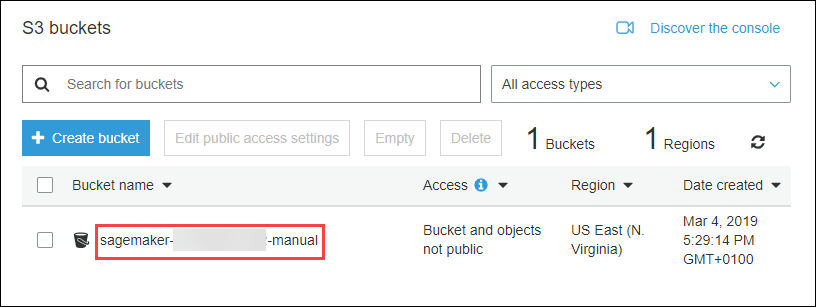
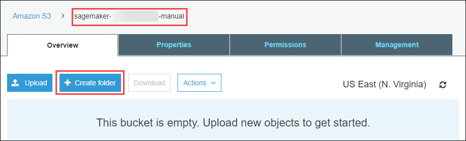
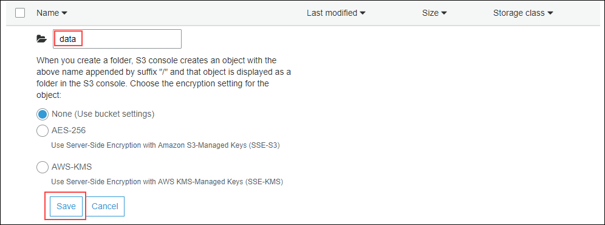
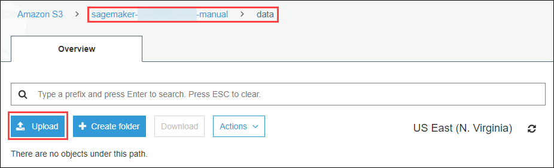
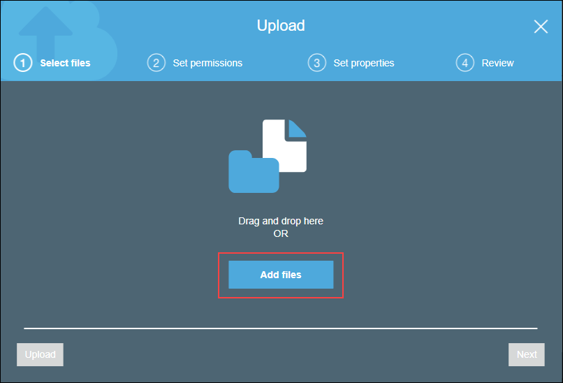
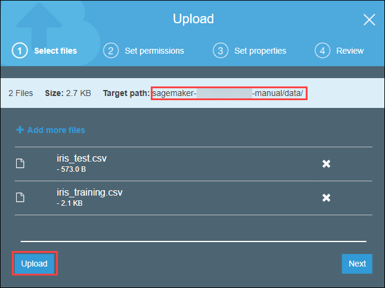
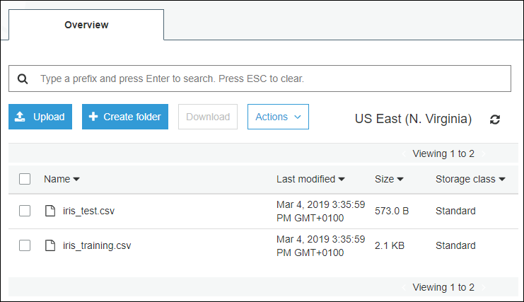
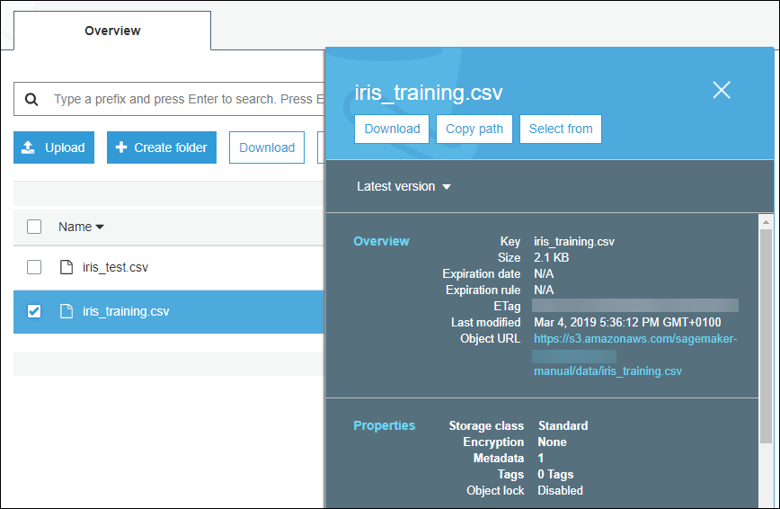

## Details
### You will learn  
  - Create an Amazon S3 bucket
  - Split the dataset for estimation and validation
  - Upload the dataset files into an Amazon S3 bucket

Before proceeding with building your model with SageMaker, you will need to provide the dataset files as an Amazon S3 object.
The dataset for training must be split into an estimation and validation set as two separate files.

This the most common way used by SageMaker to consume a dataset to build your model.

Other options are available like establishing a direct connection to your SAP HANA, express edition, but this would require to extend/customize the Out of the Box containers used with the SAP HANA client including the SAP HANA Python Data Frame library and provide the connection details in clear including user name and password (unless using additional services like AWS Secret Manager).

Amazon Simple Storage Service (Amazon S3) is an object storage service. For more details, please check the following URL: <https://aws.amazon.com/s3>

[ACCORDION-BEGIN [Step 1: ](S3 Upload Options)]

There are multiple ways to upload files in S3 bucket:

  - ***Manual approach***: Use the Amazon S3 console
  - ***Command line approach***: Use the AWS CLI
  - ***Code/programmatic approach*** : Use the AWS `Boto` SDK for Python

Here since, you have access to both the S3 console and a Jupyter Notebook which allows to run both Python code or shell commands, you can try them all.

To do so, you will be using different S3 bucket names, but only one will be kept.

> ### **Note:**
>
If the AWS user currently in use (programmatic or console) doesn't have the S3 Full access policy enabled but rather only the Policy created previously (`sap-hxe-eml-policy`), you will only be able to create S3 buckets with names starting with `sagemaker` (in lower case).

## _Manual approach_

Access the <a href="https://s3.console.aws.amazon.com" target="&#95;blank">S3 Management Console</a> (you also use the search for **S3** in the Amazon Web Services Management Console).


Click on **Create Bucket**.

Enter **`sagemaker-xxxxxxxxxxxx-manual`** as ***Bucket name*** and update the selected ***Region*** if needed.

Replace **`xxxxxxxxxxxx`** by your account id.

> ### **Note:**
You can get your account id (a 12 digits identifier) from the following URL: <https://console.aws.amazon.com/billing/home?#/account>


Click on **Create**.



Click on the created bucket name **`sagemaker-xxxxxxxxxxxx-manual`**.

Your context is now **`sagemaker-xxxxxxxxxxxx-manual`** as displayed on the next screenshot.



Click on **Create Folder**.

Enter **`data`** as ***Name*** and you can keep the default settings for encryption.



Click on **Save**.

Click on the create folder name **`data`**.

Your context is now **`sagemaker-xxxxxxxxxxxx-manual`** as displayed on the next screenshot.

Click on **Upload**.



Click on **Add Files**.



Select the file (after downloading them locally):

 - `iris_training.csv` : <http://download.tensorflow.org/data/iris_training.csv>



Click on **Upload**.

The files are now uploaded in your bucket.



You can select one of the file using the check box to open the details panel.



Provide an answer to the question below then click on **Validate**.

## _Command Line approach_

> ### **Note:**
>
To use this approach, you will need the AWS CLI installed and configured. Be aware that, SageMaker notebooks all have the AWS CLI installed an configured with the proper role to execute the following set of commands using a Jupyter Terminal.
>
For more details about installing the AWS CLI, you can refer to: [Set up your AWS environment - AWS CLI](hxe-aws-eml-02).

You can also use a Terminal console from your SageMaker Notebook instance to achieve this using the **File > New > Terminal** menu.

Remember that in order to paste text in the Terminal you need to use **SHIFT** + **INSERT** and to copy  use **CTRL** + **INSERT**.

Here is the series of commands to execute for illustration (not to be executed):

```
# create a folder and remove old files if any
mkdir -p ~/data

# download the data set locally from http://download.tensorflow.org/
wget -P ~/data "http://download.tensorflow.org/data/iris_training.csv" -q

# get the account id
aws_account=$(aws sts get-caller-identity --query 'Account' --output text)

# set the s3 bucket name
aws_bucket=s3://sagemaker-$aws_account-cli

# create the bucket
aws s3 mb $aws_bucket

# clear existing files if any
aws s3 rm $aws_bucket --recursive --quiet

#upload the downloaded files
aws s3 cp ~/data/iris_training.csv $aws_bucket/data/
```

## _Programmatic approach_

The below code leverage the ***`Boto`*** API to get your account id, then create a S3 bucket and finally upload local files.

For more details, please refer to the following URL: <https://boto3.amazonaws.com/v1/documentation/api/latest/index.html>

Here is the code to execute for illustration (not to be executed):

```
import boto3

# Create an S3 client
s3cli = boto3.client('s3')

aws_account = boto3.client('sts').get_caller_identity().get('Account')
current_region = boto3.session.Session().region_name

# Print out the bucket list
bucket_name='sagemaker-{}-{}'.format(current_region, aws_account)
print("Default Bucket name: %s" % bucket_name)

# Create an S3 bucket
bucket=s3cli.create_bucket(Bucket=bucket_name,  CreateBucketConfiguration={
        'LocationConstraint': current_region
    } )


# upload files to the s3 bucket
s3cli.upload_file('./iris_training_estimation.csv', bucket_name, 'data/iris_training_estimation.csv')
s3cli.upload_file('./iris_training_validation.csv', bucket_name, 'data/iris_training_validation.csv')

# Call S3 to list current buckets
response = s3cli.list_objects(Bucket=bucket_name)

# Get a list of all bucket names from the response
buckets = [bucket['Key'] for bucket in response['Contents']]

# Print out the bucket list
print("Object List: %s" % buckets)
```

[DONE]
[ACCORDION-END]

[ACCORDION-BEGIN [Step 1: ](Split the Iris Dataset)]

Before uploading the training dataset, you will need to split it into an estimation and validation set with an 80/20% split.

To do so, you can run the below code in a new notebook.

Access your Jupyter Notebook instance (if not already open in your browser).

From the menu bar, open a new Notebook using **File > New > Notebook**.


Select **`conda_tensorflow_p36`** as **Kernel**.


Rename your new Notebook as **`hxe-aws-eml-iris-02.ipyndb`** using the menu bar **File > Rename Notebook...**.

In the first cell, paste the following code:

```Python
!pip install -q /home/ec2-user/SageMaker/sap/hdbclient/hdbcli-*.tar.gz
!pip install -q /home/ec2-user/SageMaker/sap/hdbclient/hana_ml-*.tar.gz

import os
import numpy as np

from hana_ml import dataframe

# Instantiate the Connection Object (conn)
host = "<HXE host public ip address>"
port = 39015
user = "ML_USER"
pswd = "Welcome19Welcome19"
conn = dataframe.ConnectionContext(host, port, user, pswd)

# Create the HANA Dataframe (df_train) and point to the training table.
training_data = conn.table("IRIS_TRAINING").collect()

estimation = training_data.sample(frac = 0.8, replace=False)
estimation.to_csv(
    path_or_buf='./iris_training_estimation.csv',
    index=False,
)

validation = training_data.drop(estimation.index)
validation.to_csv(
    path_or_buf='./iris_training_validation.csv',
    index=False,
)
print('Training dataset size: {}'.format(len(training_data)))
print('Estimation dataset size: {}'.format(len(estimation)))
print('Validation dataset size: {}'.format(len(validation)))
```

Adjust the **the connection details (row 10)**, then press **SHIFT** + **ENTER** to execute the code.

Provide an answer to the question below then click on **Validate**.

[VALIDATE_1]
[ACCORDION-END]

[ACCORDION-BEGIN [Step 1: ](Upload the Iris Dataset)]

Now, you can upload the dataset files into a new AWS S3 bucket.

In the next cell, paste the following code:

```Python
import boto3

# Create an S3 client
s3cli = boto3.client('s3')

aws_account = boto3.client('sts').get_caller_identity().get('Account')
current_region = boto3.session.Session().region_name

# Print out the bucket list
bucket_name='sagemaker-{}-{}'.format(current_region, aws_account)
print("Default Bucket name: %s" % bucket_name)

# Create an S3 bucket
bucket=s3cli.create_bucket(Bucket=bucket_name)

# upload files to the s3 bucket
s3cli.upload_file('./iris_training_estimation.csv', bucket_name, 'data/iris_training_estimation.csv')
s3cli.upload_file('./iris_training_validation.csv', bucket_name, 'data/iris_training_validation.csv')

# Call S3 to list current buckets
response = s3cli.list_objects(Bucket=bucket_name)

# Get a list of all bucket names from the response
buckets = [bucket['Key'] for bucket in response['Contents']]

# Print out the bucket list
print("Object List: %s" % buckets)
```

Provide an answer to the question below then click on **Validate**.

[VALIDATE_2]
[ACCORDION-END]
