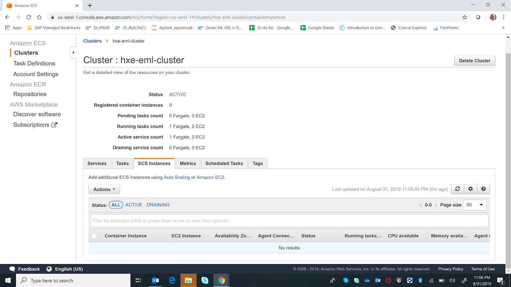

## Details
### You will learn  
  - Create an Amazon Elastic Container Registry (Amazon ECR)
  - Deploy your custom Docker image to ECR
  - Create a Cluster in Elastic Container Service (Amazon ECS)
  - Deploy a new `Fargate` Task in ECS with the Iris Docker image

Amazon Elastic Container Registry (ECR) is a fully-managed Docker container registry that makes it easy for developers to store, manage, and deploy Docker container images. It eliminates the need to operate your own container repositories or worry about scaling the underlying infrastructure.

Amazon ECR is integrated with Amazon Elastic Container Service (ECS), simplifying your development to production workflow.

For more details on Amazon Elastic Container Registry (ECR), please check the following URL: <https://aws.amazon.com/ecr/>

Amazon Elastic Container Service (Amazon ECS) is a highly scalable, high-performance container orchestration service that supports Docker containers and allows you to easily run and scale containerized applications on AWS. It eliminates the need for you to install and operate your own container orchestration software, manage and scale a cluster of virtual machines, or schedule containers on those virtual machines.

For more details on Amazon Elastic Container Service (ECS), please check the following URL: <https://aws.amazon.com/ecs/>

> ### **Warning:**
As SageMaker Notebook instance storage is ephemeral, anytime you restart it, you will loose all local files (except the ones in the SageMaker directory).
>Therefore, your local Iris container created during [Build a TensorFlow Serving Docker Image to host the Iris model](hxe-aws-eml-05-iris-04) was dropped and you will need to complete the tutorial again.

[ACCORDION-BEGIN [Step 1: ](Access the SageMaker Notebook instance)]

To deploy your container, you will be using the existing SageMaker Notebook instance as:

 - the AWS CLI is installed and configured already
 - the Iris Docker image is available locally

However, this can also be done in any environment where the AWS CLI is installed.

If you have your Jupyter Notebook instance already open in your browser, then you can move to the next step.

Else, access the <a href="https://console.aws.amazon.com/sagemaker" target="&#95;blank">Amazon SageMaker Console</a> (you also use the search for **SageMaker** in the Amazon Web Services Management Console).


Click on **Open `JupyterLab`**.

[DONE]
[ACCORDION-END]

[ACCORDION-BEGIN [Step 1: ](Create a Notebook document)]

Once open, you should have access to your Notebook instance.

On the menu bar, select **File > New > Notebook**.


Select **`conda_tensorflow_p36`** as Kernel then click on **Select**.


Rename your notebook document **`hxe-aws-eml-iris-05.ipynb`** using the menu bar with **File > Rename Notebook...**.

[DONE]
[ACCORDION-END]

[ACCORDION-BEGIN [Step 1: ](Create an Amazon ECR repository)]

Amazon Elastic Container Registry (Amazon ECR) is a managed AWS Docker registry service that supports private Docker repositories so that specific users or Amazon EC2 instances can access repositories to push, pull, and manage images.

The repository is the place where your Docker images are store.

For more details about repositories in ECR, you can check the following link: <https://docs.aws.amazon.com/AmazonECR/latest/userguide/Repositories.html>

Before getting started, you'll need to create a repository where your container image will be deployed.

In the first cell, paste the following code then press **SHIFT** + **ENTER** to execute the code:

```Python
%%sh
aws ecr create-repository --repository-name hxe-eml/iris
aws ecr describe-repositories

```

The above code will create a new repository named ***`hxe-eml`***. You can check that it was properly created by accessing the Amazon ECR dashboard: <https://console.aws.amazon.com/ecr/repositories>

> ### **Note:**

>If the repository already exists, you can drop it before using the following command:
>
```
aws ecr delete-repository --repository-name hxe-eml
```

Provide an answer to the question below then click on **Validate**.

[VALIDATE_1]
[ACCORDION-END]

[ACCORDION-BEGIN [Step 1: ](Tag the Iris Docker image for ECR)]

You can now tag the Iris TensorFlow Serving Docker image for your Elastic Container Registry repository.

Before pushing the Iris Docker image, you can check it is locally available.

In the next cell, paste the following code then press **SHIFT** + **ENTER** to execute the code:

```Python
%%sh
docker images
```

The response should include a line like the following:

```
REPOSITORY                 TAG    IMAGE ID            CREATED             SIZE
tensorflow/serving/iris    1.0.0  xxxxxxxxxxxx        8 minutes ago       230MB
```

> ### **Waring:**
> If there is no ***`tensorflow/serving/iris`*** image listed in the output, then you will need to complete [Build a TensorFlow Serving Docker Image to host the Iris model](hxe-aws-eml-05-iris-04) again.

Now, let's tag the image with the repository ID.

In the next cell, paste the following code then press **SHIFT** + **ENTER** to execute the code:

```Python
%%sh
aws_account=$(aws sts get-caller-identity --query 'Account' --output text)
aws_region=$(aws configure get region)

docker tag tensorflow/serving/iris:1.0.0 $aws_account.dkr.ecr.$aws_region.amazonaws.com/hxe-eml/iris:1.0.0

docker images
```

Provide an answer to the question below then click on **Validate**.

[VALIDATE_2]
[ACCORDION-END]

[ACCORDION-BEGIN [Step 1: ](Push the Iris Docker image to ECR)]

Now that the Iris Docker image was tag for ECR, you can push it.

In the next cell, paste the following code then press **SHIFT** + **ENTER** to execute the code:

```Python
%%sh
aws_account=$(aws sts get-caller-identity --query 'Account' --output text)
aws_region=$(aws configure get region)

$(aws ecr get-login --no-include-email --region $aws_region)

docker push $aws_account.dkr.ecr.$aws_region.amazonaws.com/hxe-eml/iris:1.0.0
```

The above code will first login to ECR, then push the Docker image to the repository.

Once the code complete successfully, you can get a list of the available Docker image using the following command.

In the next cell, paste the following code then press **SHIFT** + **ENTER** to execute the code:

```Python
%%sh
aws ecr describe-images --repository-name hxe-eml/iris
```

You can check that the Docker image was properly uploaded by accessing the Amazon ECR repository: <https://console.aws.amazon.com/ecr/repositories/hxe-eml/iris/>

Provide an answer to the question below then click on **Validate**.

[VALIDATE_3]
[ACCORDION-END]

[ACCORDION-BEGIN [Step 1: ](Register a Task Definition in Amazon ECS)]

Now that the Docker image has been pushed in ECR, you can now register a task definition in ECS which is required to run Docker containers.

Here are some examples of configurable parameters when registering a new task definition:

 - the Docker image to use
 - how much CPU and memory to use with each task
 - the launch type to use, which determines the infrastructure on which your tasks are hosted
 - the Docker networking mode to use for the containers in your task

For more details about Task Definition in ECS, you can check the following link: <https://docs.aws.amazon.com/AmazonECS/latest/userguide/task_definitions.html>

In the next cell of the notebook, paste the following code then press **SHIFT** + **ENTER** to execute the code:

```Python
%%sh
aws_account=$(aws sts get-caller-identity --query 'Account' --output text)
aws_region=$(aws configure get region)

aws ecs register-task-definition \
    --family task-hxe-eml-iris \
    --network-mode awsvpc \
    --requires-compatibilities FARGATE \
    --execution-role-arn arn:aws:iam::$aws_account:role/ecsTaskExecutionRole \
    --cpu 256 \
    --memory 1024 \
    --container-definitions "name=iris,image=$aws_account.dkr.ecr.$aws_region.amazonaws.com/hxe-eml/iris:1.0.0,portMappings=[{containerPort=8500},{containerPort=8501}]"
```

The above code will get the account id and region using the AWS CLI commands, then register the task definition with a port mapping for `gRPC` and REST APIs.

The registered task definition will be named **`task-hxe-eml-iris`**. You can check that the task definition was properly registered by accessing the Amazon ECS dashboard: <https://console.aws.amazon.com/ecs/home?#/taskDefinitions/>

Provide an answer to the question below then click on **Validate**.

[VALIDATE_4]
[ACCORDION-END]

[ACCORDION-BEGIN [Step 1: ](Create a cluster in ECS)]

An Amazon ECS cluster is a logical grouping of tasks or services using both the `Fargate` and EC2 launch types.

The `Fargate` launch type allows you to run your containerized applications without the need to provision and manage the backend infrastructure.

For more details on ECS cluster, please check the following URL: <https://docs.aws.amazon.com/AmazonECS/latest/userguide/ECS_clusters.html>

Before getting started, you'll need to create a cluster where your tasks will be defined.

In the next cell, paste the following code then press **SHIFT** + **ENTER** to execute the code:

```Python
%%sh
aws ecs create-cluster --cluster-name hxe-eml-cluster
```

The above code will create a new cluster named ***`hxe-eml-cluster`***. You can check that the cluster was properly created by accessing the Amazon ECS dashboard: <https://console.aws.amazon.com/ecs/home?#/clusters/>

>If the cluster already exists, you can drop it before using the following command:
>
```Python
aws ecs delete-cluster --cluster hxe-eml-cluster
```

Provide an answer to the question below then click on **Validate**.

[VALIDATE_5]
[ACCORDION-END]

[ACCORDION-BEGIN [Step 1: ](Create a security group)]

In order to access the Iris model stored in the custom Docker image, the TensorFlow Serving server will be listening on port 8500 (for `gRPC`) and 8501 (for HTTP REST calls).

Therefore, you will need to get these ports exposed when the Docker instance is started via an ECS Service.

In the next cell, paste the following code then press **SHIFT** + **ENTER** to execute the code:

```Python
%%sh
aws ec2 create-security-group --group-name hxe-eml-tf-serving --description "My security group For TF Serving"

aws ec2 authorize-security-group-ingress --group-name "hxe-eml-tf-serving" --ip-permissions IpProtocol=tcp,FromPort=8500,ToPort=8501,Ipv6Ranges='[{CidrIpv6=::/0}]',IpRanges='[{CidrIp=0.0.0.0/0}]'

aws ec2 describe-security-groups --group-names "hxe-eml-tf-serving"
```

You can now check that the security group was properly created here: <https://console.aws.amazon.com/ec2/v2/home?#SecurityGroups:search=hxe-eml-tf-serving;sort=groupId>

Provide an answer to the question below then click on **Validate**.

[VALIDATE_6]
[ACCORDION-END]

[ACCORDION-BEGIN [Step 1: ](Create a service in Amazon ECS)]

In order to instantiate the created task definition and start the required Docker container for serving the Iris model, you will create an ECS service.

Amazon ECS service allows you to run and maintain a specified number of instances of a task definition simultaneously in an Amazon ECS cluster.

If any of your tasks should fail or stop for any reason, the Amazon ECS service scheduler launches another instance of your task definition to replace it and maintain the desired count of tasks in the service depending on the scheduling strategy used.

In addition to maintaining the desired count of tasks in your service, you can optionally run your service behind a load balancer. The load balancer distributes traffic across the tasks that are associated with the service.

For more details on ECS service, please check the following URL: <https://docs.aws.amazon.com/AmazonECS/latest/userguide/ecs_services.html>

In the next cell, paste the following code then press **SHIFT** + **ENTER** to execute the code:

```Python
%%sh
vpc_id=$(aws ec2 describe-security-groups --group-names "hxe-eml-tf-serving" | jq -r ".SecurityGroups[0].VpcId")
subnet=$(aws ec2 describe-subnets --filters Name=vpc-id,Values=$vpc_id | jq -r ".Subnets[0].SubnetId")
security_group=$(aws ec2 describe-security-groups --group-names "hxe-eml-tf-serving" | jq -r ".SecurityGroups[0].GroupId")

aws ecs create-service \
    --cluster hxe-eml-cluster \
    --service-name service-hxe-eml-iris \
    --task-definition task-hxe-eml-iris:(version number)
    --desired-count 1 \
    --launch-type FARGATE \
    --platform-version LATEST \
    --network-configuration "awsvpcConfiguration={subnets=[$subnet],securityGroups=[$security_group],assignPublicIp=ENABLED}"
```

You can now check that the service was properly created here: <https://console.aws.amazon.com/ecs/home?#/clusters/hxe-eml-cluster/services>



Provide an answer to the question below then click on **Validate**.

[VALIDATE_7]
[ACCORDION-END]

[ACCORDION-BEGIN [Step 1: ](Test the Iris Container)]

Before testing the model, you will need to make sure the task is started.

You can either check the following URL to make sure the status is **RUNNING**: <https://console.aws.amazon.com/ecs/home?#/clusters/hxe-eml-cluster/tasks>

Or you can execute the following code in the next cell:

```Python
%%sh
task_id=$(aws ecs list-tasks --cluster hxe-eml-cluster --family task-hxe-eml-iris | jq -r ".taskArns[0]")

aws ecs describe-tasks --cluster hxe-eml-cluster --tasks $task_id  | jq -r '.tasks[0].lastStatus'
```

Now, you will need to collect the public IP address bound to the Docker container. The Docker container public will be require to configure the SAP HANA EML library later.

To do so, you can navigate in the running task and get the value from the network section:


Or you can execute the following code in the next cell:

```Python
%%sh
task_id=$(aws ecs list-tasks --cluster hxe-eml-cluster --family task-hxe-eml-iris | jq -r ".taskArns[0]")

eni_id=$(aws ecs describe-tasks --cluster hxe-eml-cluster --tasks $task_id | jq -r '.tasks[0].attachments[0].details | .[] | select(.name == "networkInterfaceId").value')

docker_ip=$(aws ec2 describe-network-interfaces --network-interface-ids $eni_id | jq -r '.NetworkInterfaces[0].Association.PublicIp')

echo docker ip: $docker_ip
```

But, to make it easier, the following code will allow you to retrieve the Docker IP address for you and then use it to call the model via `gRPC` to score a new entry for `Versicolor` (class = 1):

 - SEPALLENGTH: 5.9
 - SEPALWIDTH: 3
 - PETALLENGTH: 4.2
 - PETALWIDTH: 1.5

In the next cell, paste the following code then press **SHIFT** + **ENTER** to execute the code:

```Python
"""
A client that talks to tensorflow_model_server serving the iris model.
"""
import os
import boto3

from grpc.beta import implementations

import tensorflow as tf
from tensorflow_serving.apis import predict_pb2
from tensorflow_serving.apis import prediction_service_pb2_grpc

# get the docker container ip address
ecs = boto3.client('ecs')
ec2 = boto3.client('ec2')

cluster = 'hxe-eml-cluster'
family = 'task-hxe-eml-iris'

task_id = ecs.list_tasks (
    cluster=cluster,
    desiredStatus='RUNNING',
    launchType='FARGATE'
)['taskArns'][0]

results = ecs.describe_tasks (
    cluster=cluster,
    tasks=[task_id]
)['tasks'][0]['attachments'][0]['details']

eni_id = {i['value'] for i in results if "networkInterfaceId" == i['name']}.pop()

docker_ip = ec2.describe_network_interfaces(
    NetworkInterfaceIds=[eni_id]
)['NetworkInterfaces'][0]['Association']['PublicIp']

# set the TF Serving host and port based on the docker ip address
host = docker_ip
port = 8500

channel = implementations.insecure_channel(host, port)

request = predict_pb2.PredictRequest()
request.model_spec.name = 'iris'
request.model_spec.signature_name = 'predict'

stub = prediction_service_pb2_grpc.PredictionServiceStub(channel._channel)

x = [[5.9, 3, 4.2, 1.5]]

request.inputs['x'].CopyFrom(tf.contrib.util.make_tensor_proto(x))

response = stub.Predict(request, 100)
print("class : " + str(response.outputs['class_ids'].int64_val[0]))
```

You will get the detected class (from 0 to 2, where 1 is `versicolor`).

To get the probabilities for each class, you use the following code in the next cell, then press **SHIFT** + **ENTER** to execute the code:

```Python
print("probabilities : " + str(response.outputs['probabilities'].float_val))
```

To get full response displayed, you can use the following code in the next cell, then press **SHIFT** + **ENTER** to execute the code:

```Python
print("response : \n\n" + str(response))
```

Provide an answer to the question below then click on **Validate**.

[VALIDATE_8]
[ACCORDION-END]
