## Details
### You will learn  
  - How to stop or terminate your SAP HANA, express edition
  - How to cleanup your Amazon Web Services account

[ACCORDION-BEGIN [Step 1: ](Amazon User Access Key and Secret)]

When creating your Amazon User in [Set up your AWS environment - IAM](hxe-aws-eml-01), you had to create a new user in IAM and downloaded the **Access key ID** and **Secret access key**.

Make sure that you backup this file, by for example sending this to yourself via an email,  then delete the local copy of the file.

[DONE]
[ACCORDION-END]

[ACCORDION-BEGIN [Step 1: ](EC2 Instance Key Pair)]

When creating your SAP HANA, express edition, you had to :

- create a key pair (the ***`pem`*** file):

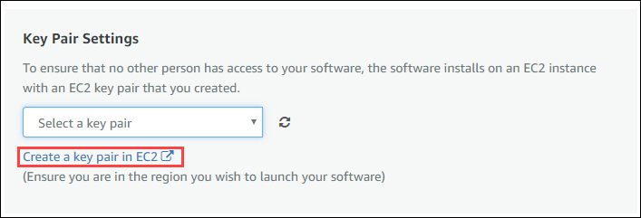

 - convert it into a ***`ppk`*** private key file

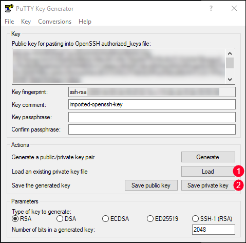

Make sure that you backup this file by for example sending this to yourself via an email.

Then delete the local copy of the file.

[DONE]
[ACCORDION-END]

[ACCORDION-BEGIN [Step 1: ](Amazon ECS & ECR)]

When you create your Amazon ECS cluster and started your task, your custom Docker image was started and place in a compute instance.

Therefore, it is important at least to stop the created task but you could also delete the all cluster and task definition as well.

Go to the **<a href="https://console.aws.amazon.com/ecs/#clusters" target="&#95;blank">ECS Dashboard - Clusters</a>**.

You should have 1 task running in your **`hxe-eml-cluster`**.

Click on the **`hxe-eml-cluster`** cluster link.

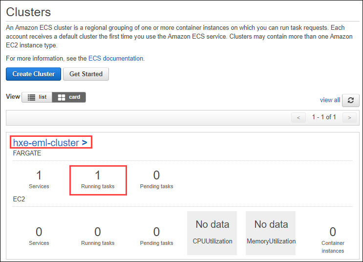

Select the **Tasks** tab, then check the running task.

Click on the **Stop** button.

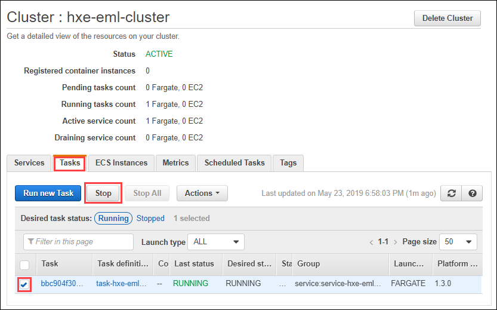

Once the tasked is stopper, use the **Desired task status** filter and set it to **Stopped**.

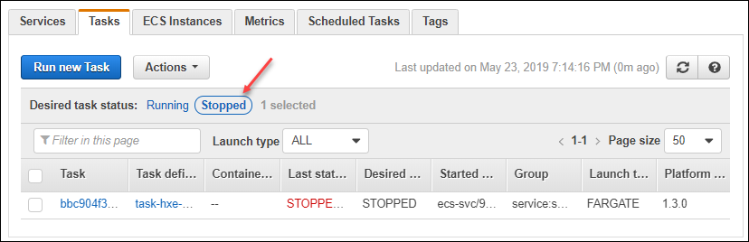

Provide an answer to the question below then click on **Validate**.

[VALIDATE_1]
[ACCORDION-END]

[ACCORDION-BEGIN [Step 1: ](Amazon S3)]

Now let's clean the S3 buckets.

Access the **<a href="https://s3.console.aws.amazon.com/s3/home" target="&#95;blank">S3 Management Console</a>**.

Select the ***`sagemaker-<region>-<my unique id>`*** bucket created earlier.

Click on **Delete Bucket**.

You will be prompted to type (or paste) the bucket name to confirm your action then click on **Confirm**.

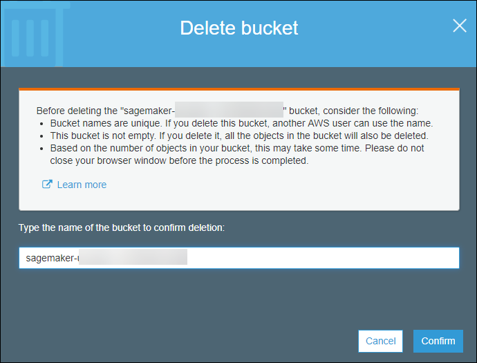

[DONE]
[ACCORDION-END]

[ACCORDION-BEGIN [Step 1: ](Amazon SageMaker)]

Now let's clean your SageMaker environment.

Access the **<a href="https://console.aws.amazon.com/sagemaker/home" target="&#95;blank">SageMaker Management Console</a>**.

Select the ***Notebook instance*** element on the left navigation bar.

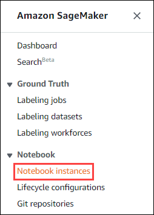

Select the notebook instance marked as **`InService`** then use the **Action** dropdown to stop it.

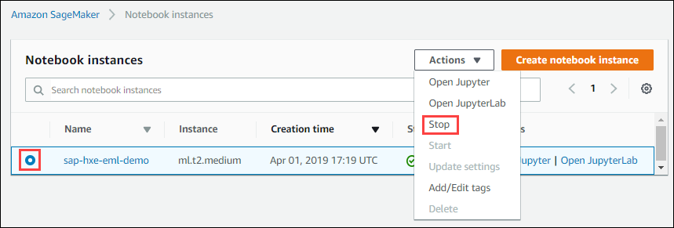

[DONE]
[ACCORDION-END]

[ACCORDION-BEGIN [Step 1: ](SAP HANA, express edition Instance)]

When using the SAP HANA, express edition AMI from AWS, you will be charged for both the EC2 instance and the provisioned EBS volumes used by this instance.

Therefore, even if you ***stop*** your EC2 instance running your SAP HANA, express edition instance, you will still be charged for the provisioned EBS volumes.

Only detaching and deleting the EBS volumes will prevent that but your SAP HANA, express edition will no longer be usable.

Therefore it is recommended that you **terminate** your SAP HANA, express edition instance when you won't need to use it anymore or for a while.

To do so, access the **<a href="https://console.aws.amazon.com/ec2" target="&#95;blank">EC2 Dashboard</a>**.

Click on **1 Running Instances**.

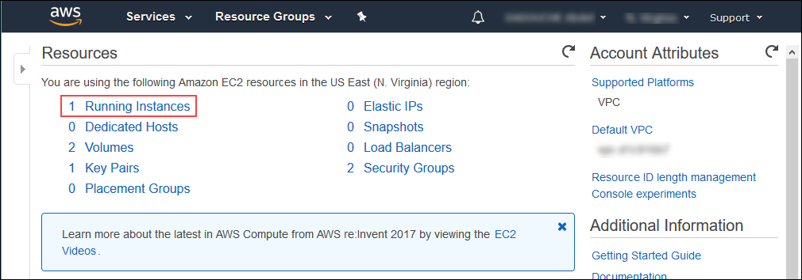

Right click on the running instance, then select **Instance State > Terminate**.

You will be notified that with EBS backed instance, the default action is for the root EBS volume to be deleted when the instance is terminated.

However, SAP HANA, express edition AMI uses EBS volumes which do not have **Delete on Termination** set to true will persist after this instance is terminated which may incur an EBS cost.

Click on **Yes, Terminate**.

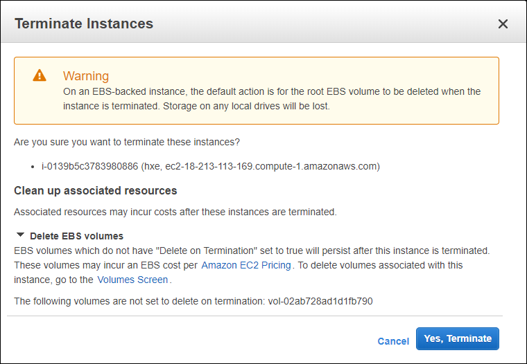

After a few seconds the instance will be marked as ***terminated***.

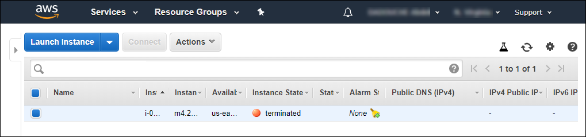

Go to the **<a href="https://console.aws.amazon.com/ec2/home?#Volumes" target="&#95;blank">EC2 Dashboard - Volumes</a>**.

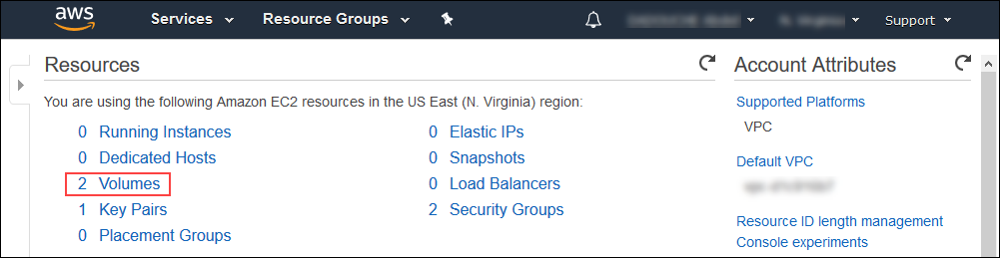

By default, your SAP HANA, express edition uses 2 disks, as displayed below.

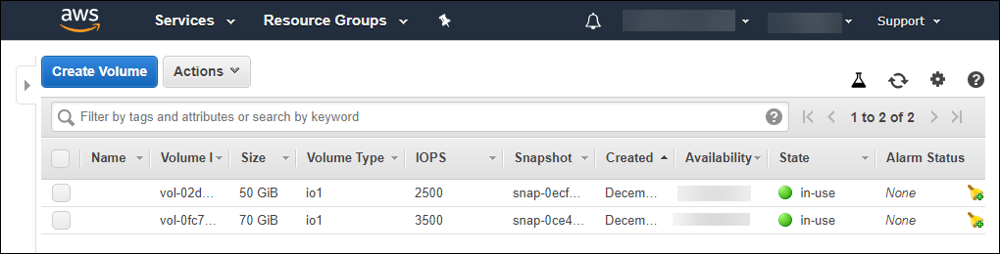

But after the termination of the instance, one will be automatically deleted but not the other.

Please note down, what capacity (in `GiB`) the remainder disk is as this will be part of the validation below.

Select the **Volume** associated to your SAP HANA, express edition EC2 instance, then use the **Actions > Delete Volumes** menu.

Provide an answer to the question below then click on **Validate**.

[VALIDATE_2]
[ACCORDION-END]

### Congratulations! You have just completed your mission: combine the power of SAP HANA, express edition with Amazon SageMaker!
