## Details
### You will learn  
This tutorial will walk you through the setup process of SAP HANA, express edition, from an Amazon Marketplace Image in Amazon Web Services

---

<div align="center">
<b><span style="color:red;align:middle">Warning: Please read carefully before starting!</span></b>
</div>
&nbsp;

<b><span style="color:red">The server-only image is being retired. Please refer to</span></b>:

 - **[Set up SAP HANA, express edition on Amazon Web Services (XS Advanced)](hxe-xsa-aws-setup)**

**Also, before you get started, please be aware that using SAP HANA, express AMI on AWS is not covered by the AWS Free tier, and therefore charges for both the EC2 instance and the provisioned EBS volumes used by this instance will incur.**

**With the EBS volumes types in use, even if your EC2 instance running your SAP HANA, express edition is _stopped_, charges will be incurred for the provisioned EBS volumes. Only detaching and deleting the EBS volumes will prevent charges. However, this will make your  SAP HANA, express edition no longer usable.**

---

[ACCORDION-BEGIN [Step 1: ](Sign in and select the AMI)]

Sign in or create an account on [Amazon Web Services Portal](https://portal.aws.amazon.com/billing/signup#/start)

> ### **Information:**
>**When creating a new account with AWS, a background validation and verification process is started. This process can take up to 2 hours.**

>During this process, some AWS services, like the AWS Marketplace, will not be available.

>Therefore, you will need to wait for the completion of the validation process before being able to proceed with the SAP HANA, express edition creation.

Access the [Amazon Web Services Marketplace](https://aws.amazon.com/marketplace/).

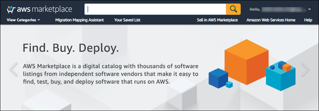

Using the search bar at the top, enter **SAP HANA, express edition** and press **Enter** or click on the search icon.

After you perform the search, you will be presented with two options. The right one will depend on what you are looking to do.

**This tutorial covers the core database option.**

  -  **SAP HANA, express edition:**

      The core database server includes the in-memory database, to which you can connect using different drivers and connectors for different languages (`JDBC`, `ODBC`, `ADO.NET`, driver for `Python`, `Node.js` modules, etc.).

      You can use the database services and the advanced analytics processing engines (e.g., geospatial, text analytics, Extended Machine Library or Predictive Analytics Library, etc.).

  -  **SAP HANA, express edition (server + applications):**

      The database server plus the XS Advanced platform includes the database server and the micro-services oriented, polyglot development platform.

      It includes the SAP Web IDE for SAP HANA, the administration cockpit among other applications like SHINE, Enterprise Architecture Designer and Smart Data Streaming. OData V2 and V4 support, Node.js and Java runtime environments are also included.

      This option requires more resources.

      For details about this option, go to the following tutorial: <https://developers.sap.com/tutorials/hxe-xsa-aws-setup.html>

Select the **SAP HANA, express edition** option.

Scroll down and review the **Pricing** and additional information.

Click on **Continue to Subscribe**

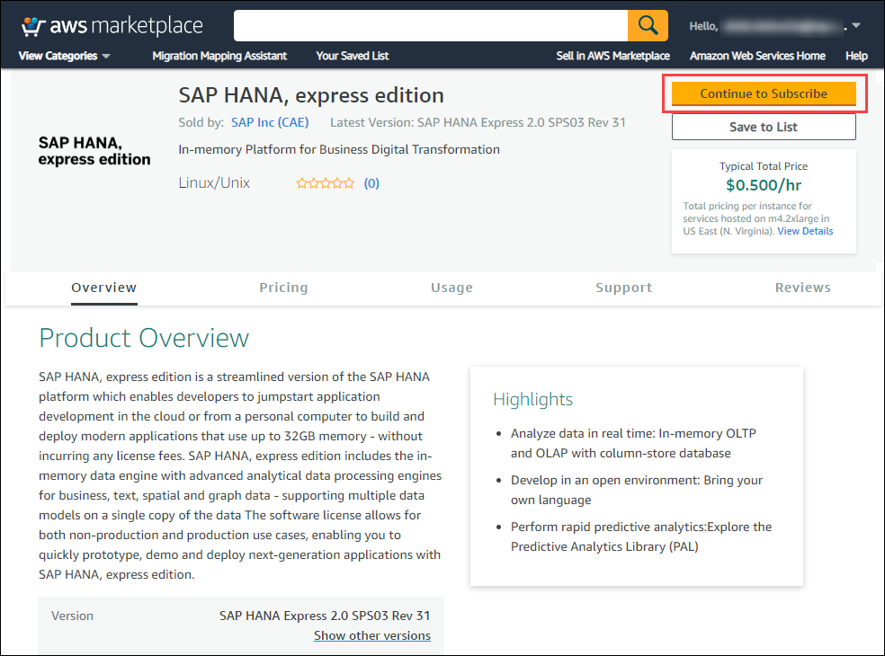

Review and accept the software **Terms and Conditions**.

Click **Continue to Configuration**.


[DONE]
[ACCORDION-END]

[ACCORDION-BEGIN [Step 2: ](Choose instance type)]

Review the pricing, choose a region and click **Continue to Launch**.

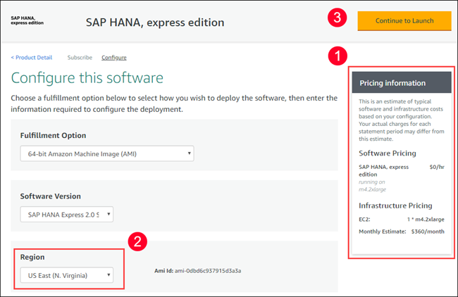

Select:

 - Choose Action:  **Launch from Website**.
 - EC2 Instance Type : **`m4.xlarge`**


[DONE]
[ACCORDION-END]

[ACCORDION-BEGIN [Step 3: ](Configure network)]

Select or create a **`VPC`**

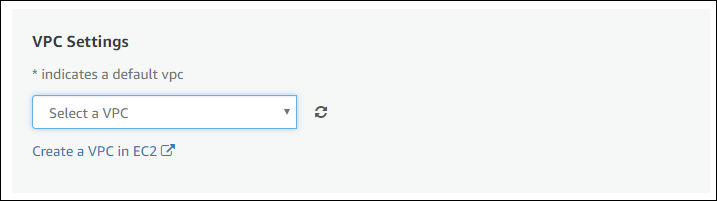

Once the **`VPC`** is created or selected, select a **Subnet**


Click on **Create a security group based on Seller Settings**.

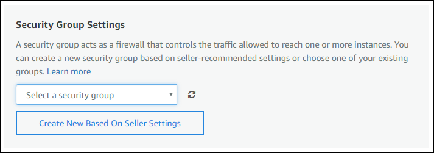

Name your security group, add a description and click **Save**

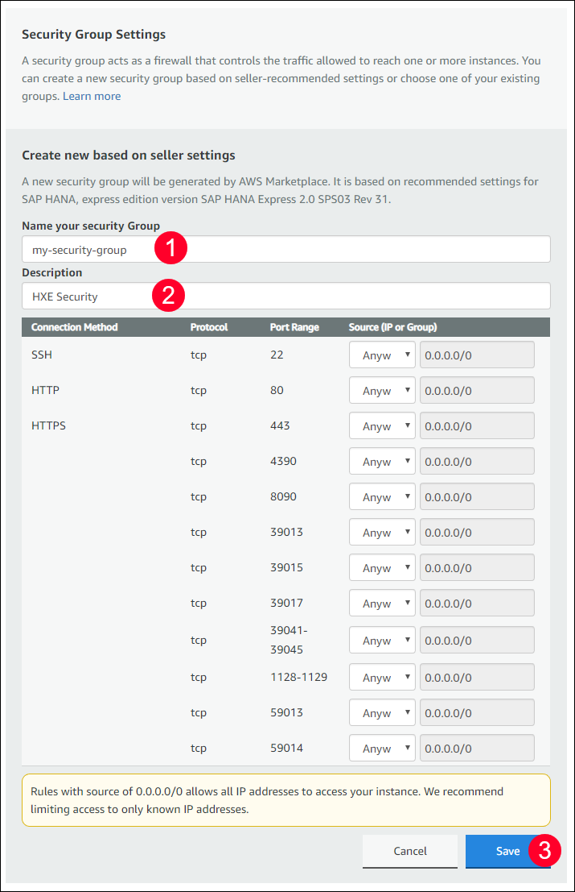

[DONE]
[ACCORDION-END]

[ACCORDION-BEGIN [Step 4: ](Create a Key Pair)]

Click **Create a key pair**.


The **EC2 Dashboard** will open.

Click on **Create a Key pair**.

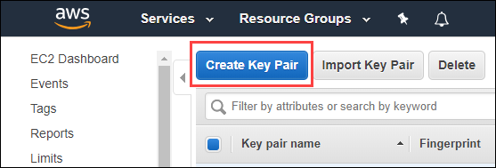

Set a name and click **Create**


**Download** the generated file and store it in a secure location.

> ### Note:  **You will need the generated file to access your instance**
>
> This file is your key to access the server. If you lose your `.pem` file you will not be able to access the instance later.
>

Go back to the instance creation page, and click the `refresh` buttons.

Choose the newly-create setting.

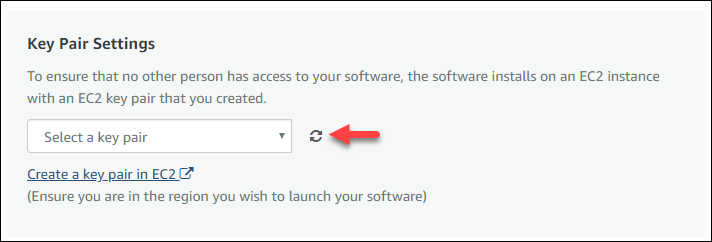

[DONE]
[ACCORDION-END]

[ACCORDION-BEGIN [Step 5: ](Launch your instance)]

Once the configuration is completed, click on the **Launch** button.


Click on the **[EC2 Console](https://console.aws.amazon.com/ec2)** link to see your instance

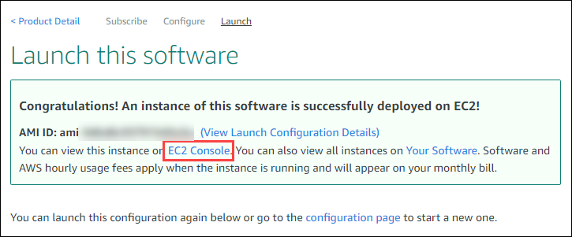

From the **EC2 Console**, you will be able to monitor the instance initialization.

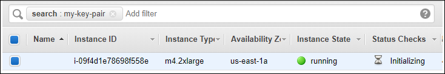

You may need to refresh the page to get the **Status Checks** updated.

Once the instance is ready, you can connect to it using an SSH client.

[DONE]
[ACCORDION-END]

[ACCORDION-BEGIN [Step 6: ](Connect to your instance)]

There are different methods to connect to your instance depending on the system you are using to connect from.

You can use a **standalone SSH client** like **`PuTTY`**.

> ### **Note:** There is also a option to use **Java SSH Client** directly from your browser which uses **`MindTerm`**.
>
>However this require the use of NPAPI, which is being deprecated and unsupported by most browsers like Chrome, Microsoft Edge or recent version of Firefox.

>Therefore, it is recommended to use a ***standalone SSH client***.

From the **EC2 Console**, select your EC2 instance:


Copy the **`IPv4` Public IP** or the **Public DNS (`IPv4`)** address from the instance information.

Then follow the instruction based on your client platform using the ***Public DNS*** host name as highlighted above.

### **Windows platform**:

If you are using a Windows PC, you will need to download and install:

- an SSH client, such as **`PuTTY`**
- a key pair converter such as **`PuTTYgen`** (one time operation)

#### **Create private key file**

***This is a one time operation.***

Open **`PuTTYgen`**.

Use the **Load** button to import your `X.509` certificate **`.pem`** file.

Use the **Save private key** button to save your private key file as **`.ppk`**.


**Connect**:

Start a new **`PuTTY`** session.

Enter the **`IPv4` Public IP** or the **Public DNS (`IPv4`)** address in the **Host Name (or IP address)** field.

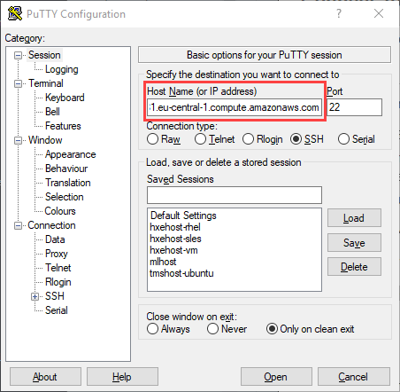

On the left tree, select **Connection > SSH > Auth**, select the generated private key **`.ppk`** file:


Click on **Open**.

When prompted, use **`ec2-user`** as user.

Check the following guide for further information: [Connecting to Your Linux Instance from Windows Using PuTTY](http://docs.aws.amazon.com/AWSEC2/latest/UserGuide/putty.html)

### **Mac or Linux platform**

You can use command `ssh` from a terminal as follows:

```shell
ssh -i /path/my-key-pair.pem ec2-user@public_ip_address
```

For more details about standalone SSH client option, you can check the [Connecting to Your Linux Instance Using SSH](https://docs.aws.amazon.com/AWSEC2/latest/UserGuide/AccessingInstancesLinux.html) guide.

[DONE]
[ACCORDION-END]

[ACCORDION-BEGIN [Step 6: ](Configure your server)]

Once you have established an SSH session, use the **`ec2-user`** user to log in:


The prompt should become:

```
ec2-user@hxehost:~>
```

Change the password for `hxeadm` using the following command:

```
sudo passwd hxeadm
```

As follows:


Switch now to user **`hxeadm`** to start configuring your instance:

```ssh
sudo su - hxeadm
```

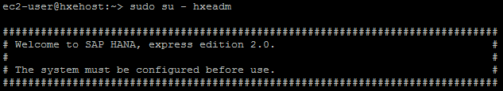

You will be prompted for the master password for your database. **If you lose this password, you will lose access to your instance**.

> ### **Note: The password has to follow these rules**
> The master password you will specify is used for the `<sid>adm` and `sapadm` OS users, the telemetry technical user, and the HANA SYSTEM user.
>
> SAP HANA, express edition requires a very strong password that complies with these rules:
>
> - At least 8 characters
> - At least 1 uppercase letter
> - At least 1 lowercase letter
> - At least 1 number
> - Can contain special characters, but not _&grave;_ (backtick), _&#36;_ (dollar sign),  _&#92;_ (backslash), _&#39;_ (single quote), or _&quot;_ (double quotes)
> - Cannot contain dictionary words
> - Cannot contain simplistic or systematic values, like strings in ascending or descending numerical or alphabetical order
>

Enter the password you want to set for your administration user and then type **Y** to continue setup.


The setup script will perform different configurations. After a couple of minutes, you should see a success message

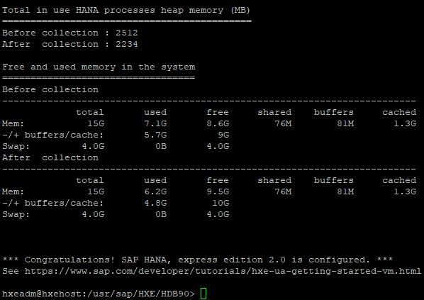

[DONE]
[ACCORDION-END]

[ACCORDION-BEGIN [Step 8: ](Check your instance)]

You can now check your instance is running properly. From the console log, use the following command as user `hxeadm` to see which processes your database is running:

```ssh
HDB info
```
You should see (at least) the following processes:

- `hdbnameserver`
- `hdbcompileserver`
- `hdbindexserver`
- `hdbwebdispatcher`

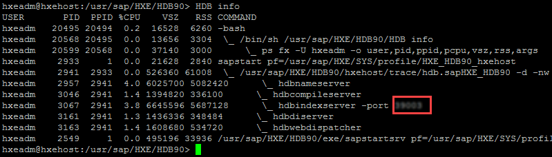

> ### **Note** You can run commands `HDB start` and `HDB stop` respectively to start and stop your SAP HANA instance

You can also log in to the database to check everything is running as intended. Use the following commands

```
hdbsql -i 90 -d systemdb -u system
```

This will log you into the command-line SQL client. You can exit using `quit`.

Provide an answer to the question below then click on **Validate**.

[VALIDATE_1]
[ACCORDION-END]

If anything is going wrong, [check the questions and answers from the community](https://answers.sap.com/index.html).

> ### **Warning:** When using the SAP HANA, express edition AMI from AWS, you will be charged for both the EC2 instance and the provisioned EBS volumes used by this instance.
Therefore, even if you ***suspend*** your EC2 instance running your SAP HANA, express edition instance, you will still be charged for the provisioned EBS volumes.
Only detaching and deleting the EBS volumes will prevent that but your SAP HANA, express edition will no longer be usable.
