## Prerequisites  
 - **Proficiency:** Beginner

## Details
### You will learn  
This tutorial will walk you through the setup process of SAP HANA, express edition, from an Amazon Marketplace Image in Amazon Web Services

### Time to Complete
**35 Min**

---

[ACCORDION-BEGIN [Step 1: ](Sign in and select the AMI)]

Sign in or create an account to access the [Amazon Web Services Marketplace](https://aws.amazon.com/marketplace/).

After you perform the next search, you will be presented with two options. The right one will depend on what you are looking to do. **This tutorial covers the core database option**.

  -  **SAP HANA, express edition (core database server):** The database server. This includes the in-memory database, to which you can connect using different drivers and connectors for different languages (`JDBC`, `ODBC`, `ADO.NET`, driver for `Python`, `Node.js` modules, etc.). You can use the database services and the advanced analytics processing engines (e.g., geospatial, text analytics, Extended Machine Library or Predictive Analytics Library, etc.) .

  -  **SAP HANA, express edition (server + applications):** The database server plus the XS Advanced platform. This includes the database server and the micro-services oriented, polyglot development platform. This includes the SAP Web IDE for SAP HANA, the administration cockpit among other applications like SHINE, Enterprise Architecture Designer and Smart Data Streaming. OData V2 and V4 support, Node.js and Java runtime environments are also included. This option requires more resources. Go to the following tutorial if you prefer this option: <https://www.sap.com/developer/tutorials/hxe-xsa-aws-setup.html>

Look for **HANA Express** and choose **SAP HANA, express edition**

Search for  **HANA Express**


Select the `SAP HANA, express edition` option. **Review** the provided information and click on **Continue to Subscribe**


Continue scrolling down to review the **pricing** and additional information. Once you are ready, click **Continue to Configuration**.

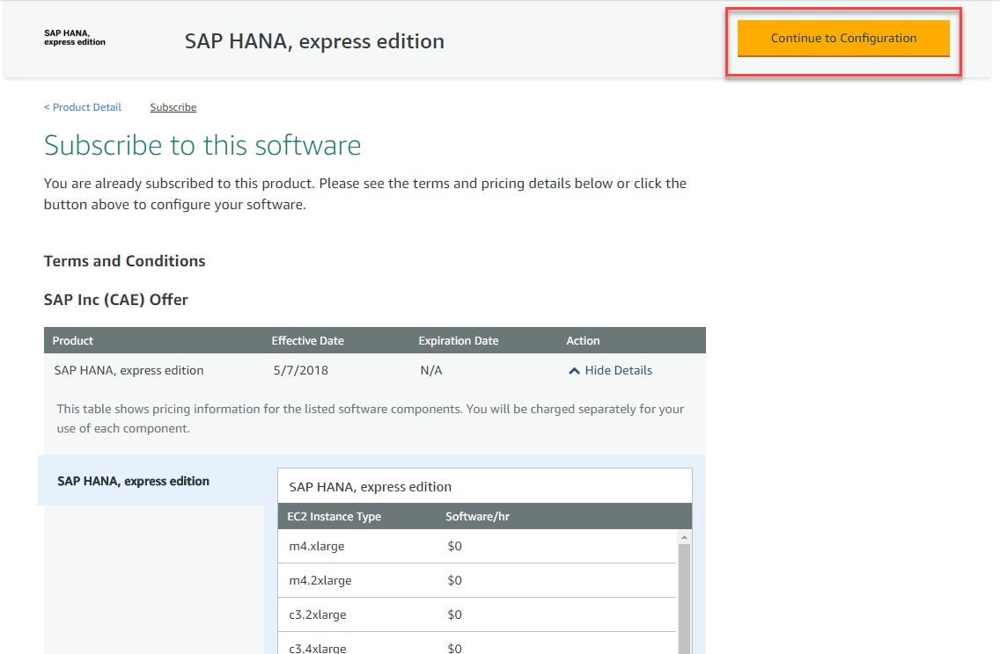


[ACCORDION-END]


[ACCORDION-BEGIN [Step 2: ](Choose instance type)]

Review the pricing, choose a region and click **Continue to Launch**.

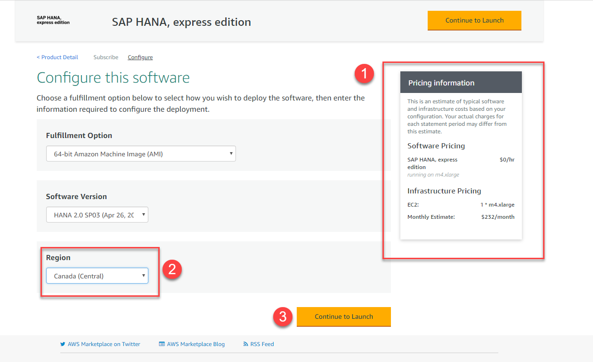

Choose **Launch from Website**, `m4.xlarge` as the instance and select or create a `VPC`.

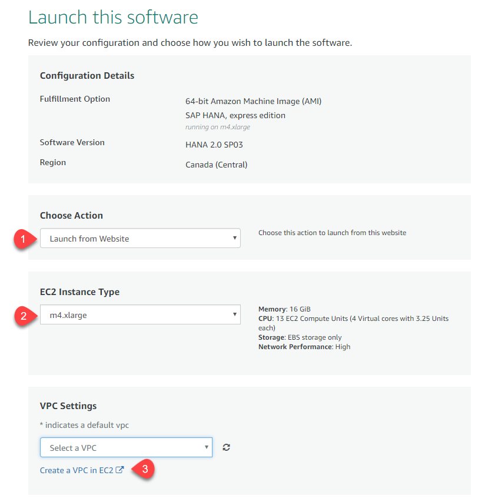

[ACCORDION-END]


[ACCORDION-BEGIN [Step 3: ](Configure network)]

Choose or create a subnet and **Create a security group based on Seller Settings**


Name the security group, add a description and click **Save**


[ACCORDION-END]


[ACCORDION-BEGIN [Step 4: ](Launch your instance)]

Click **Create a key pair**.

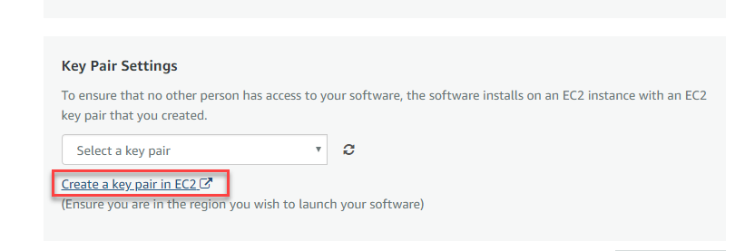

Click the button to **Create a Key pair**, set a name and click **Create**


**Download** the generated file and store it in a secure location.

> ### **You will need the generated file to access your instance**
>
> This file is your key to access the server. If you lose your `.pem` file you will not be able to access the instance later.
>

&nbsp;

Click the `refresh` buttons to choose the newly-create settings

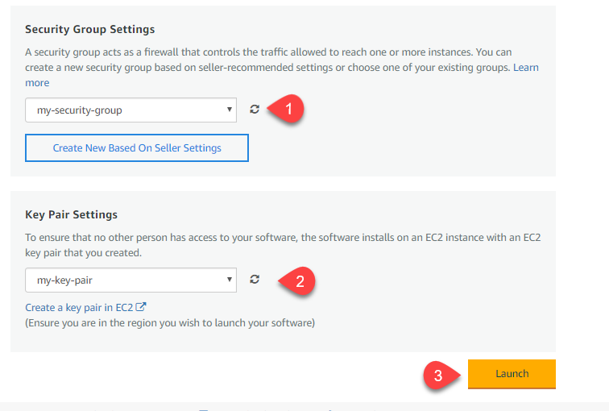

Click **`EC2 Console`** to see your instance

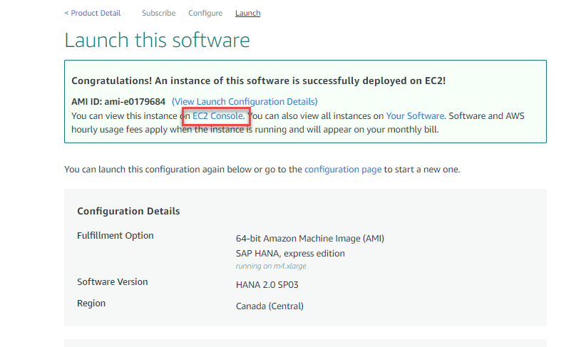

[ACCORDION-END]

[ACCORDION-BEGIN [Step 5: ](Connect to your instance)]

Once the instance is ready, you can connect to it using an SSH client. Copy the external IP address from the instance information:


There are different methods to connect to your instance depending on the system you are using to connect from:

  -  Windows computer: If you are using a Windows PC, you will need to download an SSH client, [such as PuTTY](https://winscp.net/eng/download.php) and `PuTTYgen` to convert your `.pem` file to a `.ppk` private key file. Follow this guide for further information: <http://docs.aws.amazon.com/AWSEC2/latest/UserGuide/putty.html>

  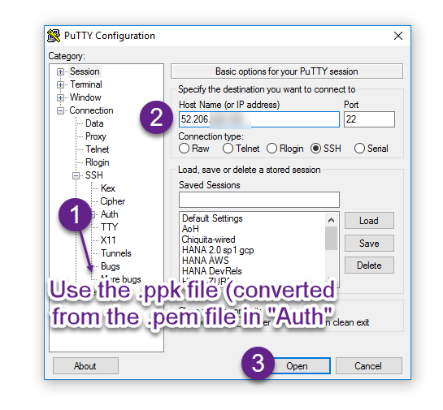

  Use user `ec2-user` when prompted.

  -  Mac or Linux computer: You can use command `ssh` from a terminal as follows

  ```ssh
  ssh -i /path/my-key-pair.pem ec2-user@your_ip_address
  ```

  There is more information about connecting to your instance on this guide: <http://docs.aws.amazon.com/AWSEC2/latest/UserGuide/AccessingInstancesLinux.html>

[ACCORDION-END]

[ACCORDION-BEGIN [Step 6: ](Configure your server)]

Once you have established an SSH session, use user `ec2-user` to log in


Change the password for `hxeadm` using the following command:

```
sudo passwd hxeadm
```

As follows:

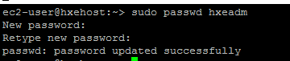


use the following command to start configuring your instance:

```ssh
sudo su - hxeadm
```

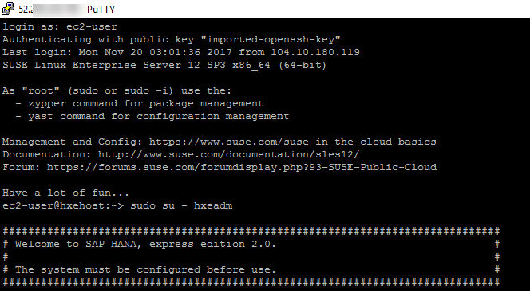

You will be prompted for the master password for your database. **If you lose this password, you will lose access to your instance**.

> ### **Note: The password has to follow these rules**
> The master password you will specify is used for the `<sid>adm` and `sapadm` OS users, the telemetry technical user, and the HANA SYSTEM user.
>
> SAP HANA, express edition requires a very strong password that complies with these rules:
>
> - At least 8 characters
> - At least 1 uppercase letter
> - At least 1 lowercase letter
> - At least 1 number
> - Can contain special characters, but not _&grave;_ (backtick), _&#36;_ (dollar sign),  _&#92;_ (backslash), _&#39;_ (single quote), or _&quot;_ (double quotes)
> - Cannot contain dictionary words
> - Cannot contain simplistic or systematic values, like strings in ascending or descending numerical or alphabetical order
>

&nbsp;

Enter the password you want to set for your administration user and then type **Y** to continue setup.

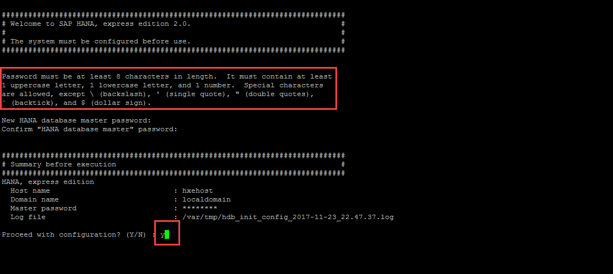

The setup script will perform different configurations. After a couple of minutes, you should see a success message

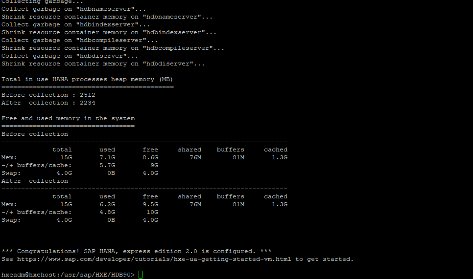

[ACCORDION-END]

[ACCORDION-BEGIN [Step 7: ](Optional: Check your instance)]

You can now check your instance is running properly. From the console log, use the following command as user `hxeadm` to see which processes your database is running:

```ssh
HDB info
```
You should see (at least) the following processes:

- `hdbnameserver`
- `hdbcompileserver`
- `hdbwebdispatcher`
- `hdbwebdispatcher`

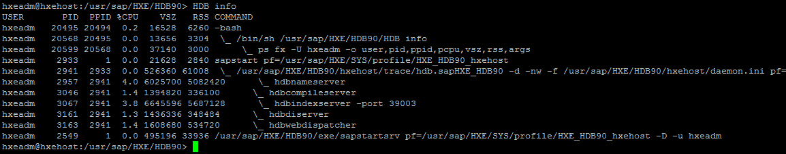

>Note: You can run commands `HDB start` and `HDB stop` respectively to start and stop your SAP HANA instance

&nbsp;

You can also log in to the database to check everything is running as intended. Use the following commands

```
hdbsql -i 90 -d systemdb -u system
```

This will log you into the command-line SQL client.  You can exit using `quit`.

All the next steps are optional and enable additional functionality in your SAP HANA, express edition, instance.

You can now connect to your instance using any SQL client that uses JDBC drivers, such as [Visual Studio](https://www.sap.com/developer/tutorials/hxe-ua-visual-studio.html),[the `DBeaver` SQL client](https://www.sap.com/developer/tutorials/hxe-cj1-download-sql-client.html) or HANA Studio, a plugin to [download and install on Eclipse](https://www.sap.com/developer/tutorials/hxe-howto-eclipse.html)

If anything is going wrong, [check the questions and answers from the community](https://answers.sap.com/index.html).

[ACCORDION-END]
