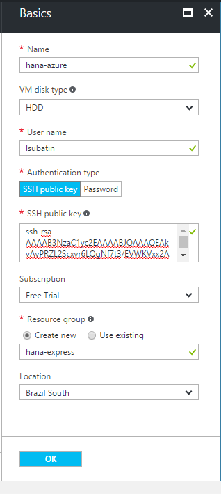
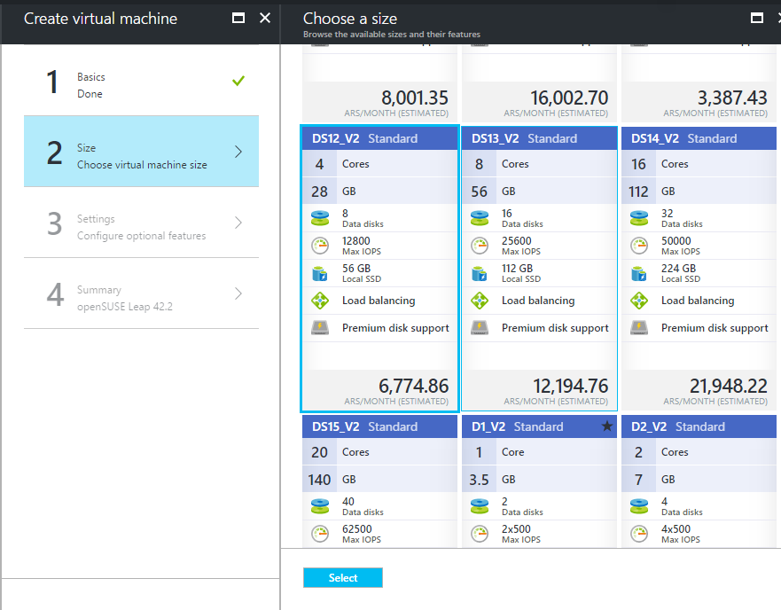
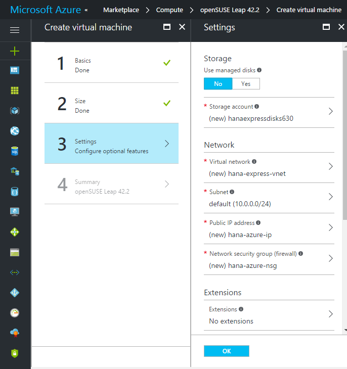
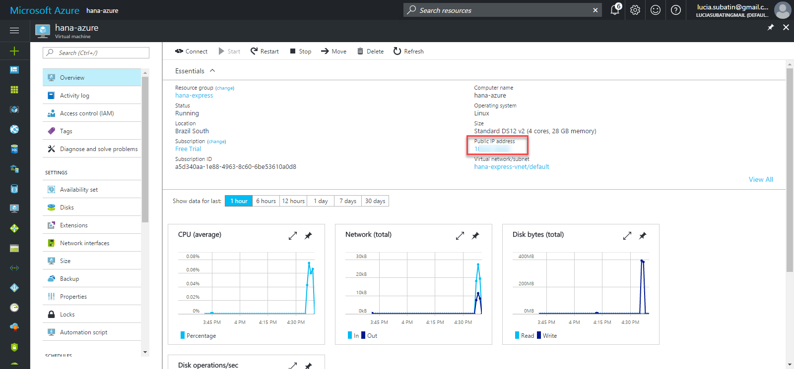
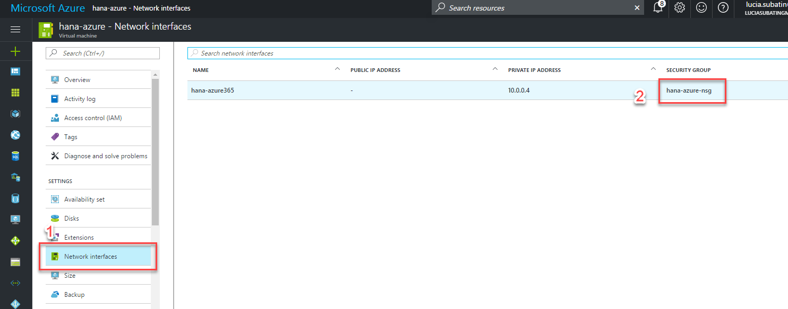
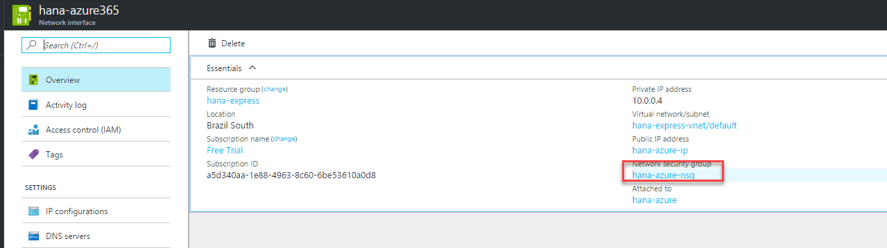
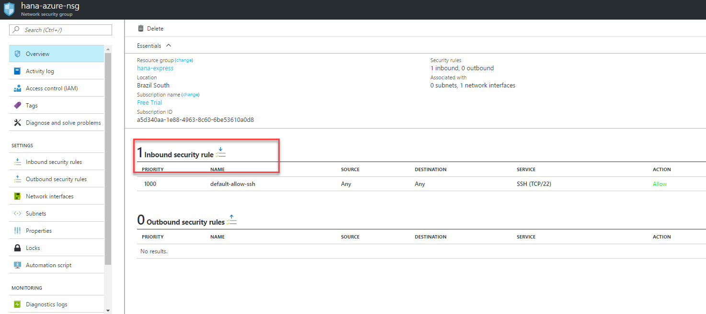
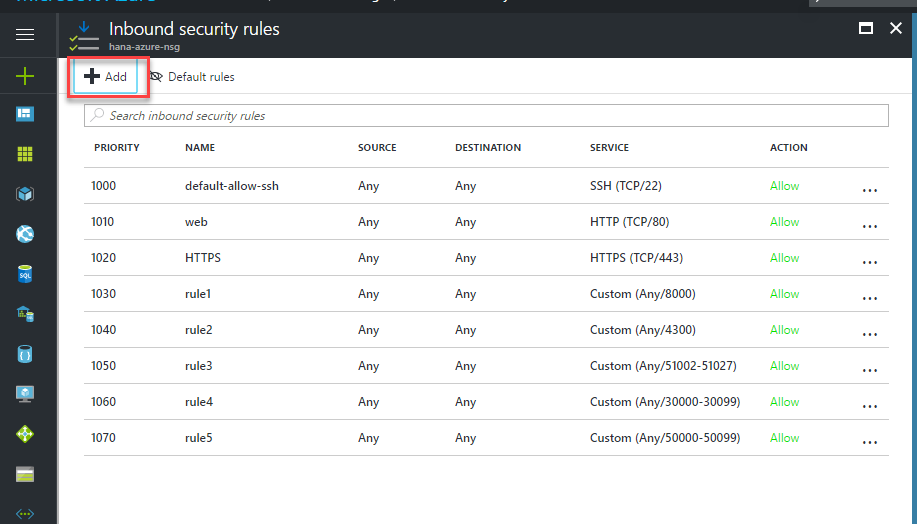

## Prerequisites  
 - **Proficiency:** Beginner | Intermediate | Advanced
 - **Register and Download SAP HANA, express edition,** [Download SAP HANA, express edition](https://www.sap.com/developer/topics/sap-hana-express.html)

## Next Steps
- [Install dependencies for SAP HANA, express edition, in Open SUSE](http://www.sap.com/developer/tutorials/hxe-azure-opensuse-dependencies.html)

## Details
### You will learn  
This tutorial will walk you through the setup of a Virtual Machine in your Microsoft Azure dashboard.

### Time to Complete
**15 Min**

---

[ACCORDION-BEGIN [Step 1: ](Log in to your MS Azure account and Launch an openSUSE machine)]

Go into the [Azure portal](https://portal.azure.com/) and log in to your account or create one. Once logged in, from the `Compute` panel in the `Marketplace` search for openSUSE and choose the 42.2 version:

And click on **Create**:

Fill in the Basic information about your machine:

You can generate the SSH public key file with `PuTTYgen` or with command `ssh-keygen`. Alternatively, you can use a password. Be sure to keep the key file or the password safe and available to you.

[DONE]
[ACCORDION-END]

[ACCORDION-BEGIN [Step 2: ](Choose an Instance)]

Now you need to decide which type of machine you want to install. If you are planning on using the server-only version, you need at least 8GB RAM. If you are planning on also installing the XS Advanced applications, you need at least 16GB RAM. Finally, if you are planning on adding the XS Advanced applications later, take it into account when choosing the size of the disk (56GB Minimum).

You can now review the optional features. **Make sure the IP address is set to `Static`.** If this machine is for development or testing purposes, the default settings should suit those needs.

Click **OK**. Once deployed, you will see the administration console. Take note of the IP address to connect using your defined username and the password or `ssh-rsa` key you have generated

[DONE]
[ACCORDION-END]

[ACCORDION-BEGIN [Step 3: ](Upload the installation files into the Virtual Machine)]

You can now upload the installation files into your virtual machine using an SCP client, such as WinSCP. Upload `hxe.tgz` if you plan to install the server-only version or upload both `hxe.tgz` and `hxexsa.tgz` if you plan to install the XS Advanced applications.

Continue with the next steps as the upload completes.

[DONE]
[ACCORDION-END]

[ACCORDION-BEGIN [Step 4: ](Configure Network Rules for SAP HANA express edition on MS Azure)]

Configure Network rules by going into `Network interfaces` and then `Security Group`

Click on the network security group:

And then click on the Inbound rules:

Add each of the rules in the list below, where XX is the instance number you will use. The installer will suggest instance number `90`, although `00` is also used. The XX is the ports represent the instance number. **Remember this choice when you specify the instance number in the installation script**.

- 22 (SSH)
- 80 (HTTP)
- 443 (HTTPS)
- 80XX
- 43XX
- 51002-51027
- 3XX00-3XX99
- 5XX00-5XX99

In the example below, instance number `00` has been chosen:

[DONE]
[ACCORDION-END]

## Next Steps
- [Install dependencies for SAP HANA, express edition, in Open SUSE](http://www.sap.com/developer/tutorials/hxe-azure-opensuse-dependencies.html)
