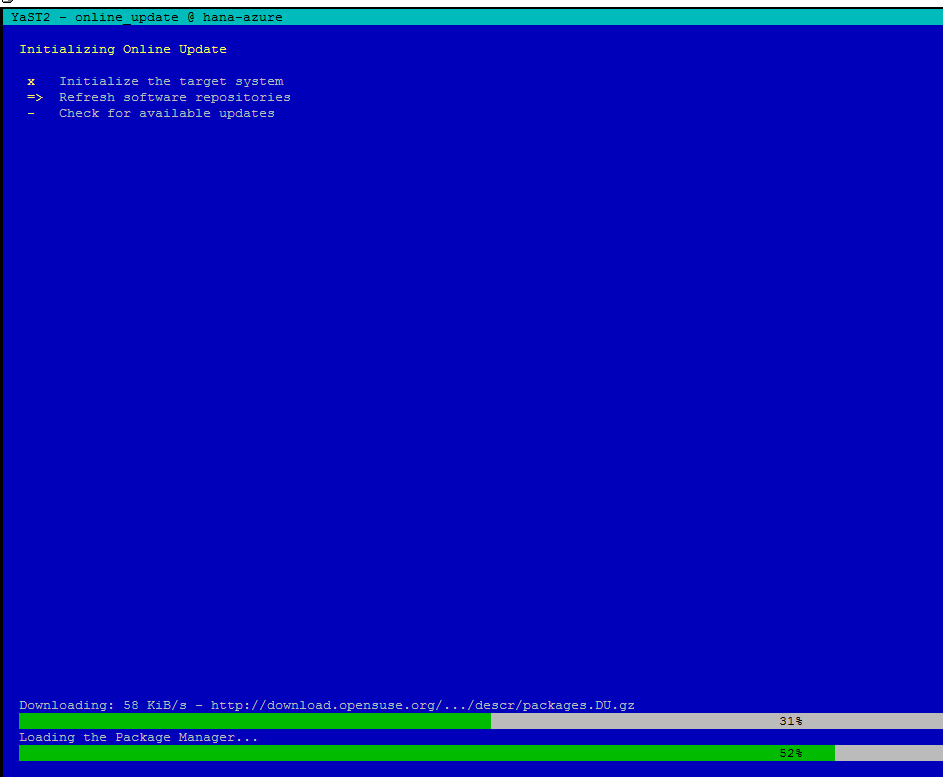
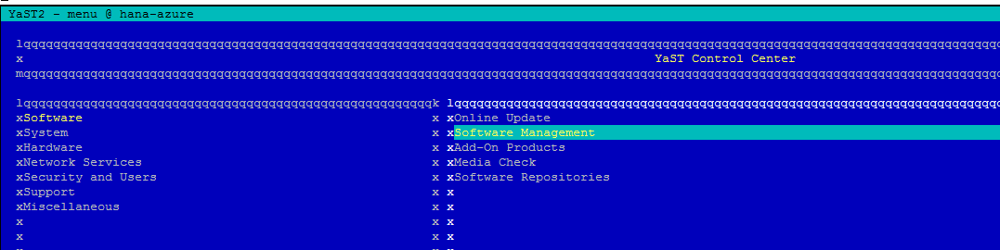
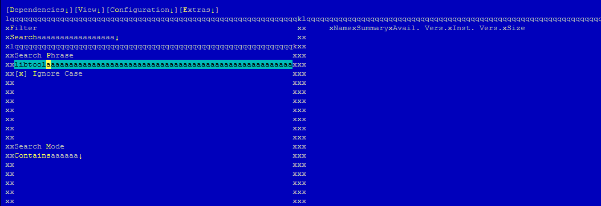
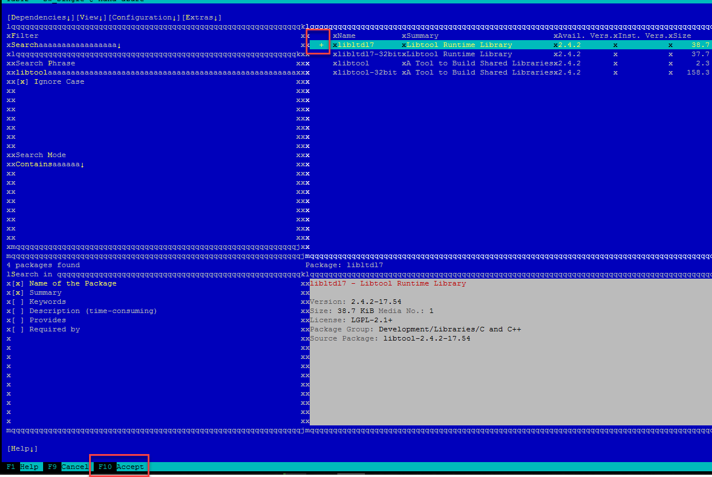

## Prerequisites  
 - **Proficiency:** Beginner | Intermediate | Advanced
 - **Tutorials:** [Installing SAP HANA, express edition, on Microsoft Azure and openSUSE](http://www.sap.com/developer/tutorials/hxe-azure-open-suse.html)
 - [**OPTIONAL** - Setup PuTTY and WinSCP to access your HANA Express Edition instance on Google Cloud Platform](http://www.sap.com/developer/tutorials/hxe-gcp-setup-putty-winscp-windows.html)  


## Next Steps
 - [Extract the binaries and execute the installation script](http://www.sap.com/developer/tutorials/hxe-azure-opensuse-extract-install.html)


## Details
### You will learn  
This tutorial will guide you through the installation of the dependencies needed for SAP HANA, express edition, to run on Open SUSE.

### Time to Complete
**15 Min**

---


[ACCORDION-BEGIN [Step 1: ](Update repositories)]

Begin by updating repositories. In a command line (using PuTTY or any other SSH client), enter the following commands:

```ssh
sudo su –
yast
```

Choose `Software`->`Online Update`


Wait for `YaST` to initialize, refresh and check for available updates:



And accept using **F10**


Once installation is complete, press **F** to finish:


>Note: Restart the system if necessary.

[DONE]
[ACCORDION-END]

[ACCORDION-BEGIN [Step 2: ](Install libtool)]

Back in the initial screen, use go into `Software -> Software Management`



Enter `libtool` and press Enter



Press enter on `libltdl7` and then F10 to accept



[DONE]
[ACCORDION-END]


## Next Steps
- [Extract the binaries and execute the installation script](http://www.sap.com/developer/tutorials/hxe-azure-opensuse-extract-install.html)
