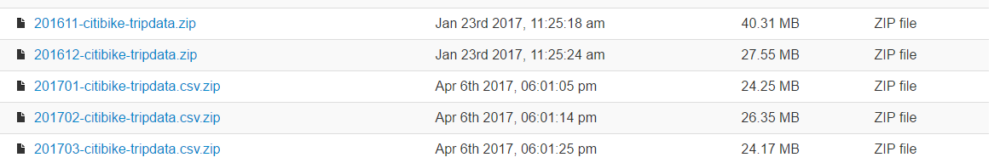
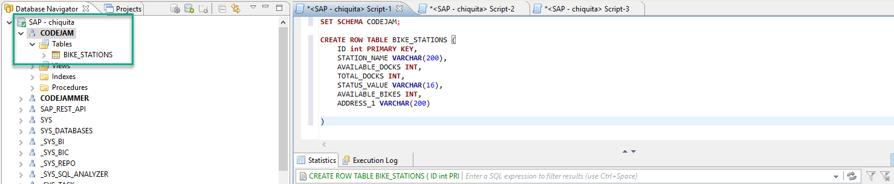
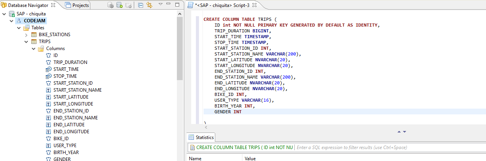
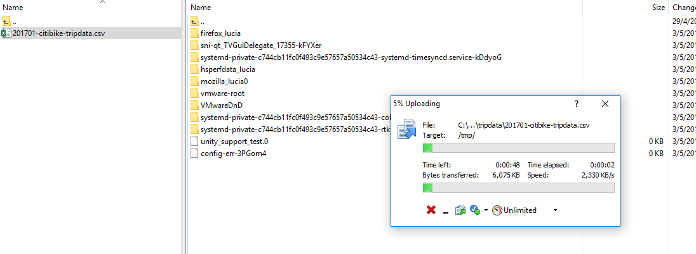
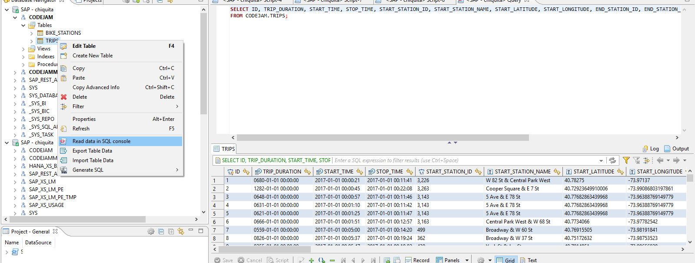

## Prerequisites  
 - **Proficiency:** Beginner | Intermediate | Advanced
 - **Tutorials:** [Download and connect SQL client ](http://www.sap.com/developer/tutorials/hxe-cj1-download-sql-client.html)


## Next Steps
 - Select a tutorial group from the [Tutorial Navigator](http://www.sap.com/developer/tutorial-navigator.html) or the [Tutorial Catalog](https://www.sap.com/developer/tutorial-navigator.tutorials.html)

## Details
### You will learn  
Describe what the user will learn from your tutorial and what the outcome will be.

### Time to Complete
**15 Min**

---

[ACCORDION-BEGIN [Step 1: ](Download sample data from NYC Bikeshare)]

You will use open data from the New York City `citibikes` [open data](https://www.citibikenyc.com/system-data). Take a look at the [Data License Agreement](https://www.citibikenyc.com/data-sharing-policy) and proceed to the [download bucket](https://s3.amazonaws.com/tripdata/index.html).



Download any of the files starting with a date and ending on `.zip`.

[DONE]
[ACCORDION-END]

[ACCORDION-BEGIN [Step 2: ](Create a Master Data Table)]

Before you continue with the upload of the data, you will need to create the tables. In this model, you will have a station master-data table that will be filled with records from this JSON feed: `https://feeds.citibikenyc.com/stations/stations.json`. You will then create a transactional table for the trips downloaded in the first step.

In order to create the master data table, execute the following SQL command in a new SQL console:

```SQL
CREATE ROW TABLE BIKE_STATIONS (
	ID int PRIMARY KEY,
	STATION_NAME VARCHAR(200),
	AVAILABLE_DOCKS INT,
	TOTAL_DOCKS INT,
	STATUS_VALUE VARCHAR(16),
	AVAILABLE_BIKES INT,
	ADDRESS_1 VARCHAR(200)

)
```

Make sure the result is successful and refresh the **CODEJAM** schema to make sure your table has been created



[DONE]
[ACCORDION-END]


[ACCORDION-BEGIN [Step 3: ](Insert data into the master data table)]

You will now insert data into the table using the **Insert** statement. There are other ways to insert data into tables and you will also use them in this tutorial. Copy and paste and execute the following into a SQL console.

```SQL
INSERT INTO CODEJAM.BIKE_STATIONS VALUES(72,'W 52 St & 11 Ave',30,39,'In Service',8,'W 52 St & 11 Ave');
INSERT INTO CODEJAM.BIKE_STATIONS VALUES(79,'Franklin St & W Broadway',8,33,'In Service',24,'Franklin St & W Broadway');
INSERT INTO CODEJAM.BIKE_STATIONS VALUES(82,'St James Pl & Pearl St',0,0,'Not In Service',0,'St James Pl & Pearl St');
INSERT INTO CODEJAM.BIKE_STATIONS VALUES(83,'Atlantic Ave & Fort Greene Pl',38,62,'In Service',24,'Atlantic Ave & Fort Greene Pl');
INSERT INTO CODEJAM.BIKE_STATIONS VALUES(116,'W 17 St & 8 Ave',33,39,'In Service',4,'W 17 St & 8 Ave');
INSERT INTO CODEJAM.BIKE_STATIONS VALUES(119,'Park Ave & St Edwards St',9,19,'In Service',9,'Park Ave & St Edwards St');
INSERT INTO CODEJAM.BIKE_STATIONS VALUES(120,'Lexington Ave & Classon Ave',11,19,'In Service',8,'Lexington Ave & Classon Ave');
INSERT INTO CODEJAM.BIKE_STATIONS VALUES(127,'Barrow St & Hudson St',6,31,'In Service',25,'Barrow St & Hudson St');
INSERT INTO CODEJAM.BIKE_STATIONS VALUES(128,'MacDougal St & Prince St',3,30,'In Service',24,'MacDougal St & Prince St');
INSERT INTO CODEJAM.BIKE_STATIONS VALUES(143,'Clinton St & Joralemon St',4,24,'In Service',19,'Clinton St & Joralemon St');
INSERT INTO CODEJAM.BIKE_STATIONS VALUES(144,'Nassau St & Navy St',0,19,'In Service',18,'Nassau St & Navy St');
INSERT INTO CODEJAM.BIKE_STATIONS VALUES(146,'Hudson St & Reade St',26,39,'In Service',13,'Hudson St & Reade St');
INSERT INTO CODEJAM.BIKE_STATIONS VALUES(147,'Greenwich St & Warren St',0,0,'Not In Service',0,'Greenwich St & Warren St');
INSERT INTO CODEJAM.BIKE_STATIONS VALUES(150,'E 2 St & Avenue C',30,31,'In Service',0,'E 2 St & Avenue C');
INSERT INTO CODEJAM.BIKE_STATIONS VALUES(151,'Cleveland Pl & Spring St',19,33,'In Service',13,'Cleveland Pl & Spring St');
INSERT INTO CODEJAM.BIKE_STATIONS VALUES(152,'Warren St & Church St',9,29,'In Service',20,'Warren St & Church St');
INSERT INTO CODEJAM.BIKE_STATIONS VALUES(153,'E 40 St & 5 Ave',7,55,'In Service',46,'E 40 St & 5 Ave');
INSERT INTO CODEJAM.BIKE_STATIONS VALUES(157,'Henry St & Atlantic Ave',18,23,'In Service',5,'Henry St & Atlantic Ave');
INSERT INTO CODEJAM.BIKE_STATIONS VALUES(161,'LaGuardia Pl & W 3 St',10,35,'In Service',22,'LaGuardia Pl & W 3 St');
INSERT INTO CODEJAM.BIKE_STATIONS VALUES(164,'E 47 St & 2 Ave',4,47,'In Service',39,'E 47 St & 2 Ave');
INSERT INTO CODEJAM.BIKE_STATIONS VALUES(167,'E 39 St & 3 Ave',36,45,'In Service',6,'E 39 St & 3 Ave');
INSERT INTO CODEJAM.BIKE_STATIONS VALUES(168,'W 18 St & 6 Ave',16,47,'In Service',26,'W 18 St & 6 Ave');
INSERT INTO CODEJAM.BIKE_STATIONS VALUES(173,'Broadway & W 49 St',18,51,'In Service',29,'Broadway & W 49 St');
INSERT INTO CODEJAM.BIKE_STATIONS VALUES(174,'E 25 St & 1 Ave',29,30,'In Service',1,'E 25 St & 1 Ave');
INSERT INTO CODEJAM.BIKE_STATIONS VALUES(195,'Liberty St & Broadway',3,45,'In Service',41,'Liberty St & Broadway');
INSERT INTO CODEJAM.BIKE_STATIONS VALUES(212,'W 16 St & The High Line',1,28,'In Service',27,'W 16 St & The High Line');
INSERT INTO CODEJAM.BIKE_STATIONS VALUES(216,'Columbia Heights & Cranberry St',8,23,'In Service',13,'Columbia Heights & Cranberry St');
INSERT INTO CODEJAM.BIKE_STATIONS VALUES(217,'Old Fulton St',8,39,'In Service',28,'Old Fulton St');
INSERT INTO CODEJAM.BIKE_STATIONS VALUES(223,'W 13 St & 7 Ave',31,33,'In Service',2,'W 13 St & 7 Ave');
INSERT INTO CODEJAM.BIKE_STATIONS VALUES(224,'Spruce St & Nassau St',24,31,'In Service',4,'Spruce St & Nassau St');
INSERT INTO CODEJAM.BIKE_STATIONS VALUES(225,'W 14 St & The High Line',0,37,'In Service',36,'W 14 St & The High Line');
INSERT INTO CODEJAM.BIKE_STATIONS VALUES(228,'E 48 St & 3 Ave',0,55,'In Service',52,'E 48 St & 3 Ave');
INSERT INTO CODEJAM.BIKE_STATIONS VALUES(229,'Great Jones St',2,23,'In Service',19,'Great Jones St');
INSERT INTO CODEJAM.BIKE_STATIONS VALUES(232,'Cadman Plaza E & Tillary St',22,23,'In Service',1,'Cadman Plaza E & Tillary St');
INSERT INTO CODEJAM.BIKE_STATIONS VALUES(236,'St Marks Pl & 2 Ave',39,39,'In Service',0,'St Marks Pl & 2 Ave');
INSERT INTO CODEJAM.BIKE_STATIONS VALUES(237,'E 11 St & 2 Ave',39,39,'In Service',0,'E 11 St & 2 Ave');
INSERT INTO CODEJAM.BIKE_STATIONS VALUES(238,'Bank St & Washington St',30,31,'In Service',1,'Bank St & Washington St');
INSERT INTO CODEJAM.BIKE_STATIONS VALUES(239,'Willoughby St & Fleet St',0,31,'In Service',31,'Willoughby St & Fleet St');
INSERT INTO CODEJAM.BIKE_STATIONS VALUES(241,'DeKalb Ave & S Portland Ave',6,23,'In Service',16,'DeKalb Ave & S Portland Ave');
INSERT INTO CODEJAM.BIKE_STATIONS VALUES(242,'Carlton Ave & Flushing Ave',2,23,'In Service',20,'Carlton Ave & Flushing Ave');
INSERT INTO CODEJAM.BIKE_STATIONS VALUES(243,'Fulton St & Rockwell Pl',4,31,'In Service',27,'Fulton St & Rockwell Pl');
INSERT INTO CODEJAM.BIKE_STATIONS VALUES(244,'Willoughby Ave & Hall St',18,31,'In Service',12,'Willoughby Ave & Hall St');
INSERT INTO CODEJAM.BIKE_STATIONS VALUES(245,'Myrtle Ave & St Edwards St',15,23,'In Service',7,'Myrtle Ave & St Edwards St');
INSERT INTO CODEJAM.BIKE_STATIONS VALUES(247,'Perry St & Bleecker St',18,20,'In Service',0,'Perry St & Bleecker St');
INSERT INTO CODEJAM.BIKE_STATIONS VALUES(248,'Laight St & Hudson St',0,23,'In Service',22,'Laight St & Hudson St');
INSERT INTO CODEJAM.BIKE_STATIONS VALUES(249,'Harrison St & Hudson St',0,27,'In Service',25,'Harrison St & Hudson St');
INSERT INTO CODEJAM.BIKE_STATIONS VALUES(251,'Mott St & Prince St',26,27,'In Service',1,'Mott St & Prince St');
INSERT INTO CODEJAM.BIKE_STATIONS VALUES(252,'MacDougal St & Washington Sq',27,33,'In Service',3,'MacDougal St & Washington Sq');
INSERT INTO CODEJAM.BIKE_STATIONS VALUES(253,'W 13 St & 5 Ave',7,55,'In Service',48,'W 13 St & 5 Ave');
INSERT INTO CODEJAM.BIKE_STATIONS VALUES(254,'W 11 St & 6 Ave',24,31,'In Service',6,'W 11 St & 6 Ave');
INSERT INTO CODEJAM.BIKE_STATIONS VALUES(257,'Lispenard St & Broadway',1,39,'In Service',38,'Lispenard St & Broadway');
INSERT INTO CODEJAM.BIKE_STATIONS VALUES(258,'DeKalb Ave & Vanderbilt Ave',21,23,'In Service',1,'DeKalb Ave & Vanderbilt Ave');
INSERT INTO CODEJAM.BIKE_STATIONS VALUES(259,'South St & Whitehall St',4,39,'In Service',34,'South St & Whitehall St');
INSERT INTO CODEJAM.BIKE_STATIONS VALUES(260,'Broad St & Bridge St',2,35,'In Service',33,'Broad St & Bridge St');
INSERT INTO CODEJAM.BIKE_STATIONS VALUES(261,'Johnson St & Gold St',25,27,'In Service',2,'Johnson St & Gold St');
INSERT INTO CODEJAM.BIKE_STATIONS VALUES(262,'Washington Park',23,24,'In Service',1,'Washington Park');
INSERT INTO CODEJAM.BIKE_STATIONS VALUES(264,'Maiden Ln & Pearl St',0,27,'In Service',24,'Maiden Ln & Pearl St');
INSERT INTO CODEJAM.BIKE_STATIONS VALUES(265,'Stanton St & Chrystie St',35,35,'In Service',0,'Stanton St & Chrystie St');
INSERT INTO CODEJAM.BIKE_STATIONS VALUES(266,'Avenue D & E 8 St',22,24,'In Service',1,'Avenue D & E 8 St');
INSERT INTO CODEJAM.BIKE_STATIONS VALUES(267,'Broadway & W 36 St',54,57,'In Service',1,'Broadway & W 36 St');
INSERT INTO CODEJAM.BIKE_STATIONS VALUES(268,'Howard St & Centre St',6,27,'In Service',21,'Howard St & Centre St');
INSERT INTO CODEJAM.BIKE_STATIONS VALUES(270,'Adelphi St & Myrtle Ave',22,23,'In Service',1,'Adelphi St & Myrtle Ave');
INSERT INTO CODEJAM.BIKE_STATIONS VALUES(274,'Lafayette Ave & Fort Greene Pl',10,31,'In Service',20,'Lafayette Ave & Fort Greene Pl');
INSERT INTO CODEJAM.BIKE_STATIONS VALUES(275,'Washington Ave & Greene Ave',18,19,'In Service',0,'Washington Ave & Greene Ave');
INSERT INTO CODEJAM.BIKE_STATIONS VALUES(276,'Duane St & Greenwich St',16,25,'In Service',8,'Duane St & Greenwich St');
INSERT INTO CODEJAM.BIKE_STATIONS VALUES(278,'Concord St & Bridge St',9,19,'In Service',9,'Concord St & Bridge St');
INSERT INTO CODEJAM.BIKE_STATIONS VALUES(279,'Peck Slip & Front St',3,36,'In Service',33,'Peck Slip & Front St');
INSERT INTO CODEJAM.BIKE_STATIONS VALUES(280,'E 10 St & 5 Ave',27,31,'In Service',4,'E 10 St & 5 Ave');
INSERT INTO CODEJAM.BIKE_STATIONS VALUES(281,'Grand Army Plaza & Central Park S',46,59,'In Service',13,'Grand Army Plaza & Central Park S');
INSERT INTO CODEJAM.BIKE_STATIONS VALUES(282,'Kent Ave & S 11 St',21,27,'In Service',5,'Kent Ave & S 11 St');
INSERT INTO CODEJAM.BIKE_STATIONS VALUES(284,'Greenwich Ave & 8 Ave',40,43,'In Service',1,'Greenwich Ave & 8 Ave');
INSERT INTO CODEJAM.BIKE_STATIONS VALUES(285,'Broadway & E 14 St',43,47,'In Service',4,'Broadway & E 14 St');
INSERT INTO CODEJAM.BIKE_STATIONS VALUES(289,'Monroe St & Classon Ave',7,19,'In Service',10,'Monroe St & Classon Ave');
INSERT INTO CODEJAM.BIKE_STATIONS VALUES(291,'Madison St & Montgomery St',20,20,'In Service',0,'Madison St & Montgomery St');
INSERT INTO CODEJAM.BIKE_STATIONS VALUES(293,'Lafayette St & E 8 St',40,55,'In Service',12,'Lafayette St & E 8 St');
INSERT INTO CODEJAM.BIKE_STATIONS VALUES(295,'Pike St & E Broadway',18,24,'In Service',6,'Pike St & E Broadway');
INSERT INTO CODEJAM.BIKE_STATIONS VALUES(296,'Division St & Bowery',17,35,'In Service',18,'Division St & Bowery');
INSERT INTO CODEJAM.BIKE_STATIONS VALUES(297,'E 15 St & 3 Ave',27,27,'In Service',0,'E 15 St & 3 Ave');
INSERT INTO CODEJAM.BIKE_STATIONS VALUES(301,'E 2 St & Avenue B',34,37,'In Service',1,'E 2 St & Avenue B');
INSERT INTO CODEJAM.BIKE_STATIONS VALUES(302,'Avenue D & E 3 St',22,23,'In Service',1,'Avenue D & E 3 St');
INSERT INTO CODEJAM.BIKE_STATIONS VALUES(303,'Mercer St & Spring St',4,31,'In Service',24,'Mercer St & Spring St');
INSERT INTO CODEJAM.BIKE_STATIONS VALUES(304,'Broadway & Battery Pl',13,34,'In Service',20,'Broadway & Battery Pl');
INSERT INTO CODEJAM.BIKE_STATIONS VALUES(305,'E 58 St & 3 Ave',12,33,'In Service',17,'E 58 St & 3 Ave');
INSERT INTO CODEJAM.BIKE_STATIONS VALUES(306,'Cliff St & Fulton St',1,37,'In Service',35,'Cliff St & Fulton St');
INSERT INTO CODEJAM.BIKE_STATIONS VALUES(307,'Canal St & Rutgers St',26,29,'In Service',2,'Canal St & Rutgers St');
INSERT INTO CODEJAM.BIKE_STATIONS VALUES(308,'St James Pl & Oliver St',27,27,'In Service',0,'St James Pl & Oliver St');
INSERT INTO CODEJAM.BIKE_STATIONS VALUES(309,'Murray St & West St',1,41,'In Service',39,'Murray St & West St');
INSERT INTO CODEJAM.BIKE_STATIONS VALUES(310,'State St & Smith St',36,36,'In Service',0,'State St & Smith St');
INSERT INTO CODEJAM.BIKE_STATIONS VALUES(311,'Norfolk St & Broome St',30,31,'In Service',0,'Norfolk St & Broome St');
INSERT INTO CODEJAM.BIKE_STATIONS VALUES(312,'Allen St & Stanton St',28,31,'In Service',3,'Allen St & Stanton St');
INSERT INTO CODEJAM.BIKE_STATIONS VALUES(313,'Washington Ave & Park Ave',7,23,'In Service',16,'Washington Ave & Park Ave');
INSERT INTO CODEJAM.BIKE_STATIONS VALUES(314,'Cadman Plaza West & Montague St',24,39,'In Service',14,'Cadman Plaza West & Montague St');
INSERT INTO CODEJAM.BIKE_STATIONS VALUES(315,'South St & Gouverneur Ln',0,29,'In Service',28,'South St & Gouverneur Ln');
INSERT INTO CODEJAM.BIKE_STATIONS VALUES(316,'Fulton St & William St',18,43,'In Service',23,'Fulton St & William St');
INSERT INTO CODEJAM.BIKE_STATIONS VALUES(317,'E 6 St & Avenue B',26,27,'In Service',1,'E 6 St & Avenue B');
INSERT INTO CODEJAM.BIKE_STATIONS VALUES(319,'Fulton St & Broadway',8,33,'In Service',25,'Fulton St & Broadway');
INSERT INTO CODEJAM.BIKE_STATIONS VALUES(320,'Leonard St & Church St',26,39,'In Service',13,'Leonard St & Church St');
INSERT INTO CODEJAM.BIKE_STATIONS VALUES(321,'Cadman Plaza E & Red Cross Pl',0,27,'In Service',27,'Cadman Plaza E & Red Cross Pl');
INSERT INTO CODEJAM.BIKE_STATIONS VALUES(322,'Clinton St & Tillary St',0,0,'Not In Service',0,'Clinton St & Tillary St');
INSERT INTO CODEJAM.BIKE_STATIONS VALUES(323,'Lawrence St & Willoughby St',0,39,'In Service',36,'Lawrence St & Willoughby St');
INSERT INTO CODEJAM.BIKE_STATIONS VALUES(324,'DeKalb Ave & Hudson Ave',1,51,'In Service',48,'DeKalb Ave & Hudson Ave');
INSERT INTO CODEJAM.BIKE_STATIONS VALUES(325,'E 19 St & 3 Ave',30,35,'In Service',5,'E 19 St & 3 Ave');
INSERT INTO CODEJAM.BIKE_STATIONS VALUES(326,'E 11 St & 1 Ave',26,27,'In Service',0,'E 11 St & 1 Ave');
INSERT INTO CODEJAM.BIKE_STATIONS VALUES(327,'Vesey Pl & River Terrace',6,39,'In Service',32,'Vesey Pl & River Terrace');
INSERT INTO CODEJAM.BIKE_STATIONS VALUES(328,'Watts St & Greenwich St',1,23,'In Service',18,'Watts St & Greenwich St');
INSERT INTO CODEJAM.BIKE_STATIONS VALUES(330,'Reade St & Broadway',14,39,'In Service',24,'Reade St & Broadway');
INSERT INTO CODEJAM.BIKE_STATIONS VALUES(331,'Pike St & Monroe St',27,27,'In Service',0,'Pike St & Monroe St');
INSERT INTO CODEJAM.BIKE_STATIONS VALUES(332,'Cherry St',23,24,'In Service',0,'Cherry St');
INSERT INTO CODEJAM.BIKE_STATIONS VALUES(334,'W 20 St & 7 Ave',27,31,'In Service',4,'W 20 St & 7 Ave');
INSERT INTO CODEJAM.BIKE_STATIONS VALUES(335,'Washington Pl & Broadway',0,27,'In Service',26,'Washington Pl & Broadway');
INSERT INTO CODEJAM.BIKE_STATIONS VALUES(336,'Sullivan St & Washington Sq',18,36,'In Service',17,'Sullivan St & Washington Sq');
INSERT INTO CODEJAM.BIKE_STATIONS VALUES(337,'Old Slip & Front St',0,37,'In Service',34,'Old Slip & Front St');
INSERT INTO CODEJAM.BIKE_STATIONS VALUES(339,'Avenue D & E 12 St',21,24,'In Service',0,'Avenue D & E 12 St');
INSERT INTO CODEJAM.BIKE_STATIONS VALUES(340,'Madison St & Clinton St',26,27,'In Service',1,'Madison St & Clinton St');
INSERT INTO CODEJAM.BIKE_STATIONS VALUES(341,'Stanton St & Mangin St',19,19,'In Service',0,'Stanton St & Mangin St');
INSERT INTO CODEJAM.BIKE_STATIONS VALUES(342,'Columbia St & Rivington St',29,29,'In Service',0,'Columbia St & Rivington St');
INSERT INTO CODEJAM.BIKE_STATIONS VALUES(343,'Clinton Ave & Flushing Ave',2,23,'In Service',19,'Clinton Ave & Flushing Ave');
INSERT INTO CODEJAM.BIKE_STATIONS VALUES(344,'Monroe St & Bedford Ave',21,23,'In Service',1,'Monroe St & Bedford Ave');
INSERT INTO CODEJAM.BIKE_STATIONS VALUES(345,'W 13 St & 6 Ave',28,35,'In Service',5,'W 13 St & 6 Ave');
INSERT INTO CODEJAM.BIKE_STATIONS VALUES(346,'Bank St & Hudson St',25,27,'In Service',2,'Bank St & Hudson St');
INSERT INTO CODEJAM.BIKE_STATIONS VALUES(347,'Greenwich St & W Houston St',5,35,'In Service',27,'Greenwich St & W Houston St');
INSERT INTO CODEJAM.BIKE_STATIONS VALUES(348,'W Broadway & Spring St',0,42,'In Service',40,'W Broadway & Spring St');
INSERT INTO CODEJAM.BIKE_STATIONS VALUES(349,'Rivington St & Ridge St',22,23,'In Service',1,'Rivington St & Ridge St');
INSERT INTO CODEJAM.BIKE_STATIONS VALUES(350,'Clinton St & Grand St',27,28,'In Service',0,'Clinton St & Grand St');
INSERT INTO CODEJAM.BIKE_STATIONS VALUES(351,'Front St & Maiden Ln',2,39,'In Service',37,'Front St & Maiden Ln');
INSERT INTO CODEJAM.BIKE_STATIONS VALUES(352,'W 56 St & 6 Ave',0,4,'Not In Service',0,'W 56 St & 6 Ave');
INSERT INTO CODEJAM.BIKE_STATIONS VALUES(353,'S Portland Ave & Hanson Pl',6,27,'In Service',21,'S Portland Ave & Hanson Pl');
INSERT INTO CODEJAM.BIKE_STATIONS VALUES(354,'Emerson Pl & Myrtle Ave',7,23,'In Service',14,'Emerson Pl & Myrtle Ave');
INSERT INTO CODEJAM.BIKE_STATIONS VALUES(355,'Bayard St & Baxter St',7,43,'In Service',33,'Bayard St & Baxter St');
INSERT INTO CODEJAM.BIKE_STATIONS VALUES(356,'Bialystoker Pl & Delancey St',23,23,'In Service',0,'Bialystoker Pl & Delancey St');
INSERT INTO CODEJAM.BIKE_STATIONS VALUES(357,'E 11 St & Broadway',13,27,'In Service',14,'E 11 St & Broadway');
INSERT INTO CODEJAM.BIKE_STATIONS VALUES(358,'Christopher St & Greenwich St',35,36,'In Service',1,'Christopher St & Greenwich St');
INSERT INTO CODEJAM.BIKE_STATIONS VALUES(359,'E 47 St & Park Ave',52,53,'In Service',1,'E 47 St & Park Ave');
INSERT INTO CODEJAM.BIKE_STATIONS VALUES(360,'William St & Pine St',4,39,'In Service',34,'William St & Pine St');
INSERT INTO CODEJAM.BIKE_STATIONS VALUES(361,'Allen St & Hester St',37,43,'In Service',3,'Allen St & Hester St');
INSERT INTO CODEJAM.BIKE_STATIONS VALUES(363,'West Thames St',40,49,'In Service',7,'West Thames St');
INSERT INTO CODEJAM.BIKE_STATIONS VALUES(364,'Lafayette Ave & Classon Ave',27,27,'In Service',0,'Lafayette Ave & Classon Ave');
INSERT INTO CODEJAM.BIKE_STATIONS VALUES(365,'Fulton St & Grand Ave',26,31,'In Service',4,'Fulton St & Grand Ave');
INSERT INTO CODEJAM.BIKE_STATIONS VALUES(366,'Clinton Ave & Myrtle Ave',30,33,'In Service',3,'Clinton Ave & Myrtle Ave');
INSERT INTO CODEJAM.BIKE_STATIONS VALUES(368,'Carmine St & 6 Ave',23,39,'In Service',12,'Carmine St & 6 Ave');
INSERT INTO CODEJAM.BIKE_STATIONS VALUES(369,'Washington Pl & 6 Ave',30,35,'In Service',4,'Washington Pl & 6 Ave');
INSERT INTO CODEJAM.BIKE_STATIONS VALUES(372,'Franklin Ave & Myrtle Ave',11,27,'In Service',15,'Franklin Ave & Myrtle Ave');
INSERT INTO CODEJAM.BIKE_STATIONS VALUES(373,'Willoughby Ave & Walworth St',11,19,'In Service',7,'Willoughby Ave & Walworth St');
INSERT INTO CODEJAM.BIKE_STATIONS VALUES(376,'John St & William St',0,43,'In Service',43,'John St & William St');
INSERT INTO CODEJAM.BIKE_STATIONS VALUES(377,'6 Ave & Canal St',44,47,'In Service',3,'6 Ave & Canal St');
INSERT INTO CODEJAM.BIKE_STATIONS VALUES(379,'W 31 St & 7 Ave',37,42,'In Service',4,'W 31 St & 7 Ave');
INSERT INTO CODEJAM.BIKE_STATIONS VALUES(380,'W 4 St & 7 Ave S',30,39,'In Service',0,'W 4 St & 7 Ave S');
INSERT INTO CODEJAM.BIKE_STATIONS VALUES(382,'University Pl & E 14 St',27,36,'In Service',9,'University Pl & E 14 St');
INSERT INTO CODEJAM.BIKE_STATIONS VALUES(383,'Greenwich Ave & Charles St',31,39,'In Service',6,'Greenwich Ave & Charles St');
INSERT INTO CODEJAM.BIKE_STATIONS VALUES(384,'Fulton St & Washington Ave',16,31,'In Service',15,'Fulton St & Washington Ave');
INSERT INTO CODEJAM.BIKE_STATIONS VALUES(385,'E 55 St & 2 Ave',12,29,'In Service',14,'E 55 St & 2 Ave');
INSERT INTO CODEJAM.BIKE_STATIONS VALUES(386,'Centre St & Worth St',2,43,'In Service',41,'Centre St & Worth St');
INSERT INTO CODEJAM.BIKE_STATIONS VALUES(387,'Centre St & Chambers St',5,39,'In Service',33,'Centre St & Chambers St');
INSERT INTO CODEJAM.BIKE_STATIONS VALUES(388,'W 26 St & 10 Ave',2,35,'In Service',33,'W 26 St & 10 Ave');
INSERT INTO CODEJAM.BIKE_STATIONS VALUES(389,'Broadway & Berry St',25,27,'In Service',1,'Broadway & Berry St');
INSERT INTO CODEJAM.BIKE_STATIONS VALUES(390,'Duffield St & Willoughby St',0,31,'In Service',29,'Duffield St & Willoughby St');
INSERT INTO CODEJAM.BIKE_STATIONS VALUES(391,'Clark St & Henry St',10,31,'In Service',21,'Clark St & Henry St');
INSERT INTO CODEJAM.BIKE_STATIONS VALUES(392,'Jay St & Tech Pl',7,32,'In Service',24,'Jay St & Tech Pl');
INSERT INTO CODEJAM.BIKE_STATIONS VALUES(393,'E 5 St & Avenue C',30,31,'In Service',1,'E 5 St & Avenue C');
INSERT INTO CODEJAM.BIKE_STATIONS VALUES(394,'E 9 St & Avenue C',31,32,'In Service',1,'E 9 St & Avenue C');
INSERT INTO CODEJAM.BIKE_STATIONS VALUES(395,'Bond St & Schermerhorn St',5,30,'In Service',24,'Bond St & Schermerhorn St');
INSERT INTO CODEJAM.BIKE_STATIONS VALUES(396,'Lefferts Pl & Franklin Ave',7,25,'In Service',15,'Lefferts Pl & Franklin Ave');
INSERT INTO CODEJAM.BIKE_STATIONS VALUES(397,'Fulton St & Clermont Ave',22,27,'In Service',5,'Fulton St & Clermont Ave');
INSERT INTO CODEJAM.BIKE_STATIONS VALUES(398,'Atlantic Ave & Furman St',11,31,'In Service',20,'Atlantic Ave & Furman St');
INSERT INTO CODEJAM.BIKE_STATIONS VALUES(399,'Lafayette Ave & St James Pl',11,27,'In Service',16,'Lafayette Ave & St James Pl');
INSERT INTO CODEJAM.BIKE_STATIONS VALUES(400,'Pitt St & Stanton St',15,15,'In Service',0,'Pitt St & Stanton St');
INSERT INTO CODEJAM.BIKE_STATIONS VALUES(401,'Allen St & Rivington St',36,42,'In Service',6,'Allen St & Rivington St');
INSERT INTO CODEJAM.BIKE_STATIONS VALUES(402,'Broadway & E 22 St',38,40,'In Service',2,'Broadway & E 22 St');
INSERT INTO CODEJAM.BIKE_STATIONS VALUES(403,'E 2 St & 2 Ave',29,31,'In Service',2,'E 2 St & 2 Ave');
INSERT INTO CODEJAM.BIKE_STATIONS VALUES(405,'Washington St & Gansevoort St',35,40,'In Service',4,'Washington St & Gansevoort St');
INSERT INTO CODEJAM.BIKE_STATIONS VALUES(406,'Hicks St & Montague St',22,34,'In Service',9,'Hicks St & Montague St');
INSERT INTO CODEJAM.BIKE_STATIONS VALUES(407,'Henry St & Poplar St',18,37,'In Service',19,'Henry St & Poplar St');
INSERT INTO CODEJAM.BIKE_STATIONS VALUES(408,'Market St & Cherry St',22,23,'In Service',0,'Market St & Cherry St');
INSERT INTO CODEJAM.BIKE_STATIONS VALUES(409,'DeKalb Ave & Skillman St',10,19,'In Service',8,'DeKalb Ave & Skillman St');
INSERT INTO CODEJAM.BIKE_STATIONS VALUES(410,'Suffolk St & Stanton St',33,35,'In Service',0,'Suffolk St & Stanton St');
INSERT INTO CODEJAM.BIKE_STATIONS VALUES(411,'E 6 St & Avenue D',23,23,'In Service',0,'E 6 St & Avenue D');
INSERT INTO CODEJAM.BIKE_STATIONS VALUES(412,'Forsyth St & Canal St',25,29,'In Service',2,'Forsyth St & Canal St');
INSERT INTO CODEJAM.BIKE_STATIONS VALUES(414,'Pearl St & Anchorage Pl',0,24,'In Service',22,'Pearl St & Anchorage Pl');
INSERT INTO CODEJAM.BIKE_STATIONS VALUES(415,'Pearl St & Hanover Square',1,42,'In Service',41,'Pearl St & Hanover Square');
INSERT INTO CODEJAM.BIKE_STATIONS VALUES(416,'Cumberland St & Lafayette Ave',22,31,'In Service',8,'Cumberland St & Lafayette Ave');
INSERT INTO CODEJAM.BIKE_STATIONS VALUES(417,'Barclay St & Church St',11,23,'In Service',12,'Barclay St & Church St');
INSERT INTO CODEJAM.BIKE_STATIONS VALUES(418,'Front St & Gold St',0,23,'In Service',22,'Front St & Gold St');
INSERT INTO CODEJAM.BIKE_STATIONS VALUES(419,'Carlton Ave & Park Ave',9,23,'In Service',13,'Carlton Ave & Park Ave');
INSERT INTO CODEJAM.BIKE_STATIONS VALUES(420,'Clermont Ave & Lafayette Ave',20,23,'In Service',3,'Clermont Ave & Lafayette Ave');
INSERT INTO CODEJAM.BIKE_STATIONS VALUES(421,'Clermont Ave & Park Ave',11,19,'In Service',8,'Clermont Ave & Park Ave');
INSERT INTO CODEJAM.BIKE_STATIONS VALUES(422,'W 59 St & 10 Ave',54,55,'In Service',1,'W 59 St & 10 Ave');
INSERT INTO CODEJAM.BIKE_STATIONS VALUES(423,'W 54 St & 9 Ave',34,39,'In Service',4,'W 54 St & 9 Ave');
INSERT INTO CODEJAM.BIKE_STATIONS VALUES(426,'West St & Chambers St',21,31,'In Service',6,'West St & Chambers St');
INSERT INTO CODEJAM.BIKE_STATIONS VALUES(427,'Bus Slip & State St',11,47,'In Service',35,'Bus Slip & State St');
INSERT INTO CODEJAM.BIKE_STATIONS VALUES(428,'E 3 St & 1 Ave',31,31,'In Service',0,'E 3 St & 1 Ave');
INSERT INTO CODEJAM.BIKE_STATIONS VALUES(430,'York St & Jay St',7,27,'In Service',19,'York St & Jay St');
INSERT INTO CODEJAM.BIKE_STATIONS VALUES(432,'E 7 St & Avenue A',30,31,'In Service',0,'E 7 St & Avenue A');
INSERT INTO CODEJAM.BIKE_STATIONS VALUES(433,'E 13 St & Avenue A',39,39,'In Service',0,'E 13 St & Avenue A');
INSERT INTO CODEJAM.BIKE_STATIONS VALUES(434,'9 Ave & W 18 St',1,27,'In Service',22,'9 Ave & W 18 St');
INSERT INTO CODEJAM.BIKE_STATIONS VALUES(435,'W 21 St & 6 Ave',1,47,'In Service',43,'W 21 St & 6 Ave');
INSERT INTO CODEJAM.BIKE_STATIONS VALUES(436,'Hancock St & Bedford Ave',16,27,'In Service',10,'Hancock St & Bedford Ave');
INSERT INTO CODEJAM.BIKE_STATIONS VALUES(437,'Macon St & Nostrand Ave',6,24,'In Service',18,'Macon St & Nostrand Ave');
INSERT INTO CODEJAM.BIKE_STATIONS VALUES(438,'St Marks Pl & 1 Ave',27,27,'In Service',0,'St Marks Pl & 1 Ave');
INSERT INTO CODEJAM.BIKE_STATIONS VALUES(439,'E 4 St & 2 Ave',38,39,'In Service',1,'E 4 St & 2 Ave');
INSERT INTO CODEJAM.BIKE_STATIONS VALUES(440,'E 45 St & 3 Ave',8,32,'In Service',23,'E 45 St & 3 Ave');
INSERT INTO CODEJAM.BIKE_STATIONS VALUES(441,'E 52 St & 2 Ave',7,35,'In Service',28,'E 52 St & 2 Ave');
INSERT INTO CODEJAM.BIKE_STATIONS VALUES(442,'W 27 St & 7 Ave',41,51,'In Service',9,'W 27 St & 7 Ave');
INSERT INTO CODEJAM.BIKE_STATIONS VALUES(443,'Bedford Ave & S 9 St',10,23,'In Service',12,'Bedford Ave & S 9 St');
INSERT INTO CODEJAM.BIKE_STATIONS VALUES(444,'Broadway & W 24 St',5,5,'Not In Service',0,'Broadway & W 24 St');
INSERT INTO CODEJAM.BIKE_STATIONS VALUES(445,'E 10 St & Avenue A',41,42,'In Service',0,'E 10 St & Avenue A');
INSERT INTO CODEJAM.BIKE_STATIONS VALUES(446,'W 24 St & 7 Ave',34,39,'In Service',5,'W 24 St & 7 Ave');
INSERT INTO CODEJAM.BIKE_STATIONS VALUES(447,'8 Ave & W 52 St',25,31,'In Service',4,'8 Ave & W 52 St');
INSERT INTO CODEJAM.BIKE_STATIONS VALUES(448,'W 37 St & 10 Ave',26,31,'In Service',2,'W 37 St & 10 Ave');
INSERT INTO CODEJAM.BIKE_STATIONS VALUES(449,'W 52 St & 9 Ave',26,31,'In Service',4,'W 52 St & 9 Ave');
INSERT INTO CODEJAM.BIKE_STATIONS VALUES(450,'W 49 St & 8 Ave',53,59,'In Service',1,'W 49 St & 8 Ave');
INSERT INTO CODEJAM.BIKE_STATIONS VALUES(453,'W 22 St & 8 Ave',35,39,'In Service',0,'W 22 St & 8 Ave');
INSERT INTO CODEJAM.BIKE_STATIONS VALUES(454,'E 51 St & 1 Ave',14,35,'In Service',19,'E 51 St & 1 Ave');
INSERT INTO CODEJAM.BIKE_STATIONS VALUES(455,'1 Ave & E 44 St',8,39,'In Service',31,'1 Ave & E 44 St');
INSERT INTO CODEJAM.BIKE_STATIONS VALUES(456,'E 53 St & Madison Ave',15,15,'Not In Service',0,'E 53 St & Madison Ave');
INSERT INTO CODEJAM.BIKE_STATIONS VALUES(457,'Broadway & W 58 St',33,39,'In Service',6,'Broadway & W 58 St');
INSERT INTO CODEJAM.BIKE_STATIONS VALUES(458,'11 Ave & W 27 St',6,31,'In Service',23,'11 Ave & W 27 St');
INSERT INTO CODEJAM.BIKE_STATIONS VALUES(459,'W 20 St & 11 Ave',1,49,'In Service',41,'W 20 St & 11 Ave');
INSERT INTO CODEJAM.BIKE_STATIONS VALUES(460,'S 4 St & Wythe Ave',16,23,'In Service',6,'S 4 St & Wythe Ave');
INSERT INTO CODEJAM.BIKE_STATIONS VALUES(461,'E 20 St & 2 Ave',36,39,'In Service',3,'E 20 St & 2 Ave');
INSERT INTO CODEJAM.BIKE_STATIONS VALUES(462,'W 22 St & 10 Ave',38,47,'In Service',8,'W 22 St & 10 Ave');
INSERT INTO CODEJAM.BIKE_STATIONS VALUES(465,'Broadway & W 41 St',33,39,'In Service',3,'Broadway & W 41 St');
INSERT INTO CODEJAM.BIKE_STATIONS VALUES(466,'W 25 St & 6 Ave',5,35,'In Service',28,'W 25 St & 6 Ave');
INSERT INTO CODEJAM.BIKE_STATIONS VALUES(467,'Dean St & 4 Ave',0,34,'In Service',34,'Dean St & 4 Ave');
INSERT INTO CODEJAM.BIKE_STATIONS VALUES(468,'Broadway & W 55 St',39,59,'In Service',20,'Broadway & W 55 St');
INSERT INTO CODEJAM.BIKE_STATIONS VALUES(469,'Broadway & W 53 St',11,57,'In Service',44,'Broadway & W 53 St');
INSERT INTO CODEJAM.BIKE_STATIONS VALUES(470,'W 20 St & 8 Ave',33,37,'In Service',3,'W 20 St & 8 Ave');
INSERT INTO CODEJAM.BIKE_STATIONS VALUES(471,'Grand St & Havemeyer St',19,31,'In Service',12,'Grand St & Havemeyer St');
INSERT INTO CODEJAM.BIKE_STATIONS VALUES(472,'E 32 St & Park Ave',27,41,'In Service',11,'E 32 St & Park Ave');
INSERT INTO CODEJAM.BIKE_STATIONS VALUES(473,'Rivington St & Chrystie St',33,38,'In Service',4,'Rivington St & Chrystie St');
INSERT INTO CODEJAM.BIKE_STATIONS VALUES(474,'5 Ave & E 29 St',3,39,'In Service',36,'5 Ave & E 29 St');
INSERT INTO CODEJAM.BIKE_STATIONS VALUES(476,'E 31 St & 3 Ave',41,47,'In Service',6,'E 31 St & 3 Ave');
INSERT INTO CODEJAM.BIKE_STATIONS VALUES(477,'W 41 St & 8 Ave',57,59,'In Service',2,'W 41 St & 8 Ave');
INSERT INTO CODEJAM.BIKE_STATIONS VALUES(478,'11 Ave & W 41 St',28,31,'In Service',3,'11 Ave & W 41 St');
INSERT INTO CODEJAM.BIKE_STATIONS VALUES(479,'9 Ave & W 45 St',31,31,'In Service',0,'9 Ave & W 45 St');
INSERT INTO CODEJAM.BIKE_STATIONS VALUES(480,'W 53 St & 10 Ave',19,27,'In Service',7,'W 53 St & 10 Ave');
INSERT INTO CODEJAM.BIKE_STATIONS VALUES(481,'S 3 St & Bedford Ave',25,25,'In Service',0,'S 3 St & Bedford Ave');
INSERT INTO CODEJAM.BIKE_STATIONS VALUES(482,'W 15 St & 7 Ave',32,39,'In Service',4,'W 15 St & 7 Ave');
INSERT INTO CODEJAM.BIKE_STATIONS VALUES(483,'E 12 St & 3 Ave',30,35,'In Service',4,'E 12 St & 3 Ave');
INSERT INTO CODEJAM.BIKE_STATIONS VALUES(484,'W 44 St & 5 Ave',2,44,'In Service',37,'W 44 St & 5 Ave');
INSERT INTO CODEJAM.BIKE_STATIONS VALUES(485,'W 37 St & 5 Ave',25,39,'In Service',13,'W 37 St & 5 Ave');
INSERT INTO CODEJAM.BIKE_STATIONS VALUES(486,'Broadway & W 29 St',3,39,'In Service',36,'Broadway & W 29 St');
INSERT INTO CODEJAM.BIKE_STATIONS VALUES(487,'E 20 St & FDR Drive',35,36,'In Service',1,'E 20 St & FDR Drive');
INSERT INTO CODEJAM.BIKE_STATIONS VALUES(488,'W 39 St & 9 Ave',34,41,'In Service',3,'W 39 St & 9 Ave');
INSERT INTO CODEJAM.BIKE_STATIONS VALUES(490,'8 Ave & W 33 St',50,59,'In Service',5,'8 Ave & W 33 St');
INSERT INTO CODEJAM.BIKE_STATIONS VALUES(491,'E 24 St & Park Ave S',0,53,'In Service',52,'E 24 St & Park Ave S');
INSERT INTO CODEJAM.BIKE_STATIONS VALUES(492,'W 33 St & 7 Ave',41,49,'In Service',8,'W 33 St & 7 Ave');
INSERT INTO CODEJAM.BIKE_STATIONS VALUES(493,'W 45 St & 6 Ave',3,3,'Not In Service',0,'W 45 St & 6 Ave');
INSERT INTO CODEJAM.BIKE_STATIONS VALUES(494,'W 26 St & 8 Ave',28,35,'In Service',2,'W 26 St & 8 Ave');
INSERT INTO CODEJAM.BIKE_STATIONS VALUES(495,'W 47 St & 10 Ave',21,25,'In Service',3,'W 47 St & 10 Ave');
INSERT INTO CODEJAM.BIKE_STATIONS VALUES(496,'E 16 St & 5 Ave',1,47,'In Service',45,'E 16 St & 5 Ave');
INSERT INTO CODEJAM.BIKE_STATIONS VALUES(497,'E 17 St & Broadway',6,59,'In Service',53,'E 17 St & Broadway');
INSERT INTO CODEJAM.BIKE_STATIONS VALUES(498,'Broadway & W 32 St',23,30,'In Service',6,'Broadway & W 32 St');
INSERT INTO CODEJAM.BIKE_STATIONS VALUES(499,'Broadway & W 60 St',31,36,'In Service',1,'Broadway & W 60 St');
INSERT INTO CODEJAM.BIKE_STATIONS VALUES(500,'Broadway & W 51 St',13,52,'In Service',39,'Broadway & W 51 St');
INSERT INTO CODEJAM.BIKE_STATIONS VALUES(501,'FDR Drive & E 35 St',32,43,'In Service',8,'FDR Drive & E 35 St');
INSERT INTO CODEJAM.BIKE_STATIONS VALUES(502,'Henry St & Grand St',29,30,'In Service',1,'Henry St & Grand St');
INSERT INTO CODEJAM.BIKE_STATIONS VALUES(503,'E 20 St & Park Ave',0,29,'In Service',28,'E 20 St & Park Ave');
INSERT INTO CODEJAM.BIKE_STATIONS VALUES(504,'1 Ave & E 16 St',45,45,'In Service',0,'1 Ave & E 16 St');
INSERT INTO CODEJAM.BIKE_STATIONS VALUES(505,'6 Ave & W 33 St',17,36,'In Service',12,'6 Ave & W 33 St');
INSERT INTO CODEJAM.BIKE_STATIONS VALUES(507,'E 25 St & 2 Ave',37,47,'In Service',10,'E 25 St & 2 Ave');
INSERT INTO CODEJAM.BIKE_STATIONS VALUES(508,'W 46 St & 11 Ave',24,24,'Not In Service',0,'W 46 St & 11 Ave');
INSERT INTO CODEJAM.BIKE_STATIONS VALUES(509,'9 Ave & W 22 St',28,36,'In Service',6,'9 Ave & W 22 St');
INSERT INTO CODEJAM.BIKE_STATIONS VALUES(511,'E 14 St & Avenue B',31,33,'In Service',2,'E 14 St & Avenue B');
INSERT INTO CODEJAM.BIKE_STATIONS VALUES(513,'W 56 St & 10 Ave',23,27,'In Service',3,'W 56 St & 10 Ave');
INSERT INTO CODEJAM.BIKE_STATIONS VALUES(514,'12 Ave & W 40 St',45,53,'In Service',7,'12 Ave & W 40 St');
INSERT INTO CODEJAM.BIKE_STATIONS VALUES(515,'W 43 St & 10 Ave',31,35,'In Service',3,'W 43 St & 10 Ave');
INSERT INTO CODEJAM.BIKE_STATIONS VALUES(516,'E 47 St & 1 Ave',5,31,'In Service',26,'E 47 St & 1 Ave');
INSERT INTO CODEJAM.BIKE_STATIONS VALUES(517,'Pershing Square South',50,59,'In Service',7,'Pershing Square South');
INSERT INTO CODEJAM.BIKE_STATIONS VALUES(518,'E 39 St & 2 Ave',29,39,'In Service',9,'E 39 St & 2 Ave');
INSERT INTO CODEJAM.BIKE_STATIONS VALUES(519,'Pershing Square North',46,61,'In Service',14,'Pershing Square North');
INSERT INTO CODEJAM.BIKE_STATIONS VALUES(520,'W 52 St & 5 Ave',14,39,'In Service',25,'W 52 St & 5 Ave');
INSERT INTO CODEJAM.BIKE_STATIONS VALUES(522,'E 51 St & Lexington Ave',4,51,'In Service',45,'E 51 St & Lexington Ave');
INSERT INTO CODEJAM.BIKE_STATIONS VALUES(523,'W 38 St & 8 Ave',48,51,'In Service',2,'W 38 St & 8 Ave');
INSERT INTO CODEJAM.BIKE_STATIONS VALUES(524,'W 43 St & 6 Ave',36,55,'In Service',16,'W 43 St & 6 Ave');
INSERT INTO CODEJAM.BIKE_STATIONS VALUES(525,'W 34 St & 11 Ave',34,39,'In Service',5,'W 34 St & 11 Ave');
INSERT INTO CODEJAM.BIKE_STATIONS VALUES(526,'E 33 St & 5 Ave',1,39,'In Service',37,'E 33 St & 5 Ave');
INSERT INTO CODEJAM.BIKE_STATIONS VALUES(527,'E 33 St & 2 Ave',51,59,'In Service',4,'E 33 St & 2 Ave');
INSERT INTO CODEJAM.BIKE_STATIONS VALUES(528,'2 Ave & E 31 St',32,39,'In Service',7,'2 Ave & E 31 St');
INSERT INTO CODEJAM.BIKE_STATIONS VALUES(529,'W 42 St & 8 Ave',35,41,'In Service',2,'W 42 St & 8 Ave');
INSERT INTO CODEJAM.BIKE_STATIONS VALUES(530,'11 Ave & W 59 St',31,36,'In Service',1,'11 Ave & W 59 St');
INSERT INTO CODEJAM.BIKE_STATIONS VALUES(531,'Forsyth St & Broome St',37,39,'In Service',2,'Forsyth St & Broome St');
INSERT INTO CODEJAM.BIKE_STATIONS VALUES(532,'S 5 Pl & S 4 St',28,43,'In Service',15,'S 5 Pl & S 4 St');
INSERT INTO CODEJAM.BIKE_STATIONS VALUES(534,'Water - Whitehall Plaza',3,31,'In Service',27,'Water - Whitehall Plaza');
INSERT INTO CODEJAM.BIKE_STATIONS VALUES(536,'1 Ave & E 30 St',12,29,'In Service',15,'1 Ave & E 30 St');
INSERT INTO CODEJAM.BIKE_STATIONS VALUES(537,'Lexington Ave & E 24 St',1,39,'In Service',34,'Lexington Ave & E 24 St');
INSERT INTO CODEJAM.BIKE_STATIONS VALUES(539,'Metropolitan Ave & Bedford Ave',13,31,'In Service',18,'Metropolitan Ave & Bedford Ave');
INSERT INTO CODEJAM.BIKE_STATIONS VALUES(540,'Lexington Ave & E 29 St',7,30,'In Service',22,'Lexington Ave & E 29 St');
INSERT INTO CODEJAM.BIKE_STATIONS VALUES(545,'E 23 St & 1 Ave',25,27,'In Service',2,'E 23 St & 1 Ave');
INSERT INTO CODEJAM.BIKE_STATIONS VALUES(546,'E 30 St & Park Ave S',3,38,'In Service',35,'E 30 St & Park Ave S');
INSERT INTO CODEJAM.BIKE_STATIONS VALUES(2000,'Front St & Washington St',15,21,'Not In Service',0,'Front St & Washington St');
INSERT INTO CODEJAM.BIKE_STATIONS VALUES(2001,'Sands St & Navy St',10,15,'In Service',5,'Sands St & Navy St');
INSERT INTO CODEJAM.BIKE_STATIONS VALUES(2002,'Wythe Ave & Metropolitan Ave',15,27,'In Service',12,'Wythe Ave & Metropolitan Ave');
INSERT INTO CODEJAM.BIKE_STATIONS VALUES(2003,'1 Ave & E 18 St',38,39,'In Service',1,'1 Ave & E 18 St');
INSERT INTO CODEJAM.BIKE_STATIONS VALUES(2004,'6 Ave & Broome St',0,12,'Not In Service',0,'6 Ave & Broome St');
INSERT INTO CODEJAM.BIKE_STATIONS VALUES(2005,'Railroad Ave & Kay Ave',8,12,'In Service',4,'Railroad Ave & Kay Ave');
INSERT INTO CODEJAM.BIKE_STATIONS VALUES(2006,'Central Park S & 6 Ave',27,49,'In Service',18,'Central Park S & 6 Ave');
INSERT INTO CODEJAM.BIKE_STATIONS VALUES(2008,'Little West St & 1 Pl',3,24,'In Service',20,'Little West St & 1 Pl');
INSERT INTO CODEJAM.BIKE_STATIONS VALUES(2009,'Catherine St & Monroe St',35,35,'In Service',0,'Catherine St & Monroe St');
INSERT INTO CODEJAM.BIKE_STATIONS VALUES(2010,'Grand St & Greene St',1,39,'In Service',36,'Grand St & Greene St');
INSERT INTO CODEJAM.BIKE_STATIONS VALUES(2012,'E 27 St & 1 Ave',34,36,'In Service',2,'E 27 St & 1 Ave');
INSERT INTO CODEJAM.BIKE_STATIONS VALUES(2021,'W 45 St & 8 Ave',42,43,'In Service',0,'W 45 St & 8 Ave');
INSERT INTO CODEJAM.BIKE_STATIONS VALUES(2022,'E 60 St & York Ave',31,33,'In Service',2,'E 60 St & York Ave');
INSERT INTO CODEJAM.BIKE_STATIONS VALUES(2023,'E 55 St & Lexington Ave',11,36,'In Service',25,'E 55 St & Lexington Ave');
INSERT INTO CODEJAM.BIKE_STATIONS VALUES(3002,'South End Ave & Liberty St',10,25,'In Service',15,'South End Ave & Liberty St');
INSERT INTO CODEJAM.BIKE_STATIONS VALUES(3016,'Kent Ave & N 7 St',20,47,'In Service',27,'Kent Ave & N 7 St');
INSERT INTO CODEJAM.BIKE_STATIONS VALUES(3041,'Kingston Ave & Herkimer St',19,24,'In Service',5,'Kingston Ave & Herkimer St');
INSERT INTO CODEJAM.BIKE_STATIONS VALUES(3042,'Fulton St & Utica Ave',4,19,'In Service',15,'Fulton St & Utica Ave');
INSERT INTO CODEJAM.BIKE_STATIONS VALUES(3043,'Lewis Ave & Decatur St',14,19,'In Service',4,'Lewis Ave & Decatur St');
INSERT INTO CODEJAM.BIKE_STATIONS VALUES(3044,'Albany Ave & Fulton St',9,27,'In Service',17,'Albany Ave & Fulton St');
INSERT INTO CODEJAM.BIKE_STATIONS VALUES(3046,'Marcus Garvey Blvd & Macon St',14,19,'In Service',5,'Marcus Garvey Blvd & Macon St');
INSERT INTO CODEJAM.BIKE_STATIONS VALUES(3047,'Halsey St & Tompkins Ave',13,21,'In Service',7,'Halsey St & Tompkins Ave');
INSERT INTO CODEJAM.BIKE_STATIONS VALUES(3048,'Putnam Ave & Nostrand Ave',12,19,'In Service',7,'Putnam Ave & Nostrand Ave');
INSERT INTO CODEJAM.BIKE_STATIONS VALUES(3049,'Cambridge Pl & Gates Ave',14,18,'In Service',3,'Cambridge Pl & Gates Ave');
INSERT INTO CODEJAM.BIKE_STATIONS VALUES(3050,'Putnam Ave & Throop Ave',21,21,'In Service',0,'Putnam Ave & Throop Ave');
INSERT INTO CODEJAM.BIKE_STATIONS VALUES(3052,'Lewis Ave & Madison St',22,23,'In Service',1,'Lewis Ave & Madison St');
INSERT INTO CODEJAM.BIKE_STATIONS VALUES(3053,'Marcy Ave & Lafayette Ave',18,23,'In Service',5,'Marcy Ave & Lafayette Ave');
INSERT INTO CODEJAM.BIKE_STATIONS VALUES(3054,'Greene Ave & Throop Ave',19,19,'In Service',0,'Greene Ave & Throop Ave');
INSERT INTO CODEJAM.BIKE_STATIONS VALUES(3055,'Greene Ave & Nostrand Ave',10,23,'In Service',13,'Greene Ave & Nostrand Ave');
INSERT INTO CODEJAM.BIKE_STATIONS VALUES(3056,'Kosciuszko St & Nostrand Ave',13,23,'In Service',10,'Kosciuszko St & Nostrand Ave');
INSERT INTO CODEJAM.BIKE_STATIONS VALUES(3057,'Kosciuszko St & Tompkins Ave',18,18,'In Service',0,'Kosciuszko St & Tompkins Ave');
INSERT INTO CODEJAM.BIKE_STATIONS VALUES(3058,'Lewis Ave & Kosciuszko St',23,24,'In Service',1,'Lewis Ave & Kosciuszko St');
INSERT INTO CODEJAM.BIKE_STATIONS VALUES(3059,'Pulaski St & Marcus Garvey Blvd',17,19,'In Service',2,'Pulaski St & Marcus Garvey Blvd');
INSERT INTO CODEJAM.BIKE_STATIONS VALUES(3060,'Willoughby Ave & Tompkins Ave',11,19,'In Service',8,'Willoughby Ave & Tompkins Ave');
INSERT INTO CODEJAM.BIKE_STATIONS VALUES(3061,'Throop Ave & Myrtle Ave',17,21,'In Service',4,'Throop Ave & Myrtle Ave');
INSERT INTO CODEJAM.BIKE_STATIONS VALUES(3062,'Myrtle Ave & Marcy Ave',11,23,'In Service',12,'Myrtle Ave & Marcy Ave');
INSERT INTO CODEJAM.BIKE_STATIONS VALUES(3063,'Nostrand Ave & Myrtle Ave',5,20,'In Service',12,'Nostrand Ave & Myrtle Ave');
INSERT INTO CODEJAM.BIKE_STATIONS VALUES(3064,'Myrtle Ave & Lewis Ave',8,23,'In Service',14,'Myrtle Ave & Lewis Ave');
INSERT INTO CODEJAM.BIKE_STATIONS VALUES(3065,'Union Ave & Wallabout St',26,27,'In Service',0,'Union Ave & Wallabout St');
INSERT INTO CODEJAM.BIKE_STATIONS VALUES(3066,'Tompkins Ave & Hopkins St',4,19,'In Service',14,'Tompkins Ave & Hopkins St');
INSERT INTO CODEJAM.BIKE_STATIONS VALUES(3067,'Broadway & Whipple St',7,27,'In Service',20,'Broadway & Whipple St');
INSERT INTO CODEJAM.BIKE_STATIONS VALUES(3068,'Humboldt St & Varet St',6,24,'In Service',18,'Humboldt St & Varet St');
INSERT INTO CODEJAM.BIKE_STATIONS VALUES(3069,'Lorimer St & Broadway',12,25,'In Service',13,'Lorimer St & Broadway');
INSERT INTO CODEJAM.BIKE_STATIONS VALUES(3070,'McKibbin St & Manhattan Ave',22,23,'In Service',1,'McKibbin St & Manhattan Ave');
INSERT INTO CODEJAM.BIKE_STATIONS VALUES(3071,'Boerum St & Broadway',5,19,'In Service',13,'Boerum St & Broadway');
INSERT INTO CODEJAM.BIKE_STATIONS VALUES(3072,'Leonard St & Boerum St',15,24,'In Service',9,'Leonard St & Boerum St');
INSERT INTO CODEJAM.BIKE_STATIONS VALUES(3073,'Division Ave & Hooper St',11,27,'In Service',16,'Division Ave & Hooper St');
INSERT INTO CODEJAM.BIKE_STATIONS VALUES(3074,'Montrose Ave & Bushwick Ave',13,31,'In Service',18,'Montrose Ave & Bushwick Ave');
INSERT INTO CODEJAM.BIKE_STATIONS VALUES(3075,'Division Ave & Marcy Ave',25,33,'In Service',8,'Division Ave & Marcy Ave');
INSERT INTO CODEJAM.BIKE_STATIONS VALUES(3076,'Scholes St & Manhattan Ave',21,24,'In Service',3,'Scholes St & Manhattan Ave');
INSERT INTO CODEJAM.BIKE_STATIONS VALUES(3077,'Stagg St & Union Ave',33,33,'In Service',0,'Stagg St & Union Ave');
INSERT INTO CODEJAM.BIKE_STATIONS VALUES(3078,'Broadway & Roebling St',15,27,'In Service',12,'Broadway & Roebling St');
INSERT INTO CODEJAM.BIKE_STATIONS VALUES(3080,'S 4 St & Rodney St',11,21,'In Service',10,'S 4 St & Rodney St');
INSERT INTO CODEJAM.BIKE_STATIONS VALUES(3081,'Graham Ave & Grand St',13,23,'In Service',9,'Graham Ave & Grand St');
INSERT INTO CODEJAM.BIKE_STATIONS VALUES(3082,'Hope St & Union Ave',15,25,'In Service',9,'Hope St & Union Ave');
INSERT INTO CODEJAM.BIKE_STATIONS VALUES(3083,'Bushwick Ave & Powers St',26,30,'In Service',4,'Bushwick Ave & Powers St');
INSERT INTO CODEJAM.BIKE_STATIONS VALUES(3085,'Roebling St & N 4 St',21,25,'In Service',4,'Roebling St & N 4 St');
INSERT INTO CODEJAM.BIKE_STATIONS VALUES(3086,'Graham Ave & Conselyea St',6,25,'In Service',19,'Graham Ave & Conselyea St');
INSERT INTO CODEJAM.BIKE_STATIONS VALUES(3087,'Metropolitan Ave & Meeker Ave',17,30,'In Service',12,'Metropolitan Ave & Meeker Ave');
INSERT INTO CODEJAM.BIKE_STATIONS VALUES(3088,'Union Ave & Jackson St',12,19,'In Service',7,'Union Ave & Jackson St');
INSERT INTO CODEJAM.BIKE_STATIONS VALUES(3090,'N 8 St & Driggs Ave',0,31,'In Service',30,'N 8 St & Driggs Ave');
INSERT INTO CODEJAM.BIKE_STATIONS VALUES(3091,'Frost St & Meeker St',24,31,'In Service',7,'Frost St & Meeker St');
INSERT INTO CODEJAM.BIKE_STATIONS VALUES(3092,'Berry St & N 8 St',3,27,'In Service',22,'Berry St & N 8 St');
INSERT INTO CODEJAM.BIKE_STATIONS VALUES(3093,'N 6 St & Bedford Ave',2,28,'In Service',26,'N 6 St & Bedford Ave');
INSERT INTO CODEJAM.BIKE_STATIONS VALUES(3094,'Graham Ave & Withers St',17,18,'In Service',1,'Graham Ave & Withers St');
INSERT INTO CODEJAM.BIKE_STATIONS VALUES(3095,'Graham Ave & Herbert St',15,23,'In Service',7,'Graham Ave & Herbert St');
INSERT INTO CODEJAM.BIKE_STATIONS VALUES(3096,'Union Ave & N 12 St',39,39,'In Service',0,'Union Ave & N 12 St');
INSERT INTO CODEJAM.BIKE_STATIONS VALUES(3100,'Nassau Ave & Newell St',36,39,'In Service',2,'Nassau Ave & Newell St');
INSERT INTO CODEJAM.BIKE_STATIONS VALUES(3101,'N 12 St & Bedford Ave',19,27,'In Service',8,'N 12 St & Bedford Ave');
INSERT INTO CODEJAM.BIKE_STATIONS VALUES(3102,'Driggs Ave & Lorimer St',27,27,'In Service',0,'Driggs Ave & Lorimer St');
INSERT INTO CODEJAM.BIKE_STATIONS VALUES(3103,'N 11 St & Wythe Ave',22,27,'In Service',4,'N 11 St & Wythe Ave');
INSERT INTO CODEJAM.BIKE_STATIONS VALUES(3105,'N 15 St & Wythe Ave',8,24,'In Service',16,'N 15 St & Wythe Ave');
INSERT INTO CODEJAM.BIKE_STATIONS VALUES(3106,'Driggs Ave & N Henry St',19,19,'In Service',0,'Driggs Ave & N Henry St');
INSERT INTO CODEJAM.BIKE_STATIONS VALUES(3107,'Bedford Ave & Nassau Ave',15,39,'In Service',23,'Bedford Ave & Nassau Ave');
INSERT INTO CODEJAM.BIKE_STATIONS VALUES(3108,'Nassau Ave & Russell St',22,24,'In Service',0,'Nassau Ave & Russell St');
INSERT INTO CODEJAM.BIKE_STATIONS VALUES(3109,'Banker St & Meserole Ave',17,31,'In Service',13,'Banker St & Meserole Ave');
INSERT INTO CODEJAM.BIKE_STATIONS VALUES(3110,'Meserole Ave & Manhattan Ave',26,27,'In Service',1,'Meserole Ave & Manhattan Ave');
INSERT INTO CODEJAM.BIKE_STATIONS VALUES(3111,'Norman Ave & Leonard St',22,25,'In Service',3,'Norman Ave & Leonard St');
INSERT INTO CODEJAM.BIKE_STATIONS VALUES(3112,'Milton St & Franklin St',5,33,'In Service',28,'Milton St & Franklin St');
INSERT INTO CODEJAM.BIKE_STATIONS VALUES(3113,'Greenpoint Ave & Manhattan Ave',17,27,'In Service',9,'Greenpoint Ave & Manhattan Ave');
INSERT INTO CODEJAM.BIKE_STATIONS VALUES(3114,'India St & East River',23,23,'Not In Service',0,'India St & East River');
INSERT INTO CODEJAM.BIKE_STATIONS VALUES(3115,'India St & Manhattan Ave',19,34,'In Service',13,'India St & Manhattan Ave');
INSERT INTO CODEJAM.BIKE_STATIONS VALUES(3116,'Huron St & Franklin St',24,35,'In Service',10,'Huron St & Franklin St');
INSERT INTO CODEJAM.BIKE_STATIONS VALUES(3117,'Franklin St & Dupont St',22,27,'In Service',5,'Franklin St & Dupont St');
INSERT INTO CODEJAM.BIKE_STATIONS VALUES(3118,'McGuinness Blvd & Eagle St',26,30,'In Service',4,'McGuinness Blvd & Eagle St');
INSERT INTO CODEJAM.BIKE_STATIONS VALUES(3119,'Vernon Blvd & 50 Ave',2,45,'In Service',42,'Vernon Blvd & 50 Ave');
INSERT INTO CODEJAM.BIKE_STATIONS VALUES(3120,'Center Blvd & Borden Ave',10,20,'In Service',10,'Center Blvd & Borden Ave');
INSERT INTO CODEJAM.BIKE_STATIONS VALUES(3121,'Jackson Ave & 46 Rd',18,27,'In Service',9,'Jackson Ave & 46 Rd');
INSERT INTO CODEJAM.BIKE_STATIONS VALUES(3122,'48 Ave & 5 St',1,31,'In Service',30,'48 Ave & 5 St');
INSERT INTO CODEJAM.BIKE_STATIONS VALUES(3123,'31 St & Thomson Ave',15,27,'In Service',11,'31 St & Thomson Ave');
INSERT INTO CODEJAM.BIKE_STATIONS VALUES(3124,'46 Ave & 5 St',22,27,'In Service',4,'46 Ave & 5 St');
INSERT INTO CODEJAM.BIKE_STATIONS VALUES(3125,'45 Rd & 11 St',0,23,'In Service',23,'45 Rd & 11 St');
INSERT INTO CODEJAM.BIKE_STATIONS VALUES(3126,'44 Dr & Jackson Ave',25,34,'In Service',8,'44 Dr & Jackson Ave');
INSERT INTO CODEJAM.BIKE_STATIONS VALUES(3127,'9 St & 44 Rd',18,35,'In Service',17,'9 St & 44 Rd');
INSERT INTO CODEJAM.BIKE_STATIONS VALUES(3128,'21 St & 43 Ave',8,23,'In Service',15,'21 St & 43 Ave');
INSERT INTO CODEJAM.BIKE_STATIONS VALUES(3129,'Queens Plaza North & Crescent St',19,31,'In Service',11,'Queens Plaza North & Crescent St');
INSERT INTO CODEJAM.BIKE_STATIONS VALUES(3130,'21 St & Queens Plaza North',22,31,'In Service',8,'21 St & Queens Plaza North');
INSERT INTO CODEJAM.BIKE_STATIONS VALUES(3131,'E 68 St & 3 Ave',29,30,'In Service',1,'E 68 St & 3 Ave');
INSERT INTO CODEJAM.BIKE_STATIONS VALUES(3132,'E 59 St & Madison Ave',0,7,'Not In Service',0,'E 59 St & Madison Ave');
INSERT INTO CODEJAM.BIKE_STATIONS VALUES(3134,'3 Ave & E 62 St',32,51,'In Service',19,'3 Ave & E 62 St');
INSERT INTO CODEJAM.BIKE_STATIONS VALUES(3135,'E 75 St & 3 Ave',41,41,'In Service',0,'E 75 St & 3 Ave');
INSERT INTO CODEJAM.BIKE_STATIONS VALUES(3136,'5 Ave & E 63 St',26,47,'In Service',20,'5 Ave & E 63 St');
INSERT INTO CODEJAM.BIKE_STATIONS VALUES(3137,'5 Ave & E 73 St',4,31,'In Service',27,'5 Ave & E 73 St');
INSERT INTO CODEJAM.BIKE_STATIONS VALUES(3139,'E 72 St & Park Ave',40,43,'In Service',3,'E 72 St & Park Ave');
INSERT INTO CODEJAM.BIKE_STATIONS VALUES(3140,'1 Ave & E 78 St',54,55,'In Service',1,'1 Ave & E 78 St');
INSERT INTO CODEJAM.BIKE_STATIONS VALUES(3141,'1 Ave & E 68 St',18,59,'In Service',38,'1 Ave & E 68 St');
INSERT INTO CODEJAM.BIKE_STATIONS VALUES(3142,'1 Ave & E 62 St',36,41,'In Service',2,'1 Ave & E 62 St');
INSERT INTO CODEJAM.BIKE_STATIONS VALUES(3143,'5 Ave & E 78 St',36,47,'In Service',11,'5 Ave & E 78 St');
INSERT INTO CODEJAM.BIKE_STATIONS VALUES(3144,'E 81 St & Park Ave',46,46,'In Service',0,'E 81 St & Park Ave');
INSERT INTO CODEJAM.BIKE_STATIONS VALUES(3145,'E 84 St & Park Ave',45,45,'In Service',0,'E 84 St & Park Ave');
INSERT INTO CODEJAM.BIKE_STATIONS VALUES(3146,'E 81 St & 3 Ave',44,47,'In Service',2,'E 81 St & 3 Ave');
INSERT INTO CODEJAM.BIKE_STATIONS VALUES(3147,'E 85 St & 3 Ave',38,39,'In Service',1,'E 85 St & 3 Ave');
INSERT INTO CODEJAM.BIKE_STATIONS VALUES(3148,'E 84 St & 1 Ave',26,27,'In Service',1,'E 84 St & 1 Ave');
INSERT INTO CODEJAM.BIKE_STATIONS VALUES(3150,'E 85 St & York Ave',47,47,'In Service',0,'E 85 St & York Ave');
INSERT INTO CODEJAM.BIKE_STATIONS VALUES(3151,'E 81 St & York Ave',43,43,'In Service',0,'E 81 St & York Ave');
INSERT INTO CODEJAM.BIKE_STATIONS VALUES(3152,'3 Ave & E 71 St',25,27,'In Service',1,'3 Ave & E 71 St');
INSERT INTO CODEJAM.BIKE_STATIONS VALUES(3155,'Lexington Ave & E 63 St',23,39,'In Service',14,'Lexington Ave & E 63 St');
INSERT INTO CODEJAM.BIKE_STATIONS VALUES(3156,'E 72 St & York Ave',32,39,'In Service',4,'E 72 St & York Ave');
INSERT INTO CODEJAM.BIKE_STATIONS VALUES(3157,'East End Ave & E 86 St',19,27,'In Service',6,'East End Ave & E 86 St');
INSERT INTO CODEJAM.BIKE_STATIONS VALUES(3158,'W 63 St & Broadway',31,31,'In Service',0,'W 63 St & Broadway');
INSERT INTO CODEJAM.BIKE_STATIONS VALUES(3159,'W 67 St & Broadway',31,31,'In Service',0,'W 67 St & Broadway');
INSERT INTO CODEJAM.BIKE_STATIONS VALUES(3160,'Central Park West & W 76 St',35,39,'In Service',4,'Central Park West & W 76 St');
INSERT INTO CODEJAM.BIKE_STATIONS VALUES(3161,'W 76 St & Columbus Ave',59,59,'In Service',0,'W 76 St & Columbus Ave');
INSERT INTO CODEJAM.BIKE_STATIONS VALUES(3162,'W 78 St & Broadway',35,39,'In Service',3,'W 78 St & Broadway');
INSERT INTO CODEJAM.BIKE_STATIONS VALUES(3163,'Central Park West & W 68 St',41,43,'In Service',2,'Central Park West & W 68 St');
INSERT INTO CODEJAM.BIKE_STATIONS VALUES(3164,'Columbus Ave & W 72 St',39,67,'In Service',26,'Columbus Ave & W 72 St');
INSERT INTO CODEJAM.BIKE_STATIONS VALUES(3165,'Central Park West & W 72 St',41,51,'In Service',9,'Central Park West & W 72 St');
INSERT INTO CODEJAM.BIKE_STATIONS VALUES(3166,'Riverside Dr & W 72 St',40,41,'In Service',0,'Riverside Dr & W 72 St');
INSERT INTO CODEJAM.BIKE_STATIONS VALUES(3167,'Amsterdam Ave & W 73 St',38,55,'In Service',2,'Amsterdam Ave & W 73 St');
INSERT INTO CODEJAM.BIKE_STATIONS VALUES(3168,'Central Park West & W 85 St',28,31,'In Service',2,'Central Park West & W 85 St');
INSERT INTO CODEJAM.BIKE_STATIONS VALUES(3169,'Riverside Dr & W 82 St',39,39,'In Service',0,'Riverside Dr & W 82 St');
INSERT INTO CODEJAM.BIKE_STATIONS VALUES(3170,'W 84 St & Columbus Ave',33,35,'In Service',2,'W 84 St & Columbus Ave');
INSERT INTO CODEJAM.BIKE_STATIONS VALUES(3171,'Amsterdam Ave & W 82 St',39,39,'In Service',0,'Amsterdam Ave & W 82 St');
INSERT INTO CODEJAM.BIKE_STATIONS VALUES(3172,'W 74 St & Columbus Ave',26,27,'In Service',0,'W 74 St & Columbus Ave');
INSERT INTO CODEJAM.BIKE_STATIONS VALUES(3173,'Riverside Blvd & W 67 St',37,39,'In Service',0,'Riverside Blvd & W 67 St');
INSERT INTO CODEJAM.BIKE_STATIONS VALUES(3175,'W 70 St & Amsterdam Ave',25,31,'In Service',6,'W 70 St & Amsterdam Ave');
INSERT INTO CODEJAM.BIKE_STATIONS VALUES(3176,'W 64 St & West End Ave',43,43,'In Service',0,'W 64 St & West End Ave');
INSERT INTO CODEJAM.BIKE_STATIONS VALUES(3177,'W 84 St & Broadway',61,63,'In Service',0,'W 84 St & Broadway');
INSERT INTO CODEJAM.BIKE_STATIONS VALUES(3178,'Riverside Dr & W 78 St',37,39,'In Service',0,'Riverside Dr & W 78 St');
INSERT INTO CODEJAM.BIKE_STATIONS VALUES(3179,'Park Ave & Marcus Garvey Blvd',7,23,'In Service',16,'Park Ave & Marcus Garvey Blvd');
INSERT INTO CODEJAM.BIKE_STATIONS VALUES(3180,'Brooklyn Bridge Park - Pier 2',8,31,'In Service',23,'Brooklyn Bridge Park - Pier 2');
INSERT INTO CODEJAM.BIKE_STATIONS VALUES(3182,'Yankee Ferry Terminal',13,42,'In Service',26,'Yankee Ferry Terminal');
INSERT INTO CODEJAM.BIKE_STATIONS VALUES(3183,'Exchange Place',2,30,'In Service',24,'Exchange Place');
INSERT INTO CODEJAM.BIKE_STATIONS VALUES(3184,'Paulus Hook',4,14,'In Service',10,'Paulus Hook');
INSERT INTO CODEJAM.BIKE_STATIONS VALUES(3185,'City Hall',6,22,'In Service',14,'City Hall');
INSERT INTO CODEJAM.BIKE_STATIONS VALUES(3186,'Grove St PATH',18,42,'In Service',22,'Grove St PATH');
INSERT INTO CODEJAM.BIKE_STATIONS VALUES(3187,'Warren St',19,22,'In Service',2,'Warren St');
INSERT INTO CODEJAM.BIKE_STATIONS VALUES(3188,'NJCU',11,18,'In Service',6,'NJCU');
INSERT INTO CODEJAM.BIKE_STATIONS VALUES(3189,'West Side Light Rail',11,14,'In Service',2,'West Side Light Rail');
INSERT INTO CODEJAM.BIKE_STATIONS VALUES(3190,'Garfield Ave Station',10,14,'In Service',4,'Garfield Ave Station');
INSERT INTO CODEJAM.BIKE_STATIONS VALUES(3191,'Union St',7,18,'In Service',9,'Union St');
INSERT INTO CODEJAM.BIKE_STATIONS VALUES(3192,'Liberty Light Rail',18,22,'In Service',2,'Liberty Light Rail');
INSERT INTO CODEJAM.BIKE_STATIONS VALUES(3193,'Lincoln Park',6,18,'In Service',10,'Lincoln Park');
INSERT INTO CODEJAM.BIKE_STATIONS VALUES(3194,'McGinley Square',11,22,'In Service',11,'McGinley Square');
INSERT INTO CODEJAM.BIKE_STATIONS VALUES(3195,'Sip Ave',10,37,'In Service',23,'Sip Ave');
INSERT INTO CODEJAM.BIKE_STATIONS VALUES(3196,'Riverview Park',15,18,'In Service',2,'Riverview Park');
INSERT INTO CODEJAM.BIKE_STATIONS VALUES(3197,'North St',17,18,'In Service',0,'North St');
INSERT INTO CODEJAM.BIKE_STATIONS VALUES(3198,'Heights Elevator',12,18,'In Service',4,'Heights Elevator');
INSERT INTO CODEJAM.BIKE_STATIONS VALUES(3199,'Newport Pkwy',8,14,'In Service',4,'Newport Pkwy');
INSERT INTO CODEJAM.BIKE_STATIONS VALUES(3200,'MLK Light Rail',14,18,'In Service',4,'MLK Light Rail');
INSERT INTO CODEJAM.BIKE_STATIONS VALUES(3201,'Dey St',2,18,'In Service',16,'Dey St');
INSERT INTO CODEJAM.BIKE_STATIONS VALUES(3202,'Newport PATH',3,18,'In Service',13,'Newport PATH');
INSERT INTO CODEJAM.BIKE_STATIONS VALUES(3203,'Hamilton Park',24,26,'In Service',0,'Hamilton Park');
INSERT INTO CODEJAM.BIKE_STATIONS VALUES(3205,'JC Medical Center',19,22,'In Service',2,'JC Medical Center');
INSERT INTO CODEJAM.BIKE_STATIONS VALUES(3206,'Hilltop',26,26,'In Service',0,'Hilltop');
INSERT INTO CODEJAM.BIKE_STATIONS VALUES(3207,'Oakland Ave',20,26,'In Service',6,'Oakland Ave');
INSERT INTO CODEJAM.BIKE_STATIONS VALUES(3209,'Brunswick St',16,21,'In Service',5,'Brunswick St');
INSERT INTO CODEJAM.BIKE_STATIONS VALUES(3210,'Pershing Field',16,18,'In Service',2,'Pershing Field');
INSERT INTO CODEJAM.BIKE_STATIONS VALUES(3211,'Newark Ave',14,22,'In Service',8,'Newark Ave');
INSERT INTO CODEJAM.BIKE_STATIONS VALUES(3212,'Christ Hospital',20,22,'In Service',2,'Christ Hospital');
INSERT INTO CODEJAM.BIKE_STATIONS VALUES(3213,'Van Vorst Park',11,21,'In Service',10,'Van Vorst Park');
INSERT INTO CODEJAM.BIKE_STATIONS VALUES(3214,'Essex Light Rail',14,22,'In Service',7,'Essex Light Rail');
INSERT INTO CODEJAM.BIKE_STATIONS VALUES(3215,'Central Ave',16,18,'In Service',2,'Central Ave');
INSERT INTO CODEJAM.BIKE_STATIONS VALUES(3216,'Columbia Park',12,18,'In Service',4,'Columbia Park');
INSERT INTO CODEJAM.BIKE_STATIONS VALUES(3217,'Bayside Park',9,18,'In Service',8,'Bayside Park');
INSERT INTO CODEJAM.BIKE_STATIONS VALUES(3220,'5 Corners Library',15,18,'In Service',2,'5 Corners Library');
INSERT INTO CODEJAM.BIKE_STATIONS VALUES(3221,'47 Ave & 31 St',4,27,'In Service',22,'47 Ave & 31 St');
INSERT INTO CODEJAM.BIKE_STATIONS VALUES(3223,'E 55 St & 3 Ave',9,55,'In Service',44,'E 55 St & 3 Ave');
INSERT INTO CODEJAM.BIKE_STATIONS VALUES(3224,'W 13 St & Hudson St',10,39,'In Service',29,'W 13 St & Hudson St');
INSERT INTO CODEJAM.BIKE_STATIONS VALUES(3225,'Baldwin at Montgomery',14,14,'In Service',0,'Baldwin at Montgomery');
INSERT INTO CODEJAM.BIKE_STATIONS VALUES(3226,'W 82 St & Central Park West',39,45,'In Service',6,'W 82 St & Central Park West');
INSERT INTO CODEJAM.BIKE_STATIONS VALUES(3231,'E 67 St & Park Ave',39,39,'In Service',0,'E 67 St & Park Ave');
INSERT INTO CODEJAM.BIKE_STATIONS VALUES(3232,'Bond St & Fulton St',4,31,'In Service',26,'Bond St & Fulton St');
INSERT INTO CODEJAM.BIKE_STATIONS VALUES(3233,'E 48 St & 5 Ave',8,39,'In Service',31,'E 48 St & 5 Ave');
INSERT INTO CODEJAM.BIKE_STATIONS VALUES(3235,'E 41 St & Madison Ave',3,31,'In Service',28,'E 41 St & Madison Ave');
INSERT INTO CODEJAM.BIKE_STATIONS VALUES(3236,'W 42 St & Dyer Ave',31,33,'In Service',2,'W 42 St & Dyer Ave');
INSERT INTO CODEJAM.BIKE_STATIONS VALUES(3238,'E 80 St & 2 Ave',36,37,'In Service',0,'E 80 St & 2 Ave');
INSERT INTO CODEJAM.BIKE_STATIONS VALUES(3241,'Monroe St & Tompkins Ave',18,19,'In Service',1,'Monroe St & Tompkins Ave');
INSERT INTO CODEJAM.BIKE_STATIONS VALUES(3242,'Schermerhorn St & Court St',27,39,'In Service',12,'Schermerhorn St & Court St');
INSERT INTO CODEJAM.BIKE_STATIONS VALUES(3243,'E 58 St & 1 Ave',23,29,'In Service',6,'E 58 St & 1 Ave');
INSERT INTO CODEJAM.BIKE_STATIONS VALUES(3244,'University Pl & E 8 St',16,31,'In Service',14,'University Pl & E 8 St');
INSERT INTO CODEJAM.BIKE_STATIONS VALUES(3249,'Verona Pl & Fulton St',16,19,'In Service',3,'Verona Pl & Fulton St');
INSERT INTO CODEJAM.BIKE_STATIONS VALUES(3254,'Soissons Landing',21,29,'In Service',8,'Soissons Landing');
INSERT INTO CODEJAM.BIKE_STATIONS VALUES(3255,'8 Ave & W 31 St',6,19,'In Service',12,'8 Ave & W 31 St');
INSERT INTO CODEJAM.BIKE_STATIONS VALUES(3256,'Pier 40 - Hudson River Park',4,22,'In Service',16,'Pier 40 - Hudson River Park');
INSERT INTO CODEJAM.BIKE_STATIONS VALUES(3258,'W 27 St & 10 Ave',14,37,'In Service',22,'W 27 St & 10 Ave');
INSERT INTO CODEJAM.BIKE_STATIONS VALUES(3259,'9 Ave & W 28 St',25,27,'In Service',2,'9 Ave & W 28 St');
INSERT INTO CODEJAM.BIKE_STATIONS VALUES(3260,'Mercer St & Bleecker St',0,31,'In Service',28,'Mercer St & Bleecker St');
INSERT INTO CODEJAM.BIKE_STATIONS VALUES(3263,'Cooper Square & E 7 St',52,59,'In Service',7,'Cooper Square & E 7 St');
INSERT INTO CODEJAM.BIKE_STATIONS VALUES(3267,'Morris Canal',7,14,'In Service',5,'Morris Canal');
INSERT INTO CODEJAM.BIKE_STATIONS VALUES(3268,'Lafayette Park',14,14,'In Service',0,'Lafayette Park');
INSERT INTO CODEJAM.BIKE_STATIONS VALUES(3269,'Brunswick & 6th',8,14,'In Service',5,'Brunswick & 6th');
INSERT INTO CODEJAM.BIKE_STATIONS VALUES(3270,'Jersey & 6th St',8,14,'In Service',5,'Jersey & 6th St');
INSERT INTO CODEJAM.BIKE_STATIONS VALUES(3271,'Danforth Light Rail',9,11,'In Service',2,'Danforth Light Rail');
INSERT INTO CODEJAM.BIKE_STATIONS VALUES(3272,'Jersey & 3rd',8,14,'In Service',5,'Jersey & 3rd');
INSERT INTO CODEJAM.BIKE_STATIONS VALUES(3273,'Manila & 1st',13,18,'In Service',5,'Manila & 1st');
INSERT INTO CODEJAM.BIKE_STATIONS VALUES(3274,'Bethune Center',12,14,'In Service',2,'Bethune Center');
INSERT INTO CODEJAM.BIKE_STATIONS VALUES(3275,'Columbus Drive',11,14,'In Service',2,'Columbus Drive');
INSERT INTO CODEJAM.BIKE_STATIONS VALUES(3276,'Marin Light Rail',23,26,'In Service',1,'Marin Light Rail');
INSERT INTO CODEJAM.BIKE_STATIONS VALUES(3277,'Communipaw & Berry Lane',9,14,'In Service',4,'Communipaw & Berry Lane');
INSERT INTO CODEJAM.BIKE_STATIONS VALUES(3278,'Monmouth and 6th',13,14,'In Service',1,'Monmouth and 6th');
INSERT INTO CODEJAM.BIKE_STATIONS VALUES(3279,'Dixon Mills',16,18,'In Service',0,'Dixon Mills');
INSERT INTO CODEJAM.BIKE_STATIONS VALUES(3280,'Astor Place',8,14,'In Service',5,'Astor Place');
INSERT INTO CODEJAM.BIKE_STATIONS VALUES(3281,'Leonard Gordon Park',13,14,'In Service',0,'Leonard Gordon Park');
INSERT INTO CODEJAM.BIKE_STATIONS VALUES(3282,'5 Ave & E 88 St',23,38,'In Service',14,'5 Ave & E 88 St');
INSERT INTO CODEJAM.BIKE_STATIONS VALUES(3283,'W 89 St & Columbus Ave',46,47,'In Service',0,'W 89 St & Columbus Ave');
INSERT INTO CODEJAM.BIKE_STATIONS VALUES(3284,'E 88 St & Park Ave',40,41,'In Service',1,'E 88 St & Park Ave');
INSERT INTO CODEJAM.BIKE_STATIONS VALUES(3285,'W 87 St  & Amsterdam Ave',41,43,'In Service',2,'W 87 St  & Amsterdam Ave');
INSERT INTO CODEJAM.BIKE_STATIONS VALUES(3286,'E 89 St & 3 Ave',39,39,'In Service',0,'E 89 St & 3 Ave');
INSERT INTO CODEJAM.BIKE_STATIONS VALUES(3288,'E 88 St & 1 Ave',38,39,'In Service',1,'E 88 St & 1 Ave');
INSERT INTO CODEJAM.BIKE_STATIONS VALUES(3289,'W 90 St & Amsterdam Ave',29,31,'In Service',1,'W 90 St & Amsterdam Ave');
INSERT INTO CODEJAM.BIKE_STATIONS VALUES(3290,'E 89 St & York Ave',34,35,'In Service',1,'E 89 St & York Ave');
INSERT INTO CODEJAM.BIKE_STATIONS VALUES(3292,'5 Ave & E 93 St',33,43,'In Service',10,'5 Ave & E 93 St');
INSERT INTO CODEJAM.BIKE_STATIONS VALUES(3293,'W 92 St & Broadway',23,24,'In Service',1,'W 92 St & Broadway');
INSERT INTO CODEJAM.BIKE_STATIONS VALUES(3294,'E 91 St & Park Ave',34,35,'In Service',1,'E 91 St & Park Ave');
INSERT INTO CODEJAM.BIKE_STATIONS VALUES(3295,'Central Park W & W 96 St',38,59,'In Service',21,'Central Park W & W 96 St');
INSERT INTO CODEJAM.BIKE_STATIONS VALUES(3296,'Coming Soon: E 93 St & 2 Ave',0,0,'Not In Service',0,'Coming Soon: E 93 St & 2 Ave');
INSERT INTO CODEJAM.BIKE_STATIONS VALUES(3297,'6 St & 7 Ave',14,21,'In Service',6,'6 St & 7 Ave');
INSERT INTO CODEJAM.BIKE_STATIONS VALUES(3298,'Warren St & Court St',16,23,'In Service',7,'Warren St & Court St');
INSERT INTO CODEJAM.BIKE_STATIONS VALUES(3299,'Coming Soon: E 98 St & Lexington Ave',0,0,'Not In Service',0,'Coming Soon: E 98 St & Lexington Ave');
INSERT INTO CODEJAM.BIKE_STATIONS VALUES(3300,'Prospect Park West & 8 St',24,25,'In Service',1,'Prospect Park West & 8 St');
INSERT INTO CODEJAM.BIKE_STATIONS VALUES(3301,'Columbus Ave & W 95 St',36,39,'In Service',1,'Columbus Ave & W 95 St');
INSERT INTO CODEJAM.BIKE_STATIONS VALUES(3302,'Columbus Ave & W 103 St',23,23,'In Service',0,'Columbus Ave & W 103 St');
INSERT INTO CODEJAM.BIKE_STATIONS VALUES(3303,'Butler St & Court St',8,25,'In Service',17,'Butler St & Court St');
INSERT INTO CODEJAM.BIKE_STATIONS VALUES(3304,'6 Ave & 9 St',12,27,'In Service',15,'6 Ave & 9 St');
INSERT INTO CODEJAM.BIKE_STATIONS VALUES(3305,'E 91 St & 2 Ave',38,39,'In Service',1,'E 91 St & 2 Ave');
INSERT INTO CODEJAM.BIKE_STATIONS VALUES(3306,'10 St & 7 Ave',23,23,'In Service',0,'10 St & 7 Ave');
INSERT INTO CODEJAM.BIKE_STATIONS VALUES(3307,'West End Ave & W 94 St',28,31,'In Service',2,'West End Ave & W 94 St');
INSERT INTO CODEJAM.BIKE_STATIONS VALUES(3308,'Kane St & Clinton St',27,27,'In Service',0,'Kane St & Clinton St');
INSERT INTO CODEJAM.BIKE_STATIONS VALUES(3309,'E 97 St & 3 Ave',27,30,'In Service',2,'E 97 St & 3 Ave');
INSERT INTO CODEJAM.BIKE_STATIONS VALUES(3310,'14 St & 7 Ave',22,24,'In Service',1,'14 St & 7 Ave');
INSERT INTO CODEJAM.BIKE_STATIONS VALUES(3311,'Columbia St & Kane St',21,21,'In Service',0,'Columbia St & Kane St');
INSERT INTO CODEJAM.BIKE_STATIONS VALUES(3312,'1 Ave & E 94 St',26,39,'In Service',13,'1 Ave & E 94 St');
INSERT INTO CODEJAM.BIKE_STATIONS VALUES(3313,'6 Ave & 12 St',10,29,'In Service',19,'6 Ave & 12 St');
INSERT INTO CODEJAM.BIKE_STATIONS VALUES(3314,'W 95 St & Broadway',32,32,'In Service',0,'W 95 St & Broadway');
INSERT INTO CODEJAM.BIKE_STATIONS VALUES(3315,'Henry St & Degraw St',22,23,'In Service',1,'Henry St & Degraw St');
INSERT INTO CODEJAM.BIKE_STATIONS VALUES(3316,'W 104 St & Amsterdam Ave',47,47,'In Service',0,'W 104 St & Amsterdam Ave');
INSERT INTO CODEJAM.BIKE_STATIONS VALUES(3317,'10 St & 5 Ave',0,24,'In Service',24,'10 St & 5 Ave');
INSERT INTO CODEJAM.BIKE_STATIONS VALUES(3318,'2 Ave & E 96 St',5,39,'In Service',34,'2 Ave & E 96 St');
INSERT INTO CODEJAM.BIKE_STATIONS VALUES(3319,'14 St & 5 Ave',6,18,'In Service',12,'14 St & 5 Ave');
INSERT INTO CODEJAM.BIKE_STATIONS VALUES(3320,'Central Park West & W 100 St',48,49,'In Service',1,'Central Park West & W 100 St');
INSERT INTO CODEJAM.BIKE_STATIONS VALUES(3321,'Clinton St & Union St',21,25,'In Service',3,'Clinton St & Union St');
INSERT INTO CODEJAM.BIKE_STATIONS VALUES(3322,'12 St & 4 Ave',0,25,'In Service',25,'12 St & 4 Ave');
INSERT INTO CODEJAM.BIKE_STATIONS VALUES(3323,'W 106 St & Central Park West',58,59,'In Service',0,'W 106 St & Central Park West');
INSERT INTO CODEJAM.BIKE_STATIONS VALUES(3324,'3 Ave & 14 St',8,25,'In Service',17,'3 Ave & 14 St');
INSERT INTO CODEJAM.BIKE_STATIONS VALUES(3325,'E 95 St & 3 Ave',29,31,'In Service',2,'E 95 St & 3 Ave');
INSERT INTO CODEJAM.BIKE_STATIONS VALUES(3326,'Clinton St & Centre St',0,21,'In Service',21,'Clinton St & Centre St');
INSERT INTO CODEJAM.BIKE_STATIONS VALUES(3327,'3 Ave & E 100 St',17,27,'In Service',10,'3 Ave & E 100 St');
INSERT INTO CODEJAM.BIKE_STATIONS VALUES(3328,'W 100 St & Manhattan Ave',39,39,'In Service',0,'W 100 St & Manhattan Ave');
INSERT INTO CODEJAM.BIKE_STATIONS VALUES(3329,'Degraw St & Smith St',25,27,'In Service',1,'Degraw St & Smith St');
INSERT INTO CODEJAM.BIKE_STATIONS VALUES(3330,'Henry St & Bay St',4,19,'In Service',15,'Henry St & Bay St');
INSERT INTO CODEJAM.BIKE_STATIONS VALUES(3331,'Riverside Dr & W 104 St',37,39,'In Service',2,'Riverside Dr & W 104 St');
INSERT INTO CODEJAM.BIKE_STATIONS VALUES(3332,'Degraw St & Hoyt St',9,19,'In Service',10,'Degraw St & Hoyt St');
INSERT INTO CODEJAM.BIKE_STATIONS VALUES(3333,'Columbia St & Lorraine St',7,21,'In Service',13,'Columbia St & Lorraine St');
INSERT INTO CODEJAM.BIKE_STATIONS VALUES(3335,'Union St & 4 Ave',15,28,'In Service',13,'Union St & 4 Ave');
INSERT INTO CODEJAM.BIKE_STATIONS VALUES(3336,'E 97 St & Madison Ave',38,41,'In Service',3,'E 97 St & Madison Ave');
INSERT INTO CODEJAM.BIKE_STATIONS VALUES(3337,'Dwight St & Van Dyke St',1,23,'In Service',22,'Dwight St & Van Dyke St');
INSERT INTO CODEJAM.BIKE_STATIONS VALUES(3338,'2 Ave & E 99 St',18,31,'In Service',12,'2 Ave & E 99 St');
INSERT INTO CODEJAM.BIKE_STATIONS VALUES(3339,'Berkeley Pl & 6 Ave',4,23,'In Service',17,'Berkeley Pl & 6 Ave');
INSERT INTO CODEJAM.BIKE_STATIONS VALUES(3340,'Wolcott St & Dwight St',7,21,'In Service',14,'Wolcott St & Dwight St');
INSERT INTO CODEJAM.BIKE_STATIONS VALUES(3341,'Central Park West & W 102 St',35,41,'In Service',0,'Central Park West & W 102 St');
INSERT INTO CODEJAM.BIKE_STATIONS VALUES(3342,'Pioneer St & Richards St',21,23,'In Service',2,'Pioneer St & Richards St');
INSERT INTO CODEJAM.BIKE_STATIONS VALUES(3343,'W 107 St & Columbus Ave',23,23,'In Service',0,'W 107 St & Columbus Ave');
INSERT INTO CODEJAM.BIKE_STATIONS VALUES(3344,'Pioneer St & Van Brunt St',3,19,'In Service',16,'Pioneer St & Van Brunt St');
INSERT INTO CODEJAM.BIKE_STATIONS VALUES(3345,'Madison Ave & E 99 St',20,35,'In Service',14,'Madison Ave & E 99 St');
INSERT INTO CODEJAM.BIKE_STATIONS VALUES(3346,'Berkeley Pl & 7 Ave',0,29,'In Service',27,'Berkeley Pl & 7 Ave');
INSERT INTO CODEJAM.BIKE_STATIONS VALUES(3347,'Van Brunt St & Wolcott St',0,21,'In Service',20,'Van Brunt St & Wolcott St');
INSERT INTO CODEJAM.BIKE_STATIONS VALUES(3348,'Coffey St & Conover St',3,19,'In Service',16,'Coffey St & Conover St');
INSERT INTO CODEJAM.BIKE_STATIONS VALUES(3349,'Grand Army Plaza & Plaza St West',22,30,'In Service',8,'Grand Army Plaza & Plaza St West');
INSERT INTO CODEJAM.BIKE_STATIONS VALUES(3350,'W 100 St & Broadway',38,39,'In Service',1,'W 100 St & Broadway');
INSERT INTO CODEJAM.BIKE_STATIONS VALUES(3351,'E 102 St & 1 Ave',19,25,'In Service',5,'E 102 St & 1 Ave');
INSERT INTO CODEJAM.BIKE_STATIONS VALUES(3352,'Sigourney St & Columbia St',4,21,'In Service',17,'Sigourney St & Columbia St');
INSERT INTO CODEJAM.BIKE_STATIONS VALUES(3353,'Reed St & Van Brunt St',1,24,'In Service',23,'Reed St & Van Brunt St');
INSERT INTO CODEJAM.BIKE_STATIONS VALUES(3354,'3 St & Prospect Park West',25,31,'In Service',6,'3 St & Prospect Park West');
INSERT INTO CODEJAM.BIKE_STATIONS VALUES(3355,'E 66 St & Madison Ave',18,25,'In Service',7,'E 66 St & Madison Ave');
INSERT INTO CODEJAM.BIKE_STATIONS VALUES(3356,'Amsterdam Ave & W 66 St',20,21,'In Service',0,'Amsterdam Ave & W 66 St');
INSERT INTO CODEJAM.BIKE_STATIONS VALUES(3357,'W 106 St & Amsterdam Ave',35,35,'In Service',0,'W 106 St & Amsterdam Ave');
INSERT INTO CODEJAM.BIKE_STATIONS VALUES(3358,'Garfield Pl & 8 Ave',25,25,'In Service',0,'Garfield Pl & 8 Ave');
INSERT INTO CODEJAM.BIKE_STATIONS VALUES(3359,'E 68 St & Madison Ave',28,35,'In Service',7,'E 68 St & Madison Ave');
INSERT INTO CODEJAM.BIKE_STATIONS VALUES(3360,'Amsterdam Ave & W 79 St',23,25,'In Service',2,'Amsterdam Ave & W 79 St');
INSERT INTO CODEJAM.BIKE_STATIONS VALUES(3361,'Carroll St & 6 Ave',20,23,'In Service',1,'Carroll St & 6 Ave');
INSERT INTO CODEJAM.BIKE_STATIONS VALUES(3362,'Madison Ave & E 82 St',26,34,'In Service',7,'Madison Ave & E 82 St');
INSERT INTO CODEJAM.BIKE_STATIONS VALUES(3363,'E 102 St & Park Ave',25,33,'In Service',8,'E 102 St & Park Ave');
INSERT INTO CODEJAM.BIKE_STATIONS VALUES(3364,'Carroll St & 5 Ave',21,27,'In Service',6,'Carroll St & 5 Ave');
INSERT INTO CODEJAM.BIKE_STATIONS VALUES(3365,'3 St & 7 Ave',21,27,'In Service',6,'3 St & 7 Ave');
INSERT INTO CODEJAM.BIKE_STATIONS VALUES(3366,'West End Ave & W 107 St',31,31,'In Service',0,'West End Ave & W 107 St');
INSERT INTO CODEJAM.BIKE_STATIONS VALUES(3367,'5 Ave & E 103 St',26,39,'In Service',12,'5 Ave & E 103 St');
INSERT INTO CODEJAM.BIKE_STATIONS VALUES(3368,'5 Ave & 3 St',24,30,'In Service',5,'5 Ave & 3 St');
INSERT INTO CODEJAM.BIKE_STATIONS VALUES(3369,'Coming Soon: 82 St & East End Ave',0,0,'Not In Service',0,'Coming Soon: 82 St & East End Ave');
INSERT INTO CODEJAM.BIKE_STATIONS VALUES(3370,'E 78 St & 2 Ave',24,25,'In Service',0,'E 78 St & 2 Ave');
INSERT INTO CODEJAM.BIKE_STATIONS VALUES(3371,'4 Ave & 2 St',9,27,'In Service',17,'4 Ave & 2 St');
INSERT INTO CODEJAM.BIKE_STATIONS VALUES(3372,'E 74 St & 1 Ave',0,4,'Not In Service',0,'E 74 St & 1 Ave');
INSERT INTO CODEJAM.BIKE_STATIONS VALUES(3373,'3 St & 3 Ave',2,27,'In Service',25,'3 St & 3 Ave');
INSERT INTO CODEJAM.BIKE_STATIONS VALUES(3374,'Central Park North & Adam Clayton Powell Blvd',30,36,'In Service',4,'Central Park North & Adam Clayton Powell Blvd');
INSERT INTO CODEJAM.BIKE_STATIONS VALUES(3375,'3 Ave & E 72 St',0,7,'Not In Service',0,'3 Ave & E 72 St');
INSERT INTO CODEJAM.BIKE_STATIONS VALUES(3376,'E 65 St & 2 Ave',39,39,'In Service',0,'E 65 St & 2 Ave');
INSERT INTO CODEJAM.BIKE_STATIONS VALUES(3377,'Carroll St & Bond St',12,25,'In Service',13,'Carroll St & Bond St');
INSERT INTO CODEJAM.BIKE_STATIONS VALUES(3378,'E 76 St & Park Ave',24,28,'In Service',3,'E 76 St & Park Ave');
INSERT INTO CODEJAM.BIKE_STATIONS VALUES(3379,'E 103 St & Lexington Ave',28,35,'In Service',6,'E 103 St & Lexington Ave');
INSERT INTO CODEJAM.BIKE_STATIONS VALUES(3381,'3 St & Hoyt St',7,21,'In Service',14,'3 St & Hoyt St');
INSERT INTO CODEJAM.BIKE_STATIONS VALUES(3382,'Carroll St & Smith St',4,31,'In Service',26,'Carroll St & Smith St');
INSERT INTO CODEJAM.BIKE_STATIONS VALUES(3383,'Cathedral Pkwy & Broadway',22,25,'In Service',3,'Cathedral Pkwy & Broadway');
INSERT INTO CODEJAM.BIKE_STATIONS VALUES(3384,'Smith St & 3 St',16,25,'In Service',9,'Smith St & 3 St');
INSERT INTO CODEJAM.BIKE_STATIONS VALUES(3386,'1 Pl & Clinton St',22,27,'In Service',4,'1 Pl & Clinton St');
INSERT INTO CODEJAM.BIKE_STATIONS VALUES(3387,'E 106 St & Madison Ave',11,25,'In Service',14,'E 106 St & Madison Ave');
INSERT INTO CODEJAM.BIKE_STATIONS VALUES(3388,'President St & Henry St',8,25,'In Service',17,'President St & Henry St');
INSERT INTO CODEJAM.BIKE_STATIONS VALUES(3389,'Carroll St & Columbia St',21,28,'In Service',7,'Carroll St & Columbia St');
INSERT INTO CODEJAM.BIKE_STATIONS VALUES(3390,'E 109 St & 3 Ave',20,24,'In Service',4,'E 109 St & 3 Ave');
INSERT INTO CODEJAM.BIKE_STATIONS VALUES(3391,'E 106 St & 1 Ave',7,25,'In Service',18,'E 106 St & 1 Ave');
INSERT INTO CODEJAM.BIKE_STATIONS VALUES(3392,'Commerce St & Van Brunt St',12,19,'In Service',7,'Commerce St & Van Brunt St');
INSERT INTO CODEJAM.BIKE_STATIONS VALUES(3393,'Richards St & Delavan St',5,19,'In Service',14,'Richards St & Delavan St');
INSERT INTO CODEJAM.BIKE_STATIONS VALUES(3394,'Columbia St & W 9 St',2,21,'In Service',19,'Columbia St & W 9 St');
INSERT INTO CODEJAM.BIKE_STATIONS VALUES(3395,'Henry St & W 9 St',2,19,'In Service',17,'Henry St & W 9 St');
INSERT INTO CODEJAM.BIKE_STATIONS VALUES(3396,'Clinton St & 4 Place',25,25,'In Service',0,'Clinton St & 4 Place');
INSERT INTO CODEJAM.BIKE_STATIONS VALUES(3397,'Court St & Nelson St',2,25,'In Service',21,'Court St & Nelson St');
INSERT INTO CODEJAM.BIKE_STATIONS VALUES(3398,'Smith St & 9 St',1,23,'In Service',21,'Smith St & 9 St');
INSERT INTO CODEJAM.BIKE_STATIONS VALUES(3399,'7 St & 3 Ave',0,24,'In Service',24,'7 St & 3 Ave');
INSERT INTO CODEJAM.BIKE_STATIONS VALUES(3400,'E 110 St & Madison Ave',20,24,'In Service',4,'E 110 St & Madison Ave');
INSERT INTO CODEJAM.BIKE_STATIONS VALUES(3401,'2 Ave & 9 St',0,19,'In Service',19,'2 Ave & 9 St');
INSERT INTO CODEJAM.BIKE_STATIONS VALUES(3402,'Court St & State St',17,23,'In Service',6,'Court St & State St');
INSERT INTO CODEJAM.BIKE_STATIONS VALUES(3403,'4 Ave & 9 St',1,31,'In Service',30,'4 Ave & 9 St');
INSERT INTO CODEJAM.BIKE_STATIONS VALUES(3404,'7 St & 5 Ave',10,27,'In Service',17,'7 St & 5 Ave');
INSERT INTO CODEJAM.BIKE_STATIONS VALUES(3405,'5 St & 6 Ave',16,23,'In Service',6,'5 St & 6 Ave');
INSERT INTO CODEJAM.BIKE_STATIONS VALUES(3407,'Union St & Nevins St',6,23,'In Service',17,'Union St & Nevins St');
INSERT INTO CODEJAM.BIKE_STATIONS VALUES(3408,'Congress St & Clinton St',3,3,'Not In Service',0,'Congress St & Clinton St');
INSERT INTO CODEJAM.BIKE_STATIONS VALUES(3409,'Bergen St & Smith St',14,35,'In Service',21,'Bergen St & Smith St');
INSERT INTO CODEJAM.BIKE_STATIONS VALUES(3410,'Dean St & Hoyt St',25,31,'In Service',5,'Dean St & Hoyt St');
INSERT INTO CODEJAM.BIKE_STATIONS VALUES(3411,'Bond St & Bergen St',24,27,'In Service',2,'Bond St & Bergen St');
INSERT INTO CODEJAM.BIKE_STATIONS VALUES(3412,'Pacific St & Nevins St',8,18,'In Service',10,'Pacific St & Nevins St');
INSERT INTO CODEJAM.BIKE_STATIONS VALUES(3413,'Wyckoff St & 3 Ave',9,22,'In Service',13,'Wyckoff St & 3 Ave');
INSERT INTO CODEJAM.BIKE_STATIONS VALUES(3414,'Bergen St & Flatbush Ave',14,33,'In Service',17,'Bergen St & Flatbush Ave');
INSERT INTO CODEJAM.BIKE_STATIONS VALUES(3415,'Prospect Pl & 6 Ave',6,25,'In Service',18,'Prospect Pl & 6 Ave');
INSERT INTO CODEJAM.BIKE_STATIONS VALUES(3416,'7 Ave & Park Pl',1,17,'In Service',16,'7 Ave & Park Pl');
INSERT INTO CODEJAM.BIKE_STATIONS VALUES(3417,'Baltic St & 5 Ave',16,27,'In Service',9,'Baltic St & 5 Ave');
INSERT INTO CODEJAM.BIKE_STATIONS VALUES(3418,'Plaza St West & Flatbush Ave',21,33,'In Service',12,'Plaza St West & Flatbush Ave');
INSERT INTO CODEJAM.BIKE_STATIONS VALUES(3419,'Douglass St & 4 Ave',10,27,'In Service',16,'Douglass St & 4 Ave');
INSERT INTO CODEJAM.BIKE_STATIONS VALUES(3420,'Douglass St & 3 Ave',3,21,'In Service',18,'Douglass St & 3 Ave');
INSERT INTO CODEJAM.BIKE_STATIONS VALUES(3421,'Hoyt St & Warren St',1,23,'In Service',22,'Hoyt St & Warren St');
INSERT INTO CODEJAM.BIKE_STATIONS VALUES(3422,'Columbia St & Degraw St',12,21,'In Service',8,'Columbia St & Degraw St');
INSERT INTO CODEJAM.BIKE_STATIONS VALUES(3423,'West Drive & Prospect Park West',26,29,'In Service',2,'West Drive & Prospect Park West');
INSERT INTO CODEJAM.BIKE_STATIONS VALUES(3424,'E 106 St & Lexington Ave',18,27,'In Service',9,'E 106 St & Lexington Ave');
INSERT INTO CODEJAM.BIKE_STATIONS VALUES(3425,'2 Ave  & E 104 St',30,33,'In Service',2,'2 Ave  & E 104 St');
INSERT INTO CODEJAM.BIKE_STATIONS VALUES(3427,'Lafayette St & Jersey St',27,40,'In Service',13,'Lafayette St & Jersey St');
INSERT INTO CODEJAM.BIKE_STATIONS VALUES(3428,'8 Ave & W 16 St',14,25,'In Service',10,'8 Ave & W 16 St');
INSERT INTO CODEJAM.BIKE_STATIONS VALUES(3429,'Hanson Pl & Ashland Pl',36,39,'In Service',2,'Hanson Pl & Ashland Pl');
INSERT INTO CODEJAM.BIKE_STATIONS VALUES(3430,'Richardson St & N Henry St',17,19,'In Service',1,'Richardson St & N Henry St');
INSERT INTO CODEJAM.BIKE_STATIONS VALUES(3431,'E 35 St & 3 Ave',21,26,'In Service',4,'E 35 St & 3 Ave');
INSERT INTO CODEJAM.BIKE_STATIONS VALUES(3434,'W 88 St & West End Ave',35,35,'In Service',0,'W 88 St & West End Ave');
INSERT INTO CODEJAM.BIKE_STATIONS VALUES(3435,'Grand St & Elizabeth St',25,45,'In Service',19,'Grand St & Elizabeth St');
INSERT INTO CODEJAM.BIKE_STATIONS VALUES(3436,'Greenwich St & Hubert St',9,31,'In Service',20,'Greenwich St & Hubert St');
INSERT INTO CODEJAM.BIKE_STATIONS VALUES(3438,'E 76 St & 3 Ave',30,31,'In Service',1,'E 76 St & 3 Ave');
INSERT INTO CODEJAM.BIKE_STATIONS VALUES(3440,'Fulton St & Adams St',11,43,'In Service',32,'Fulton St & Adams St');
INSERT INTO CODEJAM.BIKE_STATIONS VALUES(3443,'W 52 St & 6 Ave',34,39,'In Service',5,'W 52 St & 6 Ave');
INSERT INTO CODEJAM.BIKE_STATIONS VALUES(3445,'Riverside Dr & W 89 St',39,39,'In Service',0,'Riverside Dr & W 89 St');
INSERT INTO CODEJAM.BIKE_STATIONS VALUES(3447,'E 71 St & 1 Ave',38,41,'In Service',3,'E 71 St & 1 Ave');
INSERT INTO CODEJAM.BIKE_STATIONS VALUES(3449,'Eckford St & Engert Ave',17,18,'In Service',1,'Eckford St & Engert Ave');
INSERT INTO CODEJAM.BIKE_STATIONS VALUES(3452,'Bayard St & Leonard St',40,43,'In Service',3,'Bayard St & Leonard St');
INSERT INTO CODEJAM.BIKE_STATIONS VALUES(3453,'Devoe St & Lorimer St',11,19,'In Service',8,'Devoe St & Lorimer St');
INSERT INTO CODEJAM.BIKE_STATIONS VALUES(3454,'Leonard St & Maujer St',23,24,'In Service',1,'Leonard St & Maujer St');
INSERT INTO CODEJAM.BIKE_STATIONS VALUES(3455,'Schermerhorn St & 3 Ave',4,35,'In Service',29,'Schermerhorn St & 3 Ave');
INSERT INTO CODEJAM.BIKE_STATIONS VALUES(3456,'Jackson St & Leonard St',8,22,'In Service',14,'Jackson St & Leonard St');
INSERT INTO CODEJAM.BIKE_STATIONS VALUES(3457,'E 58 St & Madison Ave',1,33,'In Service',32,'E 58 St & Madison Ave');
INSERT INTO CODEJAM.BIKE_STATIONS VALUES(3459,'E 53 St & 3 Ave',0,4,'Not In Service',0,'E 53 St & 3 Ave');
INSERT INTO CODEJAM.BIKE_STATIONS VALUES(3462,'E 44 St & 2 Ave',3,39,'In Service',34,'E 44 St & 2 Ave');
INSERT INTO CODEJAM.BIKE_STATIONS VALUES(3463,'E 16 St & Irving Pl',33,37,'In Service',4,'E 16 St & Irving Pl');
INSERT INTO CODEJAM.BIKE_STATIONS VALUES(3464,'W 37 St & Broadway',56,57,'Not In Service',1,'W 37 St & Broadway');
```


[DONE]
[ACCORDION-END]

[ACCORDION-BEGIN [Step 4: ](Create the transactional table)]

You will now create a COLUMN table. Unlike the master-data table, this type of table hardly ever uses all the fields in the same access and is planned to be a large table.

```SQL
CREATE COLUMN TABLE TRIPS (
	ID int NOT NULL PRIMARY KEY GENERATED BY DEFAULT AS IDENTITY,
	TRIP_DURATION TIMESTAMP,
	START_TIME TIMESTAMP,
	STOP_TIME TIMESTAMP,
	START_STATION_ID INT,
	START_STATION_NAME VARCHAR(200),
	START_LATITUDE NVARCHAR(20),
	START_LONGITUDE NVARCHAR(20),
	END_STATION_ID INT,
	END_STATION_NAME VARCHAR(200),
	END_LATITUDE NVARCHAR(20),
	END_LONGITUDE NVARCHAR(20),
	BIKE_ID INT,
	USER_TYPE VARCHAR(16),
	BIRTH_YEAR INT,
	GENDER INT
)
```

**Execute** and check that the table has been created



[DONE]
[ACCORDION-END]

[ACCORDION-BEGIN [Step 5: ](Load the CSV file into the table)]

Because the CSV file is too large to manually copy, you will use the **IMPORT** command to insert data. The file needs to be in a `.csv` format for the command to work, so upload the file into the `/hana/shared/HXE/HDBXX/work/` (where XX is the instance number) directory first:



In a SQL console, execute the following code:
```SQL
IMPORT FROM CSV FILE '/hana/shared/HXE/HDB90/work/201701-citibike-tripdata.csv'
into "CODEJAM"."TRIPS"
WITH COLUMN LIST (TRIP_DURATION, START_TIME, STOP_TIME,	START_STATION_ID, START_STATION_NAME, START_LATITUDE, START_LONGITUDE, END_STATION_ID, END_STATION_NAME, END_LATITUDE, END_LONGITUDE, BIKE_ID, USER_TYPE, BIRTH_YEAR, GENDER)
SKIP FIRST 1 ROW
record delimited by '\n'
field delimited by ','
error log '/hana/shared/HXE/HDB90/work/import_csv.bad';
```

You can check the data has been imported into the table if no errors have occurred. If errors occur, you will see them in the file you specified after `error log`. You can also load more datasets if you want a bigger volume to work with.




[DONE]
[ACCORDION-END]


## Next Steps
- Select a tutorial from the [Tutorial Navigator](http://www.sap.com/developer/tutorial-navigator.html) or the [Tutorial Catalog](http://www.sap.com/developer/tutorials.html)
