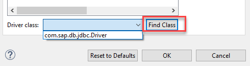

## Prerequisites  
 - **Proficiency:** Beginner
 - JDBC client: You need to have downloaded the clients from the HXE Download Manager. Go to the [registration site](https://www.sap.com/cmp/ft/crm-xu16-dat-hddedft/index.html) and get the download manager for free.


## Next Steps
 - [Create a Table and Upload data into SAP HANA, express edition ](https://www.sap.com/developer/tutorials/hxe-cj1-create-table-upload-data.html)

## Details
### You will learn  
You will learn how to download and configure am open source database client and use the JDBC driver for SAP HANA to connect to your SAP HANA, express edition instance.

### Time to Complete  
**15 Min**

---

[ACCORDION-BEGIN [Step 1: ](Download a database client)]

This tutorial series will use the client `DBeaver`. You can choose to install any other client that allows you to connect to your SAP HANA, express edition, database and enter SQL commands.

> Here are some suggestions for other tools to connect with the SAP HANA, express edition database:
> - [Install the HANA plugin for Microsoft Visual Studio](https://sap.com/developer/groups/hxe-install-hana-plugin-microsoft-visual-studio.html)
> - [Use plugin for Eclipse](https://sap.com/developer/tutorials/hxe-howto-eclipse.html)

[Download `DBeaver`](http://dbeaver.jkiss.org/download/) and follow the instructions to install it.

[ACCORDION-END]

[ACCORDION-BEGIN [Step 2: ](Connect to your SAP HANA, express edition, instance)]

Look for the SAP HANA connector and click on **Next**


Enter your hostname (for example, `hxehost`) if you have [mapped it in your hosts file](https://sap.com/developer/tutorials/hxe-ua-hosts.html) or external IP address, username (for example, **SYSTEM**, unless you have already set up another administrator user) and the port: 3XX13, where XX is the instance number (default is 90). If you are using the Docker container, the default port for the system database is 39017.

> **Important note**  
> SAP HANA, express edition includes a default tenant database called HXE and a system database, called `systemdb`.
> The system database is where administration tasks are performed. The tenant databases are where the actual SQL and development is performed. In the context of SAP HANA, express edition, most clients will resolve the tenant database through the port 39013 - or 39017 - if the database name is set to `HXE`.


Then click on **Edit Driver Settings**.


> **Default port assignment**: The default port for the system database in all deployments, except for Docker, is 39013. The default port for the first tenant, HXE, is 39015. For Docker containers, the default port the system database is 39017 and for the first tenant is 39041

Click on **Add File** to choose from the clients you downloaded with the HXE Download Manager.


You will need to extract them from the files `hdb_client_windows.zip` or `hdb_client_linux.tgz` depending on your operating system and the file `JDBC.TGZ` within the deepest parent directory.  Choose the file called `ngdbc.jar`.


Click on **Find Class** and select `com.sap.db.jdbc.Driver` from the drop down menu:



Click **OK** and proceed to test the connection:


And you should see a success message:


[ACCORDION-END]


[ACCORDION-BEGIN [Step 3: ](Finish connection and create a development user)]

Click on **next** until you can click on **Finish**.  Click on the **SQL Editor**  so you can create a development user.

Copy the following code into the console:

```

CREATE SCHEMA "CODEJAM";
CREATE USER CODEJAMMER PASSWORD "HanaRocks2017" NO FORCE_FIRST_PASSWORD_CHANGE ;

CALL GRANT_ACTIVATED_ROLE ('sap.hana.ide.roles::EditorDeveloper','CODEJAMMER');
CALL GRANT_ACTIVATED_ROLE ('sap.hana.ide.roles::CatalogDeveloper','CODEJAMMER');
CALL GRANT_ACTIVATED_ROLE ('sap.hana.ide.roles::SecurityAdmin','CODEJAMMER');
CALL GRANT_ACTIVATED_ROLE ('sap.hana.ide.roles::TraceViewer','CODEJAMMER');

GRANT SELECT ON SCHEMA "CODEJAM" TO "CODEJAMMER" WITH GRANT OPTION;
GRANT UPDATE ON SCHEMA "CODEJAM" TO "CODEJAMMER" WITH GRANT OPTION;
GRANT INSERT ON SCHEMA "CODEJAM" TO "CODEJAMMER" WITH GRANT OPTION;
GRANT DELETE ON SCHEMA "CODEJAM" TO "CODEJAMMER" WITH GRANT OPTION;
GRANT EXECUTE ON SCHEMA "CODEJAM" TO "CODEJAMMER" WITH GRANT OPTION;
GRANT CREATE ANY ON SCHEMA "CODEJAM" TO "CODEJAMMER" WITH GRANT OPTION;
GRANT DROP ON SCHEMA "CODEJAM" TO "CODEJAMMER" WITH GRANT OPTION;
GRANT "IMPORT" TO "CODEJAMMER";

```

Press the `Execute script` button or `CTRL+X`, you can check the results in the `Execution Log` tab once it is done.


[ACCORDION-END]

[ACCORDION-BEGIN [Step 4: ](Reconnect as the development user)]

You can now go back into the safety of a restricted user and reconnect as the user you have just created.

Right-click on the database and choose **Edit connection**.


Replace the login details with those of the new user:


You are now set to start development. Check the [tutorial section in the Developer Center](https://sap.com/developer/topics/sap-hana.tutorials.html#tutorials).

Here are some suggestions:
- [Create a Table and Upload data into SAP HANA, express edition ](https://www.sap.com/developer/tutorials/hxe-cj1-create-table-upload-data.html)
- [Get started with Geospatial](https://sap.com/developer/tutorials/hana-spatial-intro1-point.html)
- [Use Node.js to connect to SAP HANA]()


[ACCORDION-END]


## Next Steps
 - [Create a Table and Upload data into SAP HANA, express edition ](https://www.sap.com/developer/tutorials/hxe-cj1-create-table-upload-data.html)
