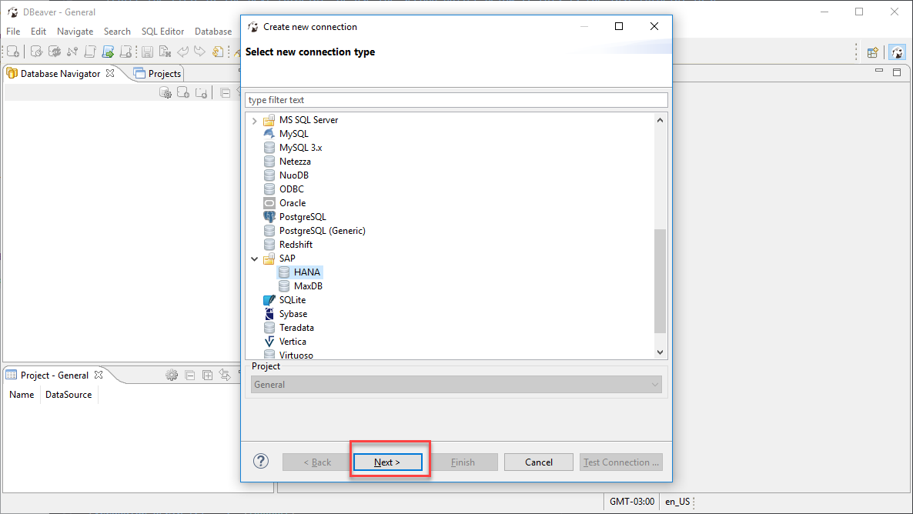
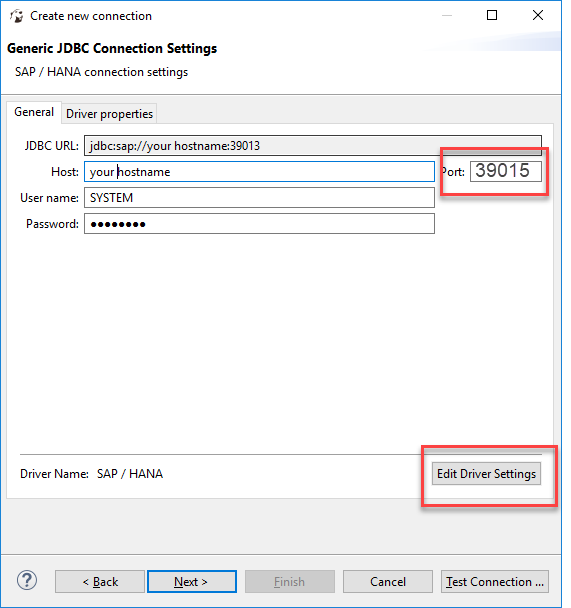
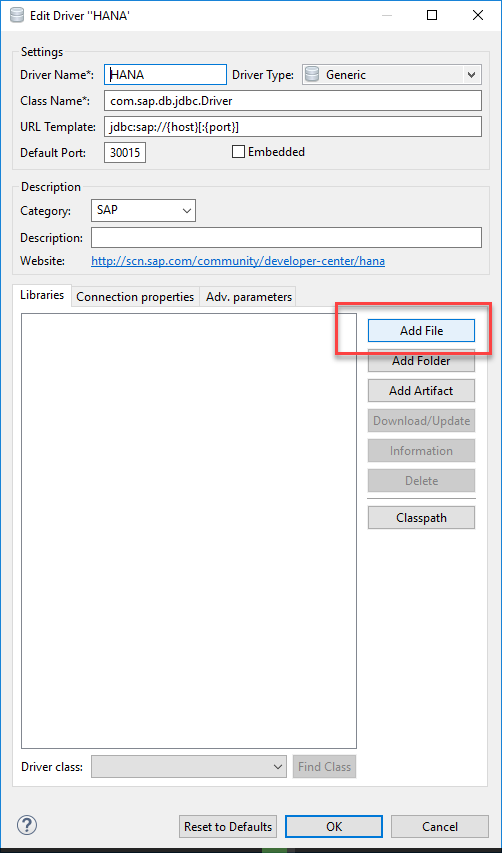
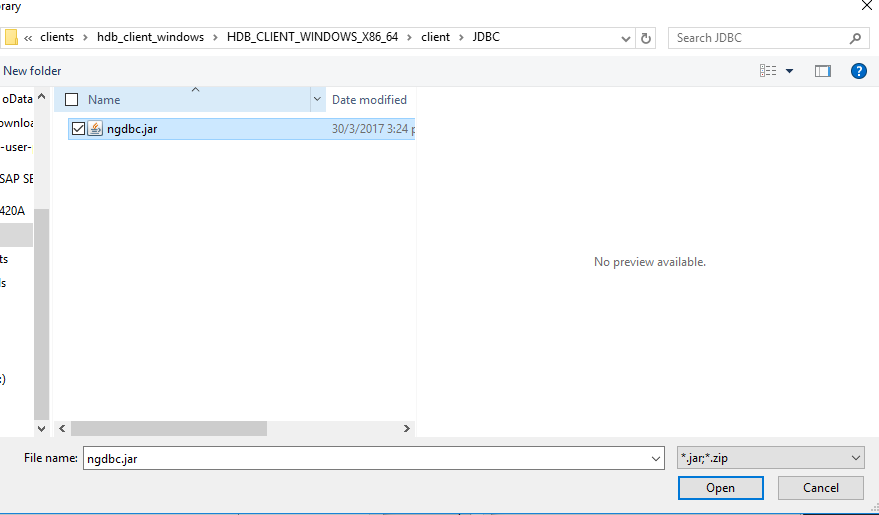
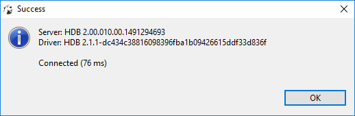
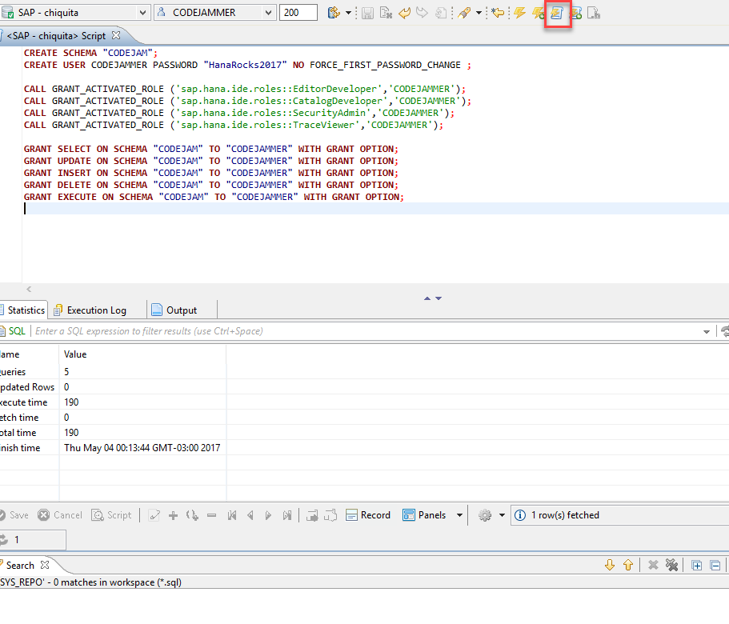
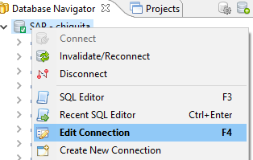
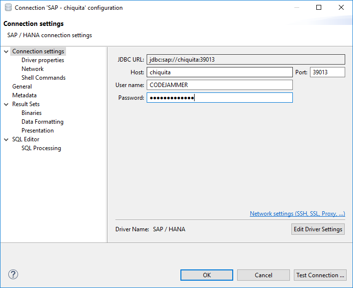

## Prerequisites  
 - **Proficiency:** Beginner | Intermediate | Advanced
 - **Tutorials:** [SAP HANA, Express edition, CodeJam ](https://www.sap.com/developer/how-tos/2017/02/codejam-gettingstarted-hxe.html)
 - JDBC client: You need to have downloaded the clients from the HXE Download Manager


## Next Steps
 - [Create a Table and Upload data into SAP HANA, express edition ](https://www.sap.com/developer/tutorials/hxe-cj1-create-table-upload-data.html)

## Details
### You will learn  
Describe what the user will learn from your tutorial and what the outcome will be.

### Time to Complete  
**15 Min**

---

[ACCORDION-BEGIN [Step 1: ](Download a database client)]

This tutorial series will use the client `DBeaver`. You can choose to install any other client that allows you to connect to your SAP HANA; express edition, database and enter SQL commands.

[Download `DBeaver`](http://dbeaver.jkiss.org/download/) and follow the instructions to install it.


[DONE]
[ACCORDION-END]

[ACCORDION-BEGIN [Step 2: ](Connect to your SAP HANA, express edition, instance)]

Look for the SAP HANA connector and click on **Next**



Enter your hostname, username (**SYSTEM**, unless you have already set up another administrator user) and the port: 3XX13, where XX is the instance number (probably, 90).
**Important note**  if you are using HANA 2.0 SPS00 or an earlier version, the port will end in 15, i.e., 3XX15, where 90 is the instance number.

Then click on **Edit Driver Settings**.



Click on **Add File** to choose from the clients you downloaded with the HXE Download Manager.



You will need to extract them from the files `hdb_client_windows.zip` or `hdb_client_linux.tgz` depending on your operating system and the file `JDBC.TGZ` within the deepest parent directory.  Choose the file called `ngdbc.jar`.



Click on **Find Class** and select `com.sap.db.jdbc.Driver` from the drop down menu:


Click **OK** and proceed to test the connection:


And you should see a success message:



[DONE]
[ACCORDION-END]


[ACCORDION-BEGIN [Step 3: ](Finish connection and create a development user)]

Click on **next** until you can click on **Finish**.  Click on the **SQL Editor**  so you can create a development user.

Copy the following code into the console:

```

CREATE SCHEMA "CODEJAM";
CREATE USER CODEJAMMER PASSWORD "HanaRocks2017" NO FORCE_FIRST_PASSWORD_CHANGE ;

CALL GRANT_ACTIVATED_ROLE ('sap.hana.ide.roles::EditorDeveloper','CODEJAMMER');
CALL GRANT_ACTIVATED_ROLE ('sap.hana.ide.roles::CatalogDeveloper','CODEJAMMER');
CALL GRANT_ACTIVATED_ROLE ('sap.hana.ide.roles::SecurityAdmin','CODEJAMMER');
CALL GRANT_ACTIVATED_ROLE ('sap.hana.ide.roles::TraceViewer','CODEJAMMER');

GRANT SELECT ON SCHEMA "CODEJAM" TO "CODEJAMMER" WITH GRANT OPTION;
GRANT UPDATE ON SCHEMA "CODEJAM" TO "CODEJAMMER" WITH GRANT OPTION;
GRANT INSERT ON SCHEMA "CODEJAM" TO "CODEJAMMER" WITH GRANT OPTION;
GRANT DELETE ON SCHEMA "CODEJAM" TO "CODEJAMMER" WITH GRANT OPTION;
GRANT EXECUTE ON SCHEMA "CODEJAM" TO "CODEJAMMER" WITH GRANT OPTION;
GRANT CREATE ANY ON SCHEMA "CODEJAM" TO "CODEJAMMER" WITH GRANT OPTION;
GRANT DROP ON SCHEMA "CODEJAM" TO "CODEJAMMER" WITH GRANT OPTION;
GRANT "IMPORT" TO "CODEJAMMER";


```

Press the `Execute script` button or `CTRL+X`, you can check the results in the `Execution Log` tab once it is done.



[DONE]
[ACCORDION-END]

[ACCORDION-BEGIN [Step 4: ](Reconnect as the development user)]

You can now go back into the safety of a restricted user and reconnect as the user you have just created.

Right-click on the database and choose **Edit connection**.



Replace the login details with those of the new user:



You can now begin with development.

[DONE]
[ACCORDION-END]


## Next Steps
 - [Create a Table and Upload data into SAP HANA, express edition ](https://www.sap.com/developer/tutorials/hxe-cj1-create-table-upload-data.html)
