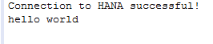

## Prerequisites  
- **Proficiency:** Beginner

## How-To Details
Java Database Connectivity (JDBC) is a Java-based application programming interface (API) which includes a set of functions that enable Java applications to access a data model in a database. The SAP HANA client includes a dedicated JDBC interface.

In this how-to, you will learn how to connect to HANA Express Edition using JDBC (Java Database Connectivity)

### Time to Complete
**10 Min**.

[ACCORDION-BEGIN [Step 1: ](Install the SAP HANA client)]

You can download the **SAP HANA Client Software Packages** from the [SAP Store](https://store.sap.com/sap/cpa/ui/resources/store/html/SolutionDetails.html?pid=0000012950).

Once downloaded, you can follow the instructions from the [SAP HANA Client Installation and Update Guide](https://help.sap.com/hana/SAP_HANA_Client_Installation_Update_Guide_en.pdf).

[ACCORDION-END]

[ACCORDION-BEGIN [Step 2: ](Locate the JDBC driver)]

The driver (`ngdbc.jar`), which is installed as part of the SAP HANA client installation, is located at (unless specified otherwise during the installation):

 - on Microsoft Windows platforms: `C:\Program Files\SAP\hdbclient\`

 - on Linux and UNIX platforms `/usr/sap/hdbclient/`

[ACCORDION-END]

[ACCORDION-BEGIN [Step 3: ](Use it in your Eclipse Java project)]

In the ***Package Explorer*** panel, right-click on the project you want to use the driver with.

Select **Build Path > Add External Archives**.

Then add the `ngdbc.jar` file by browsing for it.

Now, in the ***Package Explorer*** panel, right-click on the project you want to use the driver with.

Select **New > Class**.

Enter `TestJDBCDriver` as your new the new class name and click on ***Finish***.

The following is an example of a java main function connecting to an SAP HANA server.

The following code sample is a simple and generic example of how to connect to more or less any JDBC data source. You will need to provide the proper information for the *connection string*, *user name* & *password*

The format is **`jdbc:sap://<server host>:<port>[/?<options>]`** and is the same for SAP HANA & SAP HANA, express edition

```java
  public static String connectionString = "jdbc:sap://<connection string>";
	public static String user = "<user name>";
	public static String password = "<password>";

	public static void main(String[] argv) {
		Connection connection = null;
		try {
			connection = DriverManager.getConnection(connectionString, user, password);
		} catch (SQLException e) {
			System.err.println("Connection Failed. User/Passwd Error? Message: " + e.getMessage());
			return;
		}
		if (connection != null) {
			try {
				System.out.println("Connection to HANA successful!");
				Statement stmt = connection.createStatement();
				ResultSet resultSet = stmt.executeQuery("select 'hello world' from dummy");
				resultSet.next();
				String hello = resultSet.getString(1);
				System.out.println(hello);
			} catch (SQLException e) {
				System.err.println("Query failed!");
			}
		}
	}
```

Adjust the **`connectionString`**, **`user`** & **`password`** properties to match your environment.

For more details about the **JDBC Connection String**, please check the last few steps.

Compile and execute the code. You should see an output similar to the following:



Congratulations: You have just connected to HANA using JDBC (Java Database Connectivity)!

[ACCORDION-END]

[ACCORDION-BEGIN [Step 4: ](Use it in from the Command Line)]

You can also directly test or use the SAP HANA JDBC driver from the command line:

```bash
java -jar ngdbc.jar
   -u <user,password>
  [-n <hostname:port>]
  [-i <instance_number>]
  [-d <database_name>]
  [-o <connect option>]
  [-c <sql command>]
```

It assumes that you have a Java Runtime environment (JRE) installed on your system to run this command.

Here is a quick example:

```
java -jar ngdbc.jar
  -u MyUser,MyPassword
  -n myServer:39015
  -c "SELECT DATABASE_NAME FROM SYS.M_DATABASES"
```

For more details about the **JDBC Connection String**, please check the last few steps.

[ACCORDION-END]

[ACCORDION-BEGIN [Connection String: ](The server host)]

You can use the IP address, the host name or the fully qualified name as long as the server host is reachable using a ping command from the machine that will run your program.

You can also specify one or more failover servers by adding additional hosts, as in the following example:

```bash
jdbc:sap://myServer:30015;failoverserver1:30015;failoverserver2:30015
```

[ACCORDION-END]

[ACCORDION-BEGIN [Connection String: ](The port number)]

The port number to be used in the connection string include the instance number which is assigned when a new instance is created.

> ### **Note:** The default value changed between version 1.0 & 2.0 of **SAP HANA, express edition**, so here is a quick recap:
> - **SAP HANA 1.0, express edition**, the default the instance number is `00`
> - **SAP HANA 2.0, express edition**, the default the instance number is `90`


Prior to **SAP HANA 1.0, express edition** SPS12, there was no concept of ***Multi Database Container*** (MDC). It was still possible to create multiple database in a single instance, but not using container isolation.

With this mode, the port number will use the following pattern: `3<instance number>15`, and with the default instance number `00`, the port will be `30015`. To access a specific database, you will use the `databasename` in the option parameter.

Since **SAP HANA 1.0, express edition** SPS12 & **SAP HANA 2.0, express edition**, the ***Multi Database Container*** is the default mode.

This means that any created instance will have a **System Database** and potentially a series of **Tenant Databases**.

The **System Database** (also called **SYSTEMDB**) can be accessed via the following port: `3<instance number>15`.

However, with your **Tenant Databases**, the SQL port is assigned dynamically at the creation time and follows a different pattern: `3<instance number><SQL port>`.

You can determine the SQL port to use for a particular tenant database using the `M_SERVICES` system view, either from the tenant database itself or from the system database, using the following SQL.

- ***From the system database:***

```SQL
SELECT
	  DATABASE_NAME
	, SERVICE_NAME
	, PORT
	, SQL_PORT
	, (PORT + 2) HTTP_PORT
FROM
	SYS_DATABASES.M_SERVICES
WHERE
  (
        SERVICE_NAME      = 'indexserver'
    and COORDINATOR_TYPE  = 'MASTER'
  )
  or SERVICE_NAME = 'xsengine'
;
```

- ***From a particular tenant database:***

```SQL                
SELECT
	  SERVICE_NAME
	, PORT
	, SQL_PORT
	, (PORT + 2) HTTP_PORT
FROM
	SYS.M_SERVICES
WHERE
  (
        SERVICE_NAME      = 'indexserver'
    and COORDINATOR_TYPE  = 'MASTER'
  )
  or SERVICE_NAME = 'xsengine'
;
```

[ACCORDION-END]

[ACCORDION-BEGIN [Connection String: ](The options)]

The JDBC driver a full stack of options that can become handy when developing you application

For example, you can use the ***options*** parameter to specify the auto-commit behavior, as in the following example:

```bash
jdbc:sap://myServer:30015/?autocommit=false
```

For more information about the **JDBC Connection Properties**, you can check the <a href="https://help.sap.com/viewer/0eec0d68141541d1b07893a39944924e/2.0.02/en-US/109397c2206a4ab2a5386d494f4cf75e.html" target="new">online documentation</a>

[ACCORDION-END]
