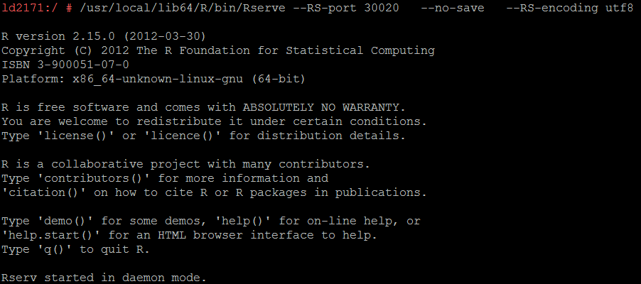
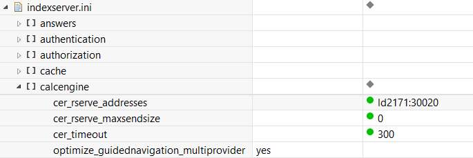
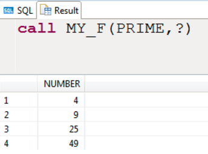

## Prerequisites  
  - **Proficiency:** Beginner

## Next Steps
 - [View similar How-Tos](http://developers.sap.com/tutorials.html) or [View all How-Tos](http://developers.sap.com/tutorials.html)


## How-To Details
You will learn how to connect to HXE using R in `Rserve` environment

### Time to Complete
**15 Min**.

---

1. The R and `Rserve` environments have to be installed on a separate host. You cannot install R on the SAP HANA host. This tutorial assumes an R installation on a Linux system, preferably SLES Linux; no other R hosting environments are currently supported. The `R/Rserve` host has to be reachable from the SAP HANA host.

2. Before installation please make sure that the related software packages exists. You can execute `rpm -q <package_name>` to determine whether you have these packages already installed.

  ```
  xorg-x11-devel: for the support of X window
  gcc-fortran: c++ compiler
  readline-devel: install only if you want to use R as a standalone application
  libgfortran46: install only if you use SLES 11 SP2
  ```

3. Download R language source code version 2.15.0 and run following commands to finish the installation.  

  ```
  ./configure --enable-R-shlib
  make
  make install
  ```
   Link to download R 2.15.0 source code: `https://cran.cnr.berkeley.edu/src/base/R-2/R-2.15.0.tar.gz`

4. Now we have R installed then we need to install `Rserve`. Start R and execute ```install.packages("Rserve")```. Of course, you can also download `Rserve.tar.gz` ,and execute `install.packages("/path/to/your/Rserve.tar.gz",repos=NULL)`.

           

5. After install `Rsever`, we also need to configure it. Create a file under `/etc`, name it `Rserve.conf` and add following content:

  ```
  maxinbuf 10000000
  maxsendbuf 0
  remote enable
  ```

6. Set `R_HOME` to where your R is installed. Create a file under `/etc/ld.so.conf.d`, name it `libR.conf`. Then add your R home path to it and execute `ldconfig`.

7. Launch `Rserve`.

     ```
    /usr/local/lib64/R/bin/Rserve --RS-port 30020   --no-save   --RS-encoding utf8
     ```

      

8. Now we have `R/Rserve` installed and configured. Then we need to configure HANA as well. Add following parameters to `calcEngine` under `indexserver.ini`.

      

      Nodes: `cer_rserve_addresses` is where your `Rserve` running, you can either use IP:PORT format or HOSTNAME:PORT format. If you're using `multidb` and running the script in `systemdb` then add the above parameters to `calEngine` under `nameserver.ini`

9. We have everything configured, you can go ahead try out the following demo script

   ```
   CREATE ROW TABLE "PRIME" ( "NUMBER" INT CS_INT );
   insert into "PRIME" values(2);
   insert into "PRIME" values(3);
   insert into "PRIME" values(5);
   insert into "PRIME" values(7);
   CREATE ROW TABLE "PRIME_SQR" ( "NUMBER" INT CS_INT );
   CREATE PROCEDURE MY_F(IN input1 PRIME,OUT result PRIME_SQR)
   LANGUAGE RLANG AS
   BEGIN
        result<-as.data.frame(input1$NUMBER^2);
        names(result)<-c("NUMBER");
   END;
   ```

10. You should get the following result after you run `call MY_F(PRIME, ?)`

      

## Related Information
- [SAP HANA R Integration Guide] (https://help.sap.com/hana/SAP_HANA_R_Integration_Guide_en.pdf)

