## Prerequisites  
 - **Systems used:** SAP HANA, express edition


## Details
&nbsp;
> **DEPRECATED:** SAP HANA XS Classic is deprecated as of SPS02. Please use XS Advanced, and learn about how to get started with the new mission [Get Started with XS Advanced Development](https://www.sap.com/developer/missions/xsa-get-started.html).

&nbsp;


The following steps will show you how to customize the login screen of your individual instance. Why might you want to do that? Well for starters if you have multiple systems this would help you distinguish between them or perhaps you simply want to make your system unique and your own.


---

1. Either using the web based tools, like this tutorial will show you or using the SAP HANA Studio you will need to create a new application. The following steps will show the web based and assumes you will be able to use your skills with the SAP HANA Studio if you choose to use that. First step will be to open the IDE.

	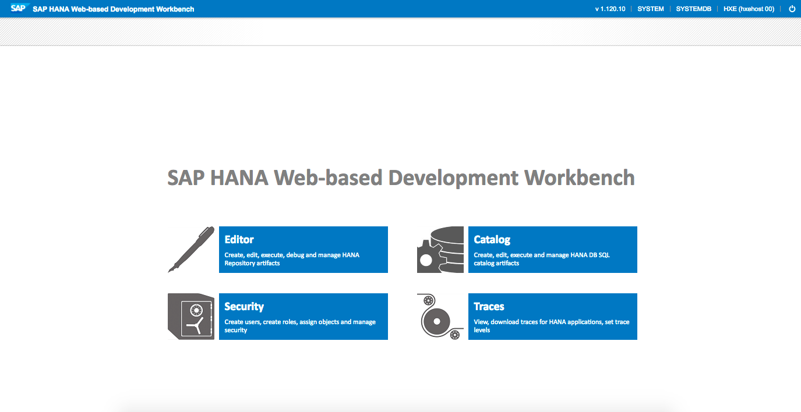
	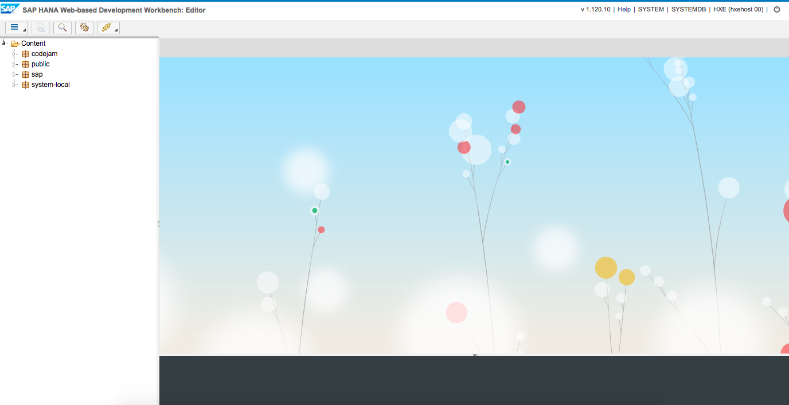

2. Now you will right click on the top level `content` and choose a new application. In this example the application will be called `codejam.mylocation`

	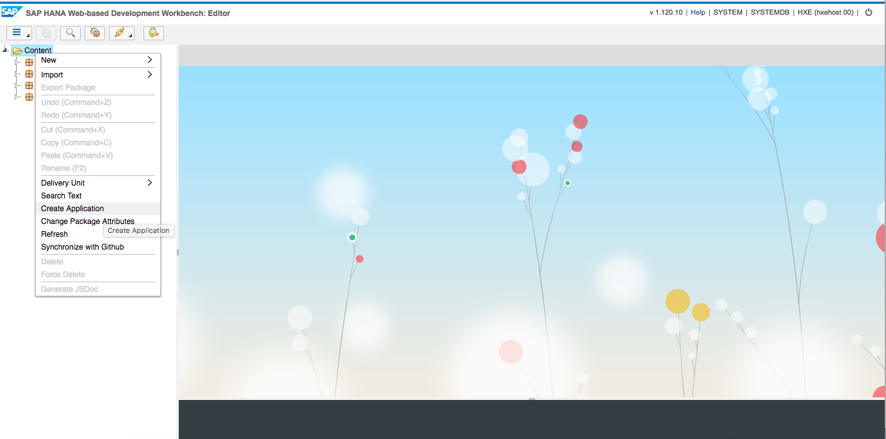
	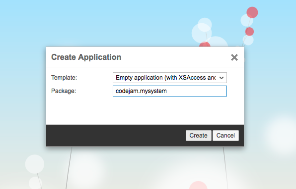

3. Now create a new package under the new application called `images`

	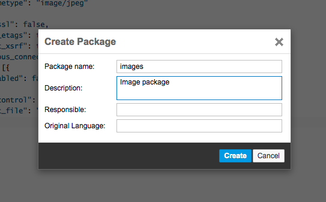

4. Next if you click on the package `images` you will get a screen that allows for multiple file uploads.

	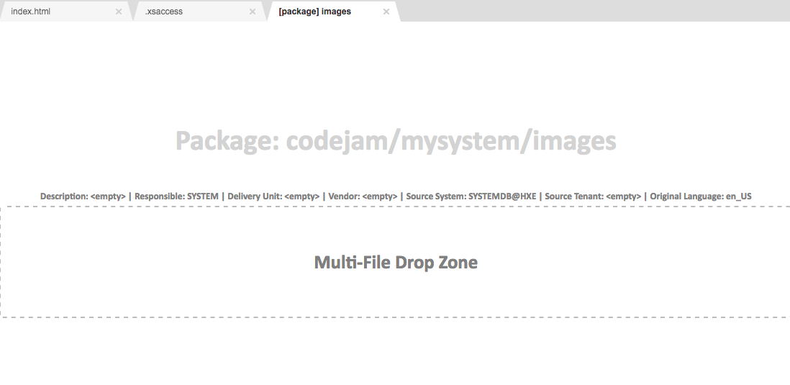

5. Here you will upload your login screen image or images. I have prepared 2 images both are 1920 wide but the height varies. Both are also `JPG` format.

	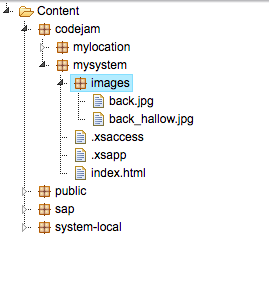

6. Now open the `.xsaccess` and modify the `authentification` line and change it to `null`

	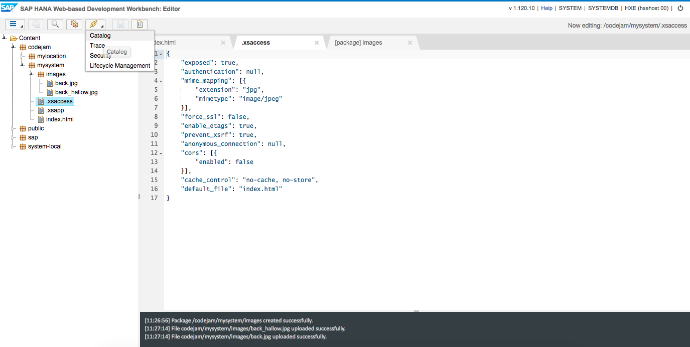

	```
	{
    "exposed": true,
    "authentication": null,
    "mime_mapping": [{
        "extension": "jpg",
        "mimetype": "image/jpeg"
    }],
    "force_ssl": false,
    "enable_etags": true,
    "prevent_xsrf": true,
    "anonymous_connection": null,
    "cors": [{
        "enabled": false
    }],
    "cache_control": "no-cache, no-store",
    "default_file": "index.html"
	}
	```

7. The next step will be to jump over to the `Catalog` editor and open an SQL console window. Execute the following SQL statement.

	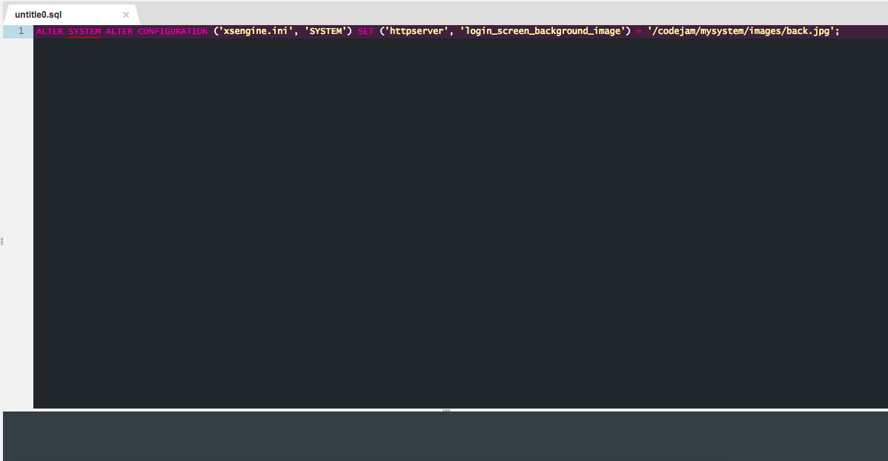

	```
	ALTER SYSTEM ALTER CONFIGURATION ('xsengine.ini', 'SYSTEM') SET ('httpserver', 'login_screen_background_image') = '/codejam/mysystem/images/back.jpg';
	```

	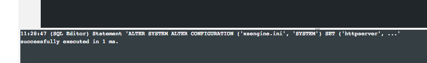

8. Now Open the `Security` editor and create a new user called `_USS` and assign and save that user the role `sap.hana.xs.selfService.user.roles::USSExecutor`

	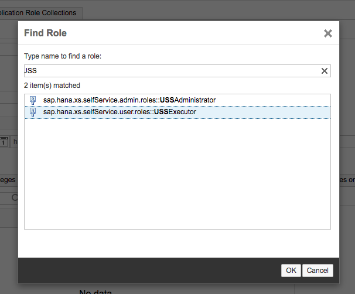

9. Now that the configuration has been set, content has been uploaded and the user has been created you will need to open a new site - change your URL to match `http://server:8000/sap/hana/xs/admin/#/package/sap.hana.xs.selfService.user/sqlcc/selfService` and then activate it (bottom right)

	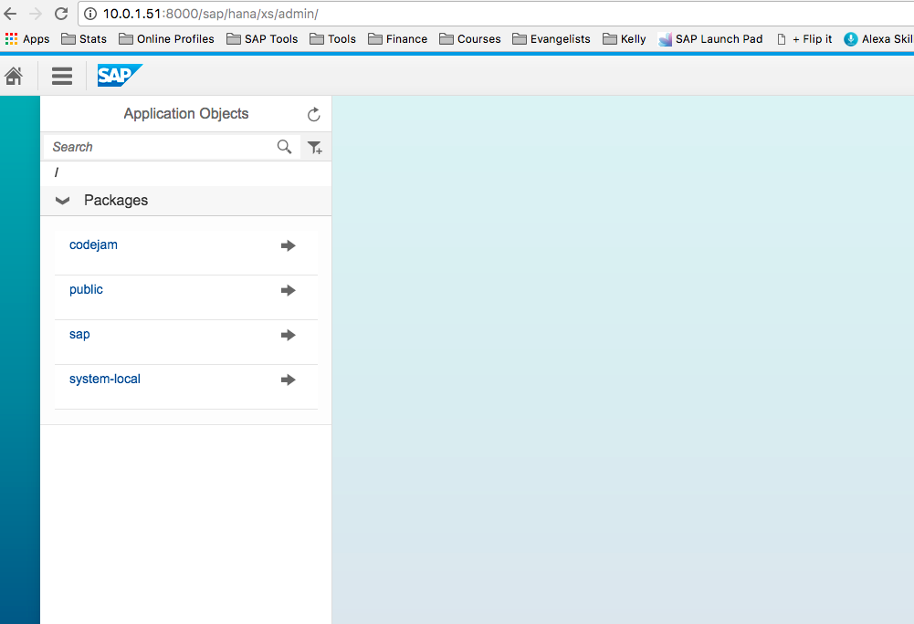
	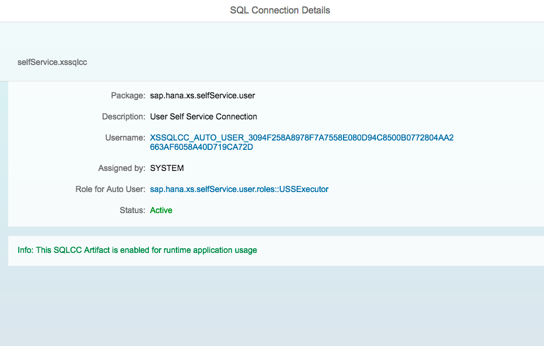

10. Now when you go to log in to your system you should notice a difference right off.

	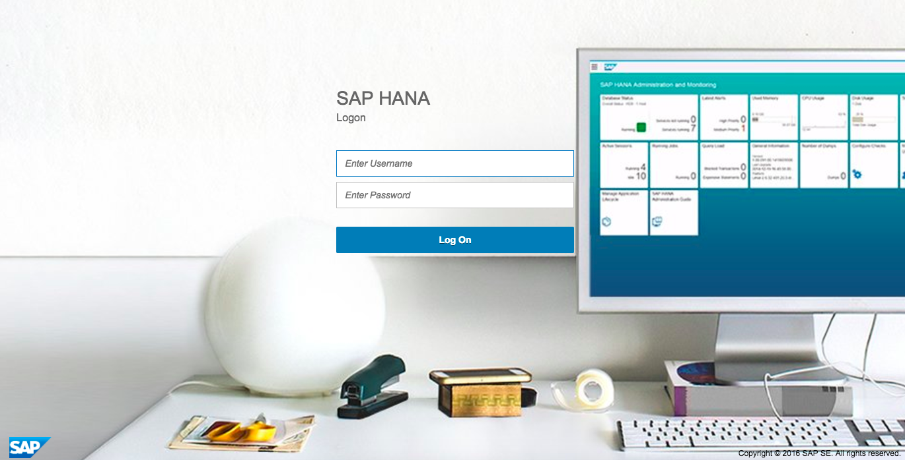

11. If you modify the configuration again you will notice we have something specifically for today, Halloween.

	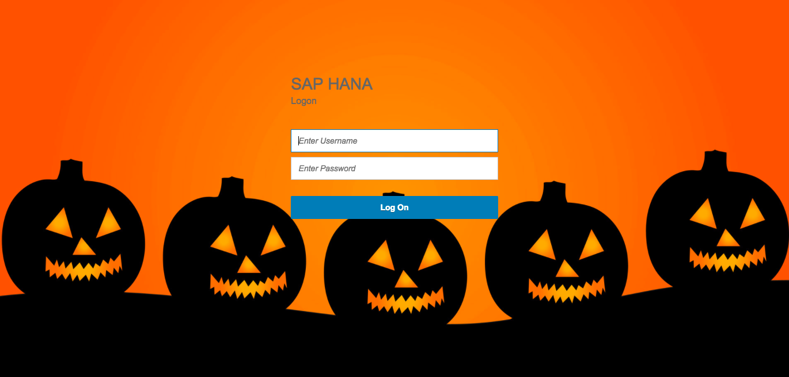
