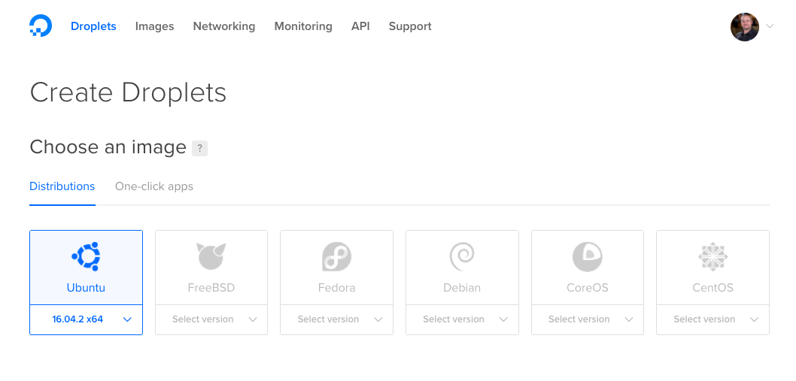
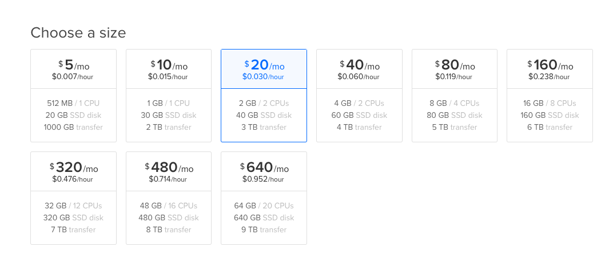
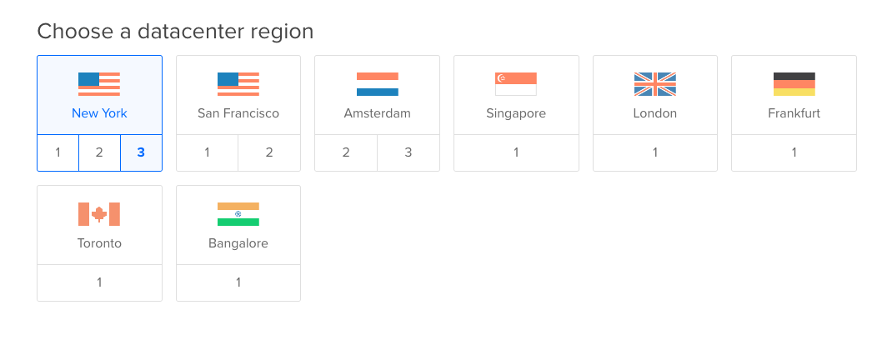

## Prerequisites  
 - You have an account with Digital Ocean
 - You have followed instructions to download Linux binaries [tutorial](http://www.sap.com/developer/tutorials/hxe-ua-installing-binary.html )


## Next Steps
  - [Install Dependencies for Ubuntu](http://www.sap.com/developer/tutorials/hxe-dioc-install-dependencies.html)
  - [**OPTIONAL** - Setup PuTTY and WinSCP to access your HANA Express Edition instance on Google Cloud Platform](http://www.sap.com/developer/tutorials/hxe-gcp-setup-putty-winscp-windows.html) Keep in mind that you will need to adjust the values to match yours from this tutorial series.

## Disclaimer
SAP HANA, express edition (HXE) is officially supported on SLES and RHEL. SAP Community members have been successful in running HXE on other Linux operating systems that are not formally supported by SAP, such as Ubuntu, openSUSE and Fedora. SAP is not committing to resolving any issues that may arise from running HXE on these platforms.

## Details
### You will learn  
This tutorial will show you how to setup a Droplet on the Digital Ocean platform using Ubuntu to run HANA Express Edition.


### Time to Complete
**15 Min**

---

[ACCORDION-BEGIN [Step 1: ](Create your Droplet)]

From your [dashboard](https://cloud.digitalocean.com/droplets) in Digital Ocean, click on `Create Droplet`:

 

Pick an image for your Droplet. Then a region to run your Droplet.

 

The minimum requirements for HANA Express Edition, server-only are:
- 4 CPU cores
- 8 GB RAM
- 100 GB Disk

 

Then scroll down and be sure to enter a name for the Droplet. This name will also be the name of the host and the example used in this tutorial is `ubuntu-hxe-server`.

> The minimum requirements for HANA Express Edition with XS Advanced installation are:
- 4 CPU cores
- 24 GB RAM
- 120 GB Disk

Be sure to select or create your [SSH key](https://www.digitalocean.com/community/tutorials/how-to-use-ssh-keys-with-digitalocean-droplets) for the Droplet to allow you to connect your computer to it.

Now create the Droplet.

[DONE]
[ACCORDION-END]

[ACCORDION-BEGIN [Step 2: ](Upload the files into your home folder)]

Upload the HXE installation packages to your Droplet (`/tmp`). Upload the files `hxe.tgz` and `hxexsa.tgz` for server + applications:

To do this you can use a FTP program or from the command line you can execute

```
scp hxe.tgz root@207.154.xxx.xxx:/tmp
```

Since this step may take a while depending on your connection, you can move on with the other setup needed before installing HANA Express Edition.

[DONE]
[ACCORDION-END]


## Optional
- [Setup Putty and WinSCP in your Windows PC](http://www.sap.com/developer/tutorials/hxe-gcp-setup-putty-winscp-windows.html) Keep in mind that you will need to adjust the values to match yours from this tutorial series.

## Next Steps
- [Install Dependencies in Ubuntu](http://www.sap.com/developer/tutorials/hxe-dioc-install-dependencies.html)
