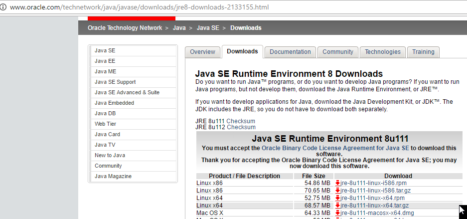
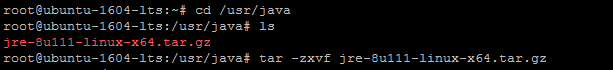
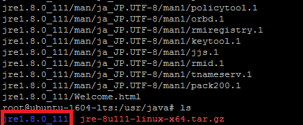
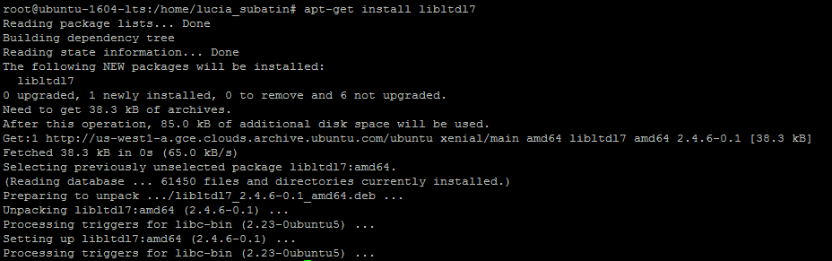
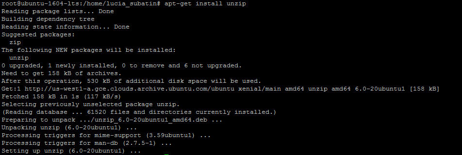

## Prerequisites  
 - [HANA Express Edition - Create and Access Instance on Digital Ocean - Server + XS Advanced](http://www.sap.com/developer/tutorials/hxe-dioc-create-instance-access.html)

## Next Steps
 - [HANA Express Edition - Extract installation Files and Configure Firewall Rules](http://www.sap.com/developer/tutorials/hxe-dioc-extract-files-configure-firewall.html)

## Disclaimer
SAP HANA, express edition (HXE) is officially supported on SLES and RHEL. SAP Community members have been successful in running HXE on other Linux operating systems that are not formally supported by SAP, such as Ubuntu, openSUSE and Fedora. SAP is not committing to resolving any issues that may arise from running HXE on these platforms.

## Details
### You will learn  
In this tutorial, you will install the dependencies needed for the setup and execution of HANA Express Edition in your Ubuntu OS image on the Digital Ocean platform.

### Time to Complete
**15 Min**

---

[ACCORDION-BEGIN [Step 1: ](Download and Install the Java Runtime Environment)]
Go to the download page for the Java Runtime Environment. Accept the license agreement and download the `tar.gz` file:



Right-click on the file with extension `.tar.gz` for x64 Linux and copy the link.

Now upload this to your server with the command:

```
scp jre-8u131-linux-x64.tar.gz root@207.154.xxx.xxx:/tmp
```

Now on the server itself, create a new directory called `/usr/java` and copy the downloaded installation package into a new folder. The name of the installation package may be different from the example, so **replace `jre-8u121-linux-x64.tar.gz` with the package you have just downloaded**:

```
sudo su –
mkdir /usr/java
chmod 777 /usr/java
cp ./jre-8u121-linux-x64.tar.gz /usr/java/jre-8u121-linux-x64.tar.gz
cd  /usr/java
tar -zxvf jre-8u121-linux-x64.tar.gz

```
This is what the console would look like:



After it finishes extracting the files, if you list the directory you will see a new folder created by the extraction process:



Set the JVM path with the following command, where `/usr/java` is the directory you created to extract the JRE installation package and ` jre1.8.0_131` refers to the directory that has just been created during extraction. Replace these references accordingly:

```
update-alternatives --install /usr/bin/java java /usr/java/jre1.8.0_131/bin/java 100
```


[DONE]
[ACCORDION-END]

[ACCORDION-BEGIN [Step 2: ](Install or check openssl)]

Enter the following command to make sure openSSL is up to date or continue installation:
```
apt-get install openssl
```

You will probably get a message indicating it is already installed:


[DONE]
[ACCORDION-END]


[ACCORDION-BEGIN [Step 3: ](Install cracklib)]

Enter the following command to install `cracklib`:
```
apt-get install libpam-cracklib
```
At any time during the installation of dependencies, you may be prompted about using more disk space. Make sure to answer `Y`:


[DONE]
[ACCORDION-END]

[ACCORDION-BEGIN [Step 4: ](Install libtool)]

Enter the following command to install `libtool`:
Example:

```
apt-get install libltdl7
```




[DONE]
[ACCORDION-END]

[ACCORDION-BEGIN [Step 5: ](Install the AIO library)]

Enter the following command to install AIO:

```
apt-get install libaio1
```
Example:


[DONE]
[ACCORDION-END]

[ACCORDION-BEGIN [Step 6: ](For XSA installation, install unzip)]

If you are planning on installing the server and XS Advanced applications, you will also need to install unzip:
```
apt-get install unzip
```
Example:




[DONE]
[ACCORDION-END]

[ACCORDION-BEGIN [Step 7: ](For HANA 2.0 SPS01: Create and alias for chkconfig and install curl)]

This is a command that is not available in Ubuntu. You will download its equivalent and create an alias so it can be called by the installation script.

```
apt-get install sysv-rc-conf
```
Example:


And set the alias for the installer:

```
alias chkconfig='sysv-rc-conf'
```


Also for SAP HANA 2.0 SPS01, install curl:

```
apt-get install curl
```

[DONE]
[ACCORDION-END]


## Next Steps
- [Extract Files and Configure Firewall](http://www.sap.com/developer/tutorials/hxe-dioc-extract-files-configure-firewall.html)
