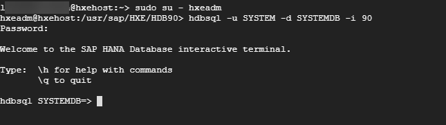
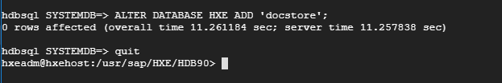

## Prerequisites  
- SAP HANA Express Edition 2.0 installed

## Details
### You will learn  
  In this tutorial series, you will create a simple food app running on SAP HANA Express Edition. In this first tutorial, you will create a new database, and enable the Document Store.

---

[ACCORDION-BEGIN [Step 1: ](Login to database)]

Log in to your SAP HANA Express Edition virtual machine with the `hxeadm` user, and once logged in, type the following at the prompt:

```shell
hdbsql -u SYSTEM -d SYSTEMDB -i 90
```

and press **Enter**.

When asked for the password, provide the password for the SYSTEM user and press **Enter**. You are now logged in to the `SYSTEMDB` database.



[DONE]
[ACCORDION-END]

[ACCORDION-BEGIN [Step 2: ](Enable the Document Store)]

While still logged on to the `SYSTEMDB` database, perform the following command at the prompt:

```shell
ALTER DATABASE HXE ADD 'docstore';
```

and press **Enter** to execute. It may take a couple of seconds to complete.

Now, the Document Store is enabled on the default `HXE` database tenant. Use `quit` to exit the SQL console.



[DONE]
[ACCORDION-END]

[ACCORDION-BEGIN [Step 4: ](Create a Document Store Collection)]

In order to store any documents, you need to create a 'Collection'. This is similar to a table, but without any column information.

To add the collection to the Document Store, you need to log on to the `HXE` database first.

At the prompt, enter the following command:

```shell
\c -u SYSTEM -d HXE -i 90
```

and after you are successfully connected to the `HXE` database, execute the following statement:

```shell
CREATE COLLECTION food_collection;
```

The Document Store is now enabled and ready to use.

[VALIDATE_4]
[ACCORDION-END]


---
