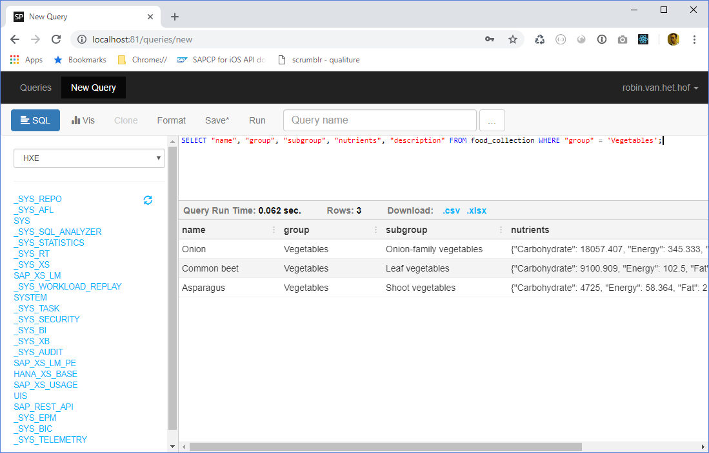
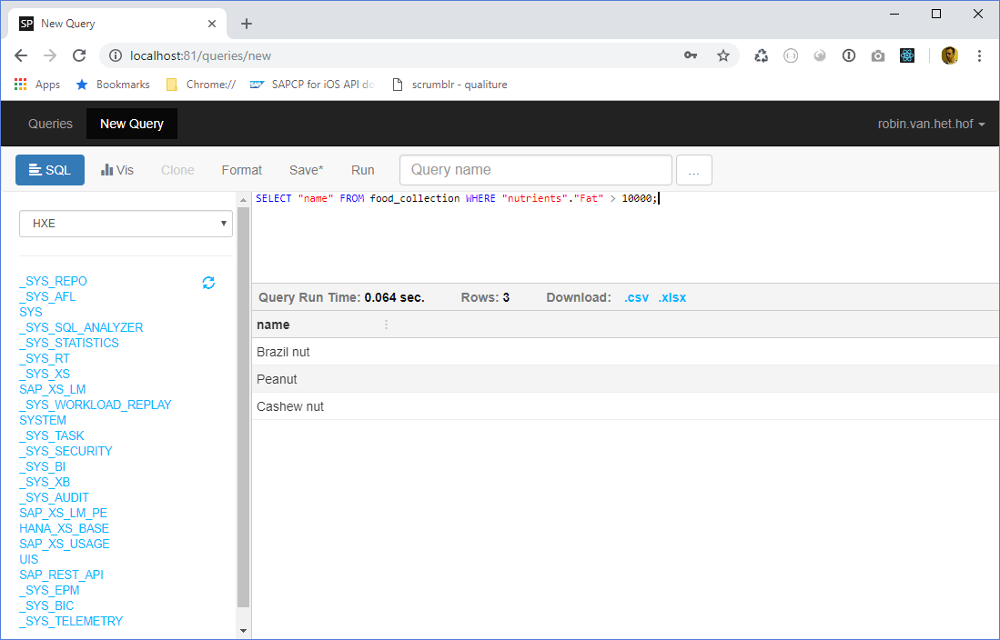

## Prerequisites  
 - SAP HANA Express Edition 2.0 installed
 - SQL editor installed (`Jupyter Notebook`, `SQLPad`, `DBeaver` or the Database Explorer included in the full image with the XS Advanced tools)

## Details
### You will learn  
- Insert JSON documents into the document store
- Query the documents using SQL

For more information about accessing a `NoSQL` storage using SQL and other capabilities of the document store, check the [SAP HANA Administration Guide](https://help.sap.com/viewer/6b94445c94ae495c83a19646e7c3fd56/2.0.03/en-US/5e783b7f5a9749bcbfffe167524aeccc.html) and the [SAP HANA SQL and System Views reference](https://help.sap.com/viewer/4fe29514fd584807ac9f2a04f6754767/2.0.03/en-US/2282aef7db6846b68f09d72be04cb9c0.html?q=document%20store)
---

[ACCORDION-BEGIN [Step 1: ](Log on to the HXE database)]

> For easier execution of SQL statements, in this tutorial it is assumed you have installed [`Jupyter`](https://developers.sap.com/tutorials/mlb-hxe-tools-jupyter.html), [`DBeaver`](https://developers.sap.com/tutorials/hxe-cj1-download-sql-client.html), [`SQLPad`](https://blogs.sap.com/2018/02/05/sqlpad-meets-sap-hana/) or any SQL editor you feel comfortable with when connecting to SAP HANA.

> **Note**: The `hdbsql` console is meant for administration tasks and is not recommended for development tasks.

Open your preferred SQL editor and log on to the `HXE` database.

[DONE]
[ACCORDION-END]


[ACCORDION-BEGIN [Step 2: ](Insert JSON documents into Document Store)]

In the SQL editor pane, paste the content you copied below:

```SQL
INSERT INTO food_collection VALUES( { "name" : 'Kiwi', "group" : 'Fruits', "subgroup" : 'Tropical fruits', "nutrients" : { "Carbohydrate" : 20945.0, "Energy" : 176.0, "Fat" : 1955.0, "Fiber" : 1925.0, "Proteins" : 1421.3 }, "description" : 'The kiwifruit, often shortened to kiwi in many parts of the world, is the edible berry of a woody vine in the genus Actinidia. The most common cultivar group of kiwifruit (''Hayward'') is oval, about the size of a large hen''s egg (5?8 centimetres in length and 4.5?5.5 centimetres in diameter). It has a fibrous, dull greenish-brown skin and bright green or golden flesh with rows of tiny, black, edible seeds. The fruit has a soft texture and a sweet but unique flavor, and today is a commercial crop in several countries, such as Italy, New Zealand, Chile, Greece and France.' });
INSERT INTO food_collection VALUES( { "name" : 'Onion', "group" : 'Vegetables', "subgroup" : 'Onion-family vegetables', "nutrients" : { "Carbohydrate" : 18057.407, "Energy" : 345.333, "Fat" : 0.0, "Fiber" : 2296.154, "Proteins" : 2150.741 }, "description" : 'Allium haematochiton is a species of wild onion known by the common name redskin onion. It is native to northern Baja California and southern California. It it grows on the slopes of the coastal hills and mountains, such as those of the Peninsular Ranges, Transverse Ranges, and southern California Coast Ranges.' });
INSERT INTO food_collection VALUES( { "name" : 'Garlic', "group" : 'Herbs and Spices', "subgroup" : 'Herbs', "nutrients" : { "Carbohydrate" : 50898.333, "Energy" : 770.333, "Fat" : 0.0, "Fiber" : 3850.000, "Proteins" : 8301.667 }, "description" : 'With a history of human use of over 7,000 years, garlic (Allium sativum) is native to central Asia, and has long been a staple in the Mediterranean region, as well as a frequent seasoning in Asia, Africa, and Europe. There are two sub-varieties of allium sativum: Allium sativum var. sativum (soft-necked garlic) and Allium sativum var. ophioscorodon (hard-necked garlic). Soft-necked garlic is the most commonly found. Bulb garlic is available in many forms, including fresh, frozen, dried, fermented (black garlic) and shelf stable products (in tubes or jars).' });
INSERT INTO food_collection VALUES( { "name" : 'Cashew nut', "group" : 'Nuts', "subgroup" : 'Nuts', "nutrients" : { "Carbohydrate" : 33540.993, "Energy" : 1622.625, "Fat" : 15466.667, "Fiber" : 2381.818, "Proteins" : 13402.857 }, "description" : 'The cashew, or caju, is a small tree native to Brazil. Cashew nuts are the seeds of the cashew apple, and are found in the grey bump at the end of the fruit. The cashew apple itself is sweet, soft and juicy.Cashews are usually sold roasted and salted and eaten as a snack.' });
INSERT INTO food_collection VALUES( { "name" : 'Pineapple', "group" : 'Fruits', "subgroup" : 'Tropical fruits', "nutrients" : { "Carbohydrate" : 17650.476, "Energy" : 179.613, "Fat" : 2188.600, "Fiber" : 705.263, "Proteins" : 542.857 }, "description" : 'The Pineapple (Ananas comosus), named for its resemblance to the pine cone, is a tropical plant with edible multiple fruit consisting of coalesced berries, and the most economically significant plant in the Bromeliaceae family. Pineapples may be cultivated from a crown cutting of the fruit, possibly flowering in 20–24 months and fruiting in the following six months. Pineapple does not ripen significantly post-harvest. Pineapples are consumed fresh, cooked, juiced, and preserved, and are found in a wide array of cuisines. In addition to consumption, in the Philippines the pineapple''s leaves are used to produce the textile fiber piña- employed as a component of wall paper and furnishings, amongst other uses.
' });
INSERT INTO food_collection VALUES( { "name" : 'Peanut', "group" : 'Nuts', "subgroup" : 'Nuts', "nutrients" : { "Carbohydrate" : 19706.341, "Energy" : 1571.563, "Fat" : 14543.900, "Fiber" : 6891.892, "Proteins" : 22098.293 }, "description" : 'The peanut, also known as the groundnut and the goober and taxonomically classified as Arachis hypogaea, is a legume crop grown mainly for its edible seeds. It is widely grown in the tropics and subtropics, being important to both small and large commercial producers. It is classified as both a grain legume and, because of its high oil content, an oil crop. World annual production of shelled peanuts was 42 million tonnes in 2014. Atypically among crop plants, peanut pods develop underground rather than aboveground. It is this characteristic that the botanist Linnaeus used to assign the specific name hypogaea, which means "under the earth."' });
INSERT INTO food_collection VALUES( { "name" : 'Horseradish', "group" : 'Herbs and Spices', "subgroup" : 'Spices', "nutrients" : { "Carbohydrate" : 22922.500, "Energy" : 229.000, "Fat" : 700.000, "Fiber" : 3600.000, "Proteins" : 4557.500 }, "description" : 'Horseradish (Armoracia rusticana, syn. Cochlearia armoracia) is a perennial plant of the Brassicaceae family (which also includes mustard, wasabi, broccoli, and cabbage). The plant is probably native to southeastern Europe and western Asia. It is now popular around the world. It grows up to 1.5 metres (5 feet) tall, and is cultivated primarily for its large, white, tapered root. The intact horseradish root has hardly any aroma. When cut or grated, however, enzymes from the now-broken plant cells break down sinigrin to produce allyl isothiocyanate, which irritates the mucous membranes of the sinuses and eyes. Once exposed to air (via grating) or heat, if not used immediately or mixed in vinegar, the grated mash darkens, loses its pungency, and becomes unpleasantly bitter-tasting.' });
INSERT INTO food_collection VALUES( { "name" : 'Asparagus', "group" : 'Vegetables', "subgroup" : 'Shoot vegetables', "nutrients" : { "Carbohydrate" : 4725.000, "Energy" : 58.364, "Fat" : 2150.000, "Fiber" : 1276.471, "Proteins" : 2872.889 }, "description" : 'Asparagus officinalis is a spring vegetable, a flowering perennial plant species in the genus Asparagus. It was once classified in the lily family, like its Allium cousins, onions and garlic, but the Liliaceae have been split and the onion-like plants are now in the family Amaryllidaceae and asparagus in the Asparagaceae. Asparagus officinalis is native to most of Europe, northern Africa and western Asia, and is widely cultivated as a vegetable crop.' });
INSERT INTO food_collection VALUES( { "name" : 'Brazil nut', "group" : 'Nuts', "subgroup" : 'Nuts', "nutrients" : { "Carbohydrate" : 11897.863, "Energy" : 2082.000, "Fat" : 67459.500, "Fiber" : 4266.667, "Proteins" : 11679.000 }, "description" : 'The Brazil nut (Bertholletia excelsa) is a South American tree in the family Lecythidaceae, and also the name of the tree''s commercially harvested edible seed.' });
INSERT INTO food_collection VALUES( { "name" : 'Common beet', "group" : 'Vegetables', "subgroup" : 'Leaf vegetables', "nutrients" : { "Carbohydrate" : 9100.909, "Energy" : 102.500, "Fat" : 0.0, "Fiber" : 2327.273, "Proteins" : 1490.000 }, "description" : 'The beet (Beta vulgaris) is a plant in the Chenopodiaceae family which is now included in Amaranthaceae family. It is best known in its numerous cultivated varieties, the most well known of which is the root vegetable known as the beetroot or garden beet. However, other cultivated varieties include the leaf vegetable chard, as well as the root vegetable sugar beet, which is important in the production of table sugar, and mangelwurzel, which is a fodder crop. Three subspecies are typically recognised. All cultivated varieties fall into the subspecies Beta vulgaris subsp. vulgaris, while Beta vulgaris subsp. maritima, commonly known as the sea beet, is the wild ancestor of these, and is found throughout the Mediterranean, the Atlantic coast of Europe, the Near East, and India. A second wild subspecies, Beta vulgaris subsp. adanensis, occurs from Greece to Syria. The roots are most commonly deep red-purple in color, but come in a wide variety of other shades, including golden yellow and red-and-white striped. Beta vulgaris is a herbaceous biennial or, rarely, perennial plant with leafy stems growing to 1–2 m tall. The leaves are heart-shaped, 5–20 cm long on wild plants (often much larger in cultivated plants). The flowers are produced in dense spikes; each flower is very small, 3–5 mm diameter, green or tinged reddish, with five petals; they are wind pollinated. The fruit is a cluster of hard nutlets.' });
```

When you execute these statements, the JSON documents are now imported.

[DONE]
[ACCORDION-END]


[ACCORDION-BEGIN [Step 3: ](Query the Document Store)]

To validate whether the JSON documents are imported correctly, run the following SQL statement:

```SQL
SELECT "name", "group", "subgroup", "nutrients", "description" FROM food_collection;
```

It now lists all the JSON data you have just inserted:


[DONE]
[ACCORDION-END]

[ACCORDION-BEGIN [Step 4: ](Query JSON properties)]

In the previous step, you selected all the contents of the Document Store collection. However, you could now also query on the specific JSON properties. Change the `SELECT` statement to the following:

```SQL
SELECT "name", "group", "subgroup", "nutrients", "description" FROM food_collection WHERE "group" = 'Vegetables';
```

It now only lists the documents where the JSON property `group` contains the value `Vegetables`:



You could even create a `SELECT` statement with nested JSON properties. Change the `SELECT` statement to the following:

```SQL
SELECT "name" FROM food_collection WHERE "nutrients"."Fat" > 10000;
```

It now only lists the items which contain more than 10,000 mg fat (per 100 mg):




[VALIDATE_4]
[ACCORDION-END]


---
