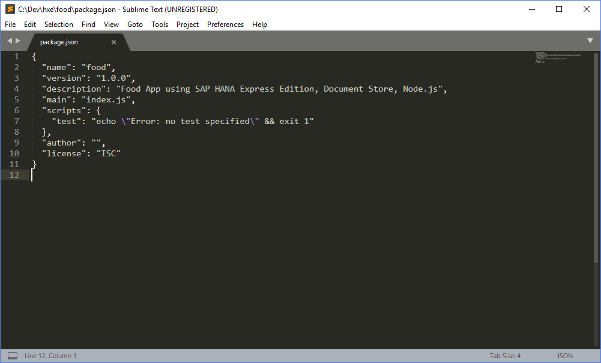
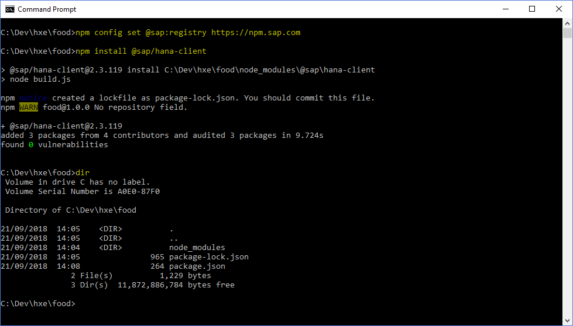
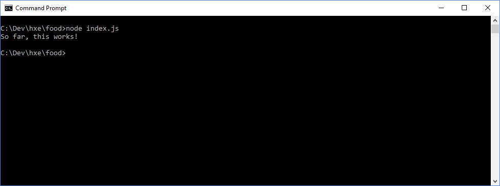
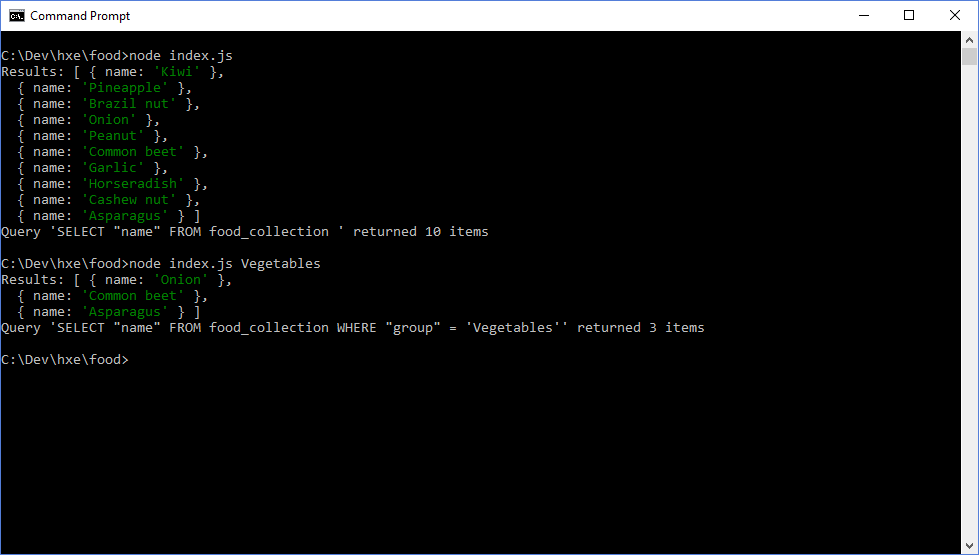

## Prerequisites  
 - SAP HANA Express Edition 2.0 installed
 - Node.js installed

## Details
### You will learn  
  In this tutorial, you will create a Node.js application querying the Document Store on you SAP HANA Express Edition.

---

[ACCORDION-BEGIN [Step 1: ](Create Node.js application)]

> To run this tutorial, it is assumed you have Node.js installed. If you haven't already, download and install the appropriate Node.js runtime for your platform from [https://nodejs.org/en/download/](https://nodejs.org/en/download/)

On your client laptop, create a directory which will serve as the root folder for the Node.js food app.

Open a terminal to that root folder, and execute the following command:

```shell
npm init
```

You are now guided through a wizard which will ultimately create a `package.json` file. You can leave all the default values as-is -- you may want to add a description, test command and/or author, if asked.


When the wizard finishes, the `package.json` file is created with the values specified:




[DONE]
[ACCORDION-END]

[ACCORDION-BEGIN [Step 2: ](Add SAP HANA Database Client to your project)]

While still in the root folder of your project, execute the following command:

```shell
npm config set @sap:registry https://npm.sap.com
npm install @sap/hana-client
```
> ### New to Node.js?
>This sets the registry for `@sap modules`, and installs the `hana-client` package to your project. Once the installation of the package has finished, you'll notice the root folder now contains a `node_modules` folder. This folder contains the `hana-client` package, as well as some dependent packages.




If you now examine the `package.json` file, you'll see an extra property `dependencies` has been added, containing the just added `@sap/hana-client` package.

[DONE]
[ACCORDION-END]


[ACCORDION-BEGIN [Step 3: ](Create a Javascript file)]

In the project's root folder, create an empty file `index.js`.

Open this `index.js` file with your preferred text editor, and add the following statement:

```javascript
console.log("So far, this works!");
```

Save the file when done.

Open a terminal to the root folder, and execute the following command:

```shell
node index.js
```

The application should now run without errors and print the output:



You have now validated your Node.js installation works, and your application can be run using Node.

[DONE]
[ACCORDION-END]

[ACCORDION-BEGIN [Step 4: ](Connect your application to SAP HANA Express Edition)]

Replace the contents of the `index.js` file with the following:

```javascript
const hanaClient = require("@sap/hana-client");

const connection = hanaClient.createConnection();

const connectionParams = {
    host : "hxehost",
    port : 39013,
    uid  : "SYSTEM",
    pwd  : "********",
    databaseName : "HXE"
}

connection.connect(connectionParams, (err) => {
    if (err) {
        return console.error("Connection error", err);
    }

    const whereClause = process.argv[2] ? `WHERE "group" = '${process.argv[2]}'` : "";
    const sql         = `SELECT "name" FROM food_collection ${whereClause}`;

    connection.exec(sql, (err, rows) => {
        connection.disconnect();

        if (err) {
            return console.error('SQL execute error:', err);
        }

        console.log("Results:", rows);
        console.log(`Query '${sql}' returned ${rows.length} items`);
    });
});
```

This code does the following:

 1. First, you tell the application to use the package `@sap/hana-client`.
 2. Then a constant `connection` is created which creates the connection
 3. A constant `connectionParams` contains the connection details to the `HXE` database.
 4. The client connects to the database.
 5. A constant `sql` containing an SQL query is defined.
 6. If you supply an argument, for instance `node index.js Vegetables`, that argument `Vegetables` is then added to the query's `WHERE` clause.
 7. The `connection` object then executes the SQL statement
 8. The connection is terminated, to free resources.
 9. Upon successful completion, it then prints the results.

> Note: The above code is meant to provide a first, clear approach to querying the database using the official drivers. It requires modification before being used for productive applications

Now try running the app with:

```shell
node index.js
```

or provide a group name as an extra argument, for instance:

```shell
node index.js Vegetables
```

If everything went well, you should see an output like this:




[VALIDATE_4]
[ACCORDION-END]


---
