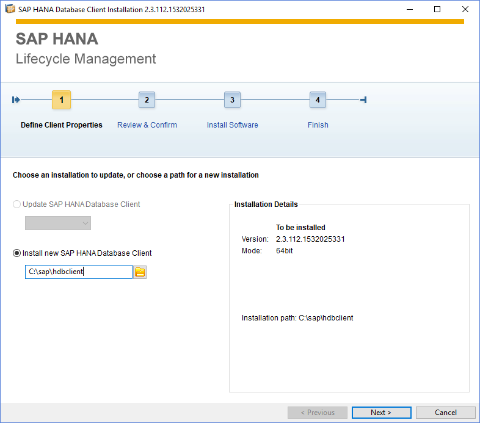
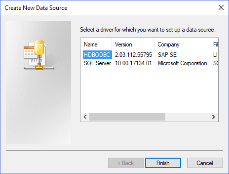
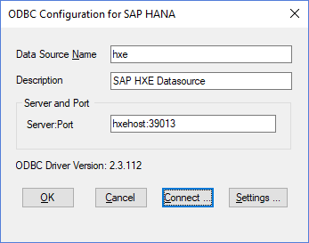
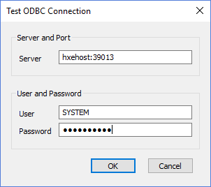
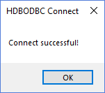
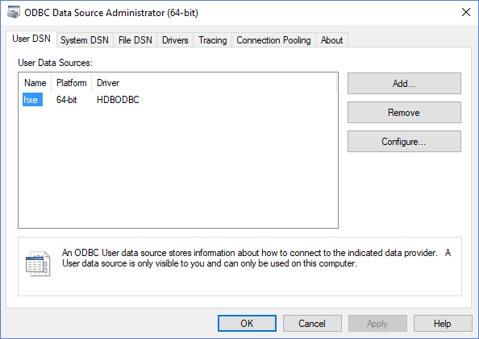

## Prerequisites  
 - SAP HANA Express Edition 2.0 installed
 - 64-bit Apache 2.4 installed
 - 64-bit PHP 7.2 installed

## Details
### You will learn  

- How to create PHP app which and connect to your SAP HANA Express Edition instance.

Since the HANA ODBC driver is 64 bit, your environment should also be 64 bit. In order to follow this tutorial, it is assumed you already have a [64-bit PHP runtime installed](http://php.net/manual/en/install.php  ) on top of a [64-bit Apache web server](http://httpd.apache.org/download.cgi), running on 64-bit Windows. You can follow the tutorial while working on Linux or macOS, but the procedure for installing the SAP HANA Client and its database drivers will be slightly different.

And instead of Apache, you may use a different 64-bit web server containing a 64-bit PHP runtime, but the location of the web root may differ from Apache's.

---

  [ACCORDION-BEGIN [Step 1: ](Download SAP HANA Client)]

In order to connect SAP HANA Express Edition to the PHP runtime, you need to install the SAP HANA ODBC database drivers. These are included in the SAP HANA Client download.

Open a browser and navigate to [https://tools.hana.ondemand.com/](https://tools.hana.ondemand.com/). Click the **HANA** tab, and locate the **SAP HANA Client 2.0** download.

Download the version of the SAP HANA Client applicable to your platform (Windows 64-bit, Linux, or macOS), and extract the contents to a local folder.

[DONE]
[ACCORDION-END]

[ACCORDION-BEGIN [Step 2: ](Install SAP HANA Client)]

Double-click the `hdbsetup.exe` file to start the installation.



Specify a target location, and walk through the installation wizard to finalize the setup.


[DONE]
[ACCORDION-END]


[ACCORDION-BEGIN [Step 3: ](Create SAP HANA ODBC Data Source)]

Open the **ODBC Data Source administrator** on your Windows machine:


Click the **Add...** button. A driver named `HDBODBC` should be listed, indicating the SAP HANA Client install was indeed successful:



Make sure you select the `HDBODBC` driver, and click **Finish**.

Now, specify the following connection details:

| Field | Value |
|----|----|
| Data Source Name | `hxe` |
| Description | `SAP HXE Datasource` |
| Server:Port | `hxehost:39013` |



> For macOS and Linux, you can check the ODBC connection using the `odbcreg` application in the SAP HANA Client's root folder.

> Execute the command:

> `./odbcreg hxehost:39013 HXE SYSTEM <your_password>`

> It should then return a result like the following:

> `ODBC Driver test.  `
>
> `Connect string: 'SERVERNODE=hxehost:39013;SERVERDB=HXE;UID=SYSTEM;PWD=********;'.`    
> `retcode:	 0`  
> `outString(73):	SERVERNODE={hxehost:39013};SERVERDB=HXE;UID=SYSTEM;PWD=********;`  
> `Driver version 02.03.0112 (2018-08-14).`  
> `Select now(): 2018-09-24 20:42:40.123000000 (29)`  

[DONE]
[ACCORDION-END]

[ACCORDION-BEGIN [Step 4: ](Validate the ODBC connection)]

Click the **Connect...** button. Enter the credentials for the `SYSTEM` user:



Click **OK** to test the connection. If everything went well, you should see the following message:



Click **OK** to dismiss the popup, click **OK** to dismiss the ODBC test, and click **OK** to save the ODBC configuration. The data source configuration is now stored:




[DONE]
[ACCORDION-END]

[ACCORDION-BEGIN [Step 5: ](Create a simple PHP app)]

Navigate to your `<Apache-home>/htdocs/` folder, and create a new subfolder `hxe`. Within that folder, create a new file `index.php`.

Open the newly created `index.php` file with your text editor of choice, and add the following content:

```php
<?php
    $datasource = "hxe";
    $servername = "hxehost:39013";
    $username   = "SYSTEM";
    $password   = "********";

    $conn   = odbc_connect($datasource, $username, $password, SQL_CUR_USE_ODBC);

    if (!($conn)) {
        exit("Connection Failed: " . $conn);
    } else {
        $sql = 'SELECT "name" FROM food_collection';
        $rs  = odbc_exec($conn,$sql);

        if (!$rs) {
            exit("Error in SQL");
        }
?>
<table>
    <tr>
        <th>Food Name</th>
    </tr>
<?php		
        while (odbc_fetch_row($rs)) {
            $foodName = odbc_result($rs,"name");
?>
    <tr>
        <td>
            <?php echo $foodName ?>
        </td>
    </tr>
<?php
        }
?>
</table>
<?php
        odbc_close($conn);
    }
?>
```

The above code does the following;

 - First, a connection to the previously created ODBC data source is established, using the user credentials for the `HXE` database.
 - If the connection succeeds, an SQL query is executed
 - The results of the SQL query are then printed in a simple HTML table.

[DONE]
[ACCORDION-END]

[ACCORDION-BEGIN [Step 6: ](Run the PHP file)]

Open a browser and navigate to `localhost/hxe/index.php`.

If everything works well, you should see the following results:


[VALIDATE_6]
[ACCORDION-END]


---
