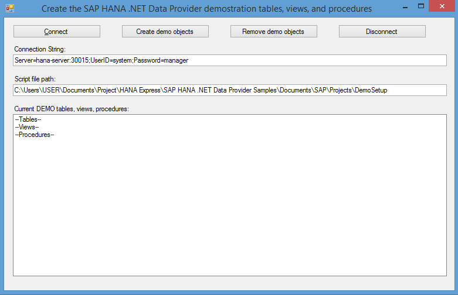

## Prerequisites  
- **Proficiency:** Beginner

- **Setup:** This tutorial assumes that you have followed the [Install the SAP HANA, express edition clients](https://www.sap.com/developer/groups/hxe-install-clients.html) group tutorials to install the HANA, express edition client software.

- **Setup:** You must have Microsoft Visual Studio 2010 or later installed on your computer.
- **Setup:** You must have Microsoft .NET Framework installed on your computer (Generally .NET     Framework will be installed when you install Microsoft Visual Studio).

## Next Steps
 - This is a standalone How-To on establishing basic connectivity to ADO and ODBC compliant SAP database servers.[View similar How-Tos](http://www.sap.com/developer/tutorials.html) or [View all How-Tos](http://www.sap.com/developer/tutorials.html)

## How-To Details
A Microsoft visual studio project can connect to SAP database using SAP HANA Client that has data providers for Microsoft .NET Framework. In this How-To you will use a demo database table setup project to learn about connecting to SAP HANA database servers from Visual Studio.

### Time to Complete
**10 Min**.

---

1. In this tutorial, you will use the data provider to set up sample database tables, views, and procedures.

2. Access the [sample projects for the data provider](http://scn.sap.com/docs/DOC-53652), download the appropriate project.

3. Start Microsoft Visual Studio.

4. Click **File** » **Open** » **Project/Solution**.

5. Browse to `Documents\SAP\Projects\DemoSetup` and open the `DemoSetup.sln` project.

6. By Default, `Sap.Data.Hana for .NET` data provider reference will be added after importing the project as shown below. This data provider will be located in SAP HANA Client installation path.

    

7. Click **Debug** » **Start Without Debugging** or press **Ctrl+F5** to run the project.

8. In the Connection String field, type a valid connection string and click Connect to connect to an SAP HANA database server. The example given below connects to a database called `HXE` assigned to the parameter `databaseName`. `HXE` is the default tenant database the server connects to on port `3< instance number >15`.

    >`Server=hana-server:30015;databaseName=HXE;UserID=system;Password=manager`, connects to an SAP HANA database server with the indicated host name or its IP address, port (usually 3 followed by instance number then 15), a database, user ID, and password.

    You can also connect to the database using ODBC driver. For example,
    >`Driver={HDBODBC};UID=system;PWD=manager;SERVERNODE=hana-server:30015;databaseName=HXE`, Note that driver can be `HDBODBC` or `HDBODBC32` depending on whether your application is 64 bit or 32 bit respectively.

    If your credentials are correct, then the .NET application connects to your SAP HANA database server. The list-box area is filled with the names of any existing tables, views, or procedures belonging to the DEMO schema.

    Example Below.

    

9. Click **Create demo objects**.

    The application reads and executes a script of SQL statements contained in a file located in the indicated `Script file path`.

    If the execution of the script was successful, then the list-box area is filled with the names of tables, views, or procedures belonging to the DEMO schema.

10. Click **Disconnect** to disconnect from the SAP HANA server and close the window to shut down the application.

### Optional - Additional Configuration Steps

- If for any reason you want to remove the tables, views, and procedures set up in the previous step, then click **Remove demo objects**.

## Next Steps
 - View additional .NET [sample projects](http://scn.sap.com/docs/DOC-53652).
 - [View similar How-Tos](http://www.sap.com/developer/tutorials.html) or [View all How-Tos](http://www.sap.com/developer/tutorials.html)
