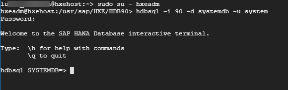

## Prerequisites  
 - Install or deploy [SAP HANA, express edition](https://developers.sap.com/topics/sap-hana-express.html#flowchart)

## Details
### You will learn  
  - How to enable the script server in a tenant database from the System database in SAP HANA, express edition
  - How to fix the error `No ScriptServer available. See SAPNote 1650957 for further information.` while executing some advanced analytic functions

The script server is an auxiliary SAP HANA server that is required to execute complex and performance-intensive procedures. It helps maintaining the main server stable during these operations.

---

[ACCORDION-BEGIN [Step 1: ](Log in to a SQL console)]

You can use the command-line SQL console embedded in the SAP HANA, express edition, virtual machine.

As user `hxeadm`, log in to the system database:

```SQL
hdbsql -i 90 -d systemdb -u SYSTEM
```

When prompted, use the password for SYSTEM.



> Note: You can also perform this from the database explorer if you are using the full image of SAP HANA, express edition that includes XS Advanced applications.


[DONE]
[ACCORDION-END]

[ACCORDION-BEGIN [Step 2: ](Enable the script server)]

Execute the following SQL statement to enable the script server

```SQL
ALTER DATABASE HXE ADD 'scriptserver';
```


[VALIDATE_1]
[ACCORDION-END]

---
