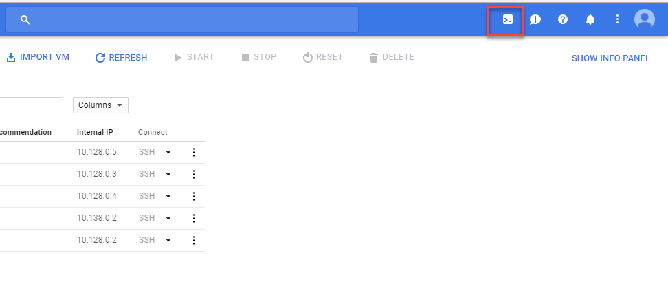
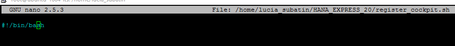
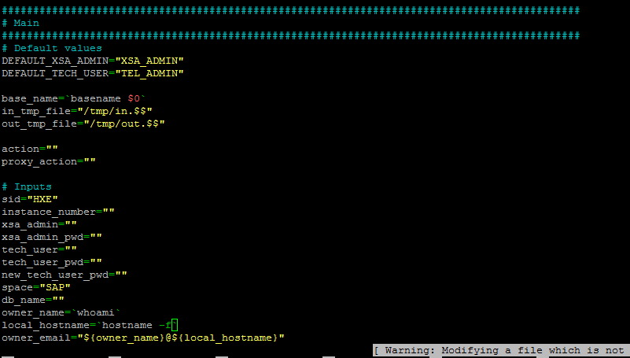

## Prerequisites  
 - [HANA Express Edition - Install Dependencies for Ubuntu on Google Cloud Platform](http://www.sap.com/developer/tutorials/hxe-gcp-install-dependencies.html)


## Next Steps
 - [HANA Express Edition - Execute the Installation script and finish setup](http://www.sap.com/developer/tutorials/hxe-gcp-install-hana-express-edition.html)

## Disclaimer
SAP HANA, express edition (HXE) is officially supported on SLES and RHEL. SAP Community members have been successful in running HXE on other Linux operating systems that are not formally supported by SAP, such as Ubuntu, openSUSE and Fedora. SAP is not committing to resolving any issues that may arise from running HXE on these platforms.

## Details
### You will learn  
In this tutorial, you will extract the files for the installation of either the server-only option or the HXE + XS Advanced tools option. You will also update the firewall rules in `Gcloud` accordingly.
**Note: Update for HANA 2.0 SPS02 pending**]

### Time to Complete
**15 Min**

---

[ACCORDION-BEGIN [Step 1: ](Extract the files)]
Once the upload of the installation package is finished, execute the following commands from a console. Replace the `home` directory accordingly if you have uploaded the files into a different location.

**Note**: If that location is the `/root` location you will get permission errors when executing the installation binaries for HANA Express. Move the files into your home location to avoid this.

```
cd /home/<<your_username>>
chmod -R 777 hxe.tgz
tar -xvzf hxe.tgz
```
If you are also installing XS Advanced applications, execute the following commands:

```
chmod -R 777 hxexsa.tgz
tar -xvzf hxexsa.tgz
```

You will see the list of files that have been extracted. These are the files you will later use for installation.


[ACCORDION-END]

[ACCORDION-BEGIN [Step 2: ](Update the Firewall rules)]

Go to the `VM Instance` panel in your Google Cloud Platform console and open a `gcloud console` for your ubuntu machine:



Keep the default command line and click on **Run** in Cloud Shell.


The following commands enable the necessary traffic into ports that are used by SAP HANA Express edition. Copy and paste them into the `gcloud` command prompt:

```
gcloud compute firewall-rules create rule1 --allow tcp:8000
gcloud compute firewall-rules create rule2 --allow tcp:4300
gcloud compute firewall-rules create rule3 --allow tcp:51002-51027
gcloud compute firewall-rules create rule4 --allow tcp:80
gcloud compute firewall-rules create rule5 --allow tcp:443
gcloud compute firewall-rules create rule6 --allow tcp:1128-1129
gcloud compute firewall-rules create rule7 --allow tcp:30000-30100
gcloud compute firewall-rules create rule8 --allow tcp:50000-50050
```

If you are installing the XS Advanced tools, you also need to add the following rules:

```
gcloud compute firewall-rules create rule9 --allow tcp:38326
gcloud compute firewall-rules create rule10 --allow tcp:39228
gcloud compute firewall-rules create rule11 --allow tcp:49000-49100
gcloud compute firewall-rules create rule12 --allow tcp:55752
gcloud compute firewall-rules create rule13 --allow tcp:53001-53100
gcloud compute firewall-rules create rule14 --allow tcp:51000-51100
gcloud compute firewall-rules create rule15 --allow tcp:55742
```

>Note: If you keep the default instance number, 90, the ports will be 8090, 4390, 39000-39100 and 59000-59050.

You can confirm all the rules have been processed using command

```
gcloud compute firewall-rules list
```


[ACCORDION-END]


[ACCORDION-BEGIN [Step 3: ](XS Advanced Installation ONLY - Update script)]

This step applies **ONLY if you are installing the XS Advanced tools**.

Before you launch the installation, you need to perform a minor modification on the script `register_cockpit.sh` which is executed at the end of the XS Advanced installation. This script has been extracted from the XS Advanced `.tar.gz` into a directory called `HANA_EXPRESS_20`.

Open the file for edition with the following command. Adjust accordingly with your username or if you extracted the installation files into a different directory:

```
 nano /home/your_home_directory/HANA_EXPRESS_20/register_cockpit.sh
```

Replace the first line containing `#!/bin/sh` with `!#/bin/bash` so it looks like this:



Look for a line containing variable `local_hostname=hostname -f` and replace it with  `hostname`, i.e., remove the  `-f` from this line:



**Save** this file.


[ACCORDION-END]


## Next Steps
- [HANA Express Edition - Execute the Installation script and finish setup](http://www.sap.com/developer/tutorials/hxe-gcp-install-hana-express-edition.html)
