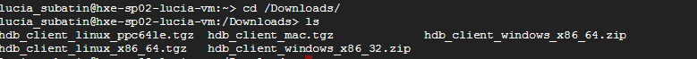
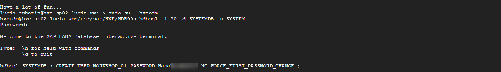
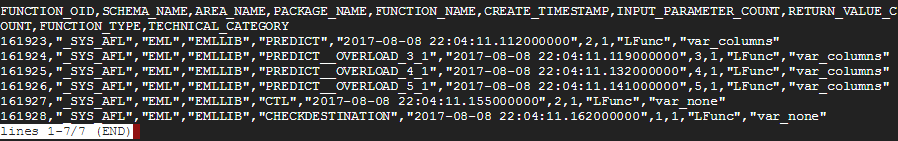

## Prerequisites  
 - **Proficiency:** Beginner
 - You have a Google Account and/or have registered for the free trial on `cloud.google.com`.


## Next Steps
 - [Review SAP HANA, express edition content, tutorials and quick start guides](http://www.sap.com/developer/topics/sap-hana-express.html)
 - **OPTIONAL** [Setup PuTTY and WinSCP to access your SAP HANA, express edition instance on Google Cloud Platform](http://www.sap.com/developer/tutorials/hxe-gcp-setup-putty-winscp-windows.html)

## Disclaimer
The image currently only includes the HANA database engine. XS Advanced is not installed by default.

## Details
### You will learn  
This tutorial will guide you through the process to create a new Google Cloud Platform virtual instance based on SAP HANA, express edition. You will also learn how to set up your new instance and enable it for tutorials and developing your first application.


### Time to Complete
**15 Min**

---

[ACCORDION-BEGIN [Step 1: ](Create your Google Cloud Platform instance)]

Navigate to [Google Cloud Launcher](https://console.cloud.google.com/launcher) and search for SAP HANA, express edition.


Click on the **Launch on Compute Engine** button. The next page will allow you to modify the default configuration for the Cloud Virtual Machine.


Type an identifying name for the instance, then select the desired geographic zone and machine type. Individual zones might have differing computing resources available and specific access restrictions.

>The default settings for RAM, CPU and Storage are appropriate for getting familiar with SAP HANA. The recommended minimum configuration is 13GB of RAM, with at least 2 virtual CPU and 36GB of storage.

By default, the firewall rules are configured specifically for SAP HANA, express edition. As new SAP HANA applications are created, additional ports might have to be opened up. The following ports are required to connect to SAP HANA, express edition: **8090, 4390, 39013, 39015, 59013, 59014**.

To connect to the instance from a local SSH client, like PuTTY, port **22** also has to be open.

After reviewing all configuration options, click **Deploy**. This will take a few minutes.


[DONE]
[ACCORDION-END]

[ACCORDION-BEGIN [Step 2: ](Log in to the instance and change the administration passwords)]

Upon successful deployment, use the web based SSH tool and log into your instance.


Type the following command:

```
sudo su - hxeadm
```

Hit **Enter**. Follow the prompts to change password. **IMPORTANT: SAP HANA will not be usable if this step is ignored**.

>The password needs to be at least eight characters-long and contain at least one digit, one uppercase and one lowercase letter. Special characters are optional but restricted. Please review password requirements in [the SAP Help](http://help-legacy.sap.com/saphelp_hanaplatform/helpdata/en/61/662e3032ad4f8dbdb5063a21a7d706/frameset.htm)


Enter `Y` to continue with configuration when prompted:


Once configuration is finished, you will see a success message:


You should also change your default Operating System password for user `hxeadm`. **Open a new SSH console** and use the following command as your GCP user for this:

```
passwd hxeadm

```


>Note: The default `hxeadm` password is `HXEHana1`

[DONE]
[ACCORDION-END]


[ACCORDION-BEGIN [Step 3: ](Take note of your external IP and connect)]

To connect to SAP HANA, we need to know what the external IP address is. Once deployment is finished, click on the `Learn more` and follow the steps to create and external IP address.


To connect to your newly deployed instance via a local SSH client, review the documentation about [how to connect to an instance](https://cloud.google.com/compute/docs/instances/connecting-to-instance). Google Cloud Platform provides built in SSH support.

Your SAP HANA, express edition, instance is now up and running.

All the steps that follow are optional.

[DONE]
[ACCORDION-END]


[ACCORDION-BEGIN [Step 4 (Optional): ](Map your hostname in the hosts file)]

Use your IP address to map it to the hosts file in your computer. You need administration permissions to do this.

- For Windows Computers:
  If your user is not an administrator but has administrator rights, right-click on Notepad and choose `Run as Administrator`. If you are an administrator user, proceed to the next point.

  

  Open the file or navigate with Windows explorer. You need to edit the file called `hosts` in the directory `C:\Windows\System32\drivers\etc`

  


- For Mac:
  Open a terminal (`Finder -> Applications -> Terminal`) and type `sudo nano /etc/hosts`

  


Add the IP address followed by the name of the host, which will be `hxehost`:


**Save** and close the editor.

> Note: If Notepad asks you to create a new file you do not have enough permissions to save the file. Creating a new file will not alter the configuration as intended.


[DONE]
[ACCORDION-END]

[ACCORDION-BEGIN [Step 5 (Optional): ](Check clients in the Downloads folder)]

Go into the `Downloads` folder and list the contents.

```
cd /Downloads
ls
```

You will find the installation packages for different clients.




[DONE]
[ACCORDION-END]

[ACCORDION-BEGIN [Step 6 (Optional): ](Server-only installation: Create a development user)]

It is always safe to create a development user and even make a copy of the system user to use as an administrator in case you somehow lock yourself out. The XS Advanced installation creates a development user called XSA_DEV, so this step is unnecessary if you are using that option.

If you are using the server-only option, in a new SSH console, switch to the user `hxeadm` and connect to the database as follows:

```SQL

sudo su - hxeadm

hdbsql -i 90 -d SYSTEMDB -u SYSTEM

```

Enter the master password you chose at setup. When the `hdbsql` command prompt is ready, enter the following (replacing a the password and username for one of your choice):

```SQL
CREATE USER WORKSHOP_01 PASSWORD <password> NO FORCE_FIRST_PASSWORD_CHANGE ;

```



While you are here, you could also see that the Extended Machine Learning libraries are included:

```SQL
select * from SYS.AFL_FUNCTIONS where AREA_NAME = 'EML';
```

Which will show the available function libraries:





[DONE]
[ACCORDION-END]

## Next Steps
 - [Review SAP HANA, express edition content, tutorials and quick start guides](http://www.sap.com/developer/topics/sap-hana-express.html)
 - **OPTIONAL** [Setup PuTTY and WinSCP to access your SAP HANA, express edition instance on Google Cloud Platform](http://www.sap.com/developer/tutorials/hxe-gcp-setup-putty-winscp-windows.html)
