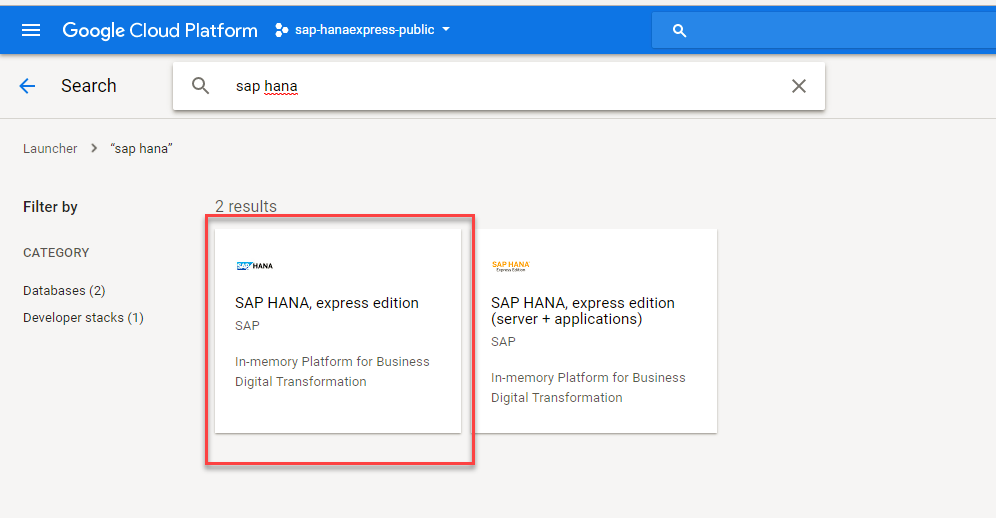
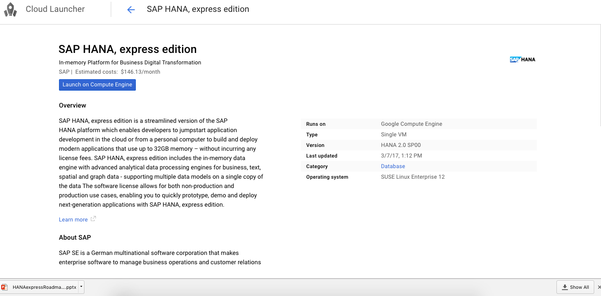
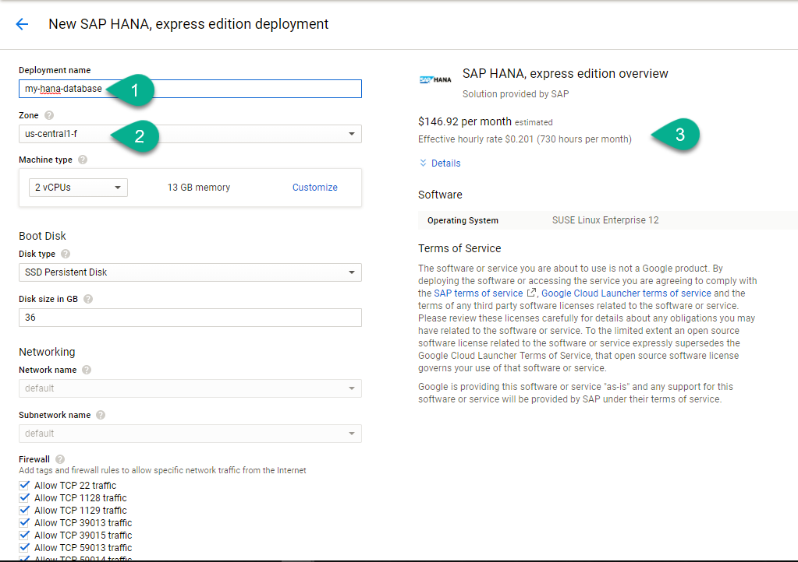
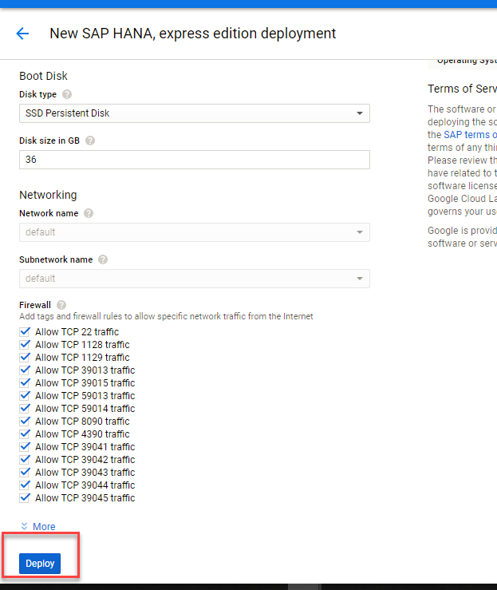
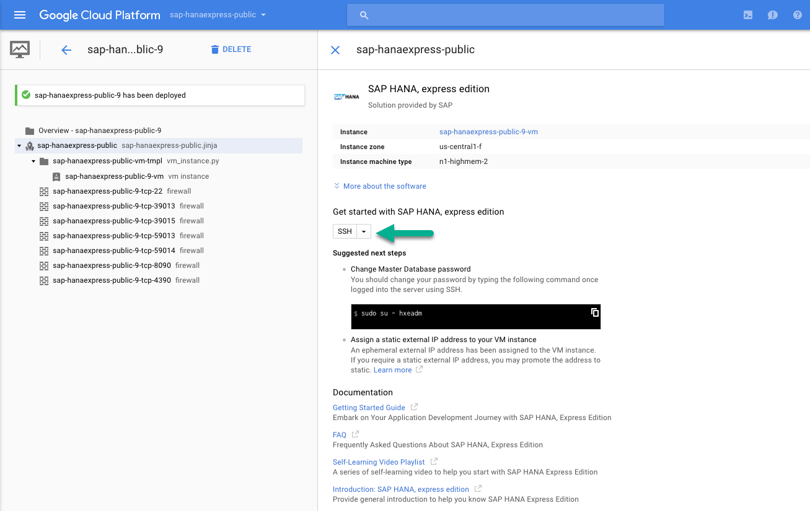
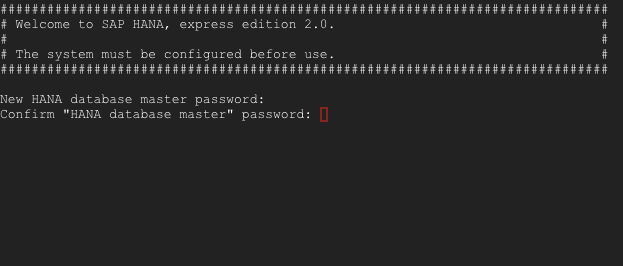
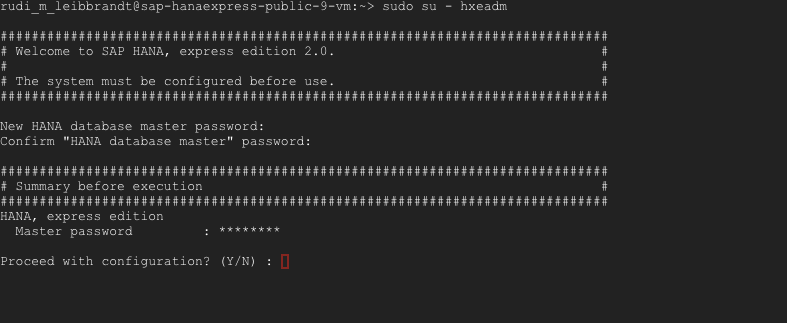
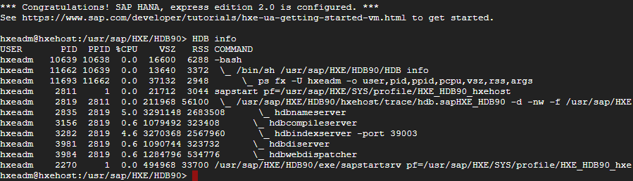
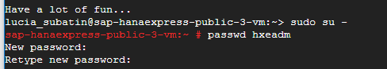

## Prerequisites  
 - You have a Google Account and/or have registered for the free trial on `cloud.google.com`


## Next Steps
- **Drivers and connectors for Python, Node.js, .NET, Java and others**: Check sample applications using different drivers and languages [such as Node.js, Python ](https://developers.sap.com/group.hxe-tiny-world.html)
- **Database clients**: Use a SQL client and the JDBC drivers to [connect to the database](https://developers.sap.com/tutorials/hana-clients-install.html).
- [Review SAP HANA, express edition content, tutorials and quick start guides](https://developers.sap.com/topics/hana.html)
- **OPTIONAL:** [Setup PuTTY and WinSCP to access your SAP HANA, express edition instance on Google Cloud Platform](https://developers.sap.com/tutorials/hxe-gcp-setup-putty-winscp-windows.html)

## Disclaimer
The image only includes the SAP HANA database engine. Extended Application Services, advanced model (XS Advanced) is not installed in this image. Check the following tutorial to setup the full image that includes XS Advanced: [Launch SAP HANA, express edition on GCP including XS Advanced applications](https://developers.sap.com/tutorials/hxe-gcp-getting-started-launcher-xsa.html)

## Details
### You will learn  
How to create a Virtual Machine with an SAP HANA, express edition instance using the pre-defined image in the Compute Engine in Google Cloud platform.


---

[ACCORDION-BEGIN [Step 1: ](Create your Google Cloud Platform instance)]

Navigate to [Google Cloud Launcher](https://console.cloud.google.com/launcher) and search for SAP HANA, express edition.

You will be presented with two options:

- **SAP HANA, express edition (server-only)**: You can connect using SQL clients like SAP HANA Studio or any other client. Includes the Predictive Analytic Library, Machine learning libraries and other advanced analytics.
- **SAP HANA, express edition + XS Advanced Applications** (also referred to as XSA): Includes all of the other features plus the Cloud Foundry based development platform,  SAP Web IDE for SAP HANA, administration cockpit among other applications like SHINE and Smart Data Streaming. OData support, Node.js and Java runtime environments are also included. This option requires more resources and is covered [in this other tutorial](https://developers.sap.com/tutorials/hxe-gcp-getting-started-launcher-xsa.html).

Click on the **SAP HANA, express edition** tile:



Click on the **Launch on Compute Engine**:



The next page will allow you to modify the default configuration for the Cloud Virtual Machine.



Type an identifying name for the instance, then select the desired geographic zone and machine type. Individual zones might have differing computing resources available and specific access restrictions.

>By default, the firewall rules are configured specifically for SAP HANA, express edition. As new SAP HANA applications are created, additional ports might have to be opened up. The following ports are required to connect to SAP HANA, express edition: **8090, 4390, 39013, 39015, 59013, 59014**.
To connect to the instance from a local SSH client, like PuTTY, port **22** also has to be open.

After reviewing all configuration options, scroll down and click **Deploy**. This will take a few minutes.



[DONE]
[ACCORDION-END]

[ACCORDION-BEGIN [Step 2: ](Log in to the instance and change the administration passwords)]

Upon successful deployment, use the web based SSH tool and log into your instance.



Type the following command:

```
sudo su - hxeadm
```

Hit **Enter**. Follow the prompts to change password. **IMPORTANT: SAP HANA will not be usable if this step is ignored**.

> ### **Please check the password policy to avoid errors**
>
> SAP HANA, express edition requires a very strong password that complies with these rules:
>
> - At least 8 characters
> - At least 1 uppercase letter
> - At least 1 lowercase letter
> - At least 1 number
> - Can contain special characters, but not _&grave;_ (backtick), _&#36;_ (dollar sign),  _&#92;_ (backslash), _&#39;_ (single quote), or _&quot;_ (double quotes)
> - Cannot contain dictionary words
> - Cannot contain simplistic or systematic values, like strings in ascending or descending numerical or alphabetical order. Please review password requirements in [the SAP Help](https://help.sap.com/viewer/6b94445c94ae495c83a19646e7c3fd56/2.0.00/en-US/61662e3032ad4f8dbdb5063a21a7d706.html)

Type in a password following the rules (the cursor will not move):



Enter `Y` to continue with configuration when prompted:



Once configuration is finished, you will see a success message:


Check the status of your database using command `HDB info`



You can optionally connect to the database using  `hdbsql -i 90 -d SYSTEMDB -u SYSTEM`

When prompted for a password, use the master database password.


Use `quit` to return to the command prompt.

[DONE]
[ACCORDION-END]

[ACCORDION-BEGIN [Step 3: ](Take note of your external IP and connect)]

To connect to SAP HANA, you need to know what the external IP address is. Once deployment is finished, you can click on the menu and navigate to `Compute Engine -> VM instances` to see your newly created Virtual Machine.


Take note of your IP address:


Alternatively, click on the `Learn more` and follow the steps to create a static external IP address. This could increase costs but will allow you to perform this configuration only once.


Your SAP HANA, express edition instance is now up and running. You can continue to [explore tutorials to get you started](https://developers.sap.com/topics/hana.html) or perform the optional steps below.

[DONE]
[ACCORDION-END]

[ACCORDION-BEGIN [Step 3 (Recommended optional): ](Change the password for the operating system user)]
You should also change your default Operating System password for user `hxeadm`. **Open a new SSH console** and use the following command as your GCP user for this:

```
sudo passwd hxeadm

```



>The default `hxeadm` password is `HXEHana1`

[DONE]
[ACCORDION-END]


[ACCORDION-BEGIN [Step 4 (Optional): ](Map your hostname in the hosts file)]

Use your IP address to map it to the hosts file in your computer. You need administration permissions to do this.

- For Windows Computers:
  If your user is not an administrator but has administrator rights, right-click on Notepad and choose `Run as Administrator`. If you are an administrator user, proceed to the next point.

  

  Open the file or navigate with Windows explorer. You need to edit the file called `hosts` in the directory `C:\Windows\System32\drivers\etc`

  


- For Mac:
  Open a terminal (`Finder -> Applications -> Terminal`) and type `sudo nano /etc/hosts`

  


Add the IP address followed by the name of the host, which will be `hxehost`:


**Save** and close the editor.

> If Notepad asks you to create a new file you do not have enough permissions to save the file. Creating a new file will not alter the configuration as intended.

[DONE]
[ACCORDION-END]


[ACCORDION-BEGIN [Step 5: ](OPTIONAL - Create a development user in the system database)]

It is always safe to create a development user and even make a copy of the SYSTEM user to use as an administrator in case you somehow lock yourself out.

In a new SSH console, switch to the user `hxeadm` and connect to the SYSTEM database as follows:

```SSH
sudo su - hxeadm

hdbsql -i 90 -d SYSTEMDB -u SYSTEM
```

Enter the master password you chose at setup. When the `hdbsql` command prompt is ready, enter the following (replacing a the password and username for one of your choice):

```SQL
CREATE USER WORKSHOP_01 PASSWORD <password> NO FORCE_FIRST_PASSWORD_CHANGE ;
```
>You may need to add additional roles or permissions depending on your goals

It is recommended that you use the tenant database for development.

> ## Important
>&nbsp;
>
> SAP HANA supports multiple databases, isolated from each other, in the same environment. This concept is known as multi-tenancy. There is one database, the system database, that has limited SQL capabilities and is used to perform administration tasks over the contained databases, called tenants. Tenant databases have all of the SQL capabilities enabled. SAP HANA, express edition, brings one default first tenant called `HXE`.

You can use the following command to connect to the first tenant.

```SSH
hdbsql -i 90 -d HXE -u SYSTEM
```

[DONE]
[ACCORDION-END]

### Additional Information
- **Drivers and connectors for Python, Node.js, .NET, Java and others**: Check sample applications using different drivers and languages [such as Node.js, Python ](https://developers.sap.com/group.hxe-tiny-world.html)
- **Database clients**: Use a SQL client and the JDBC drivers to [connect to the database](https://developers.sap.com/tutorials/hana-clients-install.html).
- [Review SAP HANA, express edition content, tutorials and quick start guides](https://developers.sap.com/topics/hana.html)
- **OPTIONAL:** [Setup PuTTY and WinSCP to access your SAP HANA, express edition instance on Google Cloud Platform](https://developers.sap.com/tutorials/hxe-gcp-setup-putty-winscp-windows.html)
