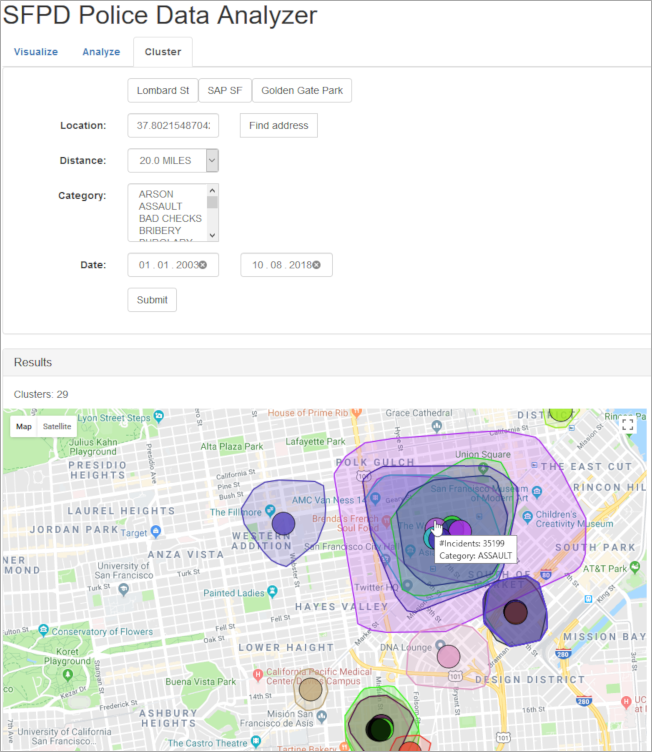

## Prerequisites  
- **Tutorials:** [Full-text search queries with Hibernate](https://developers.sap.com/tutorials/hxe-gcp-hibernate-text-search.html)

## Details
### You will learn  
  - How to use spatial clustering to find incident clusters.

### Motivation
[Spatial clustering](https://help.sap.com/viewer/cbbbfc20871e4559abfd45a78ad58c02/latest/en-US/ebb0955d1b6e4d4baf47263fca55e081.html) can be used to group points (locations) that are somehow related according to some criteria.

There are several [cluster algorithms](https://help.sap.com/viewer/cbbbfc20871e4559abfd45a78ad58c02/latest/en-US/a6d01f373d1b47f98e7814606d24d704.html) available in SAP HANA.

The algorithm that is most suitable for the police incidents data set is [DBSCAN](https://help.sap.com/viewer/cbbbfc20871e4559abfd45a78ad58c02/latest/en-US/bd5972d6dda346f8b5c0d0615353c24d.html). The DBSCAN algorithm finds arbitrary clusters of points by grouping points that are at most a distance epsilon apart. Such a group of points is considered a cluster if the group is made of at least a configurable minimum number of points. All points that are not part of a cluster are considered to be noise.

One interesting use-case for clustering in the police incidents data set is to find clusters of incidents per category. This way it is possible to determine areas that are hot spots for certain types of incidents.

---

[ACCORDION-BEGIN [Step 1: ](Implement the spatial clustering)]
Open the file `IncidentClusterRepository.java` from the directory `src/main/java/com/sap/hana/hibernate/sample/repositories`.

The `findClusters` method needs to be implemented to perform the clustering per category in the database.

As there is no support for spatial clustering in Hibernate, this requires a native query. However, Hibernate can still automatically map the query results to Java objects using a [`SqlResultSetMapping`](http://docs.jboss.org/hibernate/orm/current/userguide/html_single/Hibernate_User_Guide.html#annotations-jpa-sqlresultsetmapping).

An appropriate result set mapping named `incidentCluster` is already defined on the `IncidentCluster` entity in the file `src/main/java/com/sap/hana/hibernate/sample/entities/IncidentCluster.java`.

```java
@SqlResultSetMappings(@SqlResultSetMapping(name = "incidentCluster", classes = {
		@ConstructorResult(targetClass = IncidentCluster.class, columns = {
				@ColumnResult(name = "clusterId", type = Long.class),
				@ColumnResult(name = "convexHull", type = Geometry.class),
				@ColumnResult(name = "numberOfIncidents", type = Long.class),
				@ColumnResult(name = "category", type = String.class)
		})
}))
```

This mapping tells Hibernate how to create an `IncidentCluster` object from the columns `clusterId`, `convexHull`, `numberOfIncidents`, and `category` in each row of the SQL result set.

The first thing the `findClusters` method needs to do is to determine for which categories the clusters should be created. If no categories were given by the user, all categories should be used, otherwise only those given by the user.

Next, the clustering query needs to be constructed. It uses the `GROUP CLUSTER BY` functionality to do the clustering on the `map_location` column. The cluster algorithm used is `DBSCAN` with an epsilon value of 200 and a minimum cluster size of 3000 points. These values work well for the data set, but you can play around with them to see how the clusters change for different values.

The conditions in the where clause restrict the incidents to the values specified by the user, i.e. to the date range and the distance around the current location.

It is also specified that the `incidentCluster` result set mapping should be used when creating the query. The query select list uses the `ST_ClusterID` function to return the cluster ID, the `ST_ConvexHullAggr` function to calculate the shape of the cluster, and `COUNT(*)` to return the number of incidents in each cluster. The columns of the select list must be aliased to match the column names of the result set mapping.

Finally, the clusters are calculated for each category by executing the query against the database. The clusters for each category are added to the final output list if the cluster ID is greater than 0 (cluster ID 0 means noise) and if the cluster shape is a polygon (some "clusters" consist of a single point or a line if there are very many incidents at one location, which isn't all that interesting to show on a map).

```java
public List<IncidentCluster> findClusters(Point<G2D> location, Distance distance, Date dateFrom, Date dateTo, List<String> categoryList) {
  List<IncidentCluster> resultList = new ArrayList<>();

  List<String> clusterCategories;
  if ( categoryList == null || categoryList.isEmpty() ) {
    clusterCategories = this.findCategories();
  }
  else {
    clusterCategories = categoryList;
  }

  Query query = this.em.createNativeQuery(
      "SELECT "
          + "  ST_ClusterID() as clusterId, "
          + "  ST_ConvexHullAggr(i.map_location).ST_Transform(4326).ST_AsEWKB() as convexHull, "
          + "  COUNT(*) as numberOfIncidents, "
          + "  :category as category "
          + "FROM Incident i "
          + "WHERE i.date between :dateFrom and :dateTo "
          + "  AND i.category = :category "
          + "  AND i.map_location.ST_WithinDistance(ST_GeomFromEWKB(:location).ST_Transform(7131), :distance) = 1 "
          + "GROUP CLUSTER BY i.map_location USING DBSCAN EPS :eps MINPTS :minpts",
      "incidentCluster" );
  query.setParameter( "dateFrom", dateFrom );
  query.setParameter( "dateTo", dateTo );
  query.setParameter( "location", location );
  query.setParameter( "distance", distance );
  query.setParameter( "eps", 200 );
  query.setParameter( "minpts", 3000 );

  for ( String category : clusterCategories ) {
    query.setParameter( "category", category );

    List<IncidentCluster> categoryClusters = query.getResultList();

    for ( IncidentCluster cluster : categoryClusters ) {
      if ( cluster.getClusterId() > 0 && cluster.getConvexHull().getGeometryType() == GeometryType.POLYGON ) {
        resultList.add( cluster );
      }
    }
  }

  return resultList;
}
```

Save the `IncidentClusterRepository.java` file.

[DONE]

[ACCORDION-END]


[ACCORDION-BEGIN [Step 2: ](Enable the cluster tab on the web UI)]
To make the clustering accessible in the web UI, the corresponding navigation tab needs to be enabled.

Open the file `selectPanel.html` from the directory `src/main/resources/templates`.

```html
<!---8<---*snip*---8<--->

<div class="row justify-content-center">
  <div class="col align-middle"><span class="h3 text-nowrap">SFPD Police Data Analyzer</span></div>
  <div class="col">
    <ul class="nav nav-pills nav-fill">
      <li role="presentation" class="nav-item border-left border-right px-1">
        <div th:switch="${active == null || #strings.isEmpty(active) || active == 'visualize'}">
          <a th:case="${true}" class="nav-link active collapsed" href="#" data-toggle="collapse" data-target="#selectForm" aria-expanded="true" aria-controls="selectForm">
            <span th:text="${visualizeText} ?: 'Visualize'">Visualize</span> <span id="ddArrow">&#x25B4;</span>
          </a>
          <a th:case="*" class="nav-link inactive collapsed" href="/">
            <span th:text="${visualizeText} ?: 'Visualize'">Visualize</span>
          </a>
        </div>
      </li>
      <li role="presentation" class="nav-item border-right px-1">
        <div th:switch="${active == 'analyze'}">
          <a th:case="${true}" class="nav-link active collapsed" href="#" data-toggle="collapse" data-target="#selectForm" aria-expanded="true" aria-controls="selectForm">
            <span th:text="${analyzeText} ?: 'Analyze'">Analyze</span> <span id="ddArrow">&#x25B4;</span>
          </a>
          <a th:case="*" class="nav-link inactive collapsed" href="/analyze">
            <span th:text="${analyzeText} ?: 'Analyze'">Analyze</span>
          </a>
        </div>
      </li>
      <!-- <li role="presentation" class="nav-item border-right px-1">
        <div th:switch="${active == 'cluster'}">
          <a th:case="${true}" class="nav-link active collapsed" href="#" data-toggle="collapse" data-target="#selectForm" aria-expanded="true" aria-controls="selectForm">
            <span th:text="${clusterText} ?: 'Cluster'">Cluster</span> <span id="ddArrow">&#x25B4;</span>
          </a>
          <a th:case="*" class="nav-link inactive collapsed" href="/cluster">
            <span th:text="${clusterText} ?: 'Cluster'">Cluster</span>
          </a>
        </div>
      </li>-->
    </ul>
  </div>
  <div class="col text-right align-middle">
    <div class="form-check form-check-inline align-middle mt-2">
      <label class="form-check-label text-secondary text-nowrap" for="autoCollapseCheckbox">auto collapse</label>
      <input class="form-check-input ml-1" type="checkbox" id="autoCollapseCheckbox" value="true" checked="checked">
    </div>
  </div>
</div>

<!---8<---*snip*---8<--->
```

Remove the comment tags around the last navigation item.

```html
<!---8<---*snip*---8<--->

<div class="row justify-content-center">
  <div class="col align-middle"><span class="h3 text-nowrap">SFPD Police Data Analyzer</span></div>
  <div class="col">
    <ul class="nav nav-pills nav-fill">
      <li role="presentation" class="nav-item border-left border-right px-1">
        <div th:switch="${active == null || #strings.isEmpty(active) || active == 'visualize'}">
          <a th:case="${true}" class="nav-link active collapsed" href="#" data-toggle="collapse" data-target="#selectForm" aria-expanded="true" aria-controls="selectForm">
            <span th:text="${visualizeText} ?: 'Visualize'">Visualize</span> <span id="ddArrow">&#x25B4;</span>
          </a>
          <a th:case="*" class="nav-link inactive collapsed" href="/">
            <span th:text="${visualizeText} ?: 'Visualize'">Visualize</span>
          </a>
        </div>
      </li>
      <li role="presentation" class="nav-item border-right px-1">
        <div th:switch="${active == 'analyze'}">
          <a th:case="${true}" class="nav-link active collapsed" href="#" data-toggle="collapse" data-target="#selectForm" aria-expanded="true" aria-controls="selectForm">
            <span th:text="${analyzeText} ?: 'Analyze'">Analyze</span> <span id="ddArrow">&#x25B4;</span>
          </a>
          <a th:case="*" class="nav-link inactive collapsed" href="/analyze">
            <span th:text="${analyzeText} ?: 'Analyze'">Analyze</span>
          </a>
        </div>
      </li>
      <li role="presentation" class="nav-item border-right px-1">
        <div th:switch="${active == 'cluster'}">
          <a th:case="${true}" class="nav-link active collapsed" href="#" data-toggle="collapse" data-target="#selectForm" aria-expanded="true" aria-controls="selectForm">
            <span th:text="${clusterText} ?: 'Cluster'">Cluster</span> <span id="ddArrow">&#x25B4;</span>
          </a>
          <a th:case="*" class="nav-link inactive collapsed" href="/cluster">
            <span th:text="${clusterText} ?: 'Cluster'">Cluster</span>
          </a>
        </div>
      </li>
    </ul>
  </div>
  <div class="col text-right align-middle">
    <div class="form-check form-check-inline align-middle mt-2">
      <label class="form-check-label text-secondary text-nowrap" for="autoCollapseCheckbox">auto collapse</label>
      <input class="form-check-input ml-1" type="checkbox" id="autoCollapseCheckbox" value="true" checked="checked">
    </div>
  </div>
</div>

<!---8<---*snip*---8<--->
```

Save the `selectPanel.html` file.

[DONE]

[ACCORDION-END]

[ACCORDION-BEGIN [Step 3: ](Deploy the application)]
With the cluster changes in place we can now deploy the application again to the cloud.

In a console run the following command from the root directory of the project

```
mvn clean appengine:update
```

The application will be deployed to the Google App Engine.

After the deployment has succeeded you can navigate to `https://<your project ID>.appspot.com` to see the changes.



Click on the **Cluster** tab and then click the **Submit** button to see the incident clusters.

If you hover over the circle in the center of a cluster you can see some statistics about the cluster, such as the cluster category and the number of incidents in the cluster.

[VALIDATE_1]

[ACCORDION-END]

---
