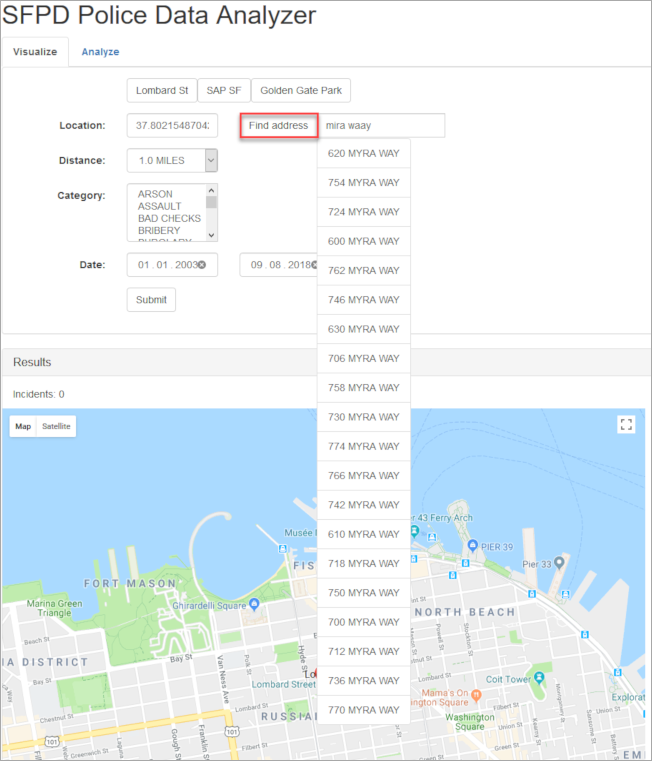
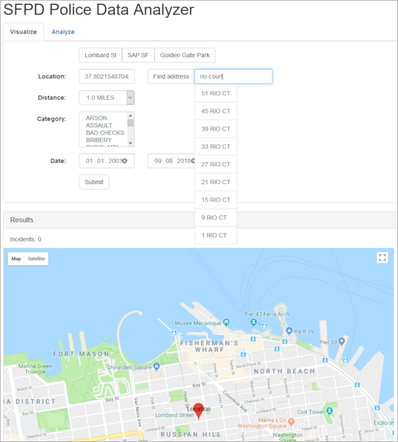

## Prerequisites  
- **Tutorials:** [Advanced geospatial processing with Hibernate](https://developers.sap.com/tutorials/hxe-gcp-hibernate-spatial.html)

## Details
### You will learn  
  - How to search for text using SAP HANA's full-text search capabilities
  - How to use term mappings to improve the search results

### Motivation
The application's address search functionality based on SQL `LIKE` queries has several drawbacks

- Only exact matches are returned. A typo in the address causes the result list to be empty.
- There is no ordering of the results, for example, by best matching address.
- Street abbreviations like 'rd', 'ct', etc. need to be used. Searches for 'road' or 'court' don't return any results.

These drawbacks can be addressed by using full-text search.

---

[ACCORDION-BEGIN [Step 1: ](Use full-text search for the address search)]
Open the file `AddressRepository.java` from the directory `src/main/java/com/sap/hana/hibernate/sample/repositories`.

The current implementation uses a standard `LIKE` query to retrieve matching addresses

```java
public List<Address> findByAddressContaining(String address) {
  Query query = this.em
      .createQuery( "select a from Address a where upper(a.address) like upper(:address)", Address.class );

  query.setParameter( "address", "%" + address + "%" );

  query.setMaxResults( 20 );

  List<Address> addresses = query.getResultList();

  return addresses;
}
```

As there is no Hibernate support for SAP HANA's full-text search capabilities you'll need to change the query to a native SQL query. Then you can use the `CONTAINS` predicate to perform a full-text search on the address table.

```java
public List<Address> findByAddressContaining(String address) {
  Query query = this.em
      .createNativeQuery(
            "select a.base_id, a.address, a.address_number, a.address_number_suffix, a.cnn, a.street_name, a.street_type, a.x, a.y, a.zip_code, a.location "
          + "from address a "
          + "where CONTAINS(a.address, :address, FUZZY(0.7, 'similarCalculationMode=searchCompare, textSearch=compare')) "
          + "order by SCORE() desc "
          + "limit 20",
          Address.class );

  query.setParameter( "address", address );

  List<Address> addresses = query.getResultList();

  return addresses;
}
```

The `CONTAINS` predicate used in the query matches the input from the `:address` parameter against the `address` column of the `address` table using full-text search. It then calculates a similarity score for each row. If the similarity score is at least 0.7 as specified in the `FUZZY` option, the value is included in the result set.

The similarity score is also used to sort the result, so the best matches are returned at the top of the list.

You can find more information about the `CONTAINS` predicate and fuzzy search in the [SAP HANA Search Developer Guide](https://help.sap.com/viewer/691cb949c1034198800afde3e5be6570/latest/en-US/cd07da82bb571014b185c8e3e3974767.html).

Note that the `address` parameter doesn't need the surrounding `%` characters any more.

Since the query is a native query now, `query.setMaxResults()` can't be used any more. Instead, the limit is included in the query via a `limit` clause.

Save the `AddressRepository.java` file.

[DONE]

[ACCORDION-END]

[ACCORDION-BEGIN [Step 2: ](Deploy the application)]
With the full-text changes in place we can now deploy the application again to the cloud.

In a console run the following command from the root directory of the project

```
mvn clean appengine:update
```

The application will be deployed to the Google App Engine.

After the deployment has succeeded you can navigate to `https://<your project ID>.appspot.com` to see the changes.



Play around with the address search which you can activate by clicking the **Find address** button.

You will see that the search is now tolerant towards typos to a certain degree and that the matches are now sorted by best matching address.

[DONE]

[ACCORDION-END]

[ACCORDION-BEGIN [Step 3: ](Learn about term mappings)]
To address the issue of street abbreviations, a feature called term mappings can be used.

While searching a table for a term, other terms can automatically be included in the search by specifying term mappings for the search term. For example, when searching for 'boulevard' the address search should also consider the term 'blvd' and vice-versa.

These term mappings are stored in a separate table which is queried by the full-text search at runtime to improve the search results.

You can find more information about term mappings in the [SAP HANA Search Developer Guide](https://help.sap.com/viewer/691cb949c1034198800afde3e5be6570/latest/en-US/cdf3eacbbb571014933db7fa4ffef324.html).

[DONE]

[ACCORDION-END]

[ACCORDION-BEGIN [Step 4: ](Add term mappings for synonymous search terms)]
To use term mappings the term mapping table must be populated first.

Open the file `DatabaseInitializer.java` from the directory `src/main/java/com/sap/hana/hibernate/sample/app` and find the method `importTermMappings`.

```java
@EventListener
@Transactional
@Order(3)
public void importTermMappings(ContextRefreshedEvent event) {
  Query query = this.em.createQuery( "delete from TermMapping" );
  query.executeUpdate();

  importTermMapping( "ADDRESS", "street", "st", BigDecimal.valueOf( 1 ) );
  importTermMapping( "ADDRESS", "avenue", "ave", BigDecimal.valueOf( 1 ) );
  importTermMapping( "ADDRESS", "boulevard", "blvd", BigDecimal.valueOf( 1 ) );
  importTermMapping( "ADDRESS", "circle", "cir", BigDecimal.valueOf( 1 ) );
  importTermMapping( "ADDRESS", "court", "ct", BigDecimal.valueOf( 1 ) );
  importTermMapping( "ADDRESS", "drive", "dr", BigDecimal.valueOf( 1 ) );
  importTermMapping( "ADDRESS", "hill", "hl", BigDecimal.valueOf( 1 ) );
  importTermMapping( "ADDRESS", "highway", "hwy", BigDecimal.valueOf( 1 ) );
  importTermMapping( "ADDRESS", "lane", "ln", BigDecimal.valueOf( 1 ) );
  importTermMapping( "ADDRESS", "place", "pl", BigDecimal.valueOf( 1 ) );
  importTermMapping( "ADDRESS", "plaza", "plz", BigDecimal.valueOf( 1 ) );
  importTermMapping( "ADDRESS", "road", "rd", BigDecimal.valueOf( 1 ) );
  importTermMapping( "ADDRESS", "stairway", "stwy", BigDecimal.valueOf( 1 ) );
  importTermMapping( "ADDRESS", "terrace", "ter", BigDecimal.valueOf( 1 ) );

  importTermMapping( "ADDRESS", "wy", "way", BigDecimal.valueOf( 1 ) );
  importTermMapping( "ADDRESS", "prk", "park", BigDecimal.valueOf( 1 ) );
}
```

This method already defines mappings for the street abbreviations. What is still missing is the implementation of the `importTermMapping` method which actually writes the mappings to the database.

This method should take a term and map it to another term using a given term mapping list ID and a given weight.

To improve the search results even more, all substrings of the first term should also be mapped to the second term to allow searches while the user is still typing. Otherwise there wouldn't be any matches until the user has finished typing the entire word, for example, 'boulevard'. To make sure that short string that might also match other terms don't distort the search result, the respective term weight will be exponentially decreased with the term length.

```java
private void importTermMapping(String listId, String term1, String term2, BigDecimal weight) {
  for ( int i = term1.length(); i > 1; i-- ) {
    String subTerm = term1.substring( 0, i );
    if ( subTerm.equals( term2 ) ) {
      continue;
    }

    TermMapping mapping = new TermMapping();
    mapping.setListId( listId );
    mapping.setMappingId( UUID.randomUUID().toString() );
    mapping.setTerm1( subTerm );
    mapping.setTerm2( term2 );
    mapping.setWeight( weight.multiply( BigDecimal.valueOf( Math.pow( 0.8, term1.length() - i ) ) ) );

    this.em.persist( mapping );
  }
}
```

As you can see, the method uses a `for` loop to iterate over the length of the term to be mapped. For each substring until the length 2 it creates a term mapping of that string to the mapping term using the given term mapping list ID, a new random mapping ID, the substring and the mapping term, and a weight calculated by multiplying the given weight by a factor which exponentially decreases with the term length.

Save the `DatabaseInitializer.java` file.

[DONE]

[ACCORDION-END]

[ACCORDION-BEGIN [Step 5: ](Configure the address search to use the term mappings)]
Now that the term mapping table is populated the full-text search needs to be configured to use it.

Open the file `AddressRepository.java` from the directory `src/main/java/com/sap/hana/hibernate/sample/repositories`.

Two new configuration options need to be added in addition to the ones already used in the query (`similarCalculationMode` and `textSearch`). The new options are `termMappingListId` for specifying which term mapping list to use, and `termMappingTable` for specifying the table where the term mapping list is stored.

```java
public List<Address> findByAddressContaining(String address) {
  Query query = this.em
      .createNativeQuery(
            "select a.base_id, a.address, a.address_number, a.address_number_suffix, a.cnn, a.street_name, a.street_type, a.x, a.y, a.zip_code, a.location "
          + "from Address a "
          + "where contains(a.address, :address, FUZZY(0.7, 'similarCalculationMode=searchCompare, textSearch=compare, termMappingListId=ADDRESS, termMappingTable=TERM_MAPPING')) "
          + "order by score() desc "
          + "limit 20",
          Address.class );

  query.setParameter( "address", address );

  List<Address> addresses = query.getResultList();

  return addresses;
}
```

Save the `AddressRepository.java` file.

[DONE]

[ACCORDION-END]

[ACCORDION-BEGIN [Step 6: ](Deploy the application)]
With the full-text changes in place we can now deploy the application again to the cloud.

In a console run the following command from the root directory of the project

```
mvn clean appengine:update
```

The application will be deployed to the Google App Engine.

After the deployment has succeeded you can navigate to `https://<your project ID>.appspot.com` to see the changes.



Play around with the address search which you can activate by clicking the **Find address** button.

You will see that the search now also returns results when searching for terms like `rio court`.

[VALIDATE_1]

[ACCORDION-END]

