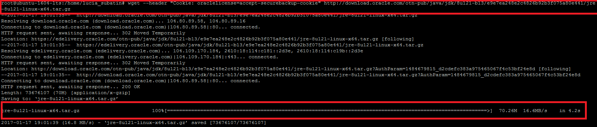
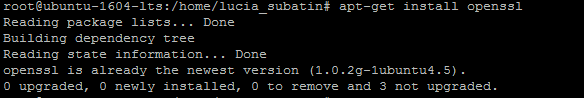
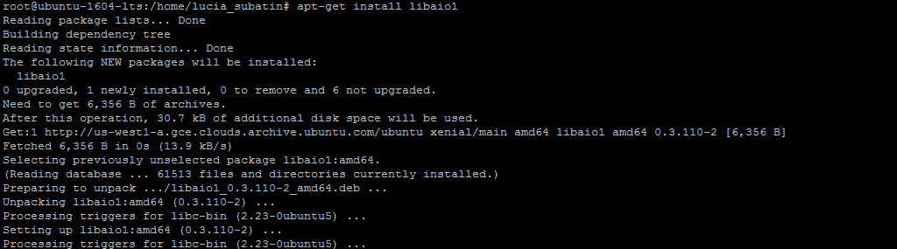
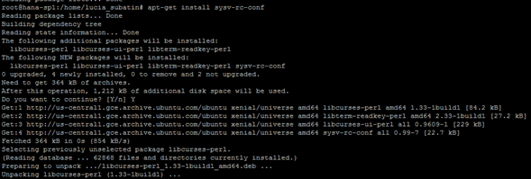
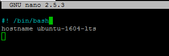
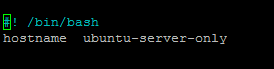
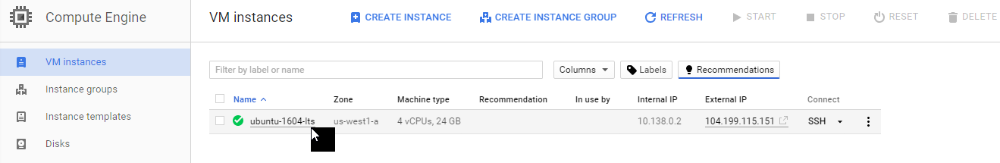
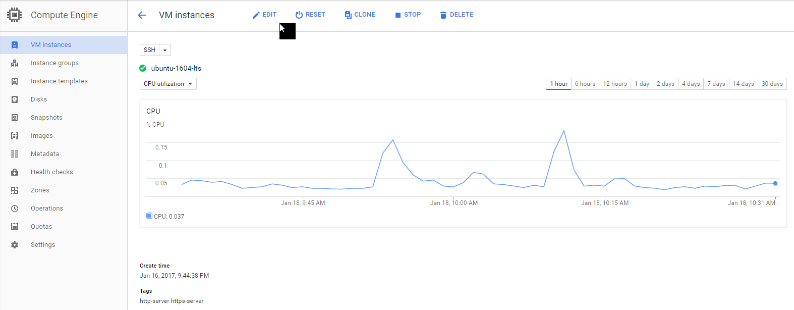
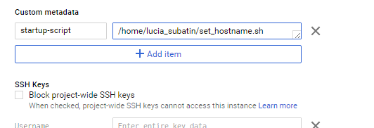

## Prerequisites  
 - [HANA Express Edition - Create and Access Instance on Google Cloud Platform - Server + XS Advanced](http://www.sap.com/developer/tutorials/hxe-gcp-create-instance-access.html)

## Next Steps
 - [HANA Express Edition - Extract installation Files and Configure Firewall Rules](http://www.sap.com/developer/tutorials/hxe-gcp-extract-files-configure-firewall.html)

## Disclaimer
SAP HANA, express edition (HXE) is officially supported on SLES and RHEL. SAP Community members have been successful in running HXE on other Linux operating systems that are not formally supported by SAP, such as Ubuntu, openSUSE and Fedora. SAP is not committing to resolving any issues that may arise from running HXE on these platforms.

## Details
### You will learn  
In this tutorial, you will install the dependencies needed for the setup and execution of HANA Express Edition in your Ubuntu OS image on the Google Cloud Platform.

### Time to Complete
**15 Min**

---

[ACCORDION-BEGIN [Step 1: ](Download and Install the Java Runtime Environment)]
Go to the download page for the Java Runtime Environment. Accept the license agreement and download the `tar.gz` file:


Right-click on the file with extension `.tar.gz` for x64 Linux and copy the link.

Log in to your virtual machine using an SSH client. Use the link you have copied from the `JRE` download page as the URL in the following command:

```
wget --header "Cookie: oraclelicense=accept-securebackup-cookie" <<URL>>
```
Here is an example of the output in the console after a successful download:



Create a new directory called `/usr/java` and copy the downloaded installation package into a new folder. The name of the installation package may be different from the example, so **replace `jre-8u121-linux-x64.tar.gz` with the package you have just downloaded**:

```
sudo su –
mkdir /usr/java
chmod 777 /usr/java
cp ./jre-8u121-linux-x64.tar.gz /usr/java/jre-8u121-linux-x64.tar.gz
cd  /usr/java
tar -zxvf jre-8u121-linux-x64.tar.gz

```
This is what the console would look like:


After it finishes extracting the files, if you list the directory you will see a new folder created by the extraction process:


Set the JVM path with the following command, where `/usr/java` is the directory you created to extract the JRE installation package and ` jre1.8.0_111` refers to the directory that has just been created during extraction. Replace these references accordingly:

```
update-alternatives --install /usr/bin/java java /usr/java/jre1.8.0_111/bin/java 100
```


[DONE]
[ACCORDION-END]

[ACCORDION-BEGIN [Step 2: ](Install or check openssl)]

Enter the following command to make sure openSSL is up to date or continue installation:
```
apt-get install openssl
```

You will probably get a message indicating it is already installed:


[DONE]
[ACCORDION-END]


[ACCORDION-BEGIN [Step 3: ](Install cracklib)]

Enter the following command to install `cracklib`:
```
apt-get install libpam-cracklib
```
At any time during the installation of dependencies, you may be prompted about using more disk space. Make sure to answer `Y`:


[DONE]
[ACCORDION-END]

[ACCORDION-BEGIN [Step 4: ](Install libtool)]

Enter the following command to install `libtool`:
Example:

```
apt-get install libltdl7
```


[DONE]
[ACCORDION-END]

[ACCORDION-BEGIN [Step 5: ](Install the AIO library)]

Enter the following command to install AIO:

```
apt-get install libaio1
```
Example:




[DONE]
[ACCORDION-END]

[ACCORDION-BEGIN [Step 6: ](For XSA installation, install unzip)]

If you are planning on installing the server and XS Advanced applications, you will also need to install unzip:
```
apt-get install unzip
```
Example:


[DONE]
[ACCORDION-END]

[ACCORDION-BEGIN [Step 7: ](For HANA 2.0 SPS01: Create and alias for chkconfig and install curl)]

This is a command that is not available in Ubuntu. You will download its equivalent and create an alias so it can be called by the installation script.

```
apt-get install sysv-rc-conf
```
Example:



And set the alias for the installer:

```
alias chkconfig='sysv-rc-conf'
```


Also for SAP HANA 2.0 SPS01, install curl:

```
apt-get install curl
```

[DONE]
[ACCORDION-END]

[ACCORDION-BEGIN [Step 8: ](Update the hostname)]

Google Cloud Platform will overwrite your hosts file every time you reboot the virtual machine. HANA Express Edition relies on the hostname to execute most of its services, so it is essential that you use something that can be accessed from outside the server.

You can do this manually by changing the configuration in the file /etc/hosts every time you reboot the machine. Fortunately, there is a script to place at startup that can do this automatically.

>Note that the hostname has to match the name of the VM instance.

Go to your home directory and create a file:

```
nano ./set_hostname.sh
```
Paste the following into the editor:
```
#! /bin/bash
hostname  <<your hostname>>
```

Example:


Or for the server-only:


Press `Ctrl-O` and `Ctrl-X` to save and exit.

Grant permissions for all users on the script with command `chmod`:

```
chmod 777 ./set_hostname.sh
```

[DONE]
[ACCORDION-END]

[ACCORDION-BEGIN [Step 9: ](Configure the script to set the hostname at startup in Google Cloud Platform)]

Go to the VM instances, click on your instance:


And then click on Edit:



Scroll down to the custom metadata section and add:
- `startup-script` in **Key**
- `/home/your_home_directory/set_hostname.sh` in **Value**

For example:



**Reboot** your Virtual Machine and check that your hostname has been set automatically with command `hostname`.

[DONE]
[ACCORDION-END]


## Next Steps
- [Extract Files and Configure Firewall](http://www.sap.com/developer/tutorials/hxe-gcp-extract-files-configure-firewall.html)
