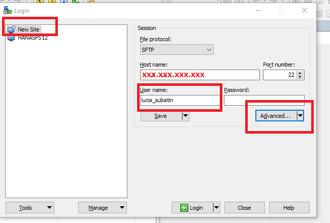
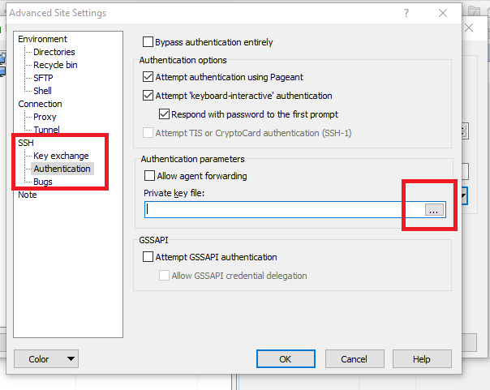
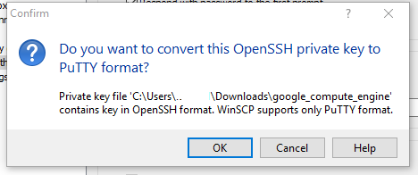
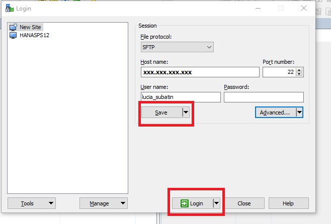

## Prerequisites  
 - [Create and Access Instance on Google Cloud Platform - Server + XS Advanced](http://www.sap.com/developer/tutorials/hxe-gcp-create-instance-access.html)

## Next Steps
 -  [Install Dependencies for Ubuntu on Google Cloud Platform](http://www.sap.com/developer/tutorials/hxe-gcp-install-dependencies.html)

## Disclaimer
SAP HANA, express edition (HXE) is officially supported on SLES and RHEL. SAP Community members have been successful in running HXE on other Linux operating systems that are not formally supported by SAP, such as Ubuntu, openSUSE and Fedora. SAP is not committing to resolving any issues that may arise from running HXE on these platforms.

## Details
### You will learn  

This tutorial will guide you through the steps to setup two of the most popular tools to access your Ubuntu virtual machine remotely. These tools, PuTTY and WinSCP, are available for Windows PCs.

### Time to Complete
**15 Min**

---

[ACCORDION-BEGIN [Step 1: ](Download WinSCP and PuTTY)]

Download the installation package for WinSCP from its [official site](https://winscp.net/eng/download.php). Scroll down on [the same site](https://winscp.net/eng/download.php#putty) to download PuTTY.

Once downloaded, follow the steps in the installation packages.

[DONE]
[ACCORDION-END]

[ACCORDION-BEGIN [Step 2: ](Add instance to WinSCP)]

Go to `VM Instance`  in the Compute Engine from [Google Cloud platform](http://console.cloud.google.com/compute/instances) and copy the External IP address for your virtual machine:

Open your WinSCP client and click on New Site. Fill in the Host Name with the External IP, keep the default port number and fill in your user name to the Ubuntu Virtual Machine. Click on Advanced:

In the Advanced settings, go into the `Authentication` menu in the `SSH` branch, and click to browse for a `Private Key File`:

Select the private key you downloaded from your home `.ssh` folder in the previous tutorial:

Choose yes for the tool to convert it to the needed format:

Enter the passphrase you entered when you generated the key pairs in the `Gcloud` console. Continue with the steps until you come back to the Advanced settings and the converted PPK file.

Click **OK** and **Save** the entry and **Log in**.

Confirm with **Yes** that you want to `connect to an unknown server and add its host to a cache` in the pop-up message and enter your passphrase again when prompted.

[DONE]
[ACCORDION-END]

[ACCORDION-BEGIN [Step 3: ](Configure PuTTY as your SSH console access)]

Open PuTTY. Enter the External IP of your Ubuntu host in the Host Name field, a name for the session under `Saved Sessions` and go to the  `Auth` section in the  `SSH` menu.

Browse for the `.ppk` file WinSCP generated in the previous step. Alternatively, convert the private key you downloaded from Google Cloud Platform using `PuTTYgen`. You will find this tool in the `Tools` menu in WinSCP.

**Save** your session and click on **Open** to log in.

[DONE]
[ACCORDION-END]

## Next Steps
- [Install Dependencies for Ubuntu on Google Cloud Platform](http://www.sap.com/developer/tutorials/hxe-gcp-install-dependencies.html)
