## Disclaimer
SAP HANA, express edition (HXE) is officially supported on SLES. SAP Community members have been successful in running HXE on other Linux operating systems that are not formally supported by SAP, such as Red Hat, Ubuntu, `openSUSE` and Fedora. SAP is not committing to resolving any issues that may arise from running HXE on these platforms.

This installation uses a test `toolchain` for Ubuntu as an interim workaround for a known compatibility problem with an SSL library. This is not an official Personal Package Archive (PPA). The library is currently required for the installation of SAP HANA, express edition, version 2.0 SPS02. It will be removed after the installation is finished.

## Details
### You will learn  
This tutorial will show you how to create and configure a virtual Machine on the Google Cloud Platform with Ubuntu Linux 16.04 LTS. You will then perform the necessary configurations and execute an alternative installation script to create your SAP HANA, express edition instance with the Extended Application Services, advanced model (XS Advanced).


### Time to Complete
**35 Min**

---
[ACCORDION-BEGIN [Step 1: ](Create your Google Cloud Platform Virtual Machine)]

From your <a href="https://console.cloud.google.com/home/dashboard" target="new">dashboard</a> on your Google Cloud Platform landing page, follow the instructions to create a project.

Once created, enter the **Resources** tile, to create an instance of a virtual machine:

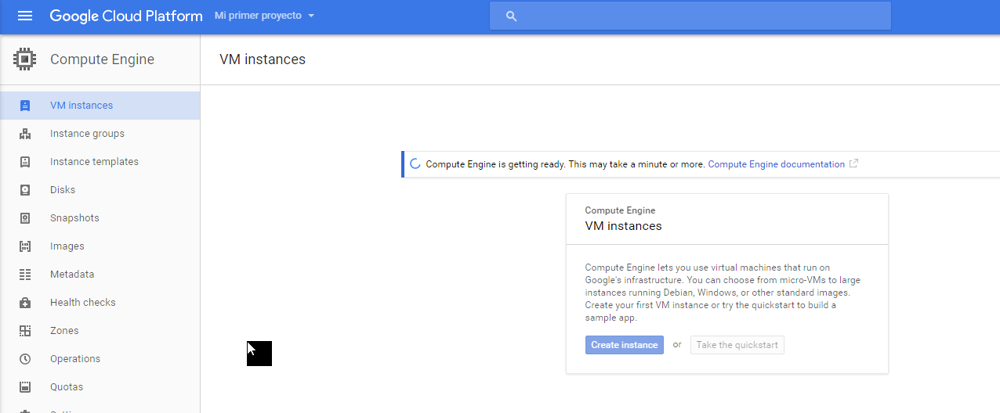

Pick a name for your VM instance and a the right zone for your location. The name you choose will also be the name of the host and the example used in this tutorial is `ubuntu-1604-lts`.

Here you can configure the resources you will allocate to your virtual machine. You can use the minimum requirements for the installation for now and adjust them later to your needs.

The minimum requirements for HANA Express Edition with XS Advanced installation are:
- 4 CPU cores
- 16 GB RAM
- 120 GB Disk (SSD)

> GCP will only allow you to set the RAM to the maximum of 32GB - as allowed by the license - if you set the CPU cores to 6. You can set it to the minimum requirements for now and update it later.

Click on **Customize** and set the values depending on your choice

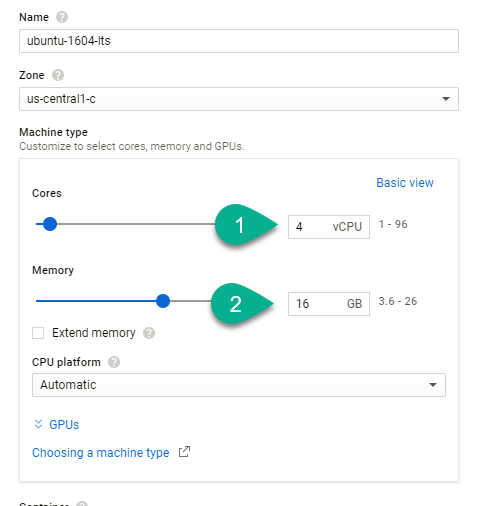

Choose `Ubuntu 16.04 LTS` as the OS image under `Boot disk`, using the **Change** button:


You will also need an external IP to access the machine. Create a new static IP by modifying the options under `Management` and the `Networking`.


Assign a name to your IP:

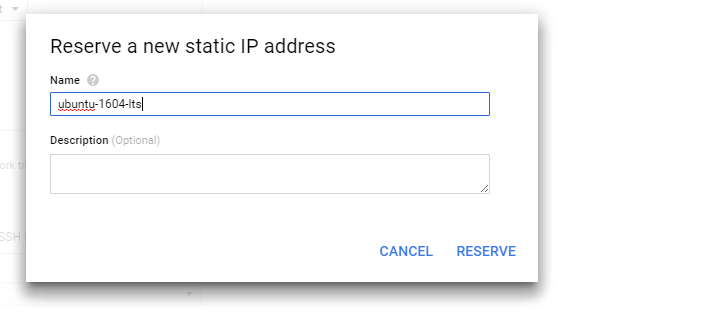

Click on **Reserve**.

You can see the estimated costs for the Virtual Machine on the top right corner. The costs vary depending on the requirements and the amount of hours in which the machine is up and running:


Proceed to **create** the virtual machine.
[ACCORDION-END]

[ACCORDION-BEGIN [Step 2: ](Download the installation files using download manager)]

You will use the download manager in console mode to download the installation binaries directly into your virtual machine on the Google Cloud Platform. Follow the steps to **register and download** the download manager for Linux from <a href="https://www.sap.com/cmp/ft/crm-xu16-dat-hddedft/index.html" target="new">the SAP HANA; express edition, download site</a>:


Back on the Google Cloud console, click on the **SSH** button to open an SSH console logged in to your virtual machine:


Once there, click on the console tools and then on **Upload file**:


Choose the download manager file you have just downloaded and wait for the transfer to finish. It will be uploaded into the home directory for your current user, which is also the default directory when you first open an SSH console:


You will also need to install the Java Runtime Environment. Go to the Downloads for the <a href="http://www.oracle.com/technetwork/java/javase/downloads/jre8-downloads-2133155.html" target="new"> Java Runtime Environment </a>. Accept the license agreement, right-click on the latest `.tar.gz` file and download it.

Upload the `.tar.gz` file.

Use the following commands install the Java Runtime Environment, which is required by the Download Manager.

```
chmod 777 -R <<downloaded file>>
tar -xvzf <<downloaded file>>

```

Update the java location with the following command:

```
chmod 777 HXEDownloadManager_linux.bin
sudo mkdir /usr/lib/jre
sudo mv <<extracted path>>  /usr/lib/jre
sudo update-alternatives --install "/usr/bin/java" "java" "/usr/lib/jre/<<replace with returned path>>/bin/java" 1
```
For example:


You can now execute the following commands to  download the relevant packages for installation, grant permissions and extract them

```
./HXEDownloadManager_linux.bin -d /home/<<your_userid>> linuxx86_64 installer hxe.tgz hxexsa.tgz
sudo chmod -R 777 ./hxe.tgz ./hxexsa.tgz
sudo tar -xvzf hxe.tgz
sudo tar -xvzf hxexsa.tgz
```

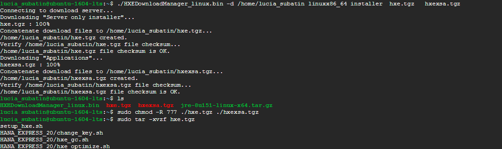


[ACCORDION-END]


[ACCORDION-BEGIN [OPTIONAL: ](Generate Key pairs to connect to your VM instance using local clients)]

**This step is optional and needed if you want to use a client like `PuTTY` or Win SCP.**

Once the instance has been created, if this is the first instance in your project and you have not done it before, you will need to generate key pairs to access the machine from SSH and SCP clients. From the `VM instances` menu, choose your newly-created virtual machine and connect using the `gcloud` command:

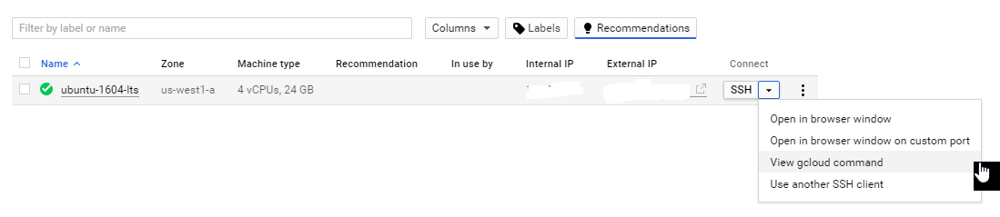

This will open the shell with a default command to access your virtual machine.

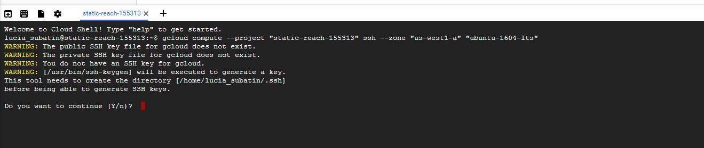

>Remember: These sessions are ephemeral. Anything you change from this console will not be persisted into future sessions. In other words, if you create a directory from this command prompt, you will not see it in the server from other SSH clients unless you create it in your own /home directory.

You will need to enter passphrases for the public and private keys. These passphrases will allow you to access any instance you create within this project, so choose something you will remember.


They key pairs are generated in your home directory, within a directory called `.ssh`. You can use command  `cd /home/your_home_directory` and then `ls` to list the names of the files in there:

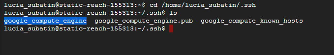

You can copy the file name and download it using the file menu on the top right corner of the `gcloud` console:


>Hint: CTRL+C and CTRL+V work in this console!

And entering the full path:


You can use these files to access the machine from SSH or FTP clients, such as PuTTY or WinSCP.


Just in case, run the following command to make sure your `gcloud` console is updated:

```
gcloud components update

```

You can find the instructions to connect using `PuTTY` or `WinSCP` <a href="https://developers.sap.com/tutorials/hxe-gcp-setup-putty-winscp-windows.html" target="new"> in this tutorial </a>.

[ACCORDION-END]


[ACCORDION-BEGIN [Step 3: ](Add the `ToolChain` repository)]

The default `libstdc++6` library on Ubuntu does not support one of the libraries required by SAP HANA. You can use an experimental package from the [Ubuntu `ToolChain` test builds](https://wiki.ubuntu.com/ToolChain).

> Note: This is not an official PPA

</br>

Use the following commands:

```
sudo add-apt-repository ppa:ubuntu-toolchain-r/test
sudo apt-get update
sudo apt-get upgrade libstdc++6
```

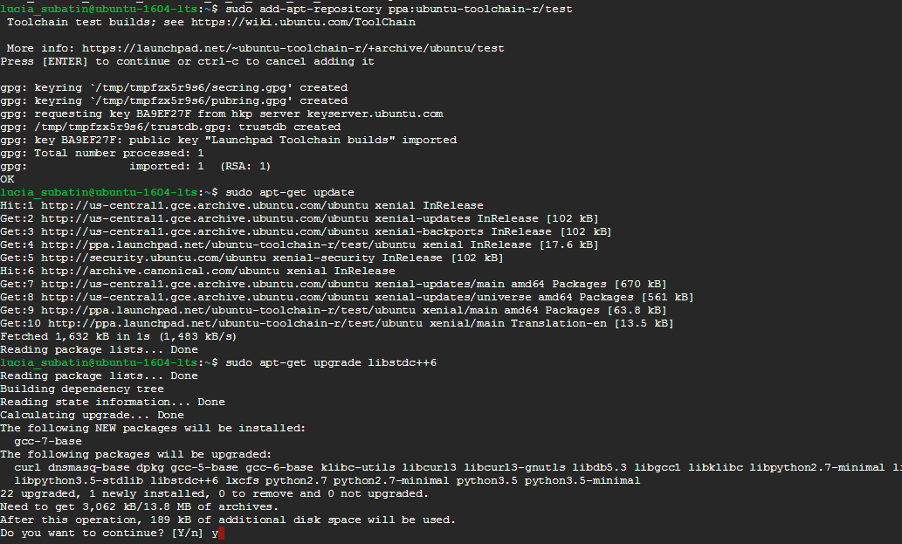

[ACCORDION-END]

[ACCORDION-BEGIN [Step 4: ](Create a softlink for bash)]

The installation script and some other scripts executed during the process need the following soft links:

```
sudo mv /bin/sh /bin/sh.orig
sudo ln -s /bin/bash /bin/sh
```


[ACCORDION-END]


[ACCORDION-BEGIN [Step 5: ](Add more resources to your Virtual Machine)]

You will need to **Stop**  your instance before you can proceed with edition.

Double your resources for the installation process by editing the Virtual Machine from the `VM Instance` in Google Cloud Platform:

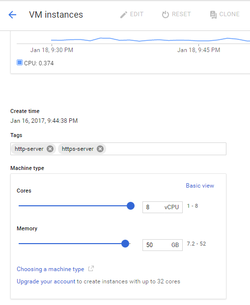

**Save** the settings and **Start** your instance again.

[ACCORDION-END]

[ACCORDION-BEGIN [Step 6: ](Execute the installation script)]

>IMPORTANT: As this process should not be interrupted, use a separate SSH client that handles connection intermittence if necessary, instead of the web client.

From the directory in which the installation files have been extracted, execute the installation script using the following command:

```
sudo ./setup_hxe.sh
```
You can enter the default values by pressing enter or you can change them if you want. Bear in mind that most tutorials on development use instance number `90` and you will need to adjust the ports accordingly in the firewall setup if you choose another instance number.

**Pay attention to the password rules (especially to the restrictions on special characters) described by the setup script.**

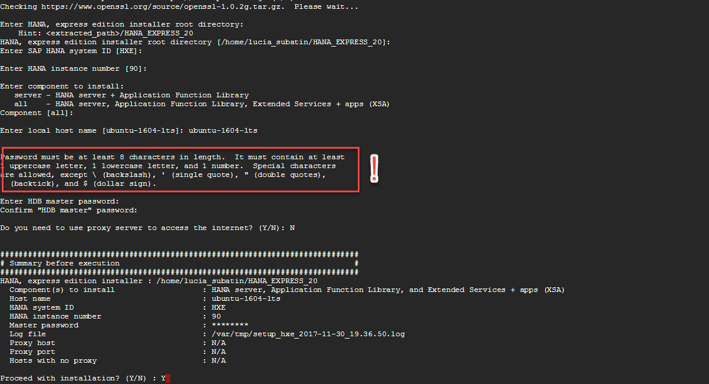

You can continue with the next steps while the installation script finishes.

[ACCORDION-END]

[ACCORDION-BEGIN [Step 7: ](Update the Firewall rules)]

Go to the `VM Instance` panel in your Google Cloud Platform console and open `view gcloud command` for your Ubuntu virtual machine:

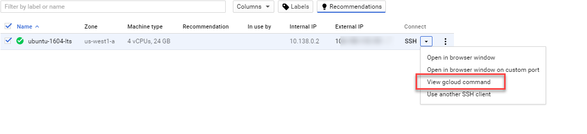

Keep the default command line and click on **Run** in Cloud Shell.


The following commands enable the necessary traffic into ports that are used by SAP HANA, express edition.

**Replace** the `XX` with your instance number (`90` is the default).

Paste them into the `gcloud` command prompt:

```
gcloud compute firewall-rules create rule1 --allow tcp:80XX
gcloud compute firewall-rules create rule2 --allow tcp:43XX
gcloud compute firewall-rules create rule3 --allow tcp:51002-51027
gcloud compute firewall-rules create rule4 --allow tcp:80
gcloud compute firewall-rules create rule5 --allow tcp:443
gcloud compute firewall-rules create rule6 --allow tcp:1128-1129
gcloud compute firewall-rules create rule7 --allow tcp:3XX13-3XX15
gcloud compute firewall-rules create rule8 --allow tcp:3XX41-3XX98
gcloud compute firewall-rules create rule9 --allow tcp:5XX13-5XX14
gcloud compute firewall-rules create rule10 --allow tcp:3XX29-3XX33
gcloud compute firewall-rules create rule11 --allow tcp:39026
gcloud compute firewall-rules create rule12 --allow tcp:50000-51500
```

>Note: The above rules are for your reference. You can find the complete list of ports at the [SAP HANA Administration Guide](https://help.sap.com/viewer/6b94445c94ae495c83a19646e7c3fd56/2.0.02/en-US/a9326f20b39342a7bc3d08acb8ffc68a.html)

You can confirm all the rules have been processed using command

```
gcloud compute firewall-rules list
```


[ACCORDION-END]


[ACCORDION-BEGIN [Step 8: ](Map your hosts file)]

You will need the external IP address assigned to your Virtual Machine.


You need administration permissions to do this.

- For Windows Computers:
  Your user will need administration rights. Right-click on Notepad and choose `Run as Administrator`. If you are an administrator user, proceed to the next point.

  

  Open the file or navigate with Windows explorer. You need to edit the file called `hosts` in the directory `C:\Windows\System32\drivers\etc`

  


- For Mac OS:
  Open a terminal (`Finder -> Applications -> Terminal`) and type `sudo nano /etc/hosts`

  


Add the IP address followed by the name of the host, in this example, `ubuntu-1604-lts`:

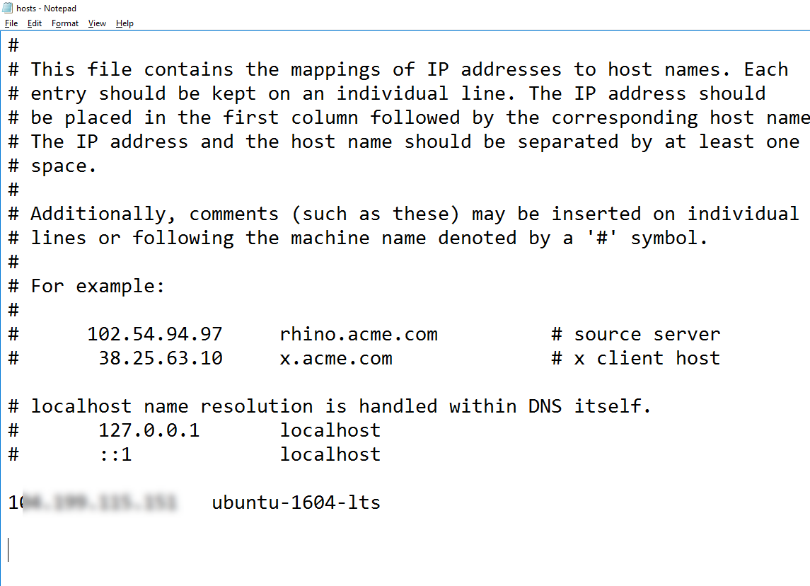

**Save** and close the editor.

> Note: If Notepad asks you to create a new file you do not have enough permissions to save the file. Creating a new file will not alter the configuration as intended.

</br>

[ACCORDION-END]

[ACCORDION-BEGIN [Step 9: ](Check your installation)]

Once the installation is finished, you will see a success message:

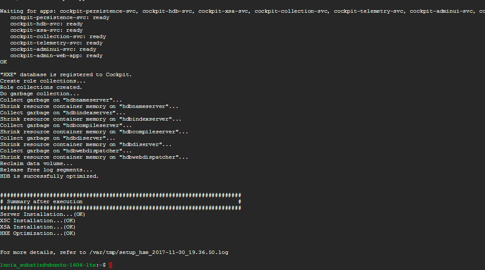

You can now test the installation using the following command:

```
sudo su - hxeadm
./HDB info
```

You will see the database services started and the XS Advanced applications starting


Log in to the XS Command Line Interface to check the status of SAP Web IDE for SAP HANA and other relevant applications:

```
xs-admin-login
xs apps
```

Once SAP Web IDE for SAP HANA is ready, you can use the URL next to it in your browser. This will take some minutes, so you can repeat the command `xs apps | grep webide` to check on the status


Congratulations! Your instance is now ready for use.

>Note: If anything has not gone as expected, search for your error at the [community Q&A](https://answers.sap.com/index.html) or post a new question if you cannot find the solution there.

[ACCORDION-END]

[ACCORDION-BEGIN [Step 10: ](Reset the resources for your Virtual Machine)]

Switch to the `<sid>adm` user. If your System ID is `HXE`, the user will be `hxeadm`. Stop the database using program `HDB` from the administrator´s home directory:

```
 su hxeadm
 ./HDB stop
```

>Hint: You can start the database again with command `./HDB start` and check if the services are running with `./HDB info`. The database will start again automatically when you reboot the server.

Once the Database is stopped, stop the Virtual Machine too from Google Cloud platform's console.

Edit the Virtual Machine to suit your installation. These are the minimal requirements and it is recommended that you monitor resources to adjust them as needed. The Google Cloud Platform will also hint you on resource utilization.

CPU: 4 cores
RAM: 16 GB RAM

**Save** your settings and start your database again.

[ACCORDION-END]
