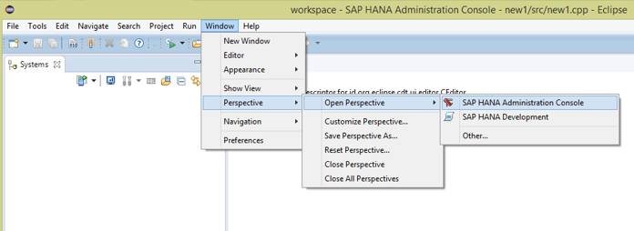
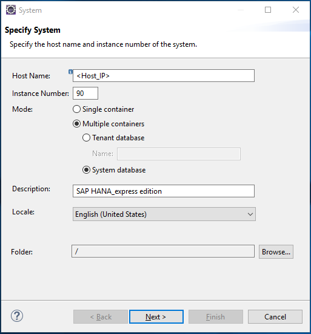
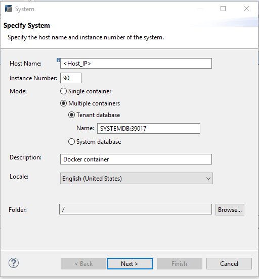
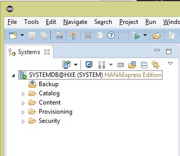

## Prerequisites  
- Proficiency: beginner
- Setup: Eclipse Mars or Neon version are expected to be installed and running before starting this tutorial to add the HANA Plugin.

## How-To Details
Provides instruction on how to install and update the SAP HANA Tools plugin for Eclipse and connect to SAP HANA, express edition.

**Important**: The plugin for Eclipse supports development with XS Classic, which has been [deprecated as of SAP HANA 2.0 SPS02](https://help.sap.com/viewer/42668af650f84f9384a3337bcd373692/2.0.02/en-US/6c63b22412d04b5d9fbe46ab39b7939d.html). The tools have been replaced with web-based tools in XS Advanced.

### Time to Complete
**10 Min**.

---

[ACCORDION-BEGIN [Step 1: ](Install development tools)]

> ##Important:
> The functionality covered by the Eclipse plugin has been replaced with web tools in XS Advanced.
> Please be aware that the XS Classic has been [**deprecated** as of SAP HANA 2.0 SPS02](https://help.sap.com/viewer/42668af650f84f9384a3337bcd373692/2.0.02/en-US/6c63b22412d04b5d9fbe46ab39b7939d.html).
>
> If you are getting started or learning SAP HANA development, you should start [exploring the new tools in XS Advanced](https://developers.sap.com/tutorials/xsa-explore-basics.html).
>
> You can also refer to [this video](https://www.youtube.com/watch?v=2_P6jcbFzeo&index=2&list=PLoc6uc3ML1JR38-V46qhmGIKG07nXwO6X) for updated information about tooling.

In Eclipse, choose in the menu bar Help > Install New Software...

Select SAP Development Tools for Eclipse

- Neon (4.6), add the URL <https://tools.hana.ondemand.com/neon/>
- Mars (4.5), add the URL <https://tools.hana.ondemand.com/mars/>

[ACCORDION-END]

[ACCORDION-BEGIN [Step 2: ](Select features)]

Press Enter to display the available features.

Select the desired features and choose Next.

[ACCORDION-END]

[ACCORDION-BEGIN [Step 3: ](Review wizard page)]

On the next wizard page, you get an overview of the features to be installed. Choose Next.

[ACCORDION-END]

[ACCORDION-BEGIN [Step 4: ](Accept license agreements)]

Confirm the license agreements and select Finish to start the installation. (Depending on the features chosen the installation may take up to 10 minutes.)

[ACCORDION-END]

[ACCORDION-BEGIN [Step 5: ](Restart Eclipse)]

Restart Eclipse as prescribed after adding HANA Plugin.

[ACCORDION-END]

[ACCORDION-BEGIN [Step 6: ](Open SAP HANA Administrative Console)]

Change perspective to SAP HANA Administrative Console Window > Perspective > SAP HANA Administrative Console

[ACCORDION-END]

[ACCORDION-BEGIN [Step 7A: ](Specify system)]

For Docker environments follow instructions in 7B.

Add your `HANAExpress` Add System > Specify System

Configuration:

- Hostname: `HANAExpress` Hostname (use `/sbin/ifconfig` to find IP address of host)
- Instance number: 90 (or 00 for SAP HANA 1.0, express edition installations, or the number you specified during a custom installation)
- Mode: _Multiple containers_ > _System database_
- Description: `HANAExpress` Edition

[ACCORDION-END]

[ACCORDION-BEGIN [Step 7B: ](Specify system - Docker)]

For Docker containers follow these instructions to add a connection your HANA Express `SystemDB` database.

Add your `HANAExpress` Add System > Specify System

Configuration:

- Hostname: `HANAExpress` Hostname (use `/sbin/ifconfig` to find IP address of host)
- Instance number: `<arbitrary unique instance number>`
- Mode: _Multiple containers_ > _Tenant database_
- Name: `SYSTEMDB:39017`
- Description: `HANAExpress` Edition

[ACCORDION-END]

[ACCORDION-BEGIN [Step 8: ](Specify connection properties)]

Connection Properties:

- Authentication by database user:
- User Name: SYSTEM
- Password: `password`

>(Note - you might be asked to change the SYSTEM user password if this is the first login)

- Enable SAP start service Connection
- Finish

[ACCORDION-END]

[ACCORDION-BEGIN [Step 9: ](Confirm connection)]

Confirm connection as shown below:

[ACCORDION-END]
