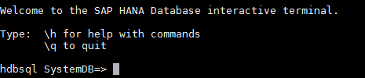
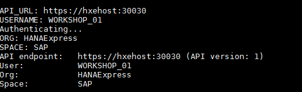

## Prerequisites  
- Proficiency: beginner
- Setup: This tutorial provides the details on creating required users for other `HANA, express edition` "Tutorials"

## Next Steps
- Go to the [SAP HANA, express edition](http://www.sap.com/developer/topics/sap-hana-express.tutorials.html) tutorials page

**Note on SAP HANA, express edition version 2.0 implications on "How-Tos" and "Tutorials":**


The most commonly used instance numbers are `00` and `90`. The instance number can be chosen at the time of setup, although the installer from versions SPS00 onwards suggests instance number `90` while the SPS12 version uses `00` as the default instance number and port (3`<instance number>`<15|13>). The following chart summarizes the common default ports:

HANA Express Version  | Default Instance ID | Port
:-------------------  | :------------------ | :---------------
1.0 SP12              |  00                 | 30015
2.0 SP00              |  90                 | 39015
2.0 SP01              |  90                 | 39013

If you are uncertain of the instance number, switch to user `hxeadm` using command `su hxeadm`, which will take you to a directory called `/usr/sap/HXE/HDBXX`, where `XX` is the instance number.


## How-To Details
The HANA, express edition "Tutorials" reference a set of users. This set of instructions assures all required users and passwords are available and correct before attempting the other `SAP HANA, express edition` Tutorials.

The passwords referred to in the "Tutorials" will not match passwords chosen by the user. For example, any reference to the password `"HANARocks2016"` or `HanaRocks2017` should be replaced by the user provided password (see below).

### Time to Complete
**5 Min**.

---

[ACCORDION-BEGIN [Step 1: ](Review system configuration)]

Review default system configuration for `HANA, express edition`:

Field Name  | Value
:---------- | :---------------
System Host | `hxehost`
SID         | `HXE`
System Instance Number | `90` (version 1 SP12 `00`)
XSA Organization | `HANAExpress`
XSA Space   | `development`
ALL passwords | <user defined> (referred to as `HANAROCKS2016` or `HanaRocks2017`in tutorials)

**Note** : The command `xs` will only be available if you have installed XS Classic or XS Advanced. The server-only installation as of HANA 2.0 SPS01 version does not bring `xs` by default.


[ACCORDION-END]

[ACCORDION-BEGIN [Step 2: ](Create user)]

Create `WORKSHOP_01` user for `SAP HANA, express edition` "How-To" tutorials:

- Login to `HANA` as `hxeadm`  (you may need to change system password if not already done) and create `WORKSHOP_01` user:

Reminder: version 1.0 SP12 default instance number is 00, in below `hdbsql` command, replace "90" with "00".

```
% hdbsql -i 90 -n localhost:39013 -u SYSTEM -p <SYSTEM user password>  "CREATE USER WORKSHOP_01 PASSWORD <password> NO FORCE_FIRST_PASSWORD_CHANGE SET PARAMETER XS_RC_XS_CONTROLLER_USER = 'XS_CONTROLLER_USER' , XS_RC_DEVX_DEVELOPER = 'DEVX_DEVELOPER', XS_RC_XS_AUTHORIZATION_ADMIN = 'XS_AUTHORIZATION_ADMIN'"
```


**Only if you have installed XS classic tooling or XS Apps** - You will get an error indicating the command has not been found if XS Advanced is not installed:
```
% sudo su - hxeadm

% xs login -u xsa_admin -p <password>
```


[ACCORDION-END]

[ACCORDION-BEGIN [Step 3: ](For XS Advanced installation - Add role to XSA)]

Add XSA "space role" for workshop user in the development space:

```
% xs set-space-role WORKSHOP_01 HANAExpress development SpaceDeveloper
```


[ACCORDION-END]

[ACCORDION-BEGIN [Step 4: ](Verify user connection  to HANA, express edition)]

Verify the new `WORKSHOP_01` user can connect to `HANA, express edition`:

```
% hdbsql -u WORKSHOP_01 -p <password> -d SystemDB -i 90
```

Expected result:




[ACCORDION-END]

[ACCORDION-BEGIN [Step 5: ](XS Installation only - Verify user connection to XSA)]

Verify the `WORKSHOP_01` user can connect to XSA:

```
% xs login -u WORKSHOP_01 -p <password>
```

Expected result:




[ACCORDION-END]


## Next Steps
- Go to the [SAP HANA, express edition](http://www.sap.com/developer/topics/sap-hana-express.tutorials.html) tutorials page
